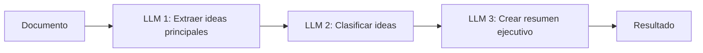
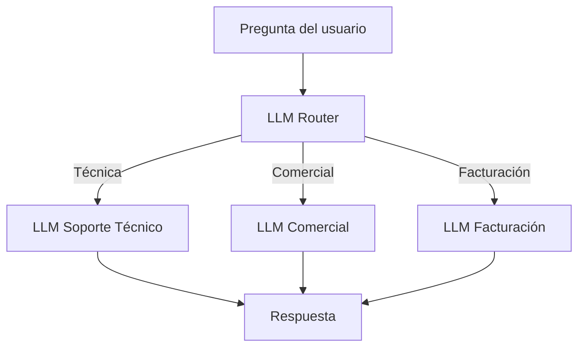
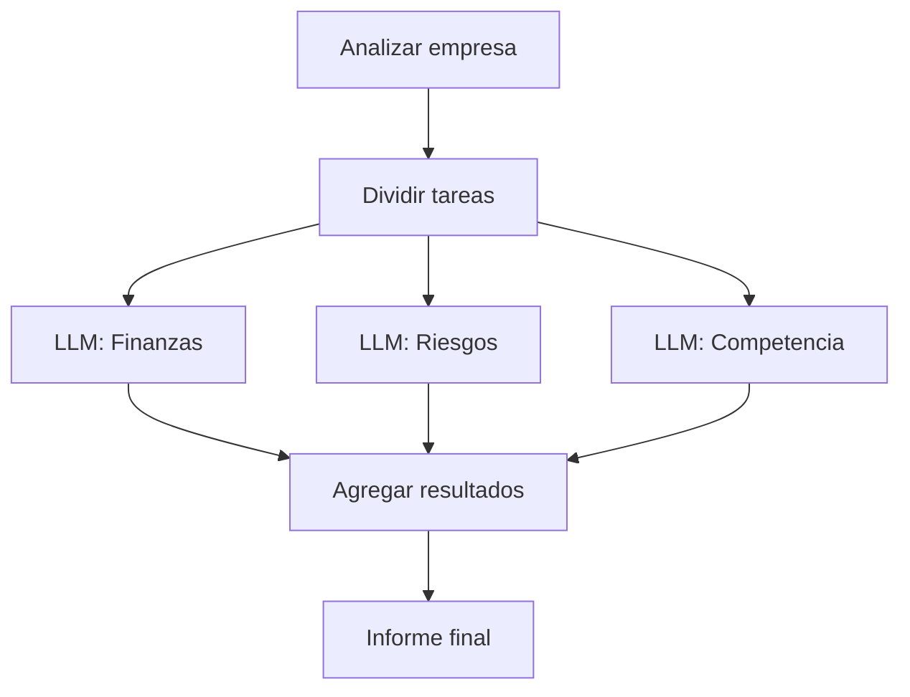
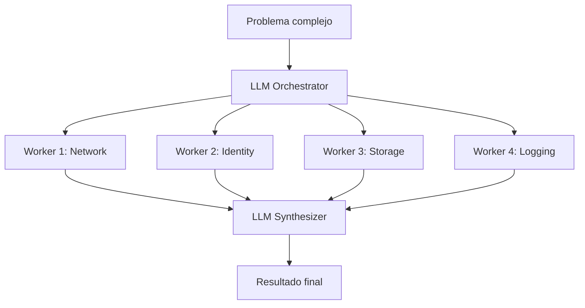
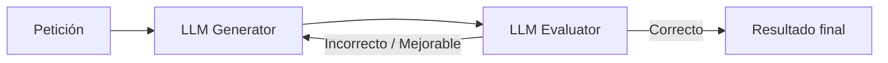
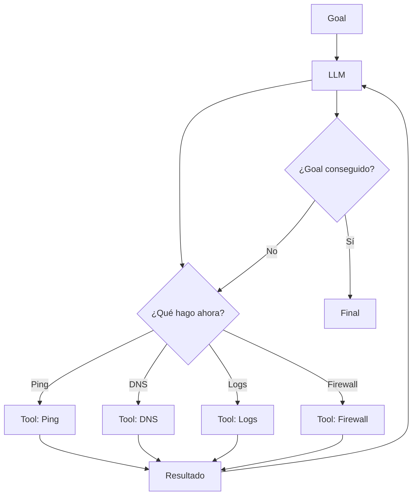
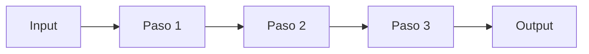
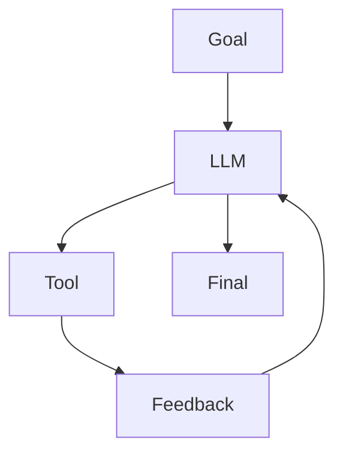
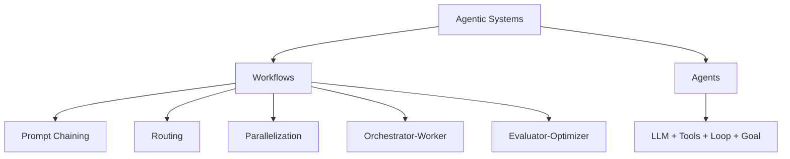

# Agentic AI - Conceptos básicos

## ¿Qué es un LLM?

**LLM** significa:

**Large Language Model**

En español:

**Modelo Grande de Lenguaje**

Un LLM es un modelo de Inteligencia Artificial entrenado con una gran cantidad de texto para poder:

- Entender preguntas.
- Generar texto.
- Resumir información.
- Escribir código.
- Analizar información.
- Razonar sobre un problema.
- Decidir qué acción realizar.

Ejemplos de LLM:

- GPT
- Claude
- Gemini
- Llama

### Ejemplo

Le preguntamos:

> ¿Cuál es la capital de Francia?

El LLM responde:

> París.

Funcionamiento:

```text
Usuario
   |
   v
  LLM
   |
   v
Respuesta
```

---

## ¿Qué es una Tool?

Una **Tool** es una herramienta externa que un LLM puede utilizar para realizar acciones.

Por sí solo, un LLM principalmente genera texto.

Con herramientas puede interactuar con otros sistemas.

Ejemplos de Tools:

- Buscar información en Internet.
- Ejecutar código Python.
- Consultar una API.
- Leer un fichero.
- Consultar una base de datos.
- Ejecutar comandos.
- Consultar Azure.
- Consultar GitHub.
- Enviar un correo.

### Ejemplo

Queremos saber el tiempo actual en Barcelona.

El LLM puede decidir usar una herramienta meteorológica.

```text
Usuario
   |
   v
  LLM
   |
   v
Weather Tool
   |
   v
Resultado
   |
   v
  LLM
   |
   v
Respuesta al usuario
```

---

## ¿Qué es un Agent?

Una definición sencilla:

> An Agent is an LLM with tools in a loop to achieve a goal.

En español:

> Un agente es un LLM que utiliza herramientas dentro de un bucle para conseguir un objetivo.

Podemos resumirlo como:

```text
Agent = LLM + Tools + Loop + Goal
```

Donde:

- **LLM** → decide qué hacer.
- **Tools** → permiten realizar acciones.
- **Loop** → permite repetir acciones.
- **Goal** → es el objetivo que queremos conseguir.

---

## ¿Qué significa Goal?

**Goal** significa objetivo.

Es lo que queremos que el agente consiga.

### Ejemplo

```text
Goal:
"Averigua por qué el servidor web no funciona"
```

El agente intentará realizar diferentes acciones hasta encontrar el problema o hasta llegar a una condición de finalización.

---

## ¿Qué significa Loop?

**Loop** significa bucle.

Un agente no tiene por qué hacer una sola acción.

Puede repetir varias veces este ciclo:

```text
Observar
   |
   v
Pensar / Decidir
   |
   v
Actuar
   |
   v
Observar el resultado
   |
   v
Volver a decidir
```

Por ejemplo:

```text
1. El agente intenta hacer ping al servidor.
2. Lee el resultado.
3. Decide comprobar el puerto 443.
4. Lee el resultado.
5. Decide consultar los logs.
6. Analiza los logs.
7. Encuentra el problema.
8. Devuelve una respuesta.
```

---

## ¿Qué es un AI Agent?

Un **AI Agent** es un sistema que utiliza un LLM para decidir qué hacer y puede utilizar herramientas para realizar acciones con el objetivo de completar una tarea.

Una definición simple es:

```text
AI Agent = LLM + Tools + Loop + Goal
```

### Ejemplo sencillo

Objetivo:

```text
"Comprueba por qué una web no funciona"
```

El agente podría hacer:

```text
Goal
 |
 v
LLM
 |
 v
¿Puedo acceder a la web?
 |
 v
Tool: HTTP Request
 |
 v
Resultado
 |
 v
LLM analiza el resultado
 |
 v
Tool: DNS Check
 |
 v
Resultado
 |
 v
LLM analiza el resultado
 |
 v
Tool: Logs
 |
 v
Resultado
 |
 v
Conclusión
```

---

## Diferencia entre LLM y Agent

### LLM

Un LLM normalmente recibe una pregunta y genera una respuesta.

```text
Usuario
   |
   v
  LLM
   |
   v
Respuesta
```

Ejemplo:

```text
Pregunta:
"¿Qué es un DNS?"

Respuesta:
"DNS es el sistema que traduce nombres de dominio a direcciones IP."
```

---

### Agent

Un Agent puede realizar acciones utilizando herramientas.

```text
Usuario
   |
   v
Agent
   |
   +--> LLM
   |
   +--> Tools
   |
   +--> Loop
   |
   v
Resultado
```

Ejemplo:

```text
Objetivo:
"Comprueba si google.com responde"

El agente puede:

1. Ejecutar una consulta DNS.
2. Hacer una petición HTTP.
3. Comprobar el código de respuesta.
4. Analizar el resultado.
5. Dar una conclusión.
```

---

## Idea clave

La idea más importante es:

```text
LLM = piensa y genera respuestas

Tool = permite realizar acciones

Loop = permite repetir acciones

Goal = define el objetivo

Agent = usa todo lo anterior para intentar conseguir un objetivo
```

---

## Definición corta para memorizar

> Un Agent es un LLM que puede utilizar herramientas y repetir acciones para conseguir un objetivo.

O en inglés:

> An Agent is an LLM with tools in a loop to achieve a goal.

## ¿Qué es un Workflow?

Un **Workflow** es un conjunto de pasos definidos previamente para realizar una tarea.

En un Workflow normalmente sabemos de antemano:

- Qué pasos se ejecutarán.
- En qué orden.
- Qué ocurre después de cada paso.
- Qué condiciones pueden cambiar el camino.

Podemos verlo como una receta:

```text
Paso 1
  |
  v
Paso 2
  |
  v
Paso 3
  |
  v
Resultado
```

### Ejemplo sencillo

Queremos procesar un fichero:

```text
1. Leer fichero.
2. Validar formato.
3. Transformar datos.
4. Guardar resultado.
5. Enviar notificación.
```

Este flujo está definido previamente.

---

## Workflow con decisiones

Un Workflow también puede tener condiciones.

Ejemplo:

```text
Leer fichero
     |
     v
¿Formato correcto?
   /      \
 Sí        No
 |          |
 v          v
Procesar   Error
 |
 v
Guardar
```

Aunque existan decisiones, los caminos posibles están definidos previamente.

---

## Diferencia entre Workflow y Agent

La diferencia principal es quién decide el siguiente paso.

### Workflow

En un Workflow:

> El siguiente paso está definido por el flujo.

```text
Paso A
  |
  v
Paso B
  |
  v
Paso C
```

El comportamiento está previamente diseñado.

### Agent

En un Agent:

> El LLM puede decidir cuál debe ser el siguiente paso.

Ejemplo:

```text
Goal
 |
 v
LLM
 |
 +--> ¿Hago ping?
 |
 +--> ¿Compruebo DNS?
 |
 +--> ¿Leo logs?
 |
 +--> ¿Compruebo Azure?
 |
 v
Resultado
```

El agente decide dinámicamente qué herramienta utilizar y qué hacer después según los resultados.

---

## Workflow vs Agent

```text
Workflow
--------
Pasos predefinidos
Orden controlado
Comportamiento predecible

Agent
-----
Decisiones dinámicas
El LLM decide el siguiente paso
Puede cambiar su estrategia según los resultados
```

---

## Ejemplo práctico

### Workflow

Objetivo:

```text
Crear una máquina virtual en Azure
```

Workflow:

```text
1. Validar parámetros.
2. Crear Resource Group.
3. Crear VNet.
4. Crear Subnet.
5. Crear VM.
6. Aplicar Tags.
```

Los pasos ya están definidos.

---

### Agent

Objetivo:

```text
Averigua por qué una VM de Azure no tiene conectividad.
```

El agente podría decidir:

```text
1. Revisar estado de la VM.
2. Revisar NSG.
3. Revisar UDR.
4. Revisar Azure Firewall.
5. Revisar DNS.
6. Ejecutar prueba de conectividad.
```

# Anthropic Agentic Design Patterns

Anthropic propone **6 patrones principales**:

- **5 Workflow Patterns**
- **1 Agent Pattern**

Resumen:

```text
1. Prompt Chaining
2. Routing
3. Parallelization
4. Orchestrator-Worker
5. Evaluator-Optimizer
6. Agent
```

La diferencia principal es:

```text
Workflow
= sigue un camino definido por código

Agent
= el LLM decide dinámicamente qué hacer en un loop
```

---

# 1. Prompt Chaining

## Definición

**Prompt Chaining** consiste en dividir una tarea grande en varios pasos más pequeños.

La salida de un LLM se utiliza como entrada del siguiente.

Idea básica:

```text
LLM 1
  |
  v
LLM 2
  |
  v
LLM 3
  |
  v
Resultado
```

## Ejemplo

Queremos crear un resumen ejecutivo de un documento.

Podemos dividirlo en:

1. Extraer ideas principales.
2. Clasificarlas.
3. Crear resumen ejecutivo.



## Idea clave

```text
La salida de un LLM alimenta al siguiente.
```

## Ejemplo práctico

```text
Documento
   |
   v
Extraer información
   |
   v
Organizar información
   |
   v
Generar respuesta final
```

---

# 2. Routing

## Definición

**Routing** consiste en utilizar un LLM para decidir a qué flujo o LLM especializado enviar una petición.

El primer LLM actúa como un router.

## Ejemplo

Tenemos un sistema de soporte.

Una pregunta puede ser:

- Técnica.
- Comercial.
- Facturación.



## Ejemplo práctico

Usuario:

```text
"No puedo conectarme a la VPN"
```

El router decide:

```text
Tipo = Technical Support
```

Y envía la petición al LLM especializado en soporte técnico.

## Idea clave

```text
Routing = decidir quién debe resolver el problema.
```

---

# 3. Parallelization

## Definición

**Parallelization** consiste en ejecutar varias tareas independientes al mismo tiempo.

El código divide el trabajo previamente.

Después se combinan los resultados.

## Ejemplo

Queremos analizar una empresa desde tres puntos de vista:

- Finanzas.
- Riesgos.
- Competencia.



## Idea clave

Las tareas ya están definidas por el código.

```text
Código:
- tarea 1
- tarea 2
- tarea 3
```

Los LLM trabajan en paralelo.

## Ejemplo práctico

```text
Analizar Microsoft

        |
        v

+-----------------------+
|                       |
v                       v
Finanzas              Riesgos
                        |
                        v
                   Competencia

        |
        v

Combinar resultados
```

---

# 4. Orchestrator-Worker

## Definición

**Orchestrator-Worker** es parecido a Parallelization.

La diferencia importante es:

```text
Parallelization:
El código decide las tareas.

Orchestrator-Worker:
Un LLM decide las tareas.
```

El **Orchestrator** analiza el problema y decide cómo dividirlo.

Después varios **Workers** realizan las subtareas.

Finalmente otro LLM puede combinar los resultados.

## Ejemplo

Queremos:

```text
Analizar la seguridad de una arquitectura Azure.
```

El Orchestrator puede decidir:

```text
1. Revisar Network Security.
2. Revisar Identity.
3. Revisar Storage.
4. Revisar Logging.
```



## Diferencia con Parallelization

### Parallelization

```text
El programador decide:

- revisar Network
- revisar Identity
- revisar Storage
```

### Orchestrator-Worker

```text
El LLM decide:

"Para resolver este problema necesito revisar:

- Network
- Identity
- Storage
- Logging
"
```

## Idea clave

```text
El Orchestrator decide dinámicamente cómo dividir el trabajo.
```

---

# 5. Evaluator-Optimizer

## Definición

En el patrón **Evaluator-Optimizer** un LLM genera una respuesta y otro LLM la evalúa.

Si la respuesta no es suficientemente buena, vuelve al generador.

También se conoce frecuentemente como:

```text
LLM as a Judge
```

## Ejemplo

Queremos generar un email profesional.



## Ejemplo práctico

El Generator crea:

```text
"Hi, send me the report."
```

El Evaluator analiza:

```text
¿Es profesional?
¿Es educado?
¿Está bien redactado?
```

Resultado:

```text
No.
```

Entonces vuelve al Generator.

Nueva respuesta:

```text
"Hi John,

Could you please send me the latest version of the report?

Thank you."
```

El Evaluator responde:

```text
Correcto.
```

Y se entrega al usuario.

## Idea clave

```text
Generate
   |
   v
Evaluate
   |
   +---- incorrecto ----> Generate
   |
 correcto
   |
   v
Resultado
```

---

# 6. Agent

## Definición

Un **Agent** es diferente de los Workflows.

En un Workflow existe un camino definido.

En un Agent no existe necesariamente un camino predefinido.

El LLM decide:

- Qué hacer.
- Qué herramienta utilizar.
- Qué hacer después.
- Cuándo terminar.

Definición sencilla:

```text
Agent = LLM + Tools + Loop + Goal
```

## Ejemplo

Objetivo:

```text
"Averigua por qué un servidor web no responde."
```

El agente puede decidir:

```text
1. Hacer ping.
2. Revisar DNS.
3. Revisar puerto 443.
4. Revisar logs.
5. Revisar firewall.
```

Pero no sabemos de antemano qué pasos terminará utilizando.



## Idea clave

El agente funciona en un loop:

```text
Observe
   |
   v
Think
   |
   v
Act
   |
   v
Observe
   |
   v
Think
   |
   v
...
```

Hasta conseguir el objetivo.

---

# Workflow vs Agent

## Workflow

```text
Camino definido
```

Ejemplo:



El código controla el flujo.

---

## Agent

```text
Objetivo definido
Camino dinámico
```

Ejemplo:



El LLM decide dinámicamente qué hacer.

---

# Resumen de los 6 Patterns

| Nº | Pattern | Tipo | Idea principal |
|---:|---|---|---|
| 1 | Prompt Chaining | Workflow | Salida de un LLM → entrada del siguiente |
| 2 | Routing | Workflow | Un LLM decide qué camino usar |
| 3 | Parallelization | Workflow | Varias tareas ejecutadas en paralelo |
| 4 | Orchestrator-Worker | Workflow | Un LLM decide cómo dividir el trabajo |
| 5 | Evaluator-Optimizer | Workflow | Un LLM genera y otro evalúa |
| 6 | Agent | Agent | LLM + Tools + Loop + Goal |

---

# Diferencia fácil de memorizar

```text
Prompt Chaining
= pasos en cadena

Routing
= elegir camino

Parallelization
= hacer varias cosas a la vez

Orchestrator-Worker
= un LLM decide cómo repartir el trabajo

Evaluator-Optimizer
= generar -> evaluar -> mejorar

Agent
= decidir y actuar en loop hasta conseguir un objetivo
```

---

# Mapa mental



---

# Frase para memorizar

```text
Anthropic:

5 Workflow Patterns
+
1 Agent Pattern
=
6 Agentic Design Patterns
```
