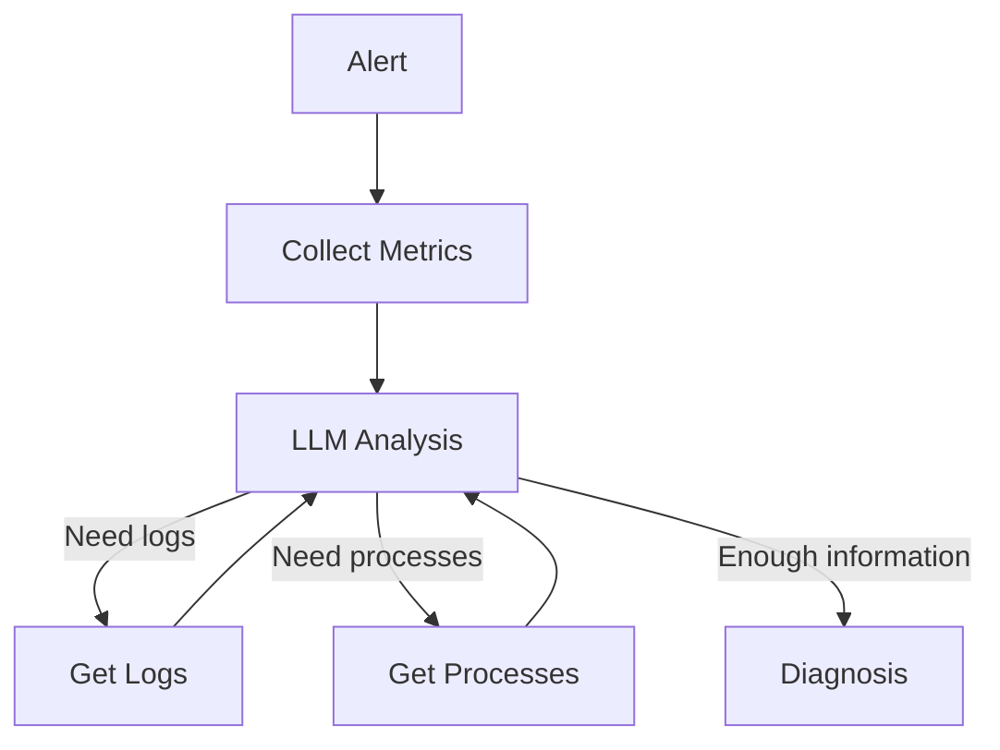

# Conceptos básicos de IA, LLMs y Agents

## Índice

- [AI — Artificial Intelligence](#ai--artificial-intelligence)
- [Model](#model)
- [LLM — Large Language Model](#llm--large-language-model)
- [Token](#token)
- [Context Window](#context-window)
- [Prompt](#prompt)
- [System Prompt](#system-prompt)
- [Tool](#tool)
- [Function Calling / Tool Calling](#function-calling--tool-calling)
- [Agent](#agent)
- [Agent Loop](#agent-loop)
- [Workflow](#workflow)
- [Workflow vs Agent](#workflow-vs-agent)
  - [Workflow](#workflow-1)
  - [Agent](#agent-1)
- [Agentic Workflow](#agentic-workflow)
- [MCP — Model Context Protocol](#mcp--model-context-protocol)
- [MCP Server](#mcp-server)
- [MCP Client](#mcp-client)
- [Resource en MCP](#resource-en-mcp)
- [RAG — Retrieval Augmented Generation](#rag--retrieval-augmented-generation)
- [Embedding](#embedding)
- [Vector Database](#vector-database)
- [Memory](#memory)
- [Short-Term Memory](#short-term-memory)
- [Long-Term Memory](#long-term-memory)
- [State](#state)
- [LangChain](#langchain)
- [LangGraph](#langgraph)
- [Node](#node)
- [Edge](#edge)
- [Conditional Edge](#conditional-edge)
- [Orchestrator](#orchestrator)
- [Multi-Agent System](#multi-agent-system)
- [Supervisor Agent](#supervisor-agent)
- [Guardrails](#guardrails)
- [Human-in-the-Loop](#human-in-the-loop)
- [Structured Output](#structured-output)
- [JSON Schema](#json-schema)
- [Temperature](#temperature)
- [Hallucination](#hallucination)
- [Grounding](#grounding)
- [Evals](#evals)
- [Observability](#observability)
- [Trace](#trace)
- [Inference](#inference)
- [Training](#training)
- [Fine-Tuning](#fine-tuning)
- [API](#api)
- [SDK](#sdk)
- [REST API](#rest-api)
- [Webhook](#webhook)
- [Event](#event)
- [Trigger](#trigger)
- [Runbook](#runbook)
- [Knowledge Base](#knowledge-base)
- [CMDB](#cmdb)
- [ReAct](#react)
- [Planning](#planning)
- [Router](#router)
- [Intent](#intent)
- [Autonomous Agent](#autonomous-agent)
- [Copilot](#copilot)
- [Copilot vs Agent](#copilot-vs-agent)
  - [Copilot](#copilot-1)
  - [Agent](#agent-2)
- [AI Operations Agent](#ai-operations-agent)

---

## AI — Artificial Intelligence

**AI (Artificial Intelligence)** es el término general para sistemas capaces de realizar tareas que normalmente asociamos con inteligencia humana.

Ejemplos:

- reconocer una imagen
- traducir un texto
- responder preguntas
- generar código
- diagnosticar un problema
- tomar decisiones

```text
Artificial Intelligence
        |
        +-- Machine Learning
        |
        +-- Deep Learning
        |
        +-- Generative AI
                 |
                 +-- LLMs
                 +-- Image models
                 +-- Audio models
```

---

# Model

Un **Model** es el "cerebro" que procesa una entrada y genera una salida.

Por ejemplo:

```text
Input:
"¿Por qué este servidor tiene la CPU al 100%?"

        ↓

      MODEL

        ↓

Output:
"Puede haber un proceso consumiendo demasiada CPU.
Ejecuta 'top' o 'ps aux --sort=-%cpu'."
```

Existen modelos de diferentes tamaños y capacidades.

De forma simplificada:

| Tipo | Velocidad | Coste | Inteligencia |
|---|---:|---:|---:|
| Small / Nano | Muy rápida | Bajo | Baja/Media |
| Medium / Mini | Rápida | Medio | Media/Alta |
| Large | Más lenta | Alto | Alta |

Los nombres concretos dependen del proveedor y cambian con el tiempo.

Por ejemplo, un proveedor podría ofrecer:

```text
Nano  → tareas simples y baratas
Mini  → tareas intermedias
Large → razonamiento complejo
```

### Ejemplo

Para comprobar:

```text
¿El filesystem está por encima del 90%?
```

probablemente no necesitas el modelo más potente.

Para:

```text
Analiza estos logs, métricas de Grafana y procesos
y determina la causa probable del incidente.
```

un modelo más potente puede dar mejores resultados.

---

# LLM — Large Language Model

Un **LLM (Large Language Model)** es un modelo especializado en entender y generar lenguaje.

Ejemplos:

```text
GPT
Claude
Gemini
Llama
Mistral
```

Un LLM recibe texto y genera texto.

```text
Pregunta
   ↓
  LLM
   ↓
Respuesta
```

Ejemplo:

```text
Usuario:
"Explícame este error."

LLM:
"El error indica que el filesystem está lleno."
```

Importante:

> Un LLM por sí mismo normalmente no puede conectarse a servidores, Grafana, Azure, bases de datos, etc.

Para hacer eso necesita **Tools**.

---

# Token

Un **Token** es una pequeña unidad de texto que procesa un LLM.

Una palabra puede ser uno o varios tokens.

Por ejemplo:

```text
"The server is down"
```

puede dividirse internamente aproximadamente en:

```text
"The"
" server"
" is"
" down"
```

Los tokens importan porque normalmente los modelos cobran por:

```text
tokens de entrada
+
tokens de salida
```

---

# Context Window

La **Context Window** es la cantidad máxima de información que el modelo puede tener "delante" mientras responde.

Por ejemplo:

```text
Prompt
+
conversación anterior
+
logs
+
documentación
+
resultados de herramientas
```

todo ocupa tokens dentro del contexto.

Ejemplo:

```text
Context Window
┌────────────────────────────────┐
│ System Prompt                  │
│ User question                  │
│ 5.000 líneas de logs           │
│ Resultado de Grafana           │
│ Resultado SSH                  │
│ Conversación anterior          │
└────────────────────────────────┘
```

---

# Prompt

Un **Prompt** es una instrucción enviada al modelo.

Ejemplo:

```text
Analiza este error y dime la causa probable.
```

Un prompt puede ser mucho más detallado:

```text
Analiza el servidor.

Comprueba:

1. CPU
2. memoria
3. filesystem
4. procesos
5. logs

No realices ningún cambio.
```

---

# System Prompt

El **System Prompt** son las instrucciones principales que definen cómo debe comportarse el modelo.

Por ejemplo:

```text
You are a Linux Operations Agent.

Your job is diagnosing Linux incidents.

Never modify the system.

You can execute read-only commands.

Always explain your conclusions.
```

Después el usuario podría decir:

```text
Server01 tiene CPU al 100%.
```

Y el modelo seguirá las reglas del System Prompt.

---

# Tool

Una **Tool** es una función que el LLM puede utilizar para interactuar con el mundo exterior.

Ejemplos:

```text
SSH
Grafana API
Azure API
ServiceNow API
Database
Web Search
Ansible
Prometheus
Zabbix
```

Por ejemplo:

```text
LLM
 |
 | "Necesito saber la CPU"
 |
 └── Tool: get_cpu(server01)
          |
          └── 97%
```

El LLM recibe:

```text
CPU = 97%
```

y puede decidir qué hacer a continuación.

---

# Function Calling / Tool Calling

**Tool Calling** es el mecanismo mediante el cual el modelo pide ejecutar una Tool.

Ejemplo:

El usuario dice:

```text
¿Por qué server01 tiene CPU alta?
```

El LLM puede decidir:

```text
Necesito consultar la CPU.
```

Y generar algo equivalente a:

```json
{
  "tool": "get_cpu",
  "server": "server01"
}
```

La aplicación ejecuta la función:

```bash
ssh server01 "top -b -n1"
```

y devuelve el resultado al LLM.

---

# Agent

Un **Agent** es un **LLM que utiliza herramientas dentro de un bucle para conseguir un objetivo**.

Una forma fácil de recordarlo es:

```text
Agent = LLM + Tools + Loop + Goal
```

Donde:

```text
LLM   → decide qué hacer.

Tools → permiten realizar acciones.

Loop  → permite repetir acciones.

Goal  → es el objetivo que queremos conseguir.
```

Visualmente:

```text
                  GOAL
                   |
                   ↓
                  LLM
                   |
             ¿Qué hago ahora?
                   |
                   ↓
                 TOOL
                   |
                   ↓
                RESULT
                   |
                   ↓
                  LLM
                   |
          ¿He conseguido el Goal?
             /             \
           NO               YES
           |                 |
           └──── LOOP ───────┘
                             |
                             ↓
                           END
```

El agente puede decidir:

1. qué información necesita
2. qué herramienta utilizar
3. ejecutar la herramienta
4. analizar el resultado
5. decidir si necesita otra herramienta
6. repetir el proceso
7. detenerse cuando ha conseguido el objetivo

Por ejemplo:

```text
GOAL:
Diagnosticar por qué server01 tiene CPU > 95%

        ↓

       LLM

        ↓

"Necesito comprobar la CPU"

        ↓

Tool: get_cpu()

        ↓

CPU = 98%

        ↓

       LLM

        ↓

"Necesito saber qué proceso consume CPU"

        ↓

Tool: get_processes()

        ↓

java = 92%

        ↓

       LLM

        ↓

"Necesito comprobar los logs de Java"

        ↓

Tool: get_logs()

        ↓

OutOfMemory / Full GC

        ↓

       LLM

        ↓

¿Goal conseguido?

        ↓

       YES

        ↓

DIAGNOSIS:

"El proceso Java está causando
el consumo elevado de CPU."
```

Por tanto, una definición muy sencilla sería:

> **Un Agent es un LLM que tiene un objetivo, puede utilizar herramientas y puede repetir acciones hasta conseguir ese objetivo.**

---

# Agent Loop

El **Agent Loop** es el ciclo que permite al agente trabajar de forma iterativa.

Normalmente:

```text
Think
  ↓
Act
  ↓
Observe
  ↓
Think
  ↓
Act
  ↓
Observe
  ↓
...
```

O, de forma más sencilla:

```text
LLM
 ↓
Tool
 ↓
Result
 ↓
LLM
 ↓
Tool
 ↓
Result
 ↓
...
 ↓
Goal achieved
```

Por ejemplo:

```text
1. CPU alta
2. Consultar procesos
3. Java consume 90%
4. Consultar memoria
5. Memoria al 95%
6. Consultar logs Java
7. Detectar Full GC
8. Generar diagnóstico
```

El Loop termina cuando:

```text
Goal achieved
```

o cuando se alcanza alguna condición de parada.

---

# Workflow

Un **Workflow** es una secuencia de pasos definida previamente.

Ejemplo:

```text
Alerta CPU
    ↓
check CPU
    ↓
check memory
    ↓
check top processes
    ↓
check logs
    ↓
LLM analysis
    ↓
diagnosis
```

El flujo ya está decidido.

Esto es diferente de un Agent.

---

# Workflow vs Agent

## Workflow

El camino está definido por nosotros.

```text
A → B → C → D
```

Ejemplo:

```text
CPU Alert
→ top
→ free
→ df
→ logs
→ LLM
```

Siempre hacemos prácticamente los mismos pasos.

## Agent

El LLM decide qué hacer para conseguir un objetivo.

```text
             GOAL
               |
               ↓
              LLM
        /       |       \
       /        |        \
     CPU      Memory     Logs
      |          |         |
      └──────────┴─────────┘
                 |
                 ↓
                LLM
                 |
          Goal achieved?
```

El Agent podría decidir:

```text
CPU alta
↓
voy a mirar procesos

java consume 95%
↓
voy a mirar logs de Java

veo errores GC
↓
ya tengo suficiente información

↓
Goal achieved
```

No necesita ejecutar todos los pasos posibles.

---

# Agentic Workflow

Un **Agentic Workflow** mezcla workflows predefinidos con decisiones tomadas por un LLM.

Por ejemplo:

```text
ALERT
  ↓
Collect metrics
  ↓
Collect basic system information
  ↓
LLM
  ↓
¿Necesito más información?
   / \
 yes  no
 /     \
SSH    Diagnosis
 |
logs
 |
LLM
```

En sistemas de producción suele ser una opción muy interesante porque permite controlar parte del proceso sin dar libertad completa al Agent.

---

# MCP — Model Context Protocol

**MCP (Model Context Protocol)** es un estándar para conectar modelos/agentes con herramientas y fuentes de información.

Puedes imaginar MCP como una especie de:

> "USB estándar para conectar herramientas a un LLM."

Sin MCP podrías programar integraciones específicas:

```text
Agent
 ├── código específico para Grafana
 ├── código específico para SSH
 ├── código específico para Azure
 └── código específico para ServiceNow
```

Con MCP:

```text
             ┌── Grafana MCP Server
             │
Agent ─ MCP ─┼── SSH MCP Server
             │
             ├── Azure MCP Server
             │
             └── ServiceNow MCP Server
```

El protocolo define cómo el Agent descubre y utiliza las herramientas.

---

# MCP Server

Un **MCP Server** es un programa que ofrece herramientas al modelo mediante MCP.

Por ejemplo:

```text
Linux MCP Server
```

podría ofrecer:

```text
get_cpu()
get_memory()
get_disk()
get_processes()
get_logs()
```

El Agent podría descubrir automáticamente esas tools.

```text
Agent
   |
   | MCP
   ↓
Linux MCP Server
   |
   ├── get_cpu
   ├── get_memory
   ├── get_disk
   ├── get_processes
   └── get_logs
```

---

# MCP Client

El **MCP Client** es la parte que se conecta a un MCP Server.

Normalmente forma parte de:

```text
Claude
ChatGPT
IDE
Agent
Aplicación
```

Simplificando:

```text
Agent
  |
MCP Client
  |
  | MCP Protocol
  |
MCP Server
  |
Tools
```

---

# Resource en MCP

Un **Resource** en MCP es información que un MCP Server puede proporcionar al modelo.

Por ejemplo:

```text
logs
configuración
documentación
ficheros
datos
```

Ejemplo:

```text
resource://server01/syslog
```

---

# RAG — Retrieval Augmented Generation

**RAG** significa proporcionar información externa al LLM antes de pedirle que responda.

Problema:

El LLM no conoce necesariamente:

```text
tu documentación interna
tu CMDB
tus procedimientos
tu arquitectura
tus runbooks
```

RAG permite buscar esa información primero.

```text
Pregunta
   ↓
Search documentation
   ↓
Relevant documents
   ↓
LLM
   ↓
Answer
```

Ejemplo:

```text
Alert:
Filesystem /opt > 90%

        ↓

RAG

        ↓

Runbook:
"Filesystem /opt pertenece a SAP.
No borrar archivos.
Escalar al equipo SAP."

        ↓

LLM

        ↓

"No debe limpiarse automáticamente.
Debe escalarse al equipo SAP."
```

---

# Embedding

Un **Embedding** convierte texto en números que representan aproximadamente su significado.

Ejemplo:

```text
"CPU problem"
```

podría convertirse conceptualmente en:

```text
[0.12, 0.82, -0.31, 0.44, ...]
```

Esto permite buscar textos por **significado**, no solamente por palabras exactas.

Por ejemplo:

```text
"filesystem full"
```

podría encontrar:

```text
"disk space exhausted"
```

aunque no utilicen las mismas palabras.

---

# Vector Database

Una **Vector Database** almacena embeddings.

Ejemplos:

```text
Pinecone
Qdrant
Weaviate
Milvus
Chroma
pgvector
Azure AI Search
```

Se utiliza mucho en arquitecturas RAG.

```text
Documentation
     ↓
Embeddings
     ↓
Vector Database
     ↓
Similarity Search
     ↓
Relevant documents
     ↓
LLM
```

---

# Memory

La **Memory** permite que un Agent conserve determinada información entre interacciones.

Por ejemplo:

```text
Server01 pertenece a SAP.

Server01 utiliza SLES.

Los logs están en /var/log/messages.
```

Sin Memory:

```text
cada ejecución empieza desde cero
```

Con Memory:

```text
el Agent puede reutilizar información anterior
```

---

# Short-Term Memory

Información disponible solamente durante la ejecución actual.

Ejemplo:

```text
CPU = 98%
process = java
PID = 2832
memory = 91%
```

Se utiliza mientras se investiga un incidente.

---

# Long-Term Memory

Información almacenada para futuras ejecuciones.

Ejemplo:

```text
server01:
  application: SAP
  owner: SAP-Team
  os: SLES
```

---

# State

El **State** representa lo que el Agent sabe en un momento determinado.

Ejemplo:

```yaml
server: server01
alert: high_cpu
cpu: 98
memory: 72
top_process: java
logs_checked: false
```

A medida que el Agent trabaja, el State cambia.

---

# LangChain

**LangChain** es un framework para desarrollar aplicaciones que utilizan LLMs.

Proporciona componentes para:

```text
LLMs
Prompts
Tools
Agents
RAG
Memory
APIs
```

Ejemplo conceptual:

```python
model + tools + prompt
```

LangChain ayuda a conectar esas piezas.

---

# LangGraph

**LangGraph** es un framework pensado para construir workflows y Agents utilizando un **grafo**.

Está relacionado con el ecosistema LangChain.

En lugar de pensar:

```text
ejecuta función A
después función B
después función C
```

piensas en:

```text
Nodes + Edges + State
```

Ejemplo:



Esto encaja muy bien con Agents porque el flujo puede volver al LLM varias veces.

---

# Node

En LangGraph, un **Node** es un paso del proceso.

Por ejemplo:

```text
get_cpu
get_memory
get_logs
analyse
diagnose
```

Cada uno podría ser un Node.

```text
        get_cpu
           ↓
       get_process
           ↓
        analyse
```

---

# Edge

Un **Edge** conecta dos Nodes.

Ejemplo:

```text
get_cpu → analyse
```

También puede ser condicional:

```text
analyse
   |
   ├── CPU problem → get_processes
   |
   ├── Memory problem → get_memory
   |
   └── Unknown → get_logs
```

---

# Conditional Edge

Un **Conditional Edge** decide cuál será el siguiente paso.

Ejemplo:

```python
if cpu > 90:
    check_processes()

elif memory > 90:
    check_memory()

else:
    check_logs()
```

En un Agent, esa decisión también podría tomarla el LLM.

---

# Orchestrator

Un **Orchestrator** coordina diferentes pasos, herramientas o Agents.

Ejemplo:

```text
             ORCHESTRATOR

             /    |     \
            /     |      \
           ↓      ↓       ↓

       Linux   Network   Azure
       Agent   Agent     Agent
```

Recibe un problema:

```text
Application unavailable
```

y decide a quién pedir información.

---

# Multi-Agent System

Un **Multi-Agent System** utiliza varios Agents especializados.

Ejemplo:

```text
             Supervisor Agent
                   |
        ┌──────────┼───────────┐
        ↓          ↓           ↓
    Linux Agent Network Agent Azure Agent
```

Cada Agent tiene herramientas diferentes.

### Linux Agent

```text
SSH
systemctl
journalctl
top
df
```

### Network Agent

```text
ping
traceroute
firewall logs
DNS
```

### Azure Agent

```text
Azure API
Resource Graph
Azure Monitor
Activity Logs
```

---

# Supervisor Agent

Un **Supervisor Agent** coordina otros Agents.

Ejemplo:

```text
Alert:
Web unavailable
```

Supervisor:

```text
1. Ask Network Agent
2. Ask Linux Agent
3. Ask Azure Agent
4. Compare results
5. Generate diagnosis
```

---

# Guardrails

Los **Guardrails** son reglas que limitan lo que un Agent puede hacer.

Esto es especialmente importante en operaciones.

Por ejemplo:

```text
ALLOW:

top
ps
df
free
journalctl
systemctl status

DENY:

rm
reboot
shutdown
kill
systemctl stop
```

Un Agent de diagnóstico debería inicialmente tener permisos:

```text
READ ONLY
```

---

# Human-in-the-Loop

**Human-in-the-Loop** significa que determinadas acciones necesitan aprobación humana.

Ejemplo:

```text
Agent detects Apache problem

        ↓

Agent proposes:

systemctl restart apache2

        ↓

Human approval

       YES

        ↓

Execute
```

Esto es mucho más seguro que:

```text
Agent decides → Agent executes
```

---

# Structured Output

**Structured Output** significa pedir al LLM que responda en un formato definido.

En lugar de:

```text
Creo que el problema probablemente es Java...
```

puedes pedir:

```json
{
  "status": "critical",
  "root_cause": "java_process",
  "confidence": 0.91,
  "recommendation": "investigate JVM memory"
}
```

Esto facilita que otros programas utilicen el resultado.

---

# JSON Schema

Un **JSON Schema** define cómo debe ser un JSON.

Ejemplo:

```json
{
  "server": "string",
  "status": "ok | warning | critical",
  "cause": "string"
}
```

Puedes obligar al modelo a devolver siempre esa estructura.

---

# Temperature

**Temperature** controla aproximadamente cuánto puede variar la respuesta del modelo.

Simplificando:

```text
Temperature baja
→ respuestas más predecibles

Temperature alta
→ respuestas más creativas
```

Para operaciones normalmente interesa:

```text
temperature baja
```

porque no quieres creatividad para interpretar:

```text
df -h
systemctl status
logs
```

---

# Hallucination

Una **Hallucination** ocurre cuando el LLM inventa información que parece plausible.

Ejemplo:

```text
LLM:

"El proceso Apache consume 95% de CPU."
```

cuando nunca se ha ejecutado:

```bash
top
```

Esto es especialmente peligroso en operaciones.

Por eso interesa separar:

```text
FACTS
```

de:

```text
LLM reasoning
```

Ejemplo:

```text
FACT:

CPU = 98%
PID 1234 = java
java CPU = 91%

CONCLUSION:

Java is probably responsible for the high CPU.
```

---

# Grounding

**Grounding** significa que la respuesta del LLM se basa en información real proporcionada al modelo.

Por ejemplo:

```text
Grafana metrics
SSH output
logs
CMDB
documentation
```

En lugar de dejar que responda únicamente usando su conocimiento interno.

---

# Evals

**Evals (Evaluations)** son pruebas utilizadas para comprobar si un Agent funciona correctamente.

Por ejemplo puedes crear 100 incidentes conocidos:

```text
CPU high
Disk full
Memory leak
Service down
DNS failure
Network timeout
```

y comprobar:

```text
¿detectó correctamente la causa?
```

Ejemplo:

```text
100 incidents

92 correct diagnosis
5 partially correct
3 incorrect

Accuracy = 92%
```

---

# Observability

La **Observability** de un Agent permite saber qué ha hecho.

Por ejemplo registrar:

```text
Prompt recibido

Tool ejecutada

Parámetros utilizados

Resultado

Tokens utilizados

Coste

Tiempo

Decisión del LLM
```

Ejemplo:

```text
14:02 Alert received
14:02 get_cpu(server01)
14:02 CPU=97%
14:02 get_processes(server01)
14:03 java=92%
14:03 get_logs(server01)
14:03 Full GC detected
14:03 Diagnosis generated
```

---

# Trace

Un **Trace** es el registro completo de una ejecución del Agent.

Ejemplo:

```text
Alert
 ↓
LLM
 ↓
get_cpu
 ↓
LLM
 ↓
get_processes
 ↓
LLM
 ↓
get_logs
 ↓
LLM
 ↓
Diagnosis
```

Esto permite entender por qué el Agent llegó a una conclusión.

---

# Inference

**Inference** es simplemente ejecutar un modelo.

Cuando haces:

```text
Pregunta → LLM → Respuesta
```

estás haciendo inference.

Entrenar un modelo y utilizar un modelo son cosas diferentes.

```text
Training
   ↓
Model
   ↓
Inference
```

---

# Training

**Training** es el proceso utilizado para crear un modelo.

Durante el entrenamiento el modelo analiza grandes cantidades de datos y aprende patrones.

```text
Huge dataset
     ↓
Training
     ↓
Model
```

Normalmente, cuando construyes un Agent:

> No entrenas un LLM.

Utilizas uno que ya existe.

---

# Fine-Tuning

**Fine-Tuning** consiste en adaptar un modelo existente utilizando ejemplos adicionales.

```text
Base Model
    ↓
Your examples
    ↓
Fine-Tuning
    ↓
Specialized Model
```

Para muchos proyectos empresariales no es necesario.

Muchas veces:

```text
Prompt
+
RAG
+
Tools
```

es suficiente.

---

# API

Una **API** permite que dos programas se comuniquen.

Por ejemplo:

```text
Agent
  |
  | HTTP API
  ↓
Grafana
```

El Agent puede llamar:

```text
GET /api/metrics/server01
```

y recibir:

```json
{
  "cpu": 97,
  "memory": 72
}
```

---

# SDK

Un **SDK** es una librería que facilita utilizar una API desde un lenguaje de programación.

Por ejemplo:

```text
OpenAI Python SDK
Azure SDK
AWS SDK
```

En lugar de construir manualmente llamadas HTTP.

---

# REST API

Una **REST API** es una forma muy común de exponer servicios mediante HTTP.

Ejemplo:

```text
GET /servers/server01
```

respuesta:

```json
{
  "status": "running"
}
```

---

# Webhook

Un **Webhook** permite que un sistema avise automáticamente a otro cuando ocurre algo.

Esto podría ser muy importante para tu Agent.

Por ejemplo:

```text
Zabbix
   |
   | ALERT
   ↓
Webhook
   |
   ↓
Operations Agent
```

No necesitas que el Agent pregunte constantemente:

```text
"¿Hay alguna alerta?"
```

Zabbix se lo envía automáticamente.

---

# Event

Un **Event** es algo que ha ocurrido.

Ejemplos:

```text
CPU > 90%
server down
filesystem > 95%
Azure VM stopped
application error
```

Un Event puede iniciar un Workflow o un Agent.

---

# Trigger

Un **Trigger** es la condición que inicia una ejecución.

Ejemplo:

```text
CPU > 95%
```

puede ser el Trigger de:

```text
Diagnostic Agent
```

---

# Runbook

Un **Runbook** es un procedimiento documentado para resolver un problema.

Ejemplo:

```text
Problem: filesystem > 90%

1. Run df -h
2. Identify filesystem
3. Run du
4. Check application logs
5. Contact application owner
```

Los Runbooks son muy interesantes para Agents.

Puedes convertirlos en:

```text
Workflows
```

o utilizarlos mediante:

```text
RAG
```

---

# Knowledge Base

Una **Knowledge Base** es un conjunto de información que puede consultar el Agent.

Ejemplo:

```text
Runbooks
Confluence
Wiki
CMDB
Documentation
Past incidents
Architecture documents
```

El Agent puede utilizar RAG para consultarla.

---

# CMDB

Una **CMDB** contiene información sobre los sistemas de una organización.

Por ejemplo:

```yaml
server: server01
application: SAP
environment: production
owner: SAP-Team
os: SLES
location: Germany
```

Para un Agent de operaciones puede ser extremadamente útil.

---

# ReAct

**ReAct** significa aproximadamente:

```text
Reason
+
Act
```

Es un patrón utilizado por muchos Agents.

Simplificando:

```text
Reason:
Necesito saber qué proceso consume CPU.

Act:
get_processes()

Observation:
java 92%

Reason:
Necesito comprobar los logs de Java.

Act:
get_java_logs()

Observation:
Full GC detected.

Answer:
Java GC is causing the CPU problem.
```

---

# Planning

Algunos Agents crean primero un **plan**.

Ejemplo:

```text
Problem:
Application unavailable

Plan:

1. Check server connectivity
2. Check application service
3. Check CPU
4. Check memory
5. Check logs
6. Check network
7. Generate diagnosis
```

Después ejecutan el plan.

---

# Router

Un **Router** decide dónde enviar una petición.

Ejemplo:

```text
             Alert
               |
             Router
        /       |       \
       /        |        \
     CPU      Network    Azure
      ↓          ↓         ↓
 Linux       Network     Azure
 Agent        Agent      Agent
```

---

# Intent

El **Intent** es lo que quiere hacer el usuario.

Ejemplo:

```text
"¿Por qué server01 va lento?"
```

Intent:

```text
diagnose_server
```

Mientras que:

```text
"Reinicia Apache en server01"
```

Intent:

```text
execute_change
```

Tu sistema podría permitir:

```text
diagnose_server
```

automáticamente, pero exigir aprobación para:

```text
execute_change
```

---

# Autonomous Agent

Un **Autonomous Agent** puede realizar múltiples pasos sin pedir instrucciones continuamente al usuario.

Ejemplo:

```text
Alert
 ↓
Agent
 ↓
metrics
 ↓
SSH
 ↓
logs
 ↓
analysis
 ↓
diagnosis
```

La autonomía no significa necesariamente permitir que modifique sistemas.

Puede ser:

```text
autonomous diagnosis
+
human-approved remediation
```

---

# Copilot

Un **Copilot** ayuda a una persona, pero normalmente la persona continúa tomando las decisiones.

Ejemplo:

```text
Administrator
     |
     ↓
AI Copilot
     |
     ↓
Suggested command:

journalctl -u nginx
```

El administrador decide si ejecutarlo.

---

# Copilot vs Agent

## Copilot

```text
Human
  ↓
AI
  ↓
suggestion
  ↓
Human executes
```

## Agent

```text
Human / Alert
      ↓
     Agent
      ↓
     Tool
      ↓
    Result
      ↓
     Agent
      ↓
    Tool
      ↓
   Diagnosis
```

La diferencia fundamental es que el Copilot normalmente **sugiere**, mientras que el Agent puede **usar tools y continuar trabajando dentro de un loop para conseguir un Goal**.

---

# AI Operations Agent

Aplicándolo directamente a tu proyecto:

```text
             ALERT / USER REQUEST
                     |
                     ↓
              Operations Agent
                     |
          ┌──────────┼──────────┐
          ↓          ↓          ↓
       Grafana      CMDB       SSH
          ↓          ↓          ↓
       Metrics     Server     Commands
          \          |          /
           \         |         /
            └────────┼────────┘
                     ↓
                    LLM
                     ↓
                 Diagnosis
                     ↓
              Recommendation
                     ↓
             Human Approval
                     ↓
              Optional Action
```

Una primera versión razonable podría ser:

```text
Alert
  ↓
Webhook
  ↓
Python application
  ↓
LangGraph
  ↓
LLM
  ↓
Tools
  ├── Grafana
  ├── SSH
  ├── CMDB
  └── Logs
  ↓
Diagnosis
```

En términos de Agent:

```text
GOAL
Diagnosticar el incidente
        |
        ↓
       LLM
        |
        ↓
      Tools
   /     |      \
Grafana SSH     CMDB
   \     |      /
        ↓
      Results
        |
        ↓
       LLM
        |
        ↓
¿Goal conseguido?
   /        \
 NO         YES
 |           |
 LOOP     Diagnosis
```

Y una regla fundamental:

```text
VERSION 1

READ ONLY
```

El Agent:

```text
✓ analiza
✓ consulta
✓ ejecuta comandos read-only
✓ genera diagnóstico
✓ propone comandos
```

pero:

```text
✗ no borra
✗ no reinicia
✗ no mata procesos
✗ no cambia configuración
```

Después puedes evolucionarlo hacia:

```text
VERSION 2

diagnosis
+
proposed remediation
+
human approval
```

y finalmente, para acciones muy controladas:

```text
VERSION 3

automatic remediation
```

con guardrails estrictos.
