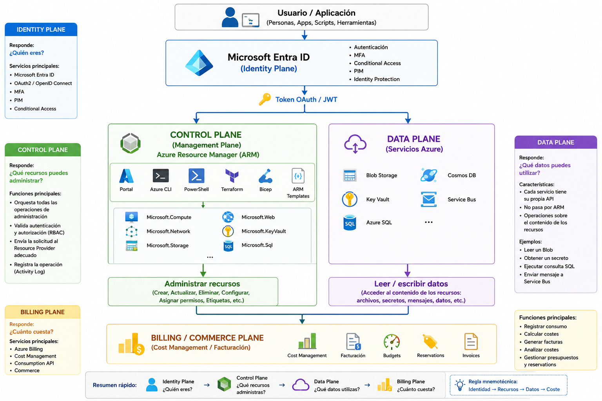
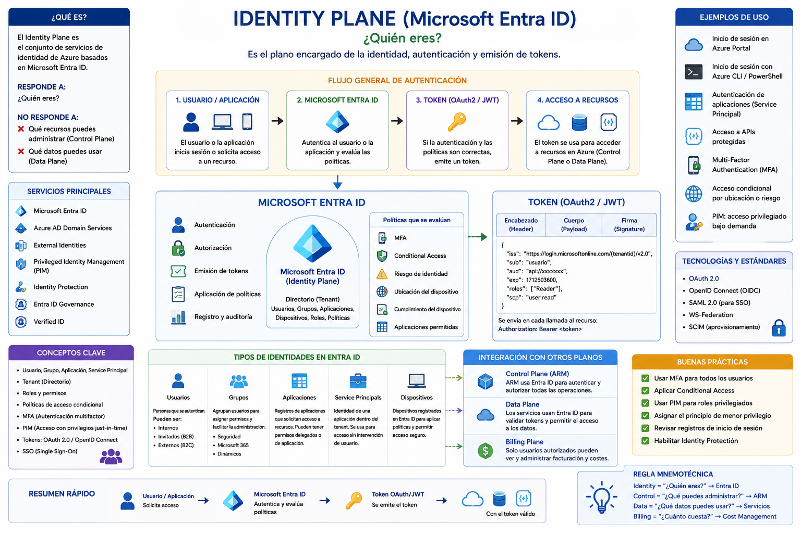
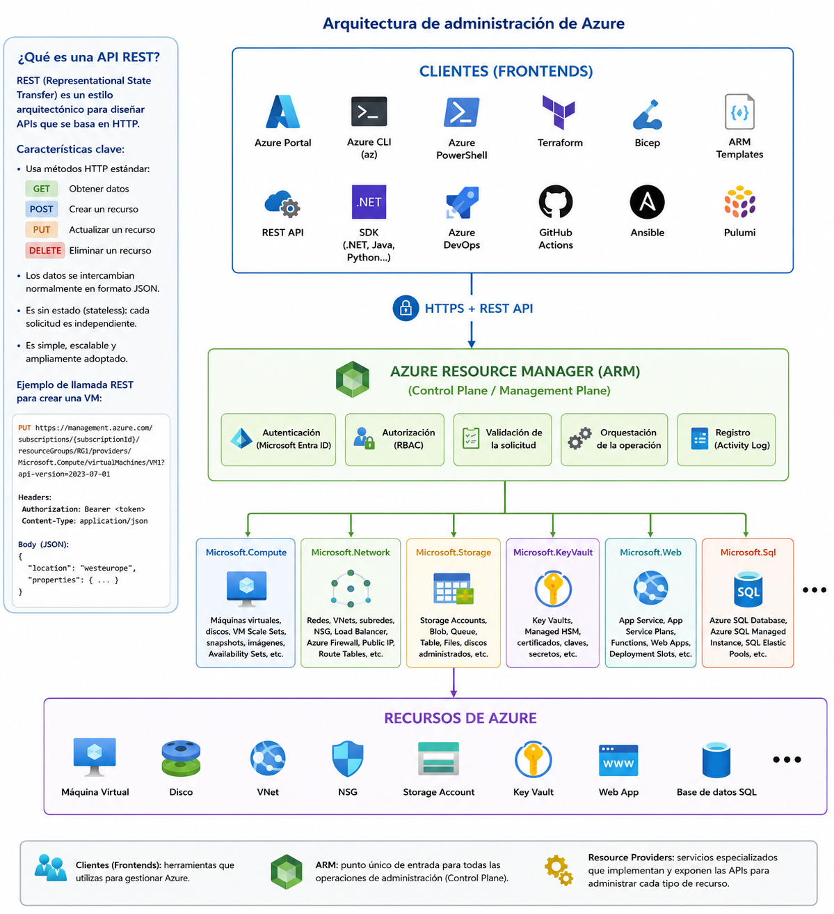
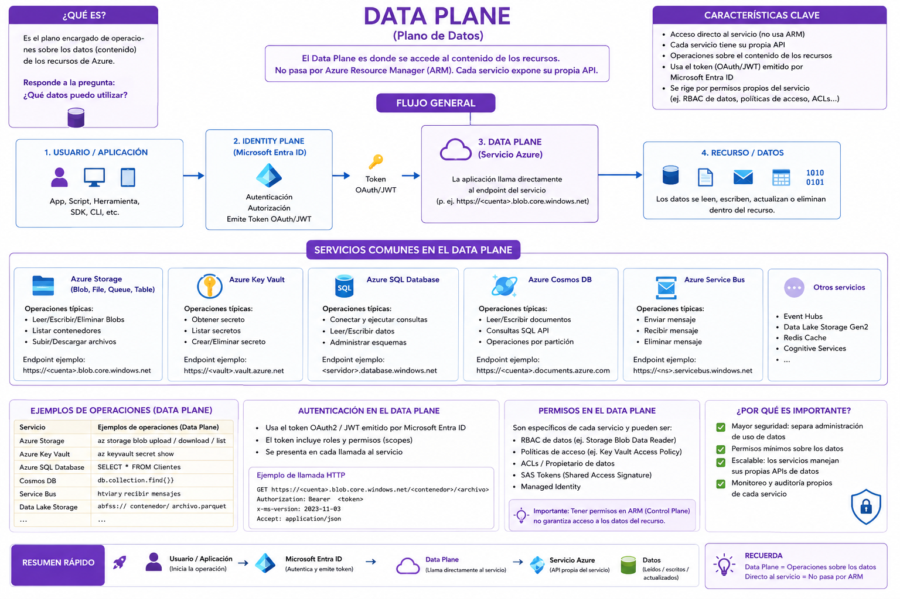
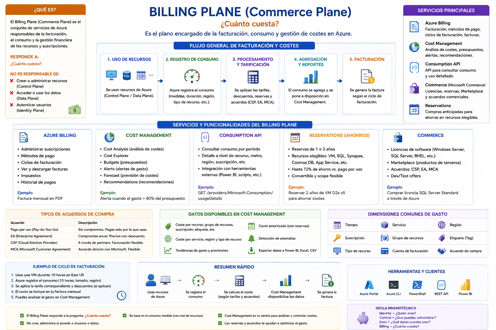

# Los cuatro planos (Planes) de Azure

Azure puede entenderse como cuatro grandes planos funcionales:

1. [**Identity Plane**](#1-identity-plane) : ¿Quién eres?
2. [**Control Plane (Management Plane)**](#2-control-plane-management-plane) : ¿Qué recursos puedes administrar?
3. [**Data Plane**](#3-data-plane) : ¿Qué datos puedes utilizar?
4. [**Billing Plane (Commerce Plane)**](#4-billing-plane-commerce-plane) : ¿Cuánto cuesta?

Cada uno responde a una pregunta diferente.

----

# Arquitectura general




---

# 1. Identity Plane

## Arquitectura general



## ¿Qué es?

Es el plano encargado de la **identidad**.

Su componente principal es:

- **Microsoft Entra ID**

Su misión es responder:

> **¿Quién eres?**

## Ejemplos

- Login en Azure Portal
- Login mediante Azure CLI
- Autenticación OAuth2
- MFA
- Obtener un Access Token

---

# 2. Control Plane (Management Plane)

## Arquitectura general




## ¿Qué es?

Es el plano encargado de **administrar los recursos de Azure**.

Su componente principal es:

- **Azure Resource Manager (ARM)**

También recibe estos nombres:

- Control Plane
- Management Plane
- Azure Resource Manager (ARM)

En el contexto del AZ-104 pueden considerarse equivalentes.

Su misión es responder:

> **¿Qué recursos puedo administrar?**

---

Todos los clientes utilizan la misma API de administración, por lo que da igual si creas una VM desde:

- Azure Portal
- Azure CLI
- Terraform
- PowerShell
- Bicep

Todos terminan realizando llamadas a **Azure Resource Manager (ARM)**.

---

# 1. ¿Qué es Azure Resource Manager (ARM)?

Azure Resource Manager (**ARM**) es el servicio que implementa el **Control Plane** de Azure.

También puede encontrarse con estos nombres:

- **Azure Resource Manager (ARM)**
- **Management Plane**
- **Control Plane**

En el contexto del AZ-104 estos términos pueden considerarse equivalentes.

Su función principal es **orquestar todas las operaciones de administración** sobre los recursos de Azure.

Ejemplos:

- Crear una máquina virtual.
- Crear una Storage Account.
- Crear una VNet.
- Cambiar el tamaño de una VM.
- Eliminar un Key Vault.
- Asignar un rol RBAC.
- Crear un Resource Group.

---

## ¿Qué NO hace ARM?

ARM **no accede al contenido de los recursos**.

Por ejemplo:

- Leer un Blob.
- Escribir un Blob.
- Leer un secreto de Key Vault.
- Conectarse por RDP o SSH a una VM.

Estas operaciones pertenecen al **Data Plane**.

---

## Management Plane vs Data Plane

| Operación | ¿Pasa por ARM? | Plano |
|-----------|:--------------:|--------|
| Crear VM | ✅ | Management Plane |
| Crear VNet | ✅ | Management Plane |
| Crear Storage Account | ✅ | Management Plane |
| Asignar RBAC | ✅ | Management Plane |
| Leer un Blob | ❌ | Data Plane |
| Escribir un Blob | ❌ | Data Plane |
| Leer un secreto de Key Vault | ❌ | Data Plane |
| RDP / SSH a una VM | ❌ | Data Plane |

---

# 2. Relación entre ARM y los Resource Providers

Una forma sencilla de entender Azure es:

> **ARM sabe "a quién pedirle el trabajo"; el Resource Provider sabe "cómo hacerlo".**

Por ejemplo, cuando ejecutas:

```bash
az vm create
```

No es Azure CLI quien crea la máquina virtual.

El flujo real es:

```text
Azure CLI

        │

        ▼

Azure Resource Manager

        │

        ▼

Microsoft.Compute

        │

        ▼

Virtual Machine creada
```

ARM recibe la petición, comprueba:

- Autenticación (Microsoft Entra ID)
- Autorización (RBAC)
- Validación de la solicitud

Y después delega el trabajo al **Resource Provider** correspondiente.

---

# 3. ¿Qué es un Resource Provider (RP)?

Un **Resource Provider (RP)** es un servicio especializado de Azure que implementa la lógica necesaria para administrar un tipo concreto de recursos.

Cada Resource Provider es responsable de un conjunto de recursos relacionados.

Por ejemplo:

| Resource Provider | Recursos que administra |
|-------------------|-------------------------|
| **Microsoft.Compute** | Máquinas virtuales, discos, VM Scale Sets... |
| **Microsoft.Network** | Redes, NSG, VNets, Load Balancers... |
| **Microsoft.Storage** | Storage Accounts, Blob, Queue, Table, Files |
| **Microsoft.KeyVault** | Key Vault y Managed HSM |

---

## ¿Cada Resource Provider tiene su propia API?

**Sí.**

Cada RP publica su propia **REST API** con operaciones específicas para el servicio que administra.

Por ejemplo:

### Microsoft.Compute

Permite operaciones como:

- Create VM
- Delete VM
- Start VM
- Stop VM
- Restart VM
- Resize VM

---

### Microsoft.Network

Permite:

- Create VNet
- Create NSG
- Create Route Table
- Create Load Balancer
- Create Public IP

---

### Microsoft.Storage

Permite:

- Create Storage Account
- Delete Storage Account
- Update Storage Account

---

## Ejemplo de llamada REST

Crear una VM:

```http
PUT
/subscriptions/{subscriptionId}
/resourceGroups/RG1
/providers/Microsoft.Compute
/virtualMachines/VM1
```

Crear una VNet:

```http
PUT
/subscriptions/{subscriptionId}
/resourceGroups/RG1
/providers/Microsoft.Network
/virtualNetworks/VNet1
```

Observa que el Resource Provider aparece en la URL:

```text
providers/Microsoft.Compute
```

o

```text
providers/Microsoft.Network
```

---

## Principales Resource Providers

| Concepto | Función |
| -------------------------------- | ------------------------------------------------------ |
| **Azure Resource Manager (ARM)** | Orquesta todas las operaciones de administración. |
| **Resource Provider (RP)** | Implementa la lógica de un servicio concreto de Azure. |
| **Microsoft.Compute** | Máquinas virtuales, discos, VM Scale Sets, snapshots... |
| **Microsoft.Network** | Redes, NSG, VNet, Load Balancer, Azure Firewall... |
| **Microsoft.Storage** | Storage Accounts, Blob, Queue, Table y Azure Files. |
| **Microsoft.KeyVault** | Key Vault y Managed HSM. |
| **Microsoft.Web** | App Service, App Service Plans, Deployment Slots... |
| **Microsoft.Sql** | Azure SQL Database y Azure SQL Managed Instance. |

---

# 4. ¿Qué es Microsoft.Compute?

**Microsoft.Compute** es el Resource Provider encargado de administrar todos los recursos relacionados con la computación en Azure.

Entre los recursos más habituales se encuentran:

| Tipo de recurso | Descripción |
|-----------------|-------------|
| Virtual Machines | Máquinas virtuales Windows y Linux |
| Virtual Machine Scale Sets (VMSS) | Grupos de máquinas virtuales con escalado automático |
| Availability Sets | Alta disponibilidad para VMs |
| Managed Disks | Discos administrados |
| Snapshots | Copias puntuales de discos |
| Images | Imágenes personalizadas de máquinas virtuales |
| Shared Image Gallery (Azure Compute Gallery) | Repositorio para compartir imágenes de VMs |

---

## Ejemplo

Cuando ejecutas:

```bash
az vm create
```

El flujo es:

```text
Azure CLI

↓

Azure Resource Manager

↓

Microsoft.Compute

↓

Virtual Machine
```

Cuando ejecutas:

```bash
az disk create
```

El flujo es:

```text
Azure CLI

↓

Azure Resource Manager

↓

Microsoft.Compute

↓

Managed Disk
```

Es decir, **Microsoft.Compute es el especialista en todos los recursos de computación de Azure**.

---

# Regla mnemotécnica

```text
Cliente

↓

Azure Resource Manager (ARM)

↓

Resource Provider

↓

Recurso Azure
```

- **Cliente** → Indica lo que quieres hacer.
- **ARM** → Decide quién debe hacerlo y valida la solicitud.
- **Resource Provider** → Ejecuta realmente la operación sobre el recurso.
- **Recurso Azure** → Resultado final (VM, VNet, Storage Account, etc.).


---

# 3. Data Plane


## Arquitectura general



## ¿Qué es?

Es el plano encargado de acceder al **contenido de los recursos**.

No utiliza Azure Resource Manager.

Cada servicio expone su propia API.

Su misión es responder:

> **¿Qué datos puedo utilizar?**

---

## Ejemplos

- Leer un Blob
- Escribir un Blob
- Obtener un secreto de Key Vault
- Ejecutar una consulta SQL
- Publicar un mensaje en Service Bus

---

# 4. Billing Plane (Commerce Plane)

## Arquitectura general



## ¿Qué es?

Es el plano encargado de la **facturación y costes**.

No existe un equivalente a ARM.

Los servicios principales son:

- Azure Billing
- Azure Cost Management
- Consumption API
- Commerce API

Su misión es responder:

> **¿Cuánto cuesta?**

---

## Arquitectura

```text
Clientes

Portal

REST API

Power BI

Azure CLI

        │

        ▼

Billing

Cost Management

Consumption

Commerce

        │

        ▼

Facturas

Budgets

Reservations

Cost Analysis
```

---

## Ejemplos

- Consultar la factura mensual
- Crear un presupuesto (Budget)
- Analizar costes
- Consultar consumo
- Administrar Reservations

---

# Comparativa

| Plano | Backend principal | Pregunta que responde |
|--------|-------------------|-----------------------|
| **Identity Plane** | Microsoft Entra ID | ¿Quién eres? |
| **Control Plane (Management Plane)** | Azure Resource Manager (ARM) | ¿Qué recursos puedes administrar? |
| **Data Plane** | API específica de cada servicio Azure | ¿Qué datos puedes utilizar? |
| **Billing Plane (Commerce Plane)** | Azure Billing / Cost Management | ¿Cuánto cuesta? |

---

# Comparación de operaciones

| Operación | Plano |
|-----------|--------|
| Iniciar sesión en Azure | Identity Plane |
| Obtener un token OAuth | Identity Plane |
| Crear una VM | Control Plane |
| Eliminar una Storage Account | Control Plane |
| Crear una VNet | Control Plane |
| Asignar un rol RBAC | Control Plane |
| Leer un Blob | Data Plane |
| Escribir un Blob | Data Plane |
| Leer un secreto de Key Vault | Data Plane |
| Ejecutar una consulta SQL | Data Plane |
| Consultar la factura | Billing Plane |
| Crear un Budget | Billing Plane |
| Analizar costes | Billing Plane |

---

# Regla mnemotécnica

| Plano | Frase para recordar |
|--------|---------------------|
| **Identity Plane** | **¿Quién eres?** |
| **Control Plane** | **¿Qué recursos puedes administrar?** |
| **Data Plane** | **¿Qué datos puedes utilizar?** |
| **Billing Plane** | **¿Cuánto cuesta?** |

---

# Resumen

```text
Identity Plane
        │
        ▼
¿Quién eres?

        │
        ▼
Control Plane
        │
        ▼
¿Qué recursos administras?

        │
        ▼
Data Plane
        │
        ▼
¿Qué datos utilizas?

        │
        ▼
Billing Plane
        │
        ▼
¿Cuánto cuesta?
```
