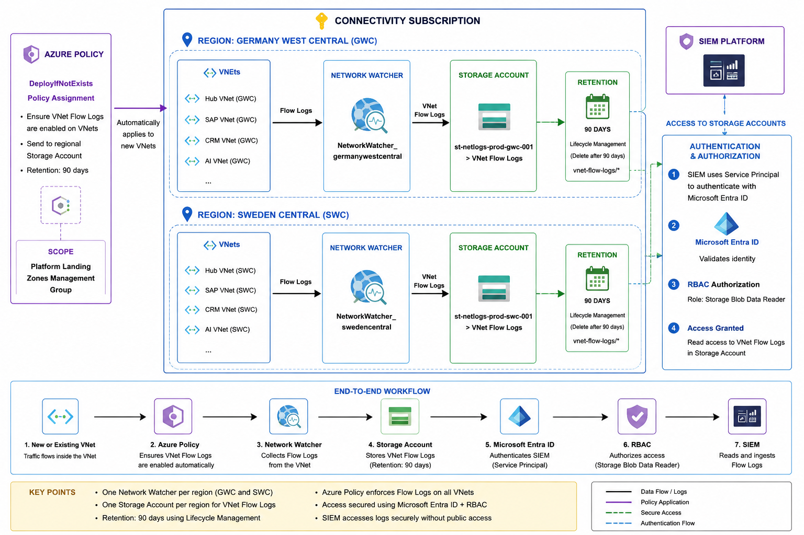

[Azure](https://github.com/magnum31415/wiki/blob/main/azure.md)

- [Azure Network Watcher](#azure-network-watcher)
- [Virtual Network Flow Logs Deployment Plan](#virtual-network-flow-logs-deployment-plan)
- [Grant SIEM Access to VNet Flow Logs Storage Accounts Using Microsoft Entra ID](#grant-siem-access-to-vnet-flow-logs-storage-accounts-using-microsoft-entra-id)

  
# Azure Network Watcher

## ¿Qué es Network Watcher?

Azure Network Watcher es un servicio regional de Azure que proporciona herramientas de monitorización, diagnóstico y captura de información de red.

- No enruta tráfico.
- No actúa como firewall.
- No es una VNet.
- No es un appliance.

Es un servicio de gestión que permite analizar y diagnosticar recursos de red de Azure.

---

## ¿Para qué sirve?

Permite realizar tareas de troubleshooting y observabilidad de red.

### Ejemplos

```text
- VNet Flow Logs
- Packet Capture
- Connection Monitor
- Next Hop
- IP Flow Verify
- Topology
- VPN Troubleshooting
```

---

## ¿Dónde se despliega?

Network Watcher es un recurso regional.

Existe un Network Watcher por región.

Ejemplo:

```text
Subscription
│
├── Germany West Central
│   └── NetworkWatcher_germanywestcentral
│
└── Sweden Central
    └── NetworkWatcher_swedencentral
```

---

## ¿De dónde cuelga?

Pertenece a una suscripción Azure.

Normalmente Microsoft lo crea dentro del Resource Group:

```text
NetworkWatcherRG
```

Ejemplo:

```text
Connectivity Subscription
│
└── NetworkWatcherRG
     ├── NetworkWatcher_germanywestcentral
     └── NetworkWatcher_swedencentral
```

Tipo de recurso:

```text
Microsoft.Network/networkWatchers
```

---

## Relación con las VNets

- Network Watcher no forma parte de una VNet.
- No está dentro de una VNet.
- No depende de una VNet concreta.

Ejemplo:

```text
Connectivity Subscription
│
├── NetworkWatcher_germanywestcentral
│
├── Hub VNet
├── SAP VNet
├── CRM VNet
└── AI VNet
```

Un único Network Watcher puede gestionar múltiples VNets de la misma región.

---

## Relación con VNet Flow Logs

Network Watcher es el servicio que permite habilitar los Flow Logs.

```text
Network Watcher
        │
        ▼
VNet Flow Logs
        │
        ▼
Storage Account
        │
        ▼
      SIEM
```

Sin Network Watcher no se pueden habilitar VNet Flow Logs.

---

## Principales funcionalidades

### VNet Flow Logs

Captura los flujos de tráfico IP de una VNet.

Ejemplo:

```text
VM1
 │
 ▼
VM2
```

Información registrada:

```text
IP origen
IP destino
Puerto origen
Puerto destino
TCP / UDP
Bytes transferidos
Estado del flujo
```

---

### Connection Monitor

Verifica conectividad entre recursos.

Ejemplo:

```text
VM1
 │
 ▼
VM2
```

Permite saber:

```text
- Latencia
- Disponibilidad
- Pérdida de paquetes
```

---

### Packet Capture

Captura paquetes directamente desde una máquina virtual.

Equivalente a:

```text
tcpdump
Wireshark
```

pero gestionado desde Azure.

---

### IP Flow Verify

Permite comprobar si un flujo será permitido o bloqueado.

Ejemplo:

```text
VM
 │
 ▼
Puerto TCP 443
```

Resultado:

```text
Allow
```

o

```text
Deny
```

incluyendo la regla responsable.

---

### Next Hop

Permite determinar la siguiente ruta utilizada.

Ejemplo:

```text
VM
 │
 ▼
Internet
```

Resultado:

```text
Azure Firewall
```

o

```text
Internet
```

o

```text
Virtual Network Gateway
```

---

### Topology

Genera automáticamente un mapa de red.

Ejemplo:

```text
VNet
│
├── Subnet Frontend
├── Subnet Backend
├── NSG
├── Route Table
└── VM
```

---

## Ejemplo en una Azure Landing Zone

```text
Connectivity Subscription
│
├── NetworkWatcherRG
│
├── NetworkWatcher_germanywestcentral
│
├── NetworkWatcher_swedencentral
│
├── Hub-GWC
├── Hub-SWC
├── VPN Gateway
├── ExpressRoute Gateway
└── Azure Firewall
```

---

## Ejemplo con VNet Flow Logs

```text
SAP VNet
      │
      ▼
VNet Flow Logs
      │
      ▼
Network Watcher
      │
      ▼
Storage Account
      │
      ▼
Corporate SIEM
```

---

## ¿Tiene coste?

El recurso Network Watcher no suele generar costes significativos por sí mismo.

Los costes aparecen al utilizar funcionalidades como:

```text
- VNet Flow Logs
- Traffic Analytics
- Packet Capture Storage
- Log Analytics
```

---

## Buenas prácticas en Azure Landing Zone

### Connectivity Subscription

```text
Connectivity Subscription
│
├── NetworkWatcher_germanywestcentral
├── NetworkWatcher_swedencentral
├── st-netlogs-prod-gwc-001
└── st-netlogs-prod-swc-001
```

### Una instancia por región

```text
Germany West Central
    ↓
NetworkWatcher_germanywestcentral

Sweden Central
    ↓
NetworkWatcher_swedencentral
```

### Automatizar mediante Terraform

```text
Terraform
    ↓
Network Watcher
    ↓
VNet Flow Logs
    ↓
Storage Account
```

### Automatizar mediante Azure Policy

```text
Nueva VNet
     ↓
DeployIfNotExists
     ↓
Activar VNet Flow Logs
```

---

## Resumen

```text
Network Watcher
    ↓
Servicio regional de diagnóstico y monitorización de red

No transporta tráfico
No es una VNet
No es un firewall

Permite:
    - VNet Flow Logs
    - Packet Capture
    - Connection Monitor
    - Next Hop
    - IP Flow Verify
    - Topology

Normalmente:
    - Uno por región
    - Ubicado en Connectivity Subscription
    - Dentro de NetworkWatcherRG
```
---

# Virtual Network Flow Logs Deployment Plan



## 1. Enable Network Watcher

Enable or verify Network Watcher in both regions:

```text
Connectivity Subscription
│
├── NetworkWatcher_germanywestcentral
└── NetworkWatcher_swedencentral
```

Notes:

- Verify whether Network Watcher already exists.
- One Network Watcher is required per Azure region.
- Network Watcher itself does not generate logs; it provides the platform required for VNet Flow Logs.

---

## 2. Create Storage Accounts

Create one regional Storage Account per region:

```text
Connectivity Subscription

Germany West Central
└── st-netlogs-prod-gwc-001
    └── VNet Flow Logs
        └── Retention: 90 days

Sweden Central
└── st-netlogs-prod-swc-001
    └── VNet Flow Logs
        └── Retention: 90 days
```

Recommended configuration:

```text
Performance: Standard
Redundancy: ZRS
Minimum TLS Version: TLS 1.2
Public Blob Access: Disabled
Lifecycle Management: Enabled
```

Lifecycle Management:

```text
vnet-flow-logs/*
Delete after 90 days
```

---

## 3. Enforce VNet Flow Logs through Azure Policy

Deploy an Azure Policy (DeployIfNotExists) to automatically enable VNet Flow Logs on newly created VNets.

```text
New VNet
    │
    ▼
Azure Policy
    │
    ▼
Deploy VNet Flow Logs
    │
    ▼
Regional Storage Account
```

Policy scope:

```text
Platform Landing Zones Management Group
```

or

```text
Connectivity Management Group
```

depending on the ALZ hierarchy.

Objective:

```text
Ensure that all production VNets have VNet Flow Logs enabled automatically.
```

---

## 4. Grant SIEM Access

Grant the SIEM access to both Storage Accounts:

```text
st-netlogs-prod-gwc-001
st-netlogs-prod-swc-001
```

Preferred authentication method:

```text
Microsoft Entra ID
+
RBAC
```

Recommended role:

```text
Storage Blob Data Reader
```

Assigned to:

```text
SIEM Service Principal
```

or

```text
SIEM Managed Identity
```

The SIEM team must confirm whether they require:

```text
- Direct Blob Storage access
- Event Hub integration
- Log Analytics integration
```

---

## 5. Terraform Implementation

Add the implementation to the ALZ Accelerator repository:

```text
modules/
└── vnet-flow-logs/

platform/
└── connectivity/
    └── vnet-flow-logs.tf
```

Terraform resources:

```text
- Network Watcher (if required)
- Storage Accounts
- Lifecycle Policies
- RBAC Assignments
- VNet Flow Logs
- Azure Policy Assignment
```

---

## Expected Result

```text
Connectivity Subscription
│
├── NetworkWatcher_germanywestcentral
├── NetworkWatcher_swedencentral
│
├── st-netlogs-prod-gwc-001
│   └── VNet Flow Logs (90 days)
│
└── st-netlogs-prod-swc-001
    └── VNet Flow Logs (90 days)

                │
                ▼

          Corporate SIEM
```
---
# Grant SIEM Access to VNet Flow Logs Storage Accounts Using Microsoft Entra ID

## Objective

Allow the corporate SIEM to securely read VNet Flow Logs stored in Azure Storage Accounts using Microsoft Entra ID authentication and Azure RBAC.

## Prerequisites

- Corporate SIEM capable of authenticating against Azure using a Service Principal.
- Storage Accounts already deployed:
  - st-netlogs-prod-gwc-001
  - st-netlogs-prod-swc-001
- Appropriate permissions in Azure:
  - Application Administrator or equivalent in Entra ID.
  - Owner or User Access Administrator on the Storage Accounts.

## Step 1 - Create a Service Principal

### Create an Application Registration

Navigate to:

```text
Microsoft Entra ID
└── App registrations
    └── New registration
```

Example:

```text
Name: sp-siem-vnetflowlogs
```

Record:

```text
Application (Client) ID
Directory (Tenant) ID
```

---

## Step 2 - Create Credentials

Navigate to:

```text
App registrations
└── sp-siem-vnetflowlogs
    └── Certificates & secrets
```

Create one of the following:

### Option A - Client Secret

```text
New client secret
```

Record:

```text
Secret Value
```

### Option B - Certificate (Recommended)

Upload a certificate provided by the SIEM team.

---

## Step 3 - Assign Storage Blob Data Reader Role

### Germany West Central Storage Account

Navigate to:

```text
st-netlogs-prod-gwc-001
└── Access Control (IAM)
    └── Add role assignment
```

Assign:

```text
Role:
Storage Blob Data Reader

Member:
sp-siem-vnetflowlogs
```

### Sweden Central Storage Account

Navigate to:

```text
st-netlogs-prod-swc-001
└── Access Control (IAM)
    └── Add role assignment
```

Assign:

```text
Role:
Storage Blob Data Reader

Member:
sp-siem-vnetflowlogs
```

---

## Step 4 - Verify Storage Configuration

Navigate to:

```text
Storage Account
└── Configuration
```

Recommended settings:

```text
Public Blob Access = Disabled
Minimum TLS Version = TLS 1.2
```

This prevents anonymous access while still allowing authenticated access through Microsoft Entra ID.

---

## Step 5 - Provide Information to the SIEM Team

Deliver:

```text
Tenant ID
Client ID
Client Secret or Certificate
Storage Account Names
Container Names
```

Example:

```text
Tenant ID:
xxxxxxxx-xxxx-xxxx-xxxx-xxxxxxxxxxxx

Client ID:
xxxxxxxx-xxxx-xxxx-xxxx-xxxxxxxxxxxx

Storage Accounts:
st-netlogs-prod-gwc-001
st-netlogs-prod-swc-001
```

---

## Step 6 - SIEM Connection Flow

```text
Corporate SIEM
        │
        ▼
Microsoft Entra ID
        │
        ▼
Service Principal
        │
        ▼
Storage Blob Data Reader
        │
        ▼
Storage Account
        │
        ▼
VNet Flow Logs
```

---

## Security Recommendations

### Recommended

```text
Public Blob Access = Disabled
Authentication = Microsoft Entra ID
Authorization = Azure RBAC
Role = Storage Blob Data Reader
```

### Avoid

```text
Storage Account Access Keys
Anonymous Blob Access
Shared Credentials Between Systems
```

---

## Validation

Verify that the SIEM can:

```text
Authenticate against Microsoft Entra ID
List containers
Read blobs
Download VNet Flow Log files
```

Verify that the SIEM cannot:

```text
Delete blobs
Modify blobs
Change Storage Account configuration
```

The assigned role should remain:

```text
Storage Blob Data Reader
```

to enforce least-privilege access.
