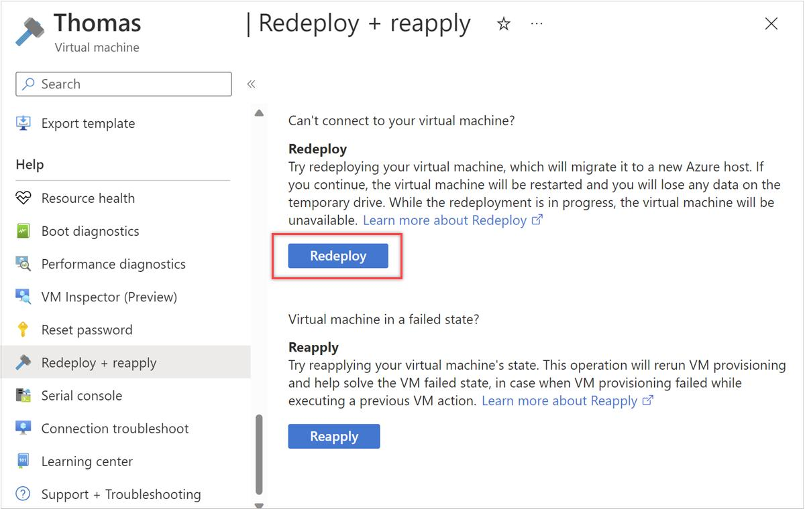

[Azure](https://github.com/magnum31415/wiki/blob/main/azure.md)


# Índice

- [Azure VM Redeploy y Scheduled Maintenance (AZ-104)](#azure-vm-redeploy-y-scheduled-maintenance-az-104)
- [Azure Desired State Configuration (DSC)](#azure-desired-state-configuration-dsc---az-104)
 
# Azure VM Redeploy y Scheduled Maintenance (AZ-104)

## Scheduled Maintenance

Azure realiza mantenimiento periódico sobre la infraestructura física.

Esto puede afectar:

- Hosts físicos
- Hypervisors
- Networking
- Hardware Azure

---

## Qué ocurre durante el mantenimiento

Azure puede:

- Reiniciar hosts
- Migrar workloads
- Reiniciar VMs
- Aplicar actualizaciones plataforma

---

## Maintenance Event

Una VM puede recibir alertas como:

```text
Scheduled platform maintenance
```

---

## Objetivo típico examen

AZ-104 suele preguntar cómo:

- Evitar impacto
- Mover VM a otro host
- Aplicar mantenimiento manualmente
- Resolver problemas host físicos

---

## Concepto clave

### Host físico

Una Azure VM corre sobre:

```text
Host físico Azure
```

---

## Importante

La VM NO existe directamente “en Azure”.

Existe sobre:

- Hardware físico
- Hypervisor Azure

---

# Tabla resumen

| Acción | Qué hace | Reinicia VM | Cambia host físico | Mantiene discos | Puede perder temporary disk | Uso típico | ¿Permite mover VM a otra subscription? | ¿Permite mover VM a otro Resource Group? |
|---|---|---|---|---|---|---|---|---|
| Redeploy | Mueve la VM a otro host Azure | ✅ | ✅ | ✅ | ✅ | Problemas host físico, scheduled maintenance | ❌ | ❌ |
| Restart | Reinicia sistema operativo/VM | ✅ | ❌ | ✅ | ❌ normalmente | Reinicio normal | ❌ | ❌ |
| Reapply | Reaplica configuración VM al host actual | A veces | ❌ | ✅ | ❌ | Problemas configuración/extensiones | ❌ | ❌ |
| One-time Update | Aplica mantenimiento manualmente | Puede | ❌ | ✅ | ❌ normalmente | Adelantar maintenance updates | ❌ | ❌ |
| Enable (Updates blade) | Habilita Update Management / patch orchestration | ❌ normalmente | ❌ | ✅ | ❌ | Gestión automática updates | ❌ | ❌ |
| Move to another subscription | Mueve recursos Azure entre subscriptions | ❌ normalmente | ❌ | ✅ | ❌ | Reorganización tenant/subscriptions | ✅ | ✅ normalmente |
| Move to another Resource Group | Mueve la VM a otro RG dentro de la subscription | ❌ normalmente | ❌ | ✅ | ❌ | Reorganización recursos | ❌ | ✅ |



---

## Diferencia importante

| Acción | Cambia host Azure | Configura updates | Cambia Resource Group | Cambia Subscription |
|---|---|---|---|---|
| Redeploy | ✅ | ❌ | ❌ | ❌ |
| One-time Update | ❌ | ✅ | ❌ | ❌ |
| Enable (Updates blade) | ❌ | ✅ | ❌ | ❌ |
| Move Resource Group | ❌ | ❌ | ✅ | ❌ |
| Move Subscription | ❌ | ❌ | ✅ normalmente | ✅ |

---

# Qué hace "Enable" en Updates blade

Al pulsar:

```text
Enable
```

Azure normalmente:

- Habilita Update Management
- Configura patch orchestration
- Permite gestión updates

Pero:

❌ NO mueve la VM  
❌ NO cambia host físico  
❌ NO hace redeploy  

---

# Reglas rápidas AZ-104

```text
Enable in the Updates blade configures update management, not VM relocation.
```

```text
Only Redeploy moves the VM to another Azure host.
```


## Diferencia clave AZ-104

| Acción | Palabra clave examen |
|---|---|
| Redeploy | Move VM to another host |
| Restart | Reboot VM |
| Reapply | Reapply configuration |
| One-time Update | Apply maintenance |


---

# Diferencia clave AZ-104

| Acción | Palabra clave examen |
|---|---|
| Redeploy | Move VM to another host |
| Restart | Reboot VM |
| Reapply | Reapply configuration |
| One-time Update | Apply maintenance |

---

# Regla rápida examen

```text
Only Redeploy guarantees moving the VM to another Azure host.
```

---

## Redeploy VM

### Qué hace

```text
Redeploy
```

mueve la VM a otro host físico Azure.

---

## Qué ocurre durante Redeploy

Azure:

1. Apaga la VM
2. La mueve a otro host físico
3. Recrea el estado computación
4. Mantiene discos y configuración

---

### Qué cambia

| Elemento | Cambia |
|---|---|
| Host físico | ✅ |
| Compute host | ✅ |
| Temporary disk | Puede perderse |
| VM runtime | Reinicia |

---

### Qué NO cambia

| Elemento | Se mantiene |
|---|---|
| Managed disks | ✅ |
| NICs | ✅ |
| IPs privadas | ✅ normalmente |
| Configuración VM | ✅ |
| OS disk | ✅ |

---

## Cuándo usar Redeploy

| Escenario | Usar Redeploy |
|---|---|
| Host con problemas | ✅ |
| Scheduled maintenance | ✅ |
| VM stuck | ✅ |
| Problemas networking host | ✅ |
| Performance issues host | ✅ |

---

## Qué NO es Redeploy

Redeploy NO es:

- Restart
- Reapply
- One-time update

---

## Restart VM

### Qué hace

```text
Restart
```

reinicia la VM.

---

### Qué NO hace

❌ NO cambia host físico.

---

## Reapply VM

### Qué hace

Reaplica configuración VM al host actual.

---

### Qué NO hace

❌ NO mueve la VM.

---

## One-time Update

### Qué es

Permite aplicar mantenimiento manualmente antes del maintenance window.

---

### Qué hace

✅ Aplicar updates plataforma  
✅ Adelantar mantenimiento  

---

### Qué NO hace

❌ NO mueve VM a otro host  
❌ NO garantiza relocation  

---

## Diferencia importante

| Acción | Cambia host físico |
|---|---|
| Restart | ❌ |
| Reapply | ❌ |
| One-time update | ❌ |
| Redeploy | ✅ |

---

## Trampa típica AZ-104

Muchos candidatos ven:

```text
maintenance
```

y piensan:

```text
update
```

❌ Incorrecto.

---

## La palabra clave examen

```text
move VM to another host
```

o

```text
relocate
```

---

## Eso implica

✅ Redeploy

---

## Temporary Disk

## Importante

Durante Redeploy:

```text
Temporary disk puede perderse
```

---

## Ejemplo típico

Windows:

```text
D:
```

Linux:

```text
/mnt
```

---

## Managed Disks

### Importante

Managed Disks:

✅ sobreviven Redeploy

---

## Maintenance Control

Azure permite:

- Planned maintenance notifications
- Maintenance configurations
- Self-service maintenance

---

## Qué quiere evaluar el examen

| Concepto | Importancia |
|---|---|
| Redeploy VM | Muy alta |
| Scheduled maintenance | Alta |
| Host relocation | Muy alta |
| Temporary disk | Alta |
| Restart vs Redeploy | Muy alta |

---

## Tabla resumen examen

| Acción | Reinicia VM | Cambia host |
|---|---|---|
| Restart | ✅ | ❌ |
| Reapply | A veces | ❌ |
| One-time update | Puede | ❌ |
| Redeploy | ✅ | ✅ |

---

## Regla rápida examen

```text
Redeploy relocates a VM to a new Azure host.
```

---

## Frases clave AZ-104

```text
Redeploy moves a VM to another physical Azure host.
```

```text
One-time update applies maintenance but does not relocate the VM.
```

```text
Temporary disks may be lost during redeploy.
```

---

# Azure Desired State Configuration (DSC) - AZ-104

---

# Azure Desired State Configuration (DSC) - AZ-104

---

# Qué es Desired State Configuration (DSC)

Desired State Configuration (DSC) es una plataforma de administración de configuración basada en PowerShell que permite definir:

```text
cómo debe estar configurado un servidor o VM
```

y garantizar que permanezca en ese estado.

---

# Soporte Windows vs Linux

Aunque DSC nació para Windows y PowerShell, también soporta Linux.

---

# Compatibilidad DSC

| Característica | Windows | Linux |
|---|---|---|
| DSC soportado | ✅ | ✅ |
| PowerShell DSC nativo | ✅ | Parcial |
| Azure Automation DSC | ✅ | ✅ |
| Local Configuration Manager (LCM) | ✅ | ✅ |
| Recursos DSC disponibles | Muchísimos | Menos |
| Uso enterprise habitual | Muy alto | Medio/Bajo |
| Gestión Windows Features | ✅ | ❌ |
| Gestión paquetes Linux | ❌ | ✅ |
| Ecosistema/módulos | Muy amplio | Más limitado |

---

# Importante examen

DSC:

```text
NO es exclusivo de Windows
```

pero:

```text
está mucho más asociado al ecosistema Windows
```

---

# Objetivo principal

DSC sirve para:

- automatizar configuraciones
- mantener consistencia
- evitar configuration drift
- aplicar configuraciones declarativas

---

# Concepto clave

Con DSC defines:

```text
estado deseado
```

NO comandos paso a paso.

---

# Ejemplo simple

```text
"IIS debe estar instalado"
```

↓

DSC verifica continuamente:

- si IIS está instalado → OK
- si alguien lo elimina → lo reinstala

---

# Qué significa "Desired State"

```text
Desired State
```

=

```text
estado esperado/configuración objetivo
```

---

# Qué es Configuration Drift

```text
Configuration Drift
```

ocurre cuando un servidor cambia respecto a la configuración esperada.

Ejemplo:

- alguien desinstala IIS
- cambia un registry key
- modifica servicios

↓

DSC puede detectar y corregir estos cambios.

---

# Arquitectura DSC

```text
Configuration
      ↓
Local Configuration Manager (LCM)
      ↓
Target Node (VM/Server)
```

---

# Componentes principales

| Componente | Función |
|---|---|
| Configuration | Define estado deseado |
| Resource | Elemento configurable |
| LCM (Local Configuration Manager) | Motor DSC en el nodo |
| Node | VM o servidor objetivo |

---

# Qué es una Configuration

Una:

```text
Configuration
```

es un script PowerShell declarativo.

---

# Ejemplo DSC

```powershell
Configuration WebServer {
    Node "Server1" {
        WindowsFeature IIS {
            Name = "Web-Server"
            Ensure = "Present"
        }
    }
}
```

---

# Qué hace este ejemplo

Garantiza que:

```text
IIS esté instalado
```

en:

```text
Server1
```

---

# Qué es un Resource

Los:

```text
DSC Resources
```

son módulos reutilizables que gestionan configuraciones.

---

# Ejemplos de Resources

| Resource | Función | Windows | Linux |
|---|---|---|---|
| WindowsFeature | Instalar roles/features | ✅ | ❌ |
| File | Gestionar archivos | ✅ | ✅ |
| Service | Gestionar servicios | ✅ | ✅ |
| Registry | Gestionar registry | ✅ | ❌ |
| User | Gestionar usuarios | ✅ | ✅ |

---

# Local Configuration Manager (LCM)

## Qué es

Motor DSC que ejecuta configuraciones en cada nodo.

---

# Funciones del LCM

- aplicar configuraciones
- detectar drift
- corregir drift
- descargar configuraciones

---

# Modos importantes

| Modo | Función |
|---|---|
| ApplyOnly | Aplica una vez |
| ApplyAndMonitor | Detecta drift |
| ApplyAndAutoCorrect | Corrige drift automáticamente |

---

# Pull vs Push Mode

## Push Mode

Administrador envía configuración manualmente.

```text
Admin → VM
```

---

## Pull Mode

La VM descarga configuraciones desde un servidor DSC.

```text
VM → Pull Server
```

---

# Azure Automation State Configuration

Azure integró DSC en:

```text
Azure Automation State Configuration
```

---

# Qué permite

- administrar DSC desde Azure
- aplicar configuraciones centralizadas
- compliance reporting
- inventory

---

# Casos típicos de uso

| Escenario | Uso |
|---|---|
| Instalar IIS automáticamente | DSC |
| Mantener servicios activos | DSC |
| Garantizar configuración seguridad | DSC |
| Corregir configuration drift | DSC |

---

# DSC vs Scripts tradicionales

| Scripts | DSC |
|---|---|
| Imperativo | Declarativo |
| Ejecuta pasos | Define estado final |
| No corrige drift | Corrige drift |
| Menos consistente | Más consistente |

---

# Importante examen

DSC es:

```text
Declarative Configuration Management
```

---

# Diferencia importante examen

| Tecnología | Objetivo |
|---|---|
| DSC | Estado configuración |
| ARM/Bicep/Terraform | Provisioning infraestructura |
| Azure Policy | Compliance/Governance |

---

# Relación con Azure Policy

Azure Policy puede:

```text
DeployIfNotExists
```

↓

desplegar extensiones DSC automáticamente.

---

# Trampas típicas AZ-104

## Trampa 1

Pensar que DSC despliega infraestructura Azure.

❌ Incorrecto.

↓

DSC configura sistemas operativos.

---

## Trampa 2

Confundir:

```text
DSC
```

con:

```text
Azure Policy
```

---

## Trampa 3

Pensar que DSC es imperativo.

❌ Incorrecto.

↓

DSC es declarativo.

---

# Tabla resumen examen

| Feature | DSC |
|---|---|
| Declarativo | ✅ |
| Configuration drift correction | ✅ |
| PowerShell-based | ✅ |
| Gestión configuración SO | ✅ |
| Provisioning Azure Resources | ❌ |

---

# Arquitectura conceptual

```text
Desired Configuration
        ↓
DSC Configuration
        ↓
Local Configuration Manager (LCM)
        ↓
Target VM / Server
```

---

# Reglas rápidas AZ-104

```text
DSC ensures systems remain in a desired configuration state.
```

```text
DSC is declarative.
```

```text
LCM applies and monitors DSC configurations.
```

```text
DSC helps prevent configuration drift.
```

---

# Frases clave AZ-104

```text
Desired State Configuration is a declarative configuration platform.
```

```text
DSC can automatically correct configuration drift.
```

```text
Azure Automation State Configuration integrates DSC into Azure.
```
