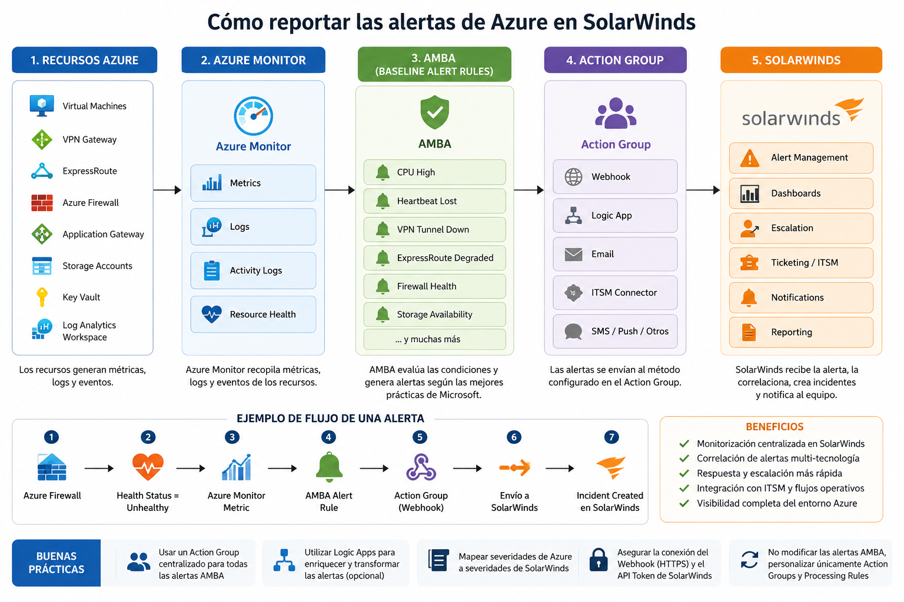

[Azure](https://github.com/magnum31415/wiki/blob/main/azure.md)

# Azure Monitor Baseline Alerts (AMBA)

## Introducción

Azure Monitor Baseline Alerts (AMBA) es una iniciativa oficial de Microsoft que proporciona un conjunto de alertas predefinidas y recomendadas para recursos Azure.

Su objetivo es implementar una línea base de monitorización consistente en toda la organización, reduciendo el esfuerzo necesario para diseñar y mantener cientos de alertas manualmente.

AMBA forma parte de las mejores prácticas de Azure Well-Architected Framework y está especialmente orientado a entornos Azure Landing Zones (ALZ).



---

# Problema que resuelve

Sin AMBA, cada equipo debe definir manualmente:

- Qué métricas monitorizar.
- Qué umbrales utilizar.
- Qué alertas crear.
- Cómo gestionar nuevos recursos.

Ejemplo:

```text
Virtual Machines
VPN Gateways
ExpressRoute
Azure Firewall
Storage Accounts
Key Vaults
AKS Clusters
```

Cada servicio requiere múltiples alertas específicas.

Con AMBA, Microsoft proporciona un catálogo de alertas recomendadas basado en las mejores prácticas operativas.

---

# Arquitectura General

```text
Azure Resources
       │
       ▼
Azure Policy
       │
       ▼
DeployIfNotExists
       │
       ▼
Alert Rules
       │
       ▼
Action Groups
       │
       ▼
Operations Team
```

Cuando aparece un nuevo recurso Azure, las políticas de AMBA detectan el recurso y despliegan automáticamente las alertas correspondientes.

---

# Componentes de AMBA

## Azure Policy

AMBA utiliza Azure Policy para garantizar que las alertas estén presentes en todos los recursos requeridos.

Principalmente utiliza políticas:

```text
DeployIfNotExists
```

Estas políticas comprueban si la alerta existe y, en caso contrario, la despliegan automáticamente.

---

## Alert Rules

Las Alert Rules son las reglas que generan alertas cuando se cumplen determinadas condiciones.

Ejemplos:

| Servicio | Alerta |
|-----------|---------|
| Virtual Machine | CPU > 90% |
| Virtual Machine | Heartbeat perdido |
| Storage Account | Disponibilidad |
| Azure Firewall | Estado del servicio |
| VPN Gateway | Túnel caído |
| ExpressRoute | Circuito degradado |

---

## Action Groups

Los Action Groups definen qué ocurre cuando una alerta se dispara.

Ejemplos:

- Correo electrónico
- SMS
- Webhook
- Logic App
- Azure Function
- ITSM Connector

Ejemplo:

```text
CPU > 90%
      │
      ▼
Action Group
      │
      ▼
Email Operaciones
```

---

## Alert Processing Rules

Permiten modificar el comportamiento de las alertas.

Casos habituales:

- Supresión durante mantenimiento.
- Redirección a distintos equipos.
- Filtrado de alertas.

Ejemplo:

```text
Maintenance Window
        │
        ▼
Suppress Alerts
```

---

# Relación con Azure Monitor

AMBA no sustituye Azure Monitor.

| Azure Monitor | AMBA |
|---------------|-------|
| Servicio Azure | Conjunto de configuraciones |
| Recoge métricas y logs | Define alertas recomendadas |
| Plataforma de monitorización | Baseline de monitorización |
| Almacena información | Consume información |

Relación:

```text
Azure Monitor
       │
       ▼
Metrics / Logs
       │
       ▼
AMBA Alert Rules
```

---

# Integración con Azure Landing Zones (ALZ)

Microsoft proporciona una implementación específica denominada:

```text
AMBA-ALZ
```

Diseñada para desplegar monitorización base en entornos Azure Landing Zone.

Arquitectura típica:

```text
Management Groups
        │
        ▼
Azure Policies
        │
        ▼
AMBA
        │
        ▼
Alert Rules
        │
        ▼
Action Groups
```

---

# Servicios Soportados

AMBA incluye alertas para numerosos servicios Azure.

## Compute

- Virtual Machines
- Virtual Machine Scale Sets
- Availability Sets

## Networking

- VPN Gateway
- ExpressRoute
- Load Balancer
- Application Gateway
- Azure Firewall

## Storage

- Storage Accounts

## Security

- Key Vault
- Defender for Cloud

## Containers

- Azure Kubernetes Service (AKS)

## Monitoring

- Log Analytics Workspace
- Azure Monitor

---

# Ejemplo de Funcionamiento

## Sin AMBA

```text
Nueva VM
    │
    ▼
Administrador crea alertas manualmente
```

## Con AMBA

```text
Nueva VM
    │
    ▼
Azure Policy detecta recurso
    │
    ▼
DeployIfNotExists
    │
    ▼
Alertas desplegadas automáticamente
```

Ejemplos:

- CPU alta
- Heartbeat perdido
- Problemas de disponibilidad

---

# Integración de AMBA con SolarWinds

## Objetivo

AMBA genera alertas en Azure Monitor.

SolarWinds puede actuar como plataforma central de monitorización y recibir dichas alertas para su correlación, visualización y escalado.

Arquitectura recomendada:

```text
Azure Resource
      │
      ▼
Azure Monitor Metric / Log
      │
      ▼
AMBA Alert Rule
      │
      ▼
Action Group
      │
      ▼
Webhook
      │
      ▼
SolarWinds
```

---

## Métodos de Integración

### Método 1 - Webhook (Recomendado)

Las alertas de Azure Monitor invocan un Webhook configurado dentro de un Action Group.

```text
Alert Rule
      │
      ▼
Action Group
      │
      ▼
Webhook
      │
      ▼
SolarWinds Alert API
```

Ventajas:

- Integración nativa.
- Tiempo real.
- Sin componentes adicionales.

---

### Método 2 - Email Integration

Las alertas se envían por correo electrónico a una cuenta monitorizada por SolarWinds.

```text
Alert Rule
      │
      ▼
Action Group
      │
      ▼
Email
      │
      ▼
SolarWinds
```

Ventajas:

- Configuración sencilla.

Desventajas:

- Mayor latencia.
- Menor capacidad de automatización.

---

### Método 3 - Azure Logic App

Permite enriquecer y transformar las alertas antes de enviarlas a SolarWinds.

```text
Alert Rule
      │
      ▼
Action Group
      │
      ▼
Logic App
      │
      ▼
SolarWinds API
```

Ventajas:

- Transformación de datos.
- Filtrado.
- Enrutamiento avanzado.

---

### Método 4 - ITSM Integration

Si SolarWinds Service Desk está implantado:

```text
Alert Rule
      │
      ▼
Action Group
      │
      ▼
ITSM Connector
      │
      ▼
SolarWinds Service Desk
```

Permite generar automáticamente:

- Incidentes.
- Tickets.
- Escalados.

---

# Ejemplo de Configuración

## Action Group

```text
Name:
ag-solarwinds-prod

Action Type:
Webhook

Endpoint:
https://solarwinds.company.com/api/alerts
```

## Alert Rule

```text
Resource:
Azure Firewall

Condition:
Health Status != Healthy

Action Group:
ag-solarwinds-prod
```

Resultado:

```text
Azure Firewall
      │
      ▼
Alert Triggered
      │
      ▼
SolarWinds Incident
```

---

# Buenas Prácticas

## Crear un Action Group centralizado

```text
ag-solarwinds-prod
```

para reutilizarlo desde todas las alertas AMBA.

---

## Separar entornos

```text
ag-solarwinds-dev
ag-solarwinds-test
ag-solarwinds-prod
```

---

## Utilizar Logic Apps para enriquecimiento

Permite añadir:

- Subscription Name
- Resource Group
- Environment
- Business Service
- Severity Mapping

antes de enviar la alerta a SolarWinds.

---

## Evitar modificaciones directas sobre AMBA

Mantener AMBA estándar y personalizar únicamente:

- Action Groups
- Alert Processing Rules

para facilitar futuras actualizaciones del framework.

---

# Resumen

```text
AMBA
=
Azure Monitor Baseline Alerts
```

Framework oficial de Microsoft para desplegar alertas recomendadas mediante Azure Policy.

Integración recomendada con SolarWinds:

```text
Azure Resource
      │
      ▼
Azure Monitor
      │
      ▼
AMBA Alert Rule
      │
      ▼
Action Group
      │
      ▼
Webhook
      │
      ▼
SolarWinds
```

Esta arquitectura permite centralizar la monitorización de Azure Landing Zones en SolarWinds manteniendo las mejores prácticas de Microsoft.
