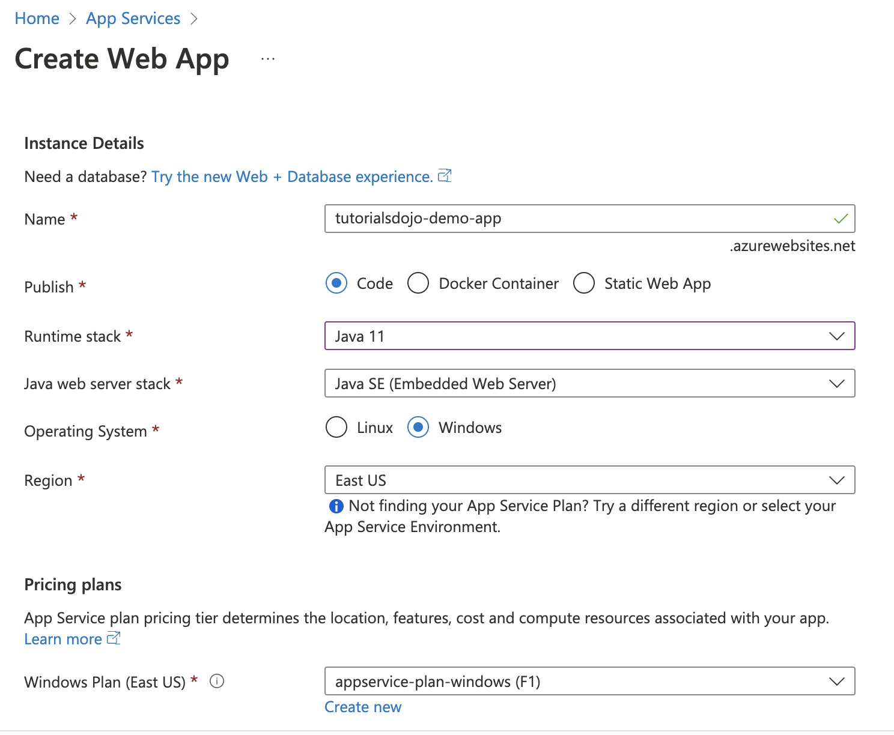

[Azure](https://github.com/magnum31415/wiki/blob/main/azure.md)


# 📑 Índice

1. [Azure App Service](#azure-app-service)

2. [Resumen comparativo](#-resumen-comparativo)

3. [Claves examen rápidas](#-claves-examen-rápidas)

4. [Árbol completo – Creación y estructura de Azure App Service](#-árbol-completo--creación-y-estructura-de-azure-app-service)

5. [¿Qué es Azure App Service?](#-qué-es-azure-app-service)

6. [Qué te proporciona](#-qué-te-proporciona)

7. [Cómo funciona](#-cómo-funciona)

8. [Tipos principales](#-tipos-principales)

9. [Diferencia con otros servicios](#-diferencia-con-otros-servicios)

10. [Cuándo usarlo](#-cuándo-usarlo)

11. [App Service Plan (ASP)](#-1️⃣-app-service-plan-asp)

12. [App Service Environment (ASE)](#-2️⃣-app-service-environment-ase)

13. [Deployment Slots](#-3️⃣-deployment-slots)

14. [Deployment Stack](#-4️⃣-deployment-stack)

15. [Mapa mental AZ-305](#-mapa-mental-az-305)

16. [Cómo funciona Azure App Service (Arquitectura interna)](#-cómo-funciona-azure-app-service)

17. [Flujo completo de funcionamiento](#-flujo-completo-de-funcionamiento)

18. [Backups personalizados de Azure App Service](#backups-personalizados-de-azure-app-service)

# Azure App Service

Azure App Service es un servicio PaaS de Azure que permite alojar aplicaciones web y APIs con escalado y alta disponibilidad sin gestionar servidores ni infraestructura.

Es el **servicio PaaS** completo para alojar aplicaciones web.

- Incluye:
  - Web Apps
  - API Apps
  - WebJobs
  - Mobile Apps
  - (Base de Azure Functions en algunos escenarios)

- 👉 Es el servicio global.

| Concepto                      | Qué es                                                | Nivel                   |
| ----------------------------- | ----------------------------------------------------- | ----------------------- |
| Azure App Service             | Servicio PaaS completo                                | Servicio                |
| App Service Plan              | Recursos de cómputo                                   | Infraestructura         |
| Azure Web App                 | Aplicación individual                                 | Aplicación              |
| App Service Environment (ASE) | Despliegue dedicado de App Service dentro de una VNet | Infraestructura aislada |





# 📊 Resumen comparativo

| Concepto | Nivel | Qué controla | Coste |
|----------|-------|--------------|-------|
| App Service Plan | Infraestructura base | CPU, RAM, instancias | Medio |
| App Service Environment "ASE" | Infraestructura aislada | Red privada + aislamiento | Alto |
| Deployment Slot | Funcionalidad app | Versiones sin downtime | Bajo |
| Deployment Stack | Runtime | Tecnología (.NET, Python…) | N/A 

**Símil**
- **App Service Plan** → Alquilas espacio en un edificio compartido.  
- **App Service Environment** → Tienes tu propio edificio privado.
- **Deployment Stack** → Es el tipo de maquinaria y herramientas que usas dentro del local (Python, .NET, Node, etc.).
- **Deployment Slot** → Tienes un segundo local dentro del mismo edificio para probar la nueva versión antes de abrirla al público.

# 🎯 Claves examen rápidas

- Cost-effective → App Service Plan
- Fully isolated → ASE
- Zero downtime deployment → Deployment Slot
- Runtime configuration → Deployment Stack


# Árbol completo – Creación y estructura de Azure App Service

````
# 🌳 Árbol completo – Creación y estructura de Azure App Service

Azure Portal
│
├── 1️⃣ Crear App Service Plan (Infraestructura)
│       │
│       ├── Subscription
│       ├── Resource Group
│       ├── Name (ej: asp-prod-eastus)
│       ├── Operating System
│       │       ├── Windows
│       │       └── Linux
│       ├── Region
│       ├── Pricing Tier
│       │       ├── Free / Basic
│       │       ├── Standard
│       │       ├── Premium
│       │       └── Isolated (ASE)
│       ├── Scale Out (nº instancias)
│       ├── Autoscale (opcional)
│       └── Availability Zones (opcional)
│               └── (mínimo 3 instancias si se activa)
│
└── 2️⃣ Crear Web App (Aplicación)
        │
        ├── Seleccionar App Service Plan existente
        │
        ├── Deployment Stack (Runtime)
        │       ├── .NET
        │       ├── Python
        │       ├── Node.js
        │       ├── Java
        │       ├── PHP
        │       └── Docker / Container
        │
        ├── Configuration
        │       ├── Application Settings
        │       ├── Connection Strings
        │       ├── Managed Identity
        │       └── Key Vault References
        │
        ├── Networking
        │       ├── VNet Integration
        │       ├── Private Endpoint
        │       └── Front Door / App Gateway (externo)
        │
        ├── Deployment Slots (opcional)
        │       ├── Production (default)
        │       ├── Staging
        │       ├── Testing
        │       └── Swap (zero downtime)
        │
        ├── Monitoring
        │       ├── Application Insights
        │       └── Azure Monitor
        │
        └── Scaling
                ├── Scale Up (cambiar tier del Plan)
                └── Scale Out (más instancias en el Plan)

````

# 🔵 ¿Qué es Azure App Service?

Azure App Service es un servicio **PaaS** que permite alojar aplicaciones web, APIs y backends sin gestionar infraestructura.

Azure App Service es un servicio **PaaS (Platform as a Service)** para alojar:

- Aplicaciones web
- APIs REST
- Backends móviles
- Aplicaciones en contenedores

Sin tener que gestionar:

- Servidores
- Sistema operativo
- Parches
- Infraestructura

---

# 🧱 Qué te proporciona

- Hosting gestionado (Windows o Linux)
- Escalado automático o manual
- Alta disponibilidad
- Integración con Azure AD
- CI/CD desde GitHub, Azure DevOps, etc.
- SSL y dominios personalizados

---

# 🔷 Cómo funciona

Cuando creas una app, la asignas a un:

## App Service Plan

El App Service Plan define:

- CPU
- RAM
- Número de instancias
- Región
- Precio

Varias apps pueden compartir el mismo plan y recursos.

---

# 🔷 Tipos principales

- **Web App** → aplicaciones web y APIs
- **Web App for Containers** → contenedores Docker
- **Mobile App** → backend móvil

---

# 🔷 Diferencia con otros servicios

| Servicio | Uso principal |
|----------|--------------|
| App Service | Apps siempre activas |
| Azure Functions | Código event-driven |
| Container Apps | Microservicios en contenedores |
| AKS | Kubernetes gestionado |

---

# 🎯 Cuándo usarlo

- Aplicación web pública
- API corporativa
- Backend estable
- Necesitas despliegue sin downtime (Deployment Slots)

---

# 🧱 1️⃣ App Service Plan (ASP)

## 🔎 ¿Qué es?

Es el **conjunto de recursos de cómputo**  donde se ejecutan tus aplicaciones.

- Define:
  - CPU
  - RAM
  - Región
  - Número de instancias
  - Tier (Basic, Standard, Premium…)


| Tier                      | Uso típico             | CPU/RAM dedicados | Autoescalado | Deployment Slots | VNet Integration      | SLA    |
| ------------------------- | ---------------------- | ----------------- | ------------ | ---------------- | --------------------- | ------ |
| **Free (F1)**             | Pruebas / labs         | ❌ Compartido      | ❌            | ❌                | ❌                     | ❌      |
| **Shared (D1)**           | Dev pequeño            | ❌ Compartido      | ❌            | ❌                | ❌                     | ❌      |
| **Basic (B1-B3)**         | Producción pequeña     | ✅                 | ❌            | ❌                | ❌                     | 99.95% |
| **Standard (S1-S3)**      | Producción media       | ✅                 | ✅            | ✅                | ✅ (outbound)          | 99.95% |
| **Premium v2/v3 (P1v3…)** | Alta carga             | ✅                 | ✅            | ✅                | ✅ (mejor rendimiento) | 99.95% |
| **Isolated (I1…)**        | Entorno dedicado (ASE) | ✅ Dedicado        | ✅            | ✅                | ✅ (completo)          | 99.95% |


Toda Web App vive dentro de un App Service Plan.

````
App Service Plan
        │
        ├── Web App
        │       ├── Deployment Stack
        │       ├── Deployment Slots
        │       ├── Configuración
        │       └── Monitoring
        │
        └── Web App

````

---

## 📌 Qué define

- Región
- Sistema operativo (Windows o Linux)
- Tamaño de instancia
- Número de instancias
- Nivel de precio (Free, Basic, Standard, Premium)
- Escalado manual o automático

---

## 🧠 Características clave

- Varias apps pueden compartir el mismo plan.
- Todas deben usar el mismo SO (Windows o Linux).
- Compartir plan reduce costes.
- El escalado se configura en el plan, no en la app.

---

## 🎯 Cuándo usarlo

- Aplicaciones web públicas
- APIs
- Soluciones coste-efectivas
- Arquitecturas multi-región (un plan por región)

---

# 🏢 2️⃣ App Service Environment (ASE)

## 🔎 ¿Qué es?

Es una versión **aislada y dedicada** de Azure App Service que se ejecuta dentro de una VNet.

---

## 📌 Características

- Infraestructura dedicada
- Aislamiento total
- Integración completa con VNet
- Puede ser completamente privado
- Mucho más caro que ASP

---

## 🎯 Cuándo usarlo

- Requisitos estrictos de seguridad
- Aplicaciones internas privadas
- Cumplimiento normativo
- Necesidad de red privada completa

---

## ⚠️ Regla examen

Si no se menciona aislamiento extremo o red privada obligatoria → NO usar ASE.

---

# 🔄 3️⃣ Deployment Slots

## 🔎 ¿Qué son?

Permiten tener múltiples versiones de una aplicación dentro de la misma Web App.

Ejemplo:
- Production
- Staging
- Testing

---

## 📌 Beneficios

- Despliegue sin downtime
- Validación antes de pasar a producción
- Swap instantáneo entre slots
- Warm-up automático
- Rollback inmediato

---

## 🎯 Si lees en examen:

- “Replace production without interruption”
- “Test before go-live”
- “Zero downtime deployment”

👉 Respuesta: **Create a deployment slot**

---

# 🧩 4️⃣ Deployment Stack

## 🔎 ¿Qué es?

Define el **runtime tecnológico** de la aplicación.

Ejemplos:
- .NET
- Node.js
- Python
- Java
- PHP

---

## 📌 Qué controla

- Versión del runtime
- Configuración del entorno
- Stack base del sistema

---

## 🧠 Diferencia clave

- Deployment Stack → Tecnología usada
- Deployment Slot → Versiones paralelas
- App Service Plan → Recursos
- ASE → Infraestructura aislada

---

|

---

# 🧠 Mapa mental AZ-305

Infraestructura:
- App Service Plan
- App Service Environment

Funcionalidad:
- Deployment Slots
- Deployment Stack

---

# 🧠 Cómo funciona Azure App Service

Azure App Service es un servicio **PaaS** que aloja aplicaciones web y APIs sin que tengas que gestionar servidores.

Para entenderlo bien en AZ-305, hay que verlo como un conjunto de **capas y piezas**.

---

# 🏗 1️⃣ Piezas principales

## 🔹 1. App Service Plan (Infraestructura)

Es la base.

Define:
- Región
- Sistema operativo (Windows o Linux)
- CPU / RAM
- Número de instancias
- Nivel de precio

👉 Es donde realmente corre tu aplicación.

Varias apps pueden compartir el mismo plan.

---

## 🔹 2. Web App (La aplicación)

Es el recurso que contiene:
- Tu código
- Configuración
- Variables de entorno
- Slots

Vive dentro de un App Service Plan.

---

## 🔹 3. Deployment Stack (Runtime)

Define la tecnología usada:

- .NET
- Python
- Node.js
- Java
- PHP
- Contenedores

Determina el entorno donde se ejecuta el código.

---

## 🔹 4. Deployment Slots (Opcional pero muy usado)

Permiten:

- Tener staging y producción
- Hacer swap sin downtime
- Validar antes de publicar

---

## 🔹 5. Escalado

Hay dos tipos:

### 🔸 Vertical (Scale Up)
Cambiar tamaño de instancia.

### 🔸 Horizontal (Scale Out)
Añadir más instancias.

El escalado se configura en el **App Service Plan**.

---

## 🔹 6. Networking (Opcional)

Puede incluir:

- VNet Integration
- Private Endpoint
- App Service Environment (ASE)
- Front Door / Application Gateway

---

## 🔹 7. Seguridad

- HTTPS automático
- Managed Identity
- Integración con Entra ID
- Key Vault references
- WAF externo (Front Door / App Gateway)

---

# 🔄 Flujo completo de funcionamiento

```text
Usuario
   ↓
DNS / Front Door / WAF (opcional)
   ↓
Web App
   ↓
App Service Plan (instancias VM gestionadas)
   ↓
Storage / Database / Key Vault / Otros servicios


---

# Backups personalizados de Azure App Service

## Backup de Azure App Service

Los backups de **Azure App Service** requieren una **Azure Storage Account** para almacenar los datos del backup.

## Requisito previo

Antes de configurar un backup de Azure App Service, se debe crear:  **Azure Storage Account**

La Storage Account se utiliza como destino para almacenar los backups.

## Configuración del backup

Azure App Service permite configurar:

- Backups programados.
- Frecuencia del backup.
- Retención de backups.
- Backup de la configuración de la aplicación.
- Backup del contenido de la aplicación.
- Exclusión de archivos y carpetas.

## Exclusión de archivos y carpetas

Para excluir archivos o carpetas del backup, se debe crear un archivo llamado: ``_backup.filter``

En este archivo se especifican las rutas que deben excluirse.

Ejemplo:

``\site\wwwroot\TempFolder``

En este escenario:

- `LogsFolder` → Incluido en el backup.
- `TempFolder` → Excluido del backup.

## Vaults

| Servicio | Uso |
|---|---|
| Azure Storage Account | Backups de Azure App Service |
| Backup vault | No se utiliza para backups de App Service |
| Recovery Services vault | No se utiliza para backups de App Service |

## Regla AZ-104

**Azure App Service Backup → Azure Storage Account**

**Excluir archivos o carpetas → `_backup.filter`**


