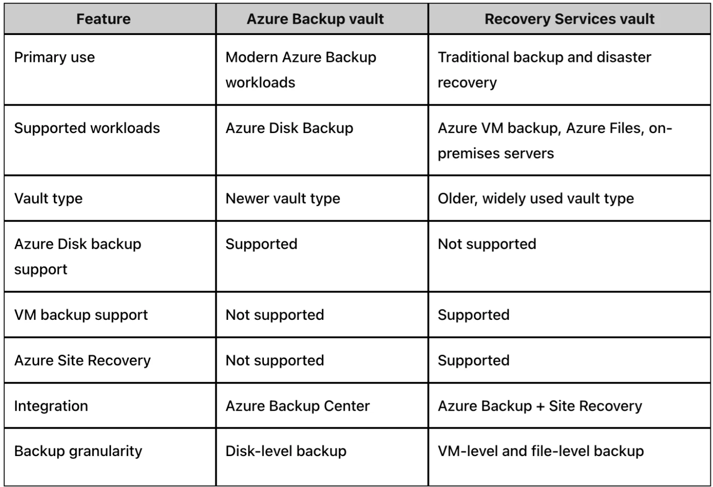

[Azure](https://github.com/magnum31415/wiki/blob/main/azure.md)

# Índice

- [Azure Backup - Teoría importante AZ-104](#azure-backup---teoría-importante-az-104)
- [¿Qué es un Vault?](#qué-es-un-vault)
- [Recovery Services vault (RSV)](#recovery-services-vault-rsv)
- [Backup vault](#backup-vault)
- [Azure Disk Backup](#azure-disk-backup)
- [Built-in backups](#built-in-backups)
- [Azure SQL Database](#azure-sql-database)
- [App Service](#app-service)
- [Trampa típica AZ-104](#trampa-típica-az-104)
- [Diferencia conceptual importante](#diferencia-conceptual-importante)
- [Qué quiere evaluar Microsoft](#qué-quiere-evaluar-microsoft)
- [Resumen para memorizar](#resumen-para-memorizar)
- [Reglas rápidas AZ-104](#reglas-rápidas-az-104)
- [Backup para Blob Storage](#backup-para-blob-storage)
- [Azure Files Backup (AZ-104)](#azure-files-backup-az-104)

# Azure Backup - Teoría importante AZ-104


# ¿Qué es un Vault?

Un:

```text
Vault
```

en Azure es un contenedor lógico utilizado para:

- almacenar información de backup
- almacenar políticas de backup
- gestionar restauraciones
- gestionar retención
- centralizar protección de recursos

---

## Relación entre Vault y Backup

El vault es el componente central donde Azure gestiona el backup.

---

## Ejemplo conceptual

```text
Azure VM
    ↓
Backup Policy
    ↓
Vault
    ↓
Recovery Points / Snapshots / Metadata
```

---

## Qué almacena un Vault

| Elemento | Descripción |
|---|---|
| Snapshots | Copias instantáneas |
| Recovery Points | Puntos de restauración |
| Metadata | Información del backup |
| Retention Policies | Políticas de retención |
| Backup Configuration | Configuración backup |
| Restore Information | Información restauración |

---

## Idea importante

El vault NO es el backup en sí.

El vault es:

```text
el sistema que organiza y administra backups
```

---

## Ejemplo sencillo

| Concepto | Analogía |
|---|---|
| Backup | Copia de seguridad |
| Vault | Caja fuerte donde se gestionan las copias |

---

## Qué necesitas saber para el examen

El examen AZ-104 suele evaluar principalmente:

1. Diferencia entre tipos de vaults
2. Qué recurso usa cada vault
3. Qué servicios tienen backups nativos
4. Qué servicios usan Azure Backup
5. Backup a nivel VM vs backup a nivel Disk

---

## Concepto clave

La mayoría de errores vienen de confundir:

```text
Backup vault
```

con:

```text
Recovery Services vault
```

---

## ¿Cuántos tipos principales de Vault existen para Azure Backup?

Para el examen AZ-104 debes conocer principalmente:

1. Recovery Services vault
2. Backup vault

---

## Concepto importante

Estos son:

```text
tipos de vaults
```

utilizados por Azure Backup para distintos escenarios.

---

## Tabla rápida

| Vault | Uso principal |
|---|---|
| Recovery Services vault | VM Backup tradicional, Azure Files, SQL in VM |
| Backup vault | Azure Disk Backup, Operational Backup |

---

## Recovery Services vault (RSV)

### Qué es

Vault tradicional de Azure Backup.

---

## Servicios típicos

| Servicio | Soportado |
|---|---|
| Azure VM Backup | ✅ |
| Azure Files Backup | ✅ |
| SQL Server in Azure VM | ✅ |
| SAP HANA in Azure VM | ✅ |
| Azure Site Recovery | ✅ |

---

## Idea clave examen

```text
Azure VM Backup → Recovery Services vault
```

---

## Backup vault

### Qué es

Vault moderno para nuevos escenarios backup.

---

## Servicios típicos

| Servicio | Soportado |
|---|---|
| Azure Disk Backup | ✅ |
| Managed Disk Backup | ✅ |
| Operational Backup | ✅ |

---

## Idea clave examen

```text
Managed Disk Backup → Backup vault
```

---

## Diferencia conceptual

| Característica | Recovery Services vault | Backup vault |
|---|---|---|
| Generación | Tradicional | Moderna |
| Azure VM Backup | ✅ | ❌ |
| Azure Disk Backup | ❌ | ✅ |
| Azure Files | ✅ | ❌ |
| Azure Site Recovery | ✅ | ❌ |
| Operational Backup | ❌ | ✅ |

---

## Relación completa

### VM Backup

```text
Azure VM
    ↓
Azure VM Backup
    ↓
Recovery Services vault
```

---

### Disk Backup

```text
Managed Disk
    ↓
Azure Disk Backup
    ↓
Backup vault
```

---

## Backup a nivel VM vs Backup a nivel Disk

| Tipo backup | Qué protege |
|---|---|
| VM Backup | VM completa |
| Disk Backup | Solo el Managed Disk |

---

## VM Backup protege

- OS Disk
- Data Disks
- Configuración VM

---

## Disk Backup protege

- Solo el disk seleccionado

NO incluye:

- VM
- Networking
- Configuración compute

---

## Built-in backups

### Qué son

Backups integrados automáticamente en algunos servicios Azure.

---

## Servicios con backup integrado

| Servicio | Built-in Backup |
|---|---|
| Azure SQL Database | ✅ |
| App Service | ✅ |
| Cosmos DB | ✅ parcialmente |

---

## Azure SQL Database

Incluye:

- Automatic Backups
- Point-in-Time Restore (PITR)
- Long-Term Retention (LTR)

---

## App Service

Incluye:

- App Backups
- Restore integrado
- Export ZIP

---

## Importante

Estos servicios:

❌ normalmente NO usan Azure Backup vaults.

---

## Tabla global importante AZ-104

| Recurso | Backup típico | Vault |
|---|---|---|
| Azure VM | Azure VM Backup | Recovery Services vault |
| Managed Disk | Azure Disk Backup | Backup vault |
| Azure Files | Azure Backup | Recovery Services vault |
| SQL in Azure VM | Azure Backup | Recovery Services vault |
| Azure SQL Database | Built-in backups | No vault |
| App Service | Built-in backups | No vault |

---

## Importante

Microsoft también usa la palabra:

```text
Vault
```

en otros servicios Azure.

---

## Ejemplos

| Servicio | Tipo de Vault |
|---|---|
| Azure Key Vault | Secretos/certificados |
| Recovery Services vault | Backup |
| Backup vault | Backup |

---

## Importante para AZ-104

En contexto backup:

✅ Debes pensar principalmente en:

- Recovery Services vault
- Backup vault

---

## Trampa típica examen

Muchos candidatos creen:

```text
Backup vault = versión nueva de Recovery Services vault
```

❌ Incorrecto.

Son servicios distintos.

---

## Otra trampa típica examen

Muchos candidatos piensan:

```text
todos los backups Azure usan vaults
```

❌ Incorrecto.

Servicios como:

- Azure SQL Database
- App Service

usan backups integrados.

---

## Regla rápida examen

| Si ves | Piensa |
|---|---|
| Azure VM Backup | Recovery Services vault |
| Managed Disk | Backup vault |
| SQL Database | Built-in backup |
| App Service | Built-in backup |

---

## Qué quiere evaluar Microsoft

| Concepto | Importancia |
|---|---|
| Recovery Services vault | Muy alta |
| Backup vault | Alta |
| VM vs Disk backup | Muy alta |
| Azure Disk Backup | Alta |
| Built-in backups | Alta |

---

## Resumen para memorizar

| Recurso | Vault / Backup |
|---|---|
| Azure VM | Recovery Services vault |
| Managed Disk | Backup vault |
| Azure SQL Database | Built-in |
| App Service | Built-in |

---

## Frases clave AZ-104

```text
A vault is a logical container for backup management.
```

```text
Recovery Services vaults are used for Azure VM Backup.
```

```text
Backup vaults are commonly used for Azure Disk Backup.
```

```text
Managed disks can be backed up independently of the VM.
```

```text
Azure SQL Database uses built-in backups.
```
---

# Recovery Services vault (RSV)

## Qué es

Es el vault tradicional de Azure Backup.

Durante muchos años fue el principal servicio backup de Azure.

---

## Qué protege normalmente

| Recurso | Soportado |
|---|---|
| Azure Virtual Machines | ✅ |
| Azure Files | ✅ |
| SQL Server in Azure VM | ✅ |
| SAP HANA in Azure VM | ✅ |
| MARS Agent | ✅ |
| Azure Site Recovery | ✅ |

---

# Concepto importante examen

Cuando el examen habla de:

```text
Azure VM Backup
```

normalmente piensa en:

```text
Recovery Services vault
```

---

# Backup vault

## Qué es

Vault moderno introducido para nuevos escenarios de backup.

---

## Qué protege normalmente

| Recurso | Soportado |
|---|---|
| Managed Disks | ✅ |
| Azure Disk Backup | ✅ |
| Operational Backup | ✅ |

---

# Concepto clave examen

```text
Backup vault ≠ Recovery Services vault
```

---

# Azure Disk Backup

## Qué es

Permite proteger:

```text
Managed Disks directamente
```

sin proteger toda la VM.

---

# Importante

Azure Disk Backup utiliza:

✅ Backup vault  
❌ NO Recovery Services vault  

---

# Diferencia importante

| Tipo backup | Qué protege |
|---|---|
| VM Backup | VM completa |
| Disk Backup | Solo el Managed Disk |

---

# Built-in backups

Algunos servicios Azure NO usan Azure Backup.

Tienen backups integrados.

---

# Azure SQL Database

Tiene:

- Automatic backups
- Point-in-Time Restore (PITR)
- Long-Term Retention (LTR)

NO necesita:

```text
Backup vault
```

---

# App Service

Tiene:

- App backups integrados
- Export ZIP
- Restore integrado

NO usa Azure Backup vault.

---

# Tabla MUY importante examen

| Recurso | Backup típico | Vault |
|---|---|---|
| Azure VM | Azure VM Backup | Recovery Services vault |
| Managed Disk | Azure Disk Backup | Backup vault |
| Azure Files | Azure Backup | Recovery Services vault |
| SQL in Azure VM | Azure Backup | Recovery Services vault |
| Azure SQL Database | Built-in backups | No vault |
| App Service | Built-in backups | No vault |




---

# Trampa típica AZ-104

Microsoft mezcla:

```text
VM
Disk
Backup vault
Recovery Services vault
```

para comprobar si sabes distinguir:

- VM backup
- Disk backup
- Built-in backup

---

# Regla rápida examen

## Si ves:

```text
Managed Disk
```

piensa:

```text
Backup vault
```

---

## Si ves:

```text
Azure VM
```

piensa:

```text
Recovery Services vault
```

---

# Diferencia conceptual importante

## VM Backup

Protege:

- OS Disk
- Data Disks
- Configuración VM

---

## Disk Backup

Protege:

- Un disco específico

sin incluir:

- VM
- Networking
- Configuración compute

---

# Qué quiere evaluar Microsoft

| Concepto | Importancia |
|---|---|
| Recovery Services vault | Muy alta |
| Backup vault | Alta |
| Azure Disk Backup | Alta |
| Built-in backups | Alta |
| VM vs Disk backup | Muy alta |

---

# Resumen para memorizar

| Recurso | Vault |
|---|---|
| Azure VM | Recovery Services vault |
| Managed Disk | Backup vault |
| Azure SQL Database | Built-in |
| App Service | Built-in |

---

# Reglas rápidas AZ-104

```text
Azure VM Backup uses Recovery Services vaults.
```

```text
Azure Disk Backup uses Backup vaults.
```

```text
Managed disks can be backed up independently of the VM.
```

```text
Azure SQL Database uses built-in backups.
```


# Azure Backup para Blob Storage (AZ-104)

## Qué debes saber para el examen

Azure Blob Storage NO utiliza el mismo modelo de backup que Azure Virtual Machines.

Microsoft suele evaluar:

- tipos de backup
- vault utilizado
- frecuencias soportadas
- diferencias entre Blob Backup y VM Backup

---

# Backup para Blob Storage

## Qué se utiliza normalmente

Para blobs Azure utiliza:

```text
Operational Backup for Blobs
```

---

## Qué protege

| Protección | Soportado |
|---|---|
| Borrado accidental | ✅ |
| Sobrescritura | ✅ |
| Corrupción lógica | ✅ |

---

# Vault utilizado

Blob Backup normalmente utiliza:

```text
Backup vault
```

---

# Frecuencias soportadas

## Blob Backup

Las políticas de backup normalmente soportan:

| Frecuencia |
|---|
| Daily |
| Weekly |

---

## Importante

Blob Backup NO soporta normalmente:

| Frecuencia | Soportado |
|---|---|
| Hourly | ❌ |
| Every 4 hours | ❌ |
| Every 6 hours | ❌ |
| Every 12 hours | ❌ |

---

# Diferencia importante con VM Backup

| Servicio | Frecuencia típica |
|---|---|
| Azure VM Backup | Varias veces al día |
| Blob Backup | Daily / Weekly |
| Azure Files Backup | Multiple/day |
| SQL Database | Continuo / PITR |

---

# Concepto importante examen

Microsoft quiere comprobar si sabes distinguir:

| Concepto | Importancia |
|---|---|
| VM Backup | Muy alta |
| Blob Backup | Alta |
| Backup vault | Alta |
| Frecuencia soportada | Muy alta |

---

# Trampa típica AZ-104

Muchos candidatos piensan:

```text
todos los backups Azure soportan hourly backups
```

❌ Incorrecto.

Blob Backup normalmente funciona:

```text
Daily / Weekly
```

---

# Operational Backup for Blobs

## Qué utiliza internamente

- soft delete
- versioning
- point-in-time restore

---

# Regla rápida AZ-104

```text
Blob backup policies typically support daily or weekly schedules.
```

---

# Frases clave AZ-104

```text
Azure Blob backup does not support hourly backup schedules.
```

```text
Operational Backup for Blobs commonly uses daily backup frequency.
```

# Azure Files Backup (AZ-104)

## Qué debes saber para el examen

Azure Files Backup utiliza un modelo diferente al de:

- Azure Blob Backup
- Azure VM Backup

Microsoft suele evaluar:

- frecuencia máxima soportada
- diferencias entre Azure Files y Blob Storage
- tipo de vault utilizado
- snapshots múltiples diarios

---

# Azure Files Backup

## Qué protege

Protege:

```text
Azure File Shares
```

---

## Vault utilizado

Azure Files Backup normalmente utiliza:

```text
Recovery Services vault
```

---

# Frecuencia de backup soportada

Azure Files permite:

✅ múltiples backups al día

---

## Máximo soportado

Azure Backup permite:

```text
hasta 6 backups por día
```

---

## Resultado

La frecuencia máxima posible es:

```text
cada 4 horas
```

porque:

```text
24h / 6 backups = 4 horas
```

---

# Frecuencias típicas

| Frecuencia | Soportado |
|---|---|
| Every hour | ❌ |
| Every 4 hours | ✅ |
| Every 6 hours | ✅ |
| Every 12 hours | ✅ |
| Daily | ✅ |

---

# Diferencia importante examen

| Servicio | Frecuencia máxima típica |
|---|---|
| Azure VM Backup | Varias veces/día |
| Azure Files Backup | Cada 4 horas |
| Blob Backup | Daily / Weekly |
| SQL Database | Continuo / PITR |

---

# Concepto importante examen

Microsoft quiere comprobar si sabes distinguir:

| Servicio | Tecnología backup |
|---|---|
| Azure Files | Snapshots múltiples diarios |
| Blob Storage | Daily / Weekly |
| VM Backup | Recovery points |

---

# Trampa típica AZ-104

Muchos candidatos creen:

```text
Azure Files y Blob Storage usan las mismas frecuencias
```

❌ Incorrecto.

---

# Diferencia clave

| Servicio | Máxima frecuencia |
|---|---|
| Azure Files | 6 veces/día |
| Blob Storage | 1 vez/día normalmente |

---

# Cómo funciona Azure Files Backup

Azure Backup usa:

```text
Snapshots del file share
```

---

# Concepto importante

Azure Files Backup está optimizado para:

- file shares
- recuperación rápida
- snapshots frecuentes

---

# Regla rápida AZ-104

```text
Azure File Shares can be backed up up to six times per day.
```

---

# Frases clave AZ-104

```text
Azure Files Backup supports multiple daily snapshots.
```

```text
The maximum backup frequency for Azure File Shares is every 4 hours.
```

```text
Azure Blob Backup does not support the same frequency as Azure Files Backup.
```
