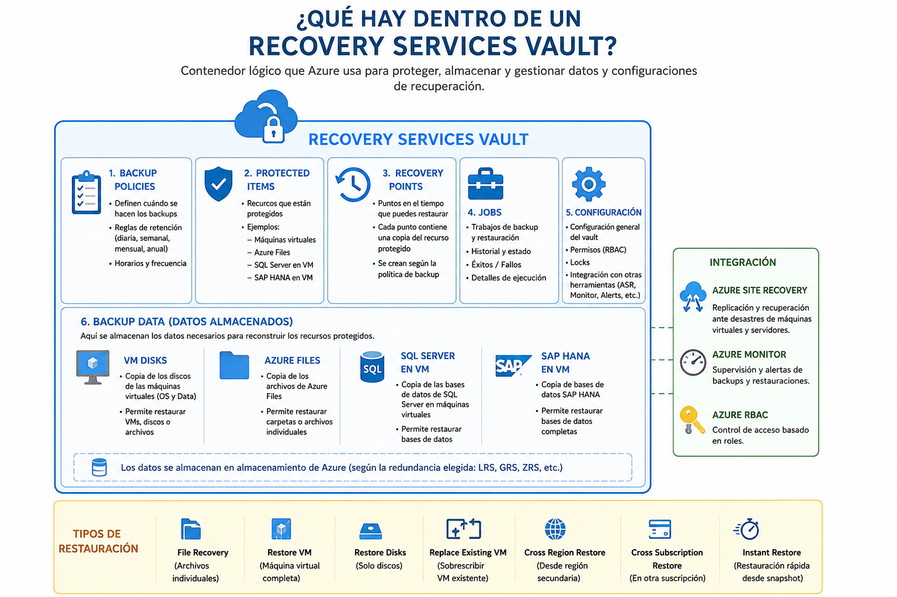
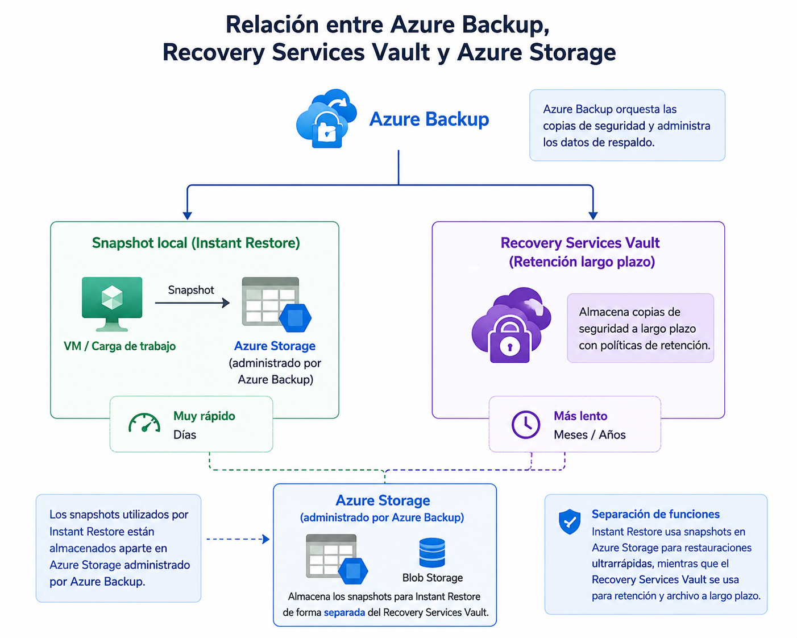
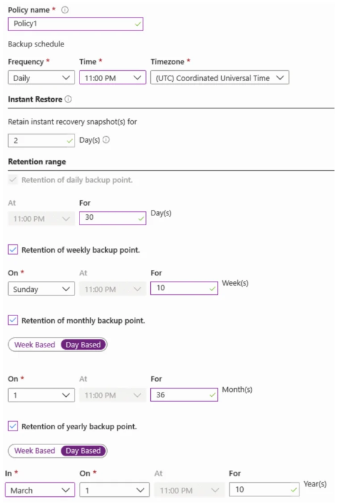

[Azure](https://github.com/magnum31415/wiki/blob/main/azure.md)

# Índice

- [Azure Backup - Teoría importante AZ-104](#azure-backup---teoría-importante-az-104)
- [Escenarios de recuperación de Azure Backup](#escenarios-de-recuperación-de-azure-backup)
- [Azure Backup Retention](#azure-backup-retention)
- [Azure Monitor Private Link Scope (AMPLS)](#azure-monitor-private-link-scope-ampls)
- [¿Qué es un Vault?](#qué-es-un-vault)
- [Recovery Services vault (RSV)](#recovery-services-vault-rsv)
- [Backup vault](#backup-vault)
- [Azure Disk Backup](#azure-disk-backup)
- [Built-in backups](#built-in-backups)
- [Azure SQL Database](#azure-sql-database)
- [App Service](#app-service)
- [Trampa típica AZ-104](#trampa-típica-az-104)
- [Diferencia conceptual importante](#diferencia-conceptual-importante)
- [Qué quiere evaluar Microsoft](#qué-quiere-evaluar-microsoft)
- [Resumen para memorizar](#resumen-para-memorizar)
- [Reglas rápidas AZ-104](#reglas-rápidas-az-104)
- [Azure Backup para Blob Storage (AZ-104)](#azure-backup-para-blob-storage-az-104)
- [Azure Files Backup (AZ-104)](#azure-files-backup-az-104)
- [Azure Backup Diagnostic Settings (AZ-104)](#azure-backup-diagnostic-settings-az-104)
- [Azure Backup Ecosystem - Componentes y Dependencias (AZ-104)](#azure-backup-ecosystem---componentes-y-dependencias-az-104)
- [Azure Backup Vault vs Recovery Services Vault (AZ-104)](#azure-backup-vault-vs-recovery-services-vault-az-104)
  
# Recovery Services Vault

El Recovery Services Vault es el repositorio central donde Azure Backup almacena y gestiona tanto los Recovery Points como los datos necesarios para realizar las restauraciones.

**Recovery Services Vault almacena tanto los metadatos como los datos de backup**



---
# Azure Backup - Teoría importante AZ-104


| Concepto                    | Definición                                                                                                                                                                                                                                                                                                                                       | Ejemplo de uso                                                                                                                                                                                                          |
| --------------------------- | ------------------------------------------------------------------------------------------------------------------------------------------------------------------------------------------------------------------------------------------------------------------------------------------------------------------------------------------------ | ----------------------------------------------------------------------------------------------------------------------------------------------------------------------------------------------------------------------- |
| **Recovery Services Vault** | Recurso de Azure utilizado para **almacenar y gestionar copias de seguridad (Azure Backup)** y configuraciones de **recuperación ante desastres (Azure Site Recovery)**. Actúa como un **contenedor lógico** donde se almacenan las **Backup Policies**, los **Recovery Points**, la configuración de replicación y los metadatos de protección. | Crear un Recovery Services Vault llamado **RSV-Prod** en la región de Sweden Central para proteger todas las máquinas virtuales de producción y almacenar sus puntos de recuperación utilizando almacenamiento ZRS.     |
| **Backup Policy**           | Define la **programación de las copias de seguridad (Backup Schedule)** y las **reglas de retención (Retention Policy)**. Especifica **cuándo se ejecutan los backups** y **cuánto tiempo se conservan** los Recovery Points (diarios, semanales, mensuales y anuales).                                                                          | Una política que realiza un backup diario a las 23:00, conserva los backups diarios 30 días, los semanales 10 semanas, los mensuales 36 meses y los anuales 10 años.                                                    |
| **Batch Job**               | Trabajo que ejecuta un conjunto de tareas de forma **automática**, **programada** y **sin intervención del usuario**. No es un concepto específico de Azure Backup, sino un concepto general utilizado para procesar operaciones masivas.                                                                                                        | Un proceso nocturno que ejecuta el backup de 500 máquinas virtuales o que procesa miles de registros de una base de datos cada madrugada.                                                                               |
| **Batch Schedule**          | Define la **planificación temporal** de un Batch Job, indicando la **hora**, la **frecuencia** y el **calendario de ejecución**. No es un concepto específico de Azure Backup.                                                                                                                                                                   | Configurar un Batch Job para ejecutarse todos los días a las 02:00 AM o todos los domingos a las 01:00 AM.                                                                                                              |
| **Recovery Plan**           | En **Azure Site Recovery (ASR)**, define la **secuencia de recuperación y arranque** de los recursos durante un proceso de **Disaster Recovery (DR)**. Puede incluir **grupos de máquinas**, **scripts automatizados**, **acciones manuales** y dependencias entre aplicaciones.                                                                 | Tras una caída del datacenter principal, el Recovery Plan arranca primero las bases de datos, después los servidores de aplicaciones y finalmente los servidores web, ejecutando scripts de validación entre cada paso. |


- **Recovery Services Vault** = Dónde se gestionan y almacenan los backups.
- **Backup Policy** = Cómo y cuándo se realizan los backups.
- **Recovery Point** = La copia concreta a la que puedes restaurar.
- **Recovery Plan** = Cómo se recupera una aplicación completa durante un desastre (ASR).

---

# Escenarios de recuperación de Azure Backup

Realmente **todas las restauraciones parten del Recovery Services Vault**, porque es donde Azure Backup almacena y gestiona los Recovery Points.

Lo que quería decir es:

| Método            | Desde dónde se recupera                                       | Velocidad                                       |
| ----------------- | ------------------------------------------------------------- | ----------------------------------------------- |
| **File Recovery** | Monta directamente el Recovery Point como una unidad temporal | ✅ Muy rápido para recuperar unos pocos archivos |
| **Restore VM**    | Azure reconstruye una VM completa                             | ❌ Más lento                                     |
| **Restore Disks** | Azure restaura discos completos                               | ❌ Más lento                                     |


| Escenario                    | Cuándo usarlo                        |
| ---------------------------- | ------------------------------------ |
| ✅ File Recovery              | Recuperar archivos individuales      |
| ✅ Restore VM                 | Recuperar una VM completa            |
| ✅ Restore Disks              | Recuperar únicamente los discos      |
| ✅ Replace Existing VM        | Sobrescribir una VM existente        |
| ✅ Cross Region Restore       | Restaurar desde la región secundaria |
| ✅ Cross Subscription Restore | Restaurar en otra suscripción        |
| ✅ Instant Restore            | Restauración rápida desde snapshot   |

## 1. Restore Files (File Recovery)

La ventaja de File Recovery no es que evite el Recovery Services Vault, sino que:

- No restaura una VM completa.
- No restaura discos completos.
- No crea recursos nuevos en Azure.
- Simplemente monta el punto de recuperación y te permite copiar los ficheros que necesitas.
Recuperar uno o varios archivos individuales.


- ✅ Es mucho más rápido que realizar una restauración completa de la VM o de los discos, ya que Azure monta directamente el Recovery Point y permite copiar únicamente los archivos necesarios.
  
- ✅ Es la opción más eficiente cuando solo necesitas recuperar algunos archivos, ya que evita restaurar la VM o los discos completos.

Ejemplo:

- Se ha borrado /home/ricard/documento.txt
- Quieres recuperar solo ese fichero.

Proceso:
| Orden | Acción real                                                            | Concepto                                                                                                                                                                                                                                                                                                                                                                                                                         |
| ----- | ---------------------------------------------------------------------- | -------------------------------------------------------------------------------------------------------------------------------------------------------------------------------------------------------------------------------------------------------------------------------------------------------------------------------------------------------------------------------------------------------------------------------- |
| 1     | **From the Azure portal, click File Recovery from the vault**          | Iniciar el proceso de recuperación de archivos desde el **Recovery Services Vault**. No se restaura la VM completa.                                                                                                                                                                                                                                                                                                              |
| 2     | **Select a restore point that contains the deleted files**             | Elegir un punto de restauración anterior al borrado de los archivos para asegurarse de que estos están incluidos en la copia de seguridad.                                                                                                                                                                                                                                                                                       |
| 3     | **Download and run the script to mount a drive on the local computer** | Descargar y ejecutar el script generado por Azure Backup, que monta el *Recovery Point* como una unidad local. **El script no tiene por qué ejecutarse en la VM que perdió los archivos; puede ejecutarse desde cualquier equipo (Windows o Linux, según el escenario soportado) que tenga los permisos necesarios y conectividad con el Recovery Services Vault. Incluso puede utilizarse aunque la VM original ya no exista.** |
| 4     | **Copy the files by using File Explorer**                              | Acceder a la unidad montada y copiar los archivos necesarios al equipo local (o a otra ubicación de destino). En un entorno Windows se utiliza normalmente **File Explorer**; en Linux se podrían utilizar herramientas como `cp` o `rsync`.                                                                                                                                                                                     |


### Secuencia para memorizar

```text
File Recovery
        ↓
Select Restore Point
        ↓
Download & Run Script
        ↓
Copy Files
```


## 2. Restore VM (Full VM Restore)

Restaurar una máquina virtual completa.

Ejemplo:

La VM se ha eliminado.
El disco está corrupto.
Quieres recuperar toda la máquina.

Proceso:
| Orden | Acción real | Concepto |
|--------|-------------|----------|
| 1 | **From the Azure portal, open the Recovery Services Vault** | Acceder al Recovery Services Vault que contiene la copia de seguridad de la máquina virtual. |
| 2 | **Select the protected virtual machine** | Seleccionar la VM que se desea restaurar. |
| 3 | **Click Restore VM** | Iniciar el proceso de restauración completa de la máquina virtual. |
| 4 | **Select the restore point** | Elegir el punto de restauración desde el que se recuperará la VM. |
| 5 | **Configure the restore options** | Elegir la suscripción, grupo de recursos, red virtual y demás parámetros de la nueva VM. |
| 6 | **Start the restore operation** | Azure crea una nueva máquina virtual a partir del backup seleccionado. |

### Secuencia para memorizar

```text
Recovery Services Vault
        ↓
Select Virtual Machine
        ↓
Restore VM
        ↓
Select Restore Point
        ↓
Configure Restore
        ↓
Create New VM
```

## 3. Restore Disks 

Recuperar únicamente los discos de la VM.

No crea automáticamente una VM.

Obtienes los discos gestionados (Managed Disks) y luego puedes:

- crear una VM manualmente
- conectar el disco a otra VM
- extraer información

Proceso:
| Orden | Acción real | Concepto |
|--------|-------------|----------|
| 1 | **From the Azure portal, open the Recovery Services Vault** | Acceder al Recovery Services Vault que contiene la copia de seguridad de la VM. |
| 2 | **Select the protected virtual machine** | Seleccionar la máquina virtual cuyos discos se desean recuperar. |
| 3 | **Click Restore Disks** | Iniciar el proceso de restauración de los discos, no de la máquina virtual completa. |
| 4 | **Select the restore point** | Elegir el punto de restauración desde el que se recuperarán los discos. |
| 5 | **Configure the restore options** | Indicar la cuenta de almacenamiento y demás opciones necesarias para la restauración. |
| 6 | **Start the restore operation** | Azure restaura los discos (Managed Disks) a partir del backup seleccionado. |
| 7 | **Use the restored Managed Disks** | Crear una nueva VM, adjuntar el disco a otra VM o extraer información del disco restaurado. |

## Secuencia para memorizar

```text
Recovery Services Vault
        ↓
Select Virtual Machine
        ↓
Restore Disks
        ↓
Select Restore Point
        ↓
Configure Restore
        ↓
Restore Managed Disks
        ↓
Attach to VM (optional)
```


Pregunta típica: ``You need to recover only the OS disk...``

No eliges Restore VM, sino Restore Disks.

## 4. Replace Existing VM ⭐⭐

En algunos escenarios puedes restaurar sobrescribiendo la VM existente.

Conceptualmente:
| Orden | Acción real | Concepto |
|--------|-------------|----------|
| 1 | **From the Azure portal, open the Recovery Services Vault** | Acceder al Recovery Services Vault que contiene la copia de seguridad de la VM. |
| 2 | **Select the protected virtual machine** | Seleccionar la máquina virtual que se desea restaurar. |
| 3 | **Click Restore VM** | Iniciar el proceso de restauración de la máquina virtual. |
| 4 | **Select the restore point** | Elegir el punto de restauración desde el que se recuperará la VM. |
| 5 | **Choose Replace Existing VM** | Indicar que la restauración debe sobrescribir la máquina virtual existente en lugar de crear una nueva. |
| 6 | **Start the restore operation** | Azure reemplaza la VM existente con el contenido del backup seleccionado. |

### Secuencia para memorizar

```text
Recovery Services Vault
        ↓
Select Virtual Machine
        ↓
Restore VM
        ↓
Select Restore Point
        ↓
Replace Existing VM
        ↓
Overwrite Existing VM
```

Menos frecuente en el examen.

## 5. Cross Region Restore (CRR) ⭐⭐

Si el Recovery Services Vault tiene activado: ``Geo-Redundant Storage (GRS)``

puedes restaurar desde la región secundaria.


Ejemplo:
````
West Europe
      │
      │ disaster
      ▼
North Europe
      │
Cross Region Restore
````


| Orden | Acción real | Concepto |
|--------|-------------|----------|
| 1 | **Verify that the Recovery Services Vault uses Geo-Redundant Storage (GRS)** | Cross Region Restore solo está disponible si el Recovery Services Vault utiliza GRS (y la funcionalidad está habilitada). |
| 2 | **Open the Recovery Services Vault** | Acceder al Recovery Services Vault que contiene las copias de seguridad. |
| 3 | **Select Cross Region Restore** | Iniciar el proceso de restauración utilizando la región secundaria. |
| 4 | **Select the restore point** | Elegir el punto de restauración disponible en la región secundaria. |
| 5 | **Select the recovery option** | Elegir si restaurar una VM completa, discos o utilizar otra opción disponible. |
| 6 | **Start the restore operation** | Azure realiza la restauración utilizando la copia replicada en la región secundaria. |

### Secuencia para memorizar

```text
Recovery Services Vault (GRS)
        ↓
Cross Region Restore
        ↓
Select Restore Point
        ↓
Select Recovery Option
        ↓
Restore from Secondary Region
```


## 6. Cross Subscription Restore ⭐⭐

Permite restaurar una VM o discos en otra suscripción (si está soportado y configurado).

Ejemplo:
````
Subscription A
      │
Backup
      │
Restore
      ▼
Subscription B
````


| Orden | Acción real | Concepto |
|--------|-------------|----------|
| 1 | **Verify that Cross Subscription Restore is supported and enabled** | Comprobar que el escenario y la configuración permiten restaurar recursos en otra suscripción. |
| 2 | **Open the Recovery Services Vault** | Acceder al Recovery Services Vault que contiene la copia de seguridad. |
| 3 | **Select the protected virtual machine** | Seleccionar la VM que se desea restaurar. |
| 4 | **Click Restore VM or Restore Disks** | Iniciar la restauración de la VM completa o únicamente de los discos. |
| 5 | **Select the restore point** | Elegir el punto de restauración adecuado. |
| 6 | **Select the target subscription** | Elegir una suscripción distinta de la original como destino de la restauración. |
| 7 | **Configure the remaining restore options and start the restore** | Configurar el grupo de recursos, red y demás parámetros, e iniciar la restauración en la nueva suscripción. |

## Secuencia para memorizar

```text
Recovery Services Vault
        ↓
Select Virtual Machine
        ↓
Restore VM / Restore Disks
        ↓
Select Restore Point
        ↓
Select Target Subscription
        ↓
Restore into Another Subscription
```


## 7. Instant Restore ⭐





Instant Restore en Azure Backup es una técnica que permite restaurar una VM muy rápidamente utilizando los snapshots locales que Azure crea cuando realiza el backup.

La diferencia clave es:
| Método          | Desde dónde restaura                            |
| --------------- | ----------------------------------------------- |
| Instant Restore | Snapshot almacenado cerca de la VM              |
| Restore normal  | Datos almacenados en el Recovery Services Vault |

Cuando Azure ejecuta un backup de una VM:

1. Crea un snapshot de los discos.
2. Ese snapshot se mantiene durante unos días (normalmente 2-5 días según la configuración).
3. En paralelo, copia los datos al Recovery Services Vault para almacenamiento a largo plazo.

Si necesitas restaurar una VM reciente, Azure puede usar directamente el snapshot sin tener que recuperar los datos del Vault.


**Azure Backup mantiene snapshots temporales.**

Si el backup es reciente:
````
   Snapshot
      │
Instant Restore
      │
     VM
````

| Orden | Acción real | Concepto |
|--------|-------------|----------|
| 1 | **Open the Recovery Services Vault** | Acceder al Recovery Services Vault que contiene la copia de seguridad de la VM. |
| 2 | **Select the protected virtual machine** | Seleccionar la máquina virtual que se desea restaurar. |
| 3 | **Select Restore VM** | Iniciar el proceso de restauración de la VM. |
| 4 | **Select a recent restore point (snapshot)** | Elegir un punto de restauración basado en un snapshot reciente disponible para Instant Restore. |
| 5 | **Start the restore operation** | Azure utiliza el snapshot disponible para acelerar la restauración. |
| 6 | **Restore the virtual machine quickly from the snapshot** | La restauración se realiza de forma mucho más rápida que utilizando únicamente los datos almacenados en el Recovery Services Vault. |

## Secuencia para memorizar

```text
Recovery Services Vault
        ↓
Select Virtual Machine
        ↓
Restore VM
        ↓
Select Recent Snapshot
        ↓
Instant Restore
        ↓
Fast VM Recovery
```

## Ejemplo práctico

Supongamos una VM:

- Nombre: vm-sap-prod
- Disco OS: 128 GB
- Disco Data: 1 TB

### Día 1 - 02:00

Azure Backup ejecuta el backup:

````
VM
 │
 ├─ Snapshot local (Instant Restore)
 │
 └─ Recovery Services Vault
````
### Día 1 - 10:00

Un administrador elimina accidentalmente:
````
D:\SAPDATA\clientes.db
````

### Restauración con Instant Restore

Azure utiliza el snapshot local:

````
Snapshot
   │
   └─ Disco temporal restaurado
            │
            └─ Recuperar archivo
````

Tiempo típico:
- Minutos.

### Si el backup tiene 20 días

El snapshot ya no existe:

````
VM
 │
 └─ Recovery Services Vault
````

Azure debe:

1. Leer los datos del Vault.
2. Recrear discos.
3. Restaurar la VM.

Tiempo típico:

- Decenas de minutos.
- Horas en VMs muy grandes.

---
# Azure Backup Retention
## Concepto

Una **Backup Policy** de Azure Backup define:

- cuándo se realiza el backup (Schedule)
- cuánto tiempo se conserva (Retention)

La política de retención puede incluir simultáneamente reglas:

- Daily
- Weekly
- Monthly
- Yearly



## Cómo funciona la retención

Una idea muy importante para el AZ-104:

> **Azure NO crea un backup distinto para cada nivel de retención.**

Se realiza un único backup.

Después Azure determina si ese backup cumple alguna regla:

- diaria
- semanal
- mensual
- anual

y le asigna la retención correspondiente.


## Tipos de retención

### Daily Retention

Conserva los backups diarios.

Ejemplo:

```text
Daily Retention: 30 days
```

```text
1 Jan  → 30 días
2 Jan  → 30 días
3 Jan  → 30 días
```

### Weekly Retention

Conserva los backups realizados un determinado día de la semana.

Ejemplo:

```text
Every Sunday : 10 weeks
```

### Monthly Retention

Conserva determinados backups mensuales.

Por ejemplo:

```text
First Sunday: 36 months
```

### Yearly Retention

Conserva determinados backups anuales.

Por ejemplo:

```text
First Sunday of March: 10 years
```


## Retención efectiva

La regla más importante del examen:

**Un mismo backup puede cumplir varias reglas de retención simultáneamente.**

No existen cuatro backups. Existe uno solo:


**Azure conserva la retención más larga**

Supongamos:

| Tipo | Retención |
|----------|-----------|
| Daily | 30 días |
| Weekly | 10 semanas |
| Monthly | 36 meses |
| Yearly | 10 años |

Si un backup cumple las cuatro reglas:

```text
Backup
      │
      ├── 30 días
      ├── 10 semanas
      ├── 36 meses
      └── 10 años
```

la retención efectiva será: 

```text
10 years
```
---
# Azure Monitor Private Link Scope (AMPLS)

## Qué es

**Azure Monitor Private Link Scope (AMPLS)** es un recurso de Azure que permite acceder de forma privada a los servicios de Azure Monitor mediante **Azure Private Link**.

Su objetivo es que el tráfico entre los recursos de una red privada y Azure Monitor **no pase por Internet pública**.

La primera vez que se ve AMPLS parece redundante: "Si ya tengo un Private Endpoint, ¿para qué necesito además un AMPLS?".

La clave es que AMPLS no conecta una VM con un único recurso, sino que define el ámbito privado de Azure Monitor.

**¿Qué sentido tiene que incluya estos tres servicios?**

- Log Analytics Workspace
- Application Insights
- Azure Monitor

Porque **los tres forman parte del ecosistema de Azure Monitor** y muchas soluciones utilizan varios de ellos simultáneamente.

**Sin AMPLS**

Cada recurso tendría que exponer su acceso por separado.
````
                 VNet
                  │
         +--------+--------+
         │                 │
         ▼                 ▼
 Private Endpoint     Private Endpoint
         │                 │
         ▼                 ▼
 Log Analytics      Application Insights
````

**Con AMPLS**

Existe un único ámbito privado para Azure Monitor.

````
                    VNet
                     │
                     ▼
             Private Endpoint
                     │
                     ▼
      Azure Monitor Private Link Scope
          │            │            │
          ▼            ▼            ▼
 Log Analytics   Application     Azure Monitor
    Workspace      Insights 
````


En otras palabras:

> **Un AMPLS crea un ámbito privado para que los recursos puedan comunicarse con Azure Monitor utilizando direcciones IP privadas.**


!Azure-Monitor-Private-Link-Scope-AMPLS](./img/azure/Azure-Monitor-Private-Link-Scope-AMPLS.png)

## Para qué sirve

AMPLS se utiliza para:

- Acceder a Log Analytics Workspaces de forma privada.
- Acceder a Azure Monitor de forma privada.
- Evitar el uso de Internet pública.
- Reducir la superficie de exposición.
- Cumplir requisitos de seguridad y compliance.
- Integrar Azure Monitor con redes privadas mediante Private Endpoints.


## Cómo funciona

Sin AMPLS:

```text
Azure VM
      │
      ▼
 Internet
      │
      ▼
Azure Monitor
```

Con AMPLS:

```text
Azure VM
      │
      ▼
Private Endpoint
      │
      ▼
Azure Monitor Private Link Scope
      │
      ▼
Azure Monitor
```

Todo el tráfico permanece dentro de la red privada de Azure.

## Arquitectura

```text
                    Virtual Network
        +--------------------------------------+
        |                                      |
        |     Azure VM / Azure Arc Server      |
        |                 │                    |
        |                 ▼                    |
        |         Private Endpoint             |
        |                 │                    |
        +-----------------│--------------------+
                          │
                          ▼
          Azure Monitor Private Link Scope
                          │
             ┌────────────┴────────────┐
             ▼                         ▼
     Log Analytics Workspace     Azure Monitor
             ▼
      Application Insights
```
## Qué recursos puede incluir

Un AMPLS puede asociarse, entre otros, con:

- Log Analytics Workspace
- Application Insights
- Azure Monitor

Su función es proporcionar acceso privado a estos servicios mediante Private Link.

## Ventajas

- Comunicación privada con Azure Monitor.
- El tráfico no utiliza Internet pública.
- Mayor seguridad.
- Menor superficie de ataque.
- Compatible con redes aisladas.
- Facilita el cumplimiento de requisitos regulatorios.
- Integración con Private DNS.

## Azure Monitor Private Link Scope (AMPLS) (AZ-104)

Un **Azure Monitor Private Link Scope (AMPLS)** es un recurso **específico de Azure Monitor**.

¿Puede utilizarse para otros servicios? **No**

No es un mecanismo genérico para proporcionar conectividad privada a cualquier servicio Azure.

Su única finalidad es proporcionar acceso privado a determinados componentes de Azure Monitor mediante **Azure Private Link**.

### ¿Qué servicios puede incluir un AMPLS?

Principalmente:

| Servicio | Compatible |
|-----------|------------|
| ✅ Log Analytics Workspace | Sí |
| ✅ Application Insights | Sí |
| ✅ Azure Monitor | Sí |


### Arquitectura típica

```text
Azure VM
      │
      ▼
Private Endpoint
      │
      ▼
Azure Monitor Private Link Scope (AMPLS)
      │
      ├──────────────► Log Analytics Workspace
      │
      ├──────────────► Azure Monitor
      │
      └──────────────► Application Insights
```


---

# ¿Qué es un Vault?

Un:

```text
Vault
```

en Azure es un contenedor lógico utilizado para:

- almacenar información de backup
- almacenar políticas de backup
- gestionar restauraciones
- gestionar retención
- centralizar protección de recursos

---

## Relación entre Vault y Backup

El vault es el componente central donde Azure gestiona el backup.

---

## Ejemplo conceptual

```text
Azure VM
    ↓
Backup Policy
    ↓
Vault
    ↓
Recovery Points / Snapshots / Metadata
```

---

## Qué almacena un Vault

| Elemento | Descripción |
|---|---|
| Snapshots | Copias instantáneas |
| Recovery Points | Puntos de restauración |
| Metadata | Información del backup |
| Retention Policies | Políticas de retención |
| Backup Configuration | Configuración backup |
| Restore Information | Información restauración |

---

## Idea importante

El vault NO es el backup en sí.

El vault es:

```text
el sistema que organiza y administra backups
```

---

## Ejemplo sencillo

| Concepto | Analogía |
|---|---|
| Backup | Copia de seguridad |
| Vault | Caja fuerte donde se gestionan las copias |

---

## Qué necesitas saber para el examen

El examen AZ-104 suele evaluar principalmente:

1. Diferencia entre tipos de vaults
2. Qué recurso usa cada vault
3. Qué servicios tienen backups nativos
4. Qué servicios usan Azure Backup
5. Backup a nivel VM vs backup a nivel Disk

---

## Concepto clave

La mayoría de errores vienen de confundir:

```text
Backup vault
```

con:

```text
Recovery Services vault
```

---

## ¿Cuántos tipos principales de Vault existen para Azure Backup?

Para el examen AZ-104 debes conocer principalmente:

1. Recovery Services vault
2. Backup vault

---

## Concepto importante

Estos son:

```text
tipos de vaults
```

utilizados por Azure Backup para distintos escenarios.

---

## Tabla rápida

| Vault | Uso principal |
|---|---|
| Recovery Services vault | VM Backup tradicional, Azure Files, SQL in VM |
| Backup vault | Azure Disk Backup, Operational Backup |

---

## Recovery Services vault (RSV)

### Qué es

Vault tradicional de Azure Backup.

---

## Servicios típicos

| Servicio | Soportado |
|---|---|
| Azure VM Backup | ✅ |
| Azure Files Backup | ✅ |
| SQL Server in Azure VM | ✅ |
| SAP HANA in Azure VM | ✅ |
| Azure Site Recovery | ✅ |

---

## Idea clave examen

```text
Azure VM Backup → Recovery Services vault
```

---

## Backup vault

### Qué es

Vault moderno para nuevos escenarios backup.

---

## Servicios típicos

| Servicio | Soportado |
|---|---|
| Azure Disk Backup | ✅ |
| Managed Disk Backup | ✅ |
| Operational Backup | ✅ |

---

## Idea clave examen

```text
Managed Disk Backup → Backup vault
```

---

## Diferencia conceptual

| Característica | Recovery Services vault | Backup vault |
|---|---|---|
| Generación | Tradicional | Moderna |
| Azure VM Backup | ✅ | ❌ |
| Azure Disk Backup | ❌ | ✅ |
| Azure Files | ✅ | ❌ |
| Azure Site Recovery | ✅ | ❌ |
| Operational Backup | ❌ | ✅ |

---

## Relación completa

### VM Backup

```text
Azure VM
    ↓
Azure VM Backup
    ↓
Recovery Services vault
```

---

### Disk Backup

```text
Managed Disk
    ↓
Azure Disk Backup
    ↓
Backup vault
```

---

## Backup a nivel VM vs Backup a nivel Disk

| Tipo backup | Qué protege |
|---|---|
| VM Backup | VM completa |
| Disk Backup | Solo el Managed Disk |

---

## VM Backup protege

- OS Disk
- Data Disks
- Configuración VM

---

## Disk Backup protege

- Solo el disk seleccionado

NO incluye:

- VM
- Networking
- Configuración compute

---

## Built-in backups

### Qué son

Backups integrados automáticamente en algunos servicios Azure.

---

## Servicios con backup integrado

| Servicio | Built-in Backup |
|---|---|
| Azure SQL Database | ✅ |
| App Service | ✅ |
| Cosmos DB | ✅ parcialmente |

---

## Azure SQL Database

Incluye:

- Automatic Backups
- Point-in-Time Restore (PITR)
- Long-Term Retention (LTR)

---

## App Service

Incluye:

- App Backups
- Restore integrado
- Export ZIP

---

## Importante

Estos servicios:

❌ normalmente NO usan Azure Backup vaults.

---

## Tabla global importante AZ-104

| Recurso | Backup típico | Vault |
|---|---|---|
| Azure VM | Azure VM Backup | Recovery Services vault |
| Managed Disk | Azure Disk Backup | Backup vault |
| Azure Files | Azure Backup | Recovery Services vault |
| SQL in Azure VM | Azure Backup | Recovery Services vault |
| Azure SQL Database | Built-in backups | No vault |
| App Service | Built-in backups | No vault |

---

## Importante

Microsoft también usa la palabra:

```text
Vault
```

en otros servicios Azure.

---

## Ejemplos

| Servicio | Tipo de Vault |
|---|---|
| Azure Key Vault | Secretos/certificados |
| Recovery Services vault | Backup |
| Backup vault | Backup |

---

## Importante para AZ-104

En contexto backup:

✅ Debes pensar principalmente en:

- Recovery Services vault
- Backup vault

---

## Trampa típica examen

Muchos candidatos creen:

```text
Backup vault = versión nueva de Recovery Services vault
```

❌ Incorrecto.

Son servicios distintos.

---

## Otra trampa típica examen

Muchos candidatos piensan:

```text
todos los backups Azure usan vaults
```

❌ Incorrecto.

Servicios como:

- Azure SQL Database
- App Service

usan backups integrados.

---

## Regla rápida examen

| Si ves | Piensa |
|---|---|
| Azure VM Backup | Recovery Services vault |
| Managed Disk | Backup vault |
| SQL Database | Built-in backup |
| App Service | Built-in backup |

---

## Qué quiere evaluar Microsoft

| Concepto | Importancia |
|---|---|
| Recovery Services vault | Muy alta |
| Backup vault | Alta |
| VM vs Disk backup | Muy alta |
| Azure Disk Backup | Alta |
| Built-in backups | Alta |

---

## Resumen para memorizar

| Recurso | Vault / Backup |
|---|---|
| Azure VM | Recovery Services vault |
| Managed Disk | Backup vault |
| Azure SQL Database | Built-in |
| App Service | Built-in |

---

## Frases clave AZ-104

```text
A vault is a logical container for backup management.
```

```text
Recovery Services vaults are used for Azure VM Backup.
```

```text
Backup vaults are commonly used for Azure Disk Backup.
```

```text
Managed disks can be backed up independently of the VM.
```

```text
Azure SQL Database uses built-in backups.
```
---

# Recovery Services vault (RSV)

## Qué es

Es el vault tradicional de Azure Backup.

Durante muchos años fue el principal servicio backup de Azure.

---

## Qué protege normalmente

| Recurso | Soportado |
|---|---|
| Azure Virtual Machines | ✅ |
| Azure Files | ✅ |
| SQL Server in Azure VM | ✅ |
| SAP HANA in Azure VM | ✅ |
| MARS Agent | ✅ |
| Azure Site Recovery | ✅ |

---

# Concepto importante examen

Cuando el examen habla de:

```text
Azure VM Backup
```

normalmente piensa en:

```text
Recovery Services vault
```

---

# Backup vault

## Qué es

Vault moderno introducido para nuevos escenarios de backup.

---

## Qué protege normalmente

| Recurso | Soportado |
|---|---|
| Managed Disks | ✅ |
| Azure Disk Backup | ✅ |
| Operational Backup | ✅ |

---

# Concepto clave examen

```text
Backup vault ≠ Recovery Services vault
```

---

# Azure Disk Backup

## Qué es

Permite proteger:

```text
Managed Disks directamente
```

sin proteger toda la VM.

---

# Importante

Azure Disk Backup utiliza:

✅ Backup vault  
❌ NO Recovery Services vault  

---

# Diferencia importante

| Tipo backup | Qué protege |
|---|---|
| VM Backup | VM completa |
| Disk Backup | Solo el Managed Disk |

---

# Built-in backups

Algunos servicios Azure NO usan Azure Backup.

Tienen backups integrados.

---

# Azure SQL Database

Tiene:

- Automatic backups
- Point-in-Time Restore (PITR)
- Long-Term Retention (LTR)

NO necesita:

```text
Backup vault
```

---

# App Service

Tiene:

- App backups integrados
- Export ZIP
- Restore integrado

NO usa Azure Backup vault.

---

# Tabla MUY importante examen

| Recurso | Backup típico | Vault |
|---|---|---|
| Azure VM | Azure VM Backup | Recovery Services vault |
| Managed Disk | Azure Disk Backup | Backup vault |
| Azure Files | Azure Backup | Recovery Services vault |
| SQL in Azure VM | Azure Backup | Recovery Services vault |
| Azure SQL Database | Built-in backups | No vault |
| App Service | Built-in backups | No vault |


---

# Trampa típica AZ-104

Microsoft mezcla:

```text
VM
Disk
Backup vault
Recovery Services vault
```

para comprobar si sabes distinguir:

- VM backup
- Disk backup
- Built-in backup

---

# Regla rápida examen

## Si ves:

```text
Managed Disk
```

piensa:

```text
Backup vault
```

---

## Si ves:

```text
Azure VM
```

piensa:

```text
Recovery Services vault
```

---

# Diferencia conceptual importante

## VM Backup

Protege:

- OS Disk
- Data Disks
- Configuración VM

---

## Disk Backup

Protege:

- Un disco específico

sin incluir:

- VM
- Networking
- Configuración compute

---

# Qué quiere evaluar Microsoft

| Concepto | Importancia |
|---|---|
| Recovery Services vault | Muy alta |
| Backup vault | Alta |
| Azure Disk Backup | Alta |
| Built-in backups | Alta |
| VM vs Disk backup | Muy alta |

---

# Resumen para memorizar

| Recurso | Vault |
|---|---|
| Azure VM | Recovery Services vault |
| Managed Disk | Backup vault |
| Azure SQL Database | Built-in |
| App Service | Built-in |

---

# Reglas rápidas AZ-104

```text
Azure VM Backup uses Recovery Services vaults.
```

```text
Azure Disk Backup uses Backup vaults.
```

```text
Managed disks can be backed up independently of the VM.
```

```text
Azure SQL Database uses built-in backups.
```


# Azure Backup para Blob Storage (AZ-104)

## Qué debes saber para el examen

Azure Blob Storage NO utiliza el mismo modelo de backup que Azure Virtual Machines.

Microsoft suele evaluar:

- tipos de backup
- vault utilizado
- frecuencias soportadas
- diferencias entre Blob Backup y VM Backup

---

# Backup para Blob Storage

## Qué se utiliza normalmente

Para blobs Azure utiliza:

```text
Operational Backup for Blobs
```

---

## Qué protege

| Protección | Soportado |
|---|---|
| Borrado accidental | ✅ |
| Sobrescritura | ✅ |
| Corrupción lógica | ✅ |

---

# Vault utilizado

Blob Backup normalmente utiliza:

```text
Backup vault
```

---

# Frecuencias soportadas

## Blob Backup

Las políticas de backup normalmente soportan:

| Frecuencia |
|---|
| Daily |
| Weekly |

---

## Importante

Blob Backup NO soporta normalmente:

| Frecuencia | Soportado |
|---|---|
| Hourly | ❌ |
| Every 4 hours | ❌ |
| Every 6 hours | ❌ |
| Every 12 hours | ❌ |

---

# Diferencia importante con VM Backup

| Servicio | Frecuencia típica |
|---|---|
| Azure VM Backup | Varias veces al día |
| Blob Backup | Daily / Weekly |
| Azure Files Backup | Multiple/day |
| SQL Database | Continuo / PITR |

---

# Concepto importante examen

Microsoft quiere comprobar si sabes distinguir:

| Concepto | Importancia |
|---|---|
| VM Backup | Muy alta |
| Blob Backup | Alta |
| Backup vault | Alta |
| Frecuencia soportada | Muy alta |

---

# Trampa típica AZ-104

Muchos candidatos piensan:

```text
todos los backups Azure soportan hourly backups
```

❌ Incorrecto.

Blob Backup normalmente funciona:

```text
Daily / Weekly
```

---

# Operational Backup for Blobs

## Qué utiliza internamente

- soft delete
- versioning
- point-in-time restore

---

# Regla rápida AZ-104

```text
Blob backup policies typically support daily or weekly schedules.
```

---

# Frases clave AZ-104

```text
Azure Blob backup does not support hourly backup schedules.
```

```text
Operational Backup for Blobs commonly uses daily backup frequency.
```

# Azure Files Backup (AZ-104)

## Qué debes saber para el examen

Azure Files Backup utiliza un modelo diferente al de:

- Azure Blob Backup
- Azure VM Backup

Microsoft suele evaluar:

- frecuencia máxima soportada
- diferencias entre Azure Files y Blob Storage
- tipo de vault utilizado
- snapshots múltiples diarios

---

# Azure Files Backup

## Qué protege

Protege:

```text
Azure File Shares
```

---

## Vault utilizado

Azure Files Backup normalmente utiliza:

```text
Recovery Services vault
```

---

# Frecuencia de backup soportada

Azure Files permite:

✅ múltiples backups al día

---

## Máximo soportado

Azure Backup permite:

```text
hasta 6 backups por día
```

---

## Resultado

La frecuencia máxima posible es:

```text
cada 4 horas
```

porque:

```text
24h / 6 backups = 4 horas
```

---

# Frecuencias típicas

| Frecuencia | Soportado |
|---|---|
| Every hour | ❌ |
| Every 4 hours | ✅ |
| Every 6 hours | ✅ |
| Every 12 hours | ✅ |
| Daily | ✅ |

---

# Diferencia importante examen

| Servicio | Frecuencia máxima típica |
|---|---|
| Azure VM Backup | Varias veces/día |
| Azure Files Backup | Cada 4 horas |
| Blob Backup | Daily / Weekly |
| SQL Database | Continuo / PITR |

---

# Concepto importante examen

Microsoft quiere comprobar si sabes distinguir:

| Servicio | Tecnología backup |
|---|---|
| Azure Files | Snapshots múltiples diarios |
| Blob Storage | Daily / Weekly |
| VM Backup | Recovery points |

---

# Trampa típica AZ-104

Muchos candidatos creen:

```text
Azure Files y Blob Storage usan las mismas frecuencias
```

❌ Incorrecto.

---

# Diferencia clave

| Servicio | Máxima frecuencia |
|---|---|
| Azure Files | 6 veces/día |
| Blob Storage | 1 vez/día normalmente |

---

# Cómo funciona Azure Files Backup

Azure Backup usa:

```text
Snapshots del file share
```

---

# Concepto importante

Azure Files Backup está optimizado para:

- file shares
- recuperación rápida
- snapshots frecuentes

---

# Regla rápida AZ-104

```text
Azure File Shares can be backed up up to six times per day.
```

---

# Frases clave AZ-104

```text
Azure Files Backup supports multiple daily snapshots.
```

```text
The maximum backup frequency for Azure File Shares is every 4 hours.
```

```text
Azure Blob Backup does not support the same frequency as Azure Files Backup.
```
---
# Azure Backup Diagnostic Settings (AZ-104)

# Qué es Azure Backup Diagnostic Settings

Azure Backup Diagnostic Settings son configuraciones que permiten enviar:

- logs
- métricas
- eventos

de Azure Backup hacia servicios de monitorización y análisis.

---

# Objetivo principal

Permiten:

- monitorizar backups
- auditar operaciones
- detectar errores
- generar alertas
- centralizar logs

---

# Importante examen

```text
Diagnostic Settings NO hacen backups.
```

↓

solo:

```text
exportan logs y métricas
```

---

# Arquitectura típica

```text
Azure Backup
      ↓
Diagnostic Settings
      ↓
Log Analytics / Storage / Event Hub
```

---

# Qué puedes monitorizar

| Evento | Ejemplo |
|---|---|
| Backup jobs | Éxito/Fallo |
| Restore jobs | Restauraciones |
| Policy changes | Cambios políticas |
| Alerts | Alertas backup |
| Retention operations | Expiración backups |

---

# Destinos soportados

| Destino | Uso típico |
|---|---|
| Log Analytics Workspace | KQL / alertas |
| Storage Account | Retención largo plazo |
| Event Hub | SIEM / Splunk |
| Partner solutions | Herramientas externas |

---

# Caso típico enterprise

```text
Azure Backup
      ↓
Diagnostic Settings
      ↓
Log Analytics Workspace
      ↓
Azure Monitor Alerts
```

---

# Categorías típicas logs

| Categoría | Descripción |
|---|---|
| AzureBackupReport | Reportes backup |
| CoreAzureBackup | Eventos core |
| AddonAzureBackupJobs | Jobs backup |
| AddonAzureBackupAlerts | Alertas |

---

# Recursos que soportan Diagnostic Settings

| Recurso | Soporte |
|---|---|
| Recovery Services Vault | ✅ |
| Backup Center | ✅ |
| Azure Backup jobs | ✅ |

---

# Diferencia importante

| Servicio | Función |
|---|---|
| Azure Backup | Realiza backups |
| Diagnostic Settings | Exporta logs/métricas |
| Azure Monitor | Analiza/alerta |
| Log Analytics | Almacena/consulta logs |

---

# Ejemplo típico examen

## Quieres alertar cuando falla un backup

↓

habilitas:

```text
Diagnostic Settings
```

↓

envías logs a:

```text
Log Analytics
```

↓

creas alerta KQL.

---

# Otro caso típico

## Quieres enviar logs backup a SIEM

↓

usas:

```text
Diagnostic Settings + Event Hub
```

---

# Trampas típicas AZ-104

## Trampa 1

```text
Diagnostic Settings realiza backups
```

❌ Incorrecto.

---

# Trampa 2

```text
Diagnostic Settings almacena backups
```

❌ Incorrecto.

---

# Trampa 3

```text
Azure Monitor reemplaza Azure Backup
```

❌ Incorrecto.

---

# Conceptos importantes AZ-104

| Concepto | Importancia |
|---|---|
| Diagnostic Settings | Muy alta |
| Log Analytics | Muy alta |
| Azure Monitor | Muy alta |
| Recovery Services Vault | Alta |
| Backup monitoring | Alta |

---

# Flujo típico correcto

```text
Azure Resource
      ↓
Diagnostic Settings
      ↓
Log Analytics Workspace
      ↓
KQL Queries / Alerts / Dashboards
```

---

# Reglas rápidas examen

```text
Diagnostic Settings export logs and metrics.
```

```text
Diagnostic Settings do not perform backups.
```

```text
Azure Backup monitoring commonly uses Log Analytics.
```
---
# Azure Backup Ecosystem - Componentes y Dependencias (AZ-104)

| Componente | Función principal | ¿Hace backups? | ¿Guarda logs? | Dependencia regional | Dependencias importantes | Uso típico |
|---|---|---|---|---|---|---|
| Recovery Services Vault (RSV) | Contenedor lógico de backups | ✅ | ❌ | ✅ Muy importante | Debe estar en misma región que muchas cargas protegidas | Azure VM Backup |
| Azure Backup | Servicio backup gestionado | ✅ | ❌ | ✅ | Usa RSV | Backup VMs/files/SAP |
| Azure Backup Diagnostic Settings | Exporta logs/métricas | ❌ | ✅ | ⚠️ Recomendado misma región | Requiere RSV + destino logs | Monitoring backup |
| Log Analytics Workspace (LAW) | Almacena y consulta logs | ❌ | ✅ | ⚠️ Importante por latencia/coste | Azure Monitor | KQL/alertas |
| Azure Monitor | Monitorización y alertas | ❌ | ✅ | ❌ Global lógico | LAW + Diagnostic Settings | Alertas backup |
| Backup Center | Vista centralizada backups | ❌ | ❌ | ❌ | RSV + Azure Backup | Gestión centralizada |
| Storage Account (logs) | Retención logs/export | ❌ | ✅ | ⚠️ Recomendado misma región | Diagnostic Settings | Archivo largo plazo |
| Event Hub | Streaming logs/SIEM | ❌ | ✅ | ⚠️ Latencia/importante | Diagnostic Settings | Splunk/Sentinel/SIEM |
| Azure Site Recovery (ASR) | Disaster Recovery/replicación | ❌ | Parcial | ✅ Muy importante | RSV | DR entre regiones |

---

# Relación entre componentes

```text
Azure Backup
      ↓
Recovery Services Vault
      ↓
Diagnostic Settings
      ↓
Log Analytics Workspace
      ↓
Azure Monitor Alerts
```

---

# Recovery Services Vault (MUY IMPORTANTE)

## Qué es

Es el contenedor lógico donde Azure guarda:

- backups
- metadata
- políticas
- recovery points

---

# Dependencia regional importante

MUY preguntado en AZ-104.

---

# Regla importante

| Recurso protegido | ¿Debe estar misma región que RSV? |
|---|---|
| Azure VM | ✅ Sí |
| Azure Files | ✅ Sí |
| SQL in Azure VM | ✅ Sí |

---

# Ejemplo

```text
VM → West Europe
RSV → West Europe
```

✅ Correcto.

---

# Incorrecto

```text
VM → West Europe
RSV → North Europe
```

❌ No soportado normalmente.

---

# Log Analytics Workspace

## Qué hace

Guarda:

- logs
- métricas
- eventos

NO backups.

---

# Importante

Puede recibir logs desde:

- Azure Backup
- VMs
- Firewall
- Azure Monitor
- Defender

---

# Dependencia regional

No tan estricta como RSV.

Pero:

```text
misma región = menos latencia/coste
```

---

# Azure Backup Diagnostic Settings

## Qué hacen

Exportan:

- logs
- métricas
- eventos

---

# NO hacen

❌ backups  
❌ snapshots  
❌ restores  

---

# Dependencias

Necesitan:

| Requisito | Necesario |
|---|---|
| Recovery Services Vault | ✅ |
| Destino logs | ✅ |
| Azure Monitor ecosystem | ✅ |

---

# Azure Monitor

## Qué hace

- alertas
- dashboards
- métricas
- monitorización

---

# NO guarda backups

Solo:

```text
observabilidad
```

---

# Backup Center

Vista centralizada para:

- jobs
- políticas
- estado backups
- restores

---

# Importante

Backup Center:

```text
NO almacena backups
```

---

# Azure Site Recovery (ASR)

MUY confundido con Azure Backup.

---

# Diferencia importante

| Servicio | Función |
|---|---|
| Azure Backup | Backup/restauración |
| Azure Site Recovery | Replicación/DR |

---

# ASR usa también

```text
Recovery Services Vault
```

---

# Trampa típica examen

Muchos creen:

```text
1 RSV = solo backups
```

❌ Incorrecto.

También puede usarse para:

```text
Azure Site Recovery
```

---

# Tabla rápida importante

| Servicio | Backup | Monitoring | DR |
|---|---|---|---|
| Azure Backup | ✅ | ❌ | ❌ |
| RSV | ✅ | ❌ | ✅ |
| Diagnostic Settings | ❌ | ✅ | ❌ |
| Log Analytics | ❌ | ✅ | ❌ |
| Azure Monitor | ❌ | ✅ | ❌ |
| ASR | ❌ | ❌ | ✅ |

---

# Dependencias regionales importantes AZ-104

| Componente | Restricción región |
|---|---|
| Recovery Services Vault | Muy estricta |
| Azure VM Backup | Misma región RSV |
| Azure Files Backup | Misma región RSV |
| Log Analytics | Flexible |
| Diagnostic Settings | Flexible |
| Azure Monitor | Global lógico |

---

# Arquitectura típica enterprise

```text
Azure VM
    ↓
Azure Backup
    ↓
Recovery Services Vault
    ↓
Diagnostic Settings
    ↓
Log Analytics Workspace
    ↓
Azure Monitor Alerts
```

---

# Conceptos MUY importantes examen

| Tema | Importancia |
|---|---|
| Recovery Services Vault region dependency | Muy alta |
| Diagnostic Settings | Muy alta |
| Azure Monitor vs Backup | Muy alta |
| ASR vs Backup | Muy alta |
| Log Analytics | Muy alta |

---

# Reglas rápidas examen

```text
Recovery Services Vault stores backup data and metadata.
```

```text
Diagnostic Settings export logs and metrics.
```

```text
Log Analytics stores monitoring data, not backups.
```

```text
Azure Backup and Azure Site Recovery both use Recovery Services Vaults.
```
---
# Azure Backup Vault vs Recovery Services Vault (AZ-104)

Azure dispone de **dos tipos de Vault** para proteger recursos mediante copias de seguridad. Ambos almacenan **Recovery Points**, pero están orientados a servicios diferentes.

| Característica | **Recovery Services Vault (RSV)** | **Backup Vault (BV)** |
|----------------|-----------------------------------|------------------------|
| Servicio | Clásico (Legacy) | Nuevo |
| Estado | Totalmente soportado | Recomendado para nuevos servicios compatibles |
| **¿Quién lo usa?** | Azure Backup y Azure Site Recovery (ASR) | Azure Backup (servicios modernos) |
| Azure Virtual Machines | ✅ Sí | ✅ Sí (mediante Backup Center) |
| Azure Files | ✅ Sí | ❌ No |
| SQL Server en Azure VM | ✅ Sí | ❌ No |
| SAP HANA en Azure VM | ✅ Sí | ❌ No |
| Azure Disk Backup | ❌ No | ✅ Sí |
| Azure Blob Backup | ❌ No | ✅ Sí |
| Backup Center | Compatible | Diseñado para integrarse con Backup Center |
| Soft Delete | ✅ Sí | ✅ Sí |
| Cross Region Restore | ✅ Sí | Depende del servicio |
| Private Endpoint | ✅ Sí | ✅ Sí |
| **Ejemplo** | Proteger una **VM Windows** con SQL Server y restaurarla en caso de desastre. | Proteger un **Managed Disk** o un **Blob Container** mediante Azure Backup. |

---

# Recovery Services Vault (RSV)

Es el **vault tradicional** utilizado por Azure Backup.

Se utiliza principalmente para:

- Azure Virtual Machines
- Azure Files
- SQL Server en Azure VM
- SAP HANA en Azure VM
- Azure Site Recovery (ASR)

Ejemplo:

```text
Azure VM
      │
      ▼
Recovery Services Vault
      │
      ▼
Recovery Points
```

---

# Backup Vault (BV)

Es el **nuevo tipo de vault** introducido para los servicios modernos de Azure Backup.

Se utiliza principalmente para:

- Azure Disk Backup
- Azure Blob Backup
- Nuevos escenarios gestionados desde Backup Center

Ejemplo:

```text
Managed Disk
      │
      ▼
Backup Vault
      │
      ▼
Recovery Points
```

---

# Diferencia principal

| Recovery Services Vault | Backup Vault |
|--------------------------|--------------|
| Diseñado para cargas de trabajo tradicionales. | Diseñado para nuevos servicios de Azure Backup. |
| Compatible con Azure Site Recovery. | No soporta Azure Site Recovery. |
| Soporta Azure Files, SQL y SAP HANA. | Soporta Azure Disk Backup y Blob Backup. |

---

# ¿Cuál utilizar?

| Escenario | Vault recomendado |
|------------|-------------------|
| Backup de una Azure VM | Recovery Services Vault (AZ-104) |
| Backup de Azure Files | Recovery Services Vault |
| Backup de SQL Server en Azure VM | Recovery Services Vault |
| Backup de SAP HANA en Azure VM | Recovery Services Vault |
| Backup de Managed Disks | Backup Vault |
| Backup de Azure Blob Storage | Backup Vault |

---

# Regla mnemotécnica

## Recovery Services Vault

Piensa en:

> **"Recupero servidores completos."**

- Virtual Machines
- Azure Files
- SQL
- SAP HANA
- Site Recovery

---

## Backup Vault

Piensa en:

> **"Protejo recursos modernos."**

- Managed Disks
- Blob Storage

---

# Clave para el AZ-104

Actualmente, la mayoría de preguntas del **AZ-104** siguen utilizando **Recovery Services Vault**, ya que es el vault empleado para proteger:

- Azure Virtual Machines
- Azure Files
- SQL Server en Azure VM
- SAP HANA en Azure VM

Es el tipo de vault que debes conocer mejor para el examen.
