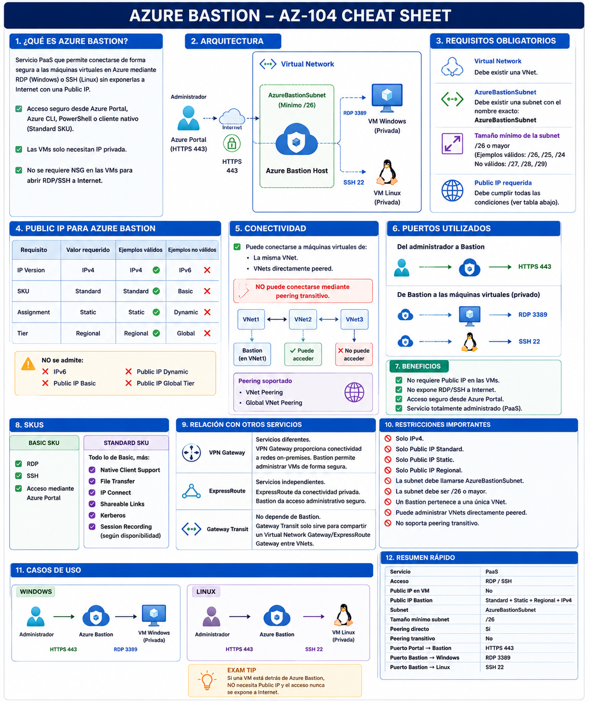

[Azure](https://github.com/magnum31415/wiki/blob/main/azure.md)

- [Azure Bastion (AZ-104)](#azure-bastion-az-104)
- [Azure Bastion Basic vs Standard (AZ-104)](#azure-bastion-basic-vs-standard-az-104)
- [Escenario Necesitas abrir una conexión RDP desde tu ordenador utilizando el cliente nativo de Windows (Remote Desktop).](#escenario-necesitas-abrir-una-conexión-rdp-desde-tu-ordenador-utilizando-el-cliente-nativo-de-windows-remote-desktop)

---

# Azure Bastion (AZ-104)

## 1. Tipos de Azure Bastion

Lo primero que debes identificar en una pregunta es **qué tipo de Azure Bastion** se está utilizando.

| Tipo de Bastion | ¿Necesita una Public IP propia? | ¿Qué IP utiliza? |
|-----------------|:-------------------------------:|------------------|
| **Developer** | ❌ No | IP pública compartida y administrada por Microsoft. |
| **Basic** | ✅ Sí | Public IP propia. |
| **Standard** | ✅ Sí | Public IP propia. |
| **Premium** | ✅ Sí | Public IP propia. |
| **Premium (Private-only)** | ❌ No | Solo IP privada dentro de la VNet. |

---

## 2. Si el Bastion necesita una Public IP...

Para los tipos **Basic**, **Standard** y **Premium**, la Public IP debe tener estas propiedades:

| Propiedad de la Public IP | Valor requerido |
|---------------------------|-----------------|
| Versión IP | **IPv4** |
| SKU | **Standard** |
| Assignment | **Static** |
| Scope | **Regional** |

> Estas propiedades pertenecen al **recurso Public IP**, no al recurso Azure Bastion.

---

# Tipos de Public IP (NO son tipos de Bastion)

Azure dispone de **tres SKUs** para el recurso **Public IP**.

| Característica | Basic SKU | Standard SKU | Premium SKU |
|----------------|-----------|--------------|-------------|
| Seguridad por defecto | Más abierta | ✅ Secure by default | ✅ Secure by default |
| Tráfico entrante | Permitido por defecto | Bloqueado hasta permitirlo mediante NSG | Bloqueado hasta permitirlo mediante NSG |
| Availability Zones | ❌ No | ✅ Sí | ✅ Sí |
| Assignment | Static o Dynamic | **Solo Static** | **Solo Static** |
| Rendimiento y resiliencia | Básico | Alto | Máximo |
| Compatible con Azure Bastion | ❌ No | ✅ Sí | ❌ No |
| Casos de uso habituales | Recursos heredados | La mayoría de servicios modernos de Azure | Servicios de red de alto rendimiento (por ejemplo, Azure Firewall con Virtual WAN y escenarios específicos) |
| Estado actual | ⚠️ En desuso para nuevos diseños | ✅ SKU recomendado | Casos especializados |

> **Importante para el AZ-104**
>
> Aunque exista una **Premium Public IP**, **Azure Bastion NO la utiliza**.
>
> Azure Bastion (Basic, Standard y Premium) **siempre requiere una Public IP Standard SKU**.

---

# Cómo reconocer las preguntas del examen

### Si la pregunta habla de...

> **Azure Bastion**

Piensa en el **tipo de Bastion** (Developer, Basic, Standard o Premium) y si necesita una Public IP.

---

### Si la pregunta habla de...

> **Public IP**

Piensa en las propiedades del recurso Public IP:

- IPv4
- Standard SKU
- Static
- Regional

---

# Truco para el examen

```
¿Qué tipo de Bastion es?

Developer
    ↓
No necesita Public IP

Basic / Standard / Premium
    ↓
Necesitan Public IP
    ↓
IPv4 + Standard SKU + Static + Regional

Premium (Private-only)
    ↓
No necesita Public IP
```

## Resumen para memorizar

| Recurso | Lo que debes recordar |
|----------|-----------------------|
| **Azure Bastion** | Existen varios tipos (Developer, Basic, Standard y Premium). |
| **Public IP** | Tiene diferentes SKUs (Basic, Standard y Premium). |
| **Relación entre ambos** | Azure Bastion **nunca utiliza una Basic SKU ni una Premium SKU**. Si necesita una Public IP, **siempre debe ser Standard SKU**. |

### Bastion Developer

Usa una IP pública de la infraestructura compartida de Microsoft, no una Public IP de tu suscripción.

````
Tu navegador
      │
      │ HTTPS
      ▼
Infraestructura pública compartida
de Azure Bastion (Microsoft)
      │
      │ Red de Azure
      ▼
IP privada de tu VM
````
Por tanto:

- ❌ Tú no creas una Public IP.
- ❌ No aparece una Public IP de Bastion en tu Resource Group.
- ❌ No necesitas AzureBastionSubnet.
- ✅ Microsoft proporciona y gestiona el endpoint público compartido.

Es parecido a usar un SaaS: hay IPs públicas por debajo, pero no son recursos tuyos.

### Bastion Basic / Standard

La diferencia entre Basic y Standard no está en el tipo de Public IP. Está en las funcionalidades: Standard añade, entre otras cosas, mayor escalabilidad y funciones avanzadas como cliente nativo, enlaces compartibles, conexión por IP y puertos personalizados.

````
BASTION BASIC / STANDARD
────────────────────────

Tú
 │ HTTPS 443
 ▼
Public IP del Bastion  ← IP1
 │
 ▼
Azure Bastion
 │
 ├── AzureBastionSubnet
 │
 ▼
VM privada
````

## Esquema



## ¿Qué es Azure Bastion?

Azure Bastion es un servicio PaaS que permite conectarse de forma segura a máquinas virtuales de Azure mediante:

- RDP (Windows)
- SSH (Linux)

sin necesidad de exponer las máquinas virtuales a Internet mediante una Public IP.

El acceso se realiza desde:

- Azure Portal
- Azure CLI
- Azure PowerShell
- Cliente nativo (según SKU)

---

# Arquitectura

```text
                Internet
                     │
              Azure Portal
                     │
              HTTPS (443)
                     │
          Azure Bastion Host
                     │
             AzureBastionSubnet
                     │
          ┌──────────┴──────────┐
          │                     │
       VM Windows           VM Linux
        RDP (3389)          SSH (22)
```

Las máquinas virtuales únicamente necesitan dirección IP privada.

---

# Azure Bastion Host

El Azure Bastion Host es el recurso que se despliega dentro de una Virtual Network.

Es el componente que proporciona el servicio Bastion.

---

# Requisitos para desplegar Azure Bastion

## Virtual Network

Debe existir una VNet.

---

## AzureBastionSubnet

Debe existir una subnet llamada exactamente:

```
AzureBastionSubnet
```

El nombre es obligatorio.

---

## Tamaño mínimo de la subnet

Actualmente:

```
/26
```

o mayor.

Ejemplos válidos:

- /26
- /25
- /24

Ejemplos no válidos:

- /27
- /28
- /29

---

## Public IP requerida

Debe cumplir todos estos requisitos:

| Propiedad | Requisito |
|-----------|-----------|
| IP Version | IPv4 |
| SKU | Standard |
| Assignment | Static |
| Tier | Regional |

No admite:

- IPv6
- Basic SKU
- Dynamic Assignment
- Global Tier

---

# Conectividad

Azure Bastion puede conectarse a:

- Máquinas virtuales de la misma VNet.
- Máquinas virtuales de VNets directamente peered.

No puede conectarse mediante peering transitivo.

Ejemplo:

```
VNet1 ---- VNet2 ---- VNet3

Bastion en VNet1

Puede acceder:

✔ VNet1
✔ VNet2
✘ VNet3
```

---

# Peering

Compatible con:

- VNet Peering
- Global VNet Peering

Siempre que exista peering directo.

---

# ¿Necesita Public IP la máquina virtual?

No.

Una VM protegida mediante Bastion normalmente tiene:

- Private IP
- Sin Public IP

---

# Puertos utilizados

Entre el administrador y Bastion:

```
HTTPS 443
```

Entre Bastion y las máquinas virtuales:

Windows

```
3389 (RDP)
```

Linux

```
22 (SSH)
```

Estos puertos permanecen privados dentro de la VNet.

---

# Beneficios

- No requiere Public IP en las VMs.
- No expone RDP a Internet.
- No expone SSH a Internet.
- Servicio administrado (PaaS).
- Acceso seguro desde Azure Portal.

---

# SKUs

## Basic

Características principales:

- RDP
- SSH
- Acceso mediante Azure Portal

---

## Standard

Además de Basic:

- Native Client Support
- File Transfer
- IP Connect
- Shareable Links
- Kerberos
- Session Recording (según disponibilidad)
- Funcionalidades adicionales de administración

---

# Casos de uso

## Windows

```
Administrador
      │
HTTPS
      │
Azure Bastion
      │
RDP
      │
Windows VM
```

---

## Linux

```
Administrador
      │
HTTPS
      │
Azure Bastion
      │
SSH
      │
Linux VM
```

---

# Bastion y Network Security Groups

El NSG no debe bloquear el tráfico necesario para Bastion.

---

# Bastion y Route Tables

Azure Bastion funciona independientemente de las Route Tables siempre que exista conectividad entre Bastion y las máquinas virtuales.

---

# Bastion y VPN Gateway

Azure Bastion no sustituye a un VPN Gateway.

Funciones distintas:

Azure Bastion

- Administración segura de VMs.

VPN Gateway

- Conectividad entre Azure y redes on-premises.

---

# Bastion y ExpressRoute

Son servicios independientes.

ExpressRoute proporciona conectividad privada.

Azure Bastion proporciona acceso administrativo seguro.

---

# Bastion y Gateway Transit

No dependen uno del otro.

Gateway Transit únicamente sirve para compartir un VPN Gateway o ExpressRoute Gateway entre VNets.

No afecta a las conexiones Bastion.

---

# Restricciones importantes

- Solo IPv4.
- Solo Public IP Standard.
- Solo Public IP Static.
- Solo Public IP Regional.
- La subnet debe llamarse AzureBastionSubnet.
- La subnet debe ser /26 o mayor.
- Un Bastion pertenece a una única VNet.
- Puede administrar VNets directamente peered.
- No soporta peering transitivo.

---

# Recursos relacionados

| Recurso | Obligatorio |
|----------|-------------|
| Virtual Network | Sí |
| AzureBastionSubnet | Sí |
| Azure Bastion Host | Sí |
| Public IP Standard | Sí |

---

# Preguntas típicas del AZ-104

## ¿Puede una VM tener únicamente Private IP?

Sí.

---

## ¿Necesita la VM una Public IP?

No.

---

## ¿Puede Bastion administrar una VM en una VNet peered?

Sí.

---

## ¿Puede administrar una VM mediante peering transitivo?

No.

---

## ¿Puede utilizar una Public IP Basic?

No.

---

## ¿Puede utilizar una Public IP Dynamic?

No.

---

## ¿Puede utilizar una Public IP IPv6?

No.

---

## ¿Puede utilizar una Public IP Global Tier?

No.

---

## ¿Puede utilizar una Public IP Regional Tier?

Sí.

---

# Resumen para memorizar

| Característica | Valor |
|----------------|-------|
| Servicio | PaaS |
| Acceso | RDP y SSH |
| Public IP en VM | No |
| Public IP Bastion | Standard + Static + Regional + IPv4 |
| Subnet | AzureBastionSubnet |
| Tamaño mínimo subnet | /26 |
| Peering directo | Sí |
| Peering transitivo | No |
| Compatible con Global VNet Peering | Sí |
| VPN Gateway requerido | No |
| Gateway Transit requerido | No |
| Puerto Portal → Bastion | HTTPS 443 |
| Puerto Bastion → Windows | RDP 3389 |
| Puerto Bastion → Linux | SSH 22 |

---

# Azure Bastion Basic vs Standard (AZ-104)

## Establecer una conexión **RDP desde Device1 hacia VM1** utilizando Azure Bastion.

Tenemos:

```text
                 Device1
          (Windows 11 + Azure CLI)
                     │
               Internet (HTTPS)
                     │
          Bastion1 (Basic SKU)
                     │
            AzureBastionSubnet
                     │
                  VNET1
                     │
        VM1 (Windows Server 2022)
            Private IP únicamente
```

VM1 **no tiene Public IP**, por lo que **no es posible conectarse directamente mediante RDP desde Internet**.

**Solución correcta**

1. **Paso 1:** Actualizar Azure Bastion al SKU Standard
   Porque **Azure Bastion Basic NO soporta Native Client Support**.
2. **Paso 2:**  Native Client Support
   Esta característica solo está disponible en **Azure Bastion Standard**.
3. **Paso 3:** Desde Azure CLI ejecutar:
```bash
# Este comando:
# - Crea el túnel seguro.
# - Inicia automáticamente el cliente RDP.
# - No requiere abrir manualmente `mstsc.exe`.

az network bastion rdp \
    --name Bastion1 \
    --resource-group RG \
    --target-resource-id VM1
```


## ¿Por qué NO mstsc.exe?

Muchas personas piensan:

```
Azure CLI
↓
mstsc.exe
```

Pero realmente ocurre esto:

```
Azure CLI
↓
az network bastion rdp
↓
Azure Bastion
↓
mstsc.exe (automáticamente)
```

El comando:

```bash
az network bastion rdp
```

ya lanza automáticamente el cliente RDP.

No es necesario ejecutar:

```text
mstsc.exe
```

## ¿Por qué no Kerberos?

- Kerberos únicamente proporciona autenticación integrada.
- No es necesario para establecer una conexión mediante Azure Bastion.


## ¿Por qué no Just-In-Time (JIT)?

- JIT pertenece a Microsoft Defender for Cloud.
- Sirve para abrir temporalmente RDP o SSH desde Internet.
- Azure Bastion nunca expone RDP directamente a Internet, por lo que JIT no interviene.


# Flujo completo

```text
           Device1
          Azure CLI
               │
               ▼
    az network bastion rdp
               │
               ▼
      Bastion Standard
     (Native Client Support)
               │
               ▼
        VM1 (Private IP)
```

---

# Azure Bastion Basic

Permite:

- Acceso mediante Azure Portal.
- RDP.
- SSH.

No permite:

- Native Client Support.
- Azure CLI.
- Azure PowerShell.
- File Transfer.
- IP Connect.
- Shareable Links.

---

# Azure Bastion Standard

Incluye todas las características de Basic y además:

- Native Client Support.
- Azure CLI.
- Azure PowerShell.
- `az network bastion rdp`
- `az network bastion ssh`
- File Transfer.
- IP Connect.
- Shareable Links.
- Kerberos.
- Funcionalidades avanzadas de administración.

---

# Comparativa Basic vs Standard

| Característica | Basic | Standard |
|----------------|:-----:|:--------:|
| Azure Portal | ✅ | ✅ |
| RDP | ✅ | ✅ |
| SSH | ✅ | ✅ |
| Native Client Support | ❌ | ✅ |
| Azure CLI (`az network bastion rdp`) | ❌ | ✅ |
| Azure PowerShell | ❌ | ✅ |
| Cliente RDP nativo (`mstsc.exe`) | ❌ | ✅ |
| Cliente SSH nativo | ❌ | ✅ |
| File Transfer | ❌ | ✅ |
| Shareable Links | ❌ | ✅ |
| IP Connect | ❌ | ✅ |
| Kerberos | ❌ | ✅ |

---

# Regla para el examen AZ-104

Si la pregunta contiene alguna de estas palabras:

- Azure CLI
- Azure PowerShell
- Cliente RDP nativo
- Cliente SSH nativo
- `az network bastion rdp`
- `az network bastion ssh`

➡️ La respuesta casi siempre será:

```
Azure Bastion Standard
+
Native Client Support
```

Si únicamente habla de conectarse desde el Azure Portal:

```
Azure Bastion Basic
```

es suficiente.

---

# Resumen para memorizar

```text
                   Azure Bastion

              BASIC
                 │
     ┌───────────┴───────────┐
     │                       │
 Azure Portal           RDP / SSH

                 ❌ Native Client
                 ❌ Azure CLI
                 ❌ Azure PowerShell
                 ❌ File Transfer
                 ❌ Shareable Links


              STANDARD
                 │
     ┌───────────┴───────────┐
     │                       │
 Todo lo de Basic      Funciones avanzadas

                 ✅ Native Client
                 ✅ Azure CLI
                 ✅ Azure PowerShell
                 ✅ az network bastion rdp
                 ✅ az network bastion ssh
                 ✅ File Transfer
                 ✅ IP Connect
                 ✅ Shareable Links
                 ✅ Kerberos
```
---


# Escenario Necesitas abrir una conexión RDP desde tu ordenador utilizando el cliente nativo de Windows (Remote Desktop).
 

Tienes:

- Un equipo Windows (Device1).
- Una máquina virtual (VM1) **sin Public IP**.
- Un **Azure Bastion Basic** conectado a la misma VNet.

Necesitas abrir una conexión **RDP** desde tu ordenador utilizando el cliente nativo de Windows (Remote Desktop).

---

# Regla principal

El **cliente nativo (Native Client)** **NO está disponible** en Azure Bastion **Basic**.

Para utilizar RDP desde tu propio equipo mediante:

- Remote Desktop (mstsc)
- Azure CLI
- Azure PowerShell

es necesario utilizar **Azure Bastion Standard**.

---

# Secuencia correcta

## Paso 1

Actualizar Azure Bastion de **Basic** a **Standard**.

```
Basic
   │
Upgrade
   ▼
Standard
```

---

## Paso 2

Habilitar la característica **Native Client Support**.

Azure Portal

Azure Bastion

Configuration

Enable **Native Client Support**

---

## Paso 3

Desde el equipo local ejecutar:

```bash
az network bastion rdp \
  --name "<BastionName>" \
  --resource-group "<ResourceGroupName>" \
  --target-resource-id "<VMResourceId>"
```

Este comando inicia automáticamente la sesión RDP hacia la VM a través de Azure Bastion.

---

# ¿Es necesario ejecutar mstsc.exe?

**No.**

El comando:

```bash
az network bastion rdp
```

lanza automáticamente el cliente RDP de Windows.

Por tanto, en una pregunta del examen:

❌ Ejecutar **mstsc.exe** como paso independiente **no es necesario**.

---

# ¿Cuándo usar mstsc.exe?

Solo si el usuario quiere abrir manualmente una conexión RDP.

Cuando se utiliza:

```bash
az network bastion rdp
```

Azure CLI se encarga de abrir el cliente RDP.

---

# Características por SKU

| Funcionalidad | Developer | Basic | Standard | Premium |
|---------------|:--------:|:-----:|:--------:|:-------:|
| Conexión desde Azure Portal | ✅ | ✅ | ✅ | ✅ |
| Native Client (RDP/SSH desde PC) | ❌ | ❌ | ✅ | ✅ |
| Azure CLI (`az network bastion rdp`) | ❌ | ❌ | ✅ | ✅ |
| Azure PowerShell | ❌ | ❌ | ✅ | ✅ |

---

# Native Client

Native Client permite utilizar aplicaciones instaladas en el ordenador local para conectarse a una VM a través de Azure Bastion.

Ejemplos:

- Remote Desktop (RDP)
- SSH
- Azure CLI
- Azure PowerShell

Sin necesidad de que la VM tenga una Public IP.

---

# Lo que NO era necesario en esta pregunta

## Kerberos Authentication

No es un requisito para conectarse mediante Azure Bastion.

---

## Just-In-Time (JIT)

JIT pertenece a Microsoft Defender for Cloud.

Sirve para limitar el tiempo durante el cual una VM acepta conexiones administrativas.

No es necesario para utilizar Azure Bastion.

---

# Truco para el examen

Si aparece cualquiera de estas palabras:

- Native Client
- Azure CLI
- Azure PowerShell
- `az network bastion rdp`
- Cliente RDP local

➡️ Piensa inmediatamente:

> **Azure Bastion Standard (o Premium).**

Si el Bastion es **Basic**, el primer paso casi siempre será:

**Upgrade Basic → Standard**

---

# Resumen para memorizar

```
Basic
   │
   ├── Azure Portal ✅
   └── Native Client ❌

Standard
   │
   ├── Azure Portal ✅
   ├── Native Client ✅
   ├── Azure CLI ✅
   ├── Azure PowerShell ✅
   └── mstsc mediante az network bastion rdp ✅
```

## Regla de oro (AZ-104)

> Si una pregunta menciona **Native Client**, **Azure CLI**, **Azure PowerShell** o el comando `az network bastion rdp`, la respuesta será **Azure Bastion Standard** (o Premium), ya que **Basic no soporta estas funcionalidades**.
