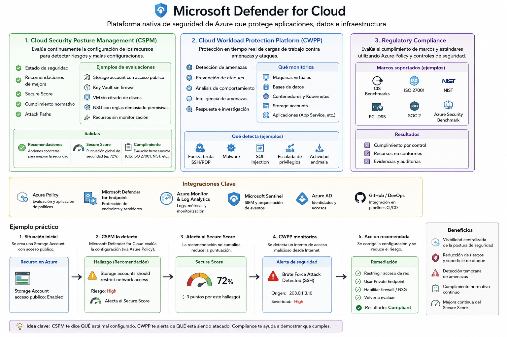

[Azure](https://github.com/magnum31415/wiki/blob/main/azure.md)

# Microsoft Defender for Cloud

# Introducción

Microsoft Defender for Cloud es la plataforma nativa de seguridad de Azure.

Su objetivo es:

* Evaluar continuamente la postura de seguridad de los recursos.
* Detectar configuraciones inseguras.
* Identificar vulnerabilidades.
* Detectar amenazas y ataques.
* Proporcionar recomendaciones de hardening.
* Ayudar al cumplimiento normativo.

Microsoft Defender for Cloud protege tanto recursos Azure como recursos híbridos y multicloud.



---

# Arquitectura General

```text
                   Microsoft Defender for Cloud
                                  │
      ┌───────────────────────────┼───────────────────────────┐
      │                           │                           │
      ▼                           ▼                           ▼

 Cloud Security            Workload Protection         Regulatory
 Posture Management        (CWPP)                      Compliance
 (CSPM)

      │                           │                           │

 Recomendaciones          Detección de amenazas      Benchmarks
 Hardening                Alertas                    Normativas
 Secure Score             Incidentes                 Auditorías
```

---

# Componentes Principales

## Cloud Security Posture Management (CSPM)

Evalúa continuamente la configuración de los recursos para identificar configuraciones inseguras y desviaciones respecto a las mejores prácticas de seguridad.

Ejemplos:

* Storage Accounts públicos.
* Key Vault sin protección adecuada.
* NSG excesivamente permisivos.
* Máquinas virtuales sin cifrado.
* Recursos sin monitorización.

Genera evaluaciones sobre:

* Configuración de seguridad.
* Exposición a Internet.
* Gestión de identidades.
* Protección de datos.
* Cumplimiento normativo.

### Security Recommendations

Las evaluaciones del CSPM generan recomendaciones de seguridad.

Ejemplos:

```text
Storage accounts should restrict network access
```

```text
Virtual machines should enable Azure Monitor Agent
```

```text
Key Vault should have firewall enabled
```

```text
Enable disk encryption
```

```text
Enable Microsoft Defender for Endpoint
```

```text
Enable vulnerability assessment
```

```text
Restrict public network access
```

### Secure Score

El Secure Score es el indicador que mide la postura global de seguridad del entorno.

Se calcula a partir de las recomendaciones de seguridad y del grado de cumplimiento de las mismas.

Ejemplo:

```text
Secure Score = 72%
```

Cuanto mayor sea el valor:

* Menor superficie de ataque.
* Menor riesgo.
* Mejor alineación con las mejores prácticas de Microsoft.

---

## Cloud Workload Protection Platform (CWPP)

Protección activa de los recursos frente a amenazas y ataques.

Monitoriza:

* Máquinas virtuales.
* Bases de datos.
* Contenedores.
* Kubernetes.
* Storage Accounts.
* Aplicaciones.

Detecta:

* Fuerza bruta SSH.
* Fuerza bruta RDP.
* Malware.
* SQL Injection.
* Escaladas de privilegios.
* Actividad anómala.
* Exfiltración de datos.
* Compromiso de cuentas.

Genera:

* Security Alerts.
* Security Incidents.
* Attack Paths.
* Threat Intelligence Findings.

---

## Regulatory Compliance

Permite evaluar el cumplimiento de marcos regulatorios y estándares de seguridad.

Ejemplos:

* CIS
* ISO 27001
* NIST
* PCI-DSS
* SOC 2
* Azure Security Benchmark

Las evaluaciones de cumplimiento se basan principalmente en Azure Policy y en los controles de Microsoft Defender for Cloud.

### Microsoft Cloud Security Benchmark (MCSB)

Es el marco de referencia de seguridad oficial de Microsoft para Azure.

Defender evalúa controles relacionados con:

* Identity Management
* Network Security
* Data Protection
* Logging and Monitoring
* Backup and Recovery
* Asset Management
* Endpoint Security
* Privileged Access
* Vulnerability Management

La iniciativa:

```text
Microsoft Cloud Security Benchmark v2
```

agrupa cientos de Azure Policies que implementan estos controles.

---
---

# Microsoft Defender Plans

# Defender for Servers

Protege:

* Windows Server
* Linux Server

Características:

* Vulnerability Assessment
* Malware Detection
* Threat Detection
* Microsoft Defender for Endpoint Integration
* File Integrity Monitoring

---

# Defender for SQL

Protege:

* Azure SQL Database
* SQL Managed Instance
* SQL Server en Azure VM

Detecta:

* SQL Injection
* Accesos anómalos
* Escaladas de privilegios
* Actividad sospechosa

---

# Defender for Storage

Protege:

* Blob Storage
* Azure Files

Detecta:

* Descargas masivas
* Accesos sospechosos
* Malware
* Exfiltración de datos

---

# Defender for Containers

Protege:

* AKS
* Kubernetes

Detecta:

* Imágenes vulnerables
* Configuraciones inseguras
* Contenedores comprometidos

---

# Defender for Key Vault

Protege:

* Azure Key Vault

Detecta:

* Accesos anómalos
* Enumeración de secretos
* Actividad sospechosa

---

# Defender for App Service

Protege:

* Azure Web Apps
* Azure Functions

Detecta:

* Ataques web
* Accesos sospechosos
* Vulnerabilidades

---

# Defender for Open Source Databases

Protege:

* PostgreSQL
* MySQL
* MariaDB

Detecta:

* Accesos anómalos
* Intentos de explotación
* Actividad sospechosa

---

# Defender for Cosmos DB

Protege:

* Azure Cosmos DB

Detecta:

* Actividad sospechosa
* Accesos no autorizados

---

# Defender for DNS

Analiza:

* Consultas DNS
* Dominios maliciosos
* Comunicaciones sospechosas

---

# Defender for Resource Manager

Monitoriza:

* Operaciones ARM
* Cambios de configuración
* Acciones administrativas sospechosas

---

# Integración con Microsoft Defender for Endpoint (MDE)

```text
Azure VM
    │
    ▼
Defender for Cloud
    │
    ▼
Microsoft Defender for Endpoint
```

Permite:

* Inventario de software.
* Detección de malware.
* EDR (Endpoint Detection and Response).
* Investigaciones avanzadas.

---

# Azure Monitor Agent (AMA)

Las versiones modernas utilizan:

```text
Azure Monitor Agent (AMA)
```

en lugar de:

```text
Log Analytics Agent (MMA)
```

AMA es el agente recomendado actualmente.

---

# Relación con Azure Policy

Defender utiliza Azure Policy internamente.

Ejemplos:

```text
Deploy-MDFC-Config-H224
```

```text
Deploy-MDFC-SqlAtp
```

```text
Deploy-MDFC-OssDb
```

Estas políticas permiten desplegar automáticamente configuraciones de Defender.

---

# Alertas

Defender genera alertas como:

```text
Brute Force Attack Detected
```

```text
Suspicious SQL Activity
```

```text
Malware Detected
```

```text
Credential Theft Attempt
```

Las alertas se agrupan en:

```text
Security Incidents
```

---

# Flujo de Detección

```text
Resource
    │
    ▼
Telemetry
    │
    ▼
Defender Analytics
    │
    ▼
Security Alert
    │
    ▼
Incident
    │
    ▼
Investigation
```

---

# Defender y Azure Landing Zones (ALZ)

ALZ despliega habitualmente:

```text
Deploy-MDFC-Config-H224
```

Configuración base de Defender.

```text
Deploy-MDFC-SqlAtp
```

Protección SQL.

```text
Deploy-MDFC-OssDb
```

Protección PostgreSQL/MySQL.

```text
Deploy-MDEndpoints
```

Integración con Microsoft Defender for Endpoint.

```text
Deploy-MDEndpointsAMA
```

Integración usando Azure Monitor Agent.

---

# Defender vs Azure Monitor

| Característica           | Defender for Cloud | Azure Monitor |
| ------------------------ | ------------------ | ------------- |
| Seguridad                | Sí                 | No            |
| Detección de amenazas    | Sí                 | No            |
| Vulnerability Assessment | Sí                 | No            |
| Alertas de seguridad     | Sí                 | No            |
| Rendimiento              | No                 | Sí            |
| Logs operativos          | No                 | Sí            |
| Métricas                 | No                 | Sí            |

---

# Defender vs Sentinel

| Característica               | Defender | Sentinel |
| ---------------------------- | -------- | -------- |
| Detección de amenazas        | Sí       | Sí       |
| Protección de recursos Azure | Sí       | Parcial  |
| SIEM                         | No       | Sí       |
| SOAR                         | No       | Sí       |
| Correlación avanzada         | Limitada | Sí       |

---

# Preguntas Típicas AZ-104

## ¿Qué es Secure Score?

Puntuación que mide la postura de seguridad del entorno.

---

## ¿Qué servicio proporciona recomendaciones de seguridad?

Microsoft Defender for Cloud.

---

## ¿Qué servicio detecta amenazas en Azure SQL?

Defender for SQL.

---

## ¿Qué servicio protege máquinas virtuales?

Defender for Servers.

---

## ¿Qué servicio integra Azure con Microsoft Defender for Endpoint?

Microsoft Defender for Cloud.

---

## ¿Qué componente evalúa cumplimiento normativo?

Regulatory Compliance.

---

## ¿Qué servicio utiliza Azure Policy para desplegar configuraciones de seguridad?

Microsoft Defender for Cloud.

---

# Resumen

Microsoft Defender for Cloud es la plataforma central de seguridad de Azure.

Funciones principales:

* CSPM (Postura de Seguridad)
* CWPP (Protección de Workloads)
* Secure Score
* Regulatory Compliance
* Threat Detection
* Vulnerability Assessment
* Integración con Defender for Endpoint
* Integración con Azure Policy
* Protección de servidores, bases de datos, almacenamiento, Kubernetes y aplicaciones.

---
# # Relación entre Microsoft Defender for Cloud y Azure Policy

# Introducción

Microsoft Defender for Cloud utiliza Azure Policy como mecanismo de evaluación y despliegue de configuraciones de seguridad.

La relación es tan estrecha que gran parte de las recomendaciones que aparecen en Defender son el resultado de evaluaciones realizadas por Azure Policy.

---

# Arquitectura General

```text
                    Microsoft Defender for Cloud
                                   │
                                   │
                                   ▼
                           Azure Policy Engine
                                   │
             ┌─────────────────────┼─────────────────────┐
             │                     │                     │
             ▼                     ▼                     ▼

      Storage Accounts      Virtual Machines      Key Vaults
      SQL Databases         AKS Clusters          App Services
```

Azure Policy actúa como motor de evaluación.

Defender for Cloud consume los resultados de esas evaluaciones y los transforma en:

* Recomendaciones.
* Secure Score.
* Regulatory Compliance.
* Alertas de configuración.

---

# Qué hace Azure Policy

Azure Policy permite:

## Auditar recursos

Ejemplo:

```text
Storage Accounts should restrict public network access
```

Si una Storage Account tiene acceso público:

```text
Non-Compliant
```

---

## Bloquear recursos

Ejemplo:

```text
Deny-UnmanagedDisk
```

Impide crear máquinas virtuales con discos no gestionados.

---

## Modificar recursos

Ejemplo:

```text
Modify
```

Puede añadir etiquetas automáticamente.

---

## Desplegar configuraciones automáticamente

Ejemplo:

```text
DeployIfNotExists
```

Si una configuración falta, Azure Policy puede desplegarla.

---

# Qué hace Defender for Cloud

Defender utiliza Azure Policy para responder preguntas como:

```text
¿Está cifrado este disco?
```

```text
¿Tiene Defender habilitado?
```

```text
¿Está configurado Azure Monitor Agent?
```

```text
¿Tiene acceso público esta Storage Account?
```

```text
¿Está protegido Key Vault?
```

Los resultados aparecen como recomendaciones.

---

# Ejemplo Práctico

## Policy

```text
Storage accounts should restrict network access
```

Azure Policy evalúa:

```text
Storage Account A
```

Resultado:

```text
Non-Compliant
```

---

## Defender

Defender recibe el resultado.

Muestra:

```text
Recommendation:
Storage accounts should restrict network access
```

Además:

* Reduce el Secure Score.
* Afecta al cumplimiento normativo.
* Puede generar tareas de remediación.

---

# Secure Score

El Secure Score se calcula principalmente utilizando resultados de Azure Policy.

Ejemplo:

```text
Storage Account pública
```

↓

```text
Policy = Non-Compliant
```

↓

```text
Defender Recommendation
```

↓

```text
Reduce Secure Score
```

---

# Regulatory Compliance

Los marcos regulatorios también utilizan Azure Policy.

Ejemplo:

```text
ISO 27001
```

```text
NIST
```

```text
CIS
```

```text
Microsoft Cloud Security Benchmark
```

Cada control se implementa mediante una o varias Azure Policies.

---

# Ejemplo con Microsoft Cloud Security Benchmark

Iniciativa:

```text
Microsoft Cloud Security Benchmark v2
```

Contiene cientos de Azure Policies.

Ejemplos:

```text
Managed disks should be encrypted
```

```text
Storage accounts should restrict network access
```

```text
Key Vault should have firewall enabled
```

```text
SQL databases should have auditing enabled
```

Defender utiliza los resultados para:

* Secure Score.
* Regulatory Compliance.
* Recomendaciones.

---

# Azure Landing Zone (ALZ)

En una Azure Landing Zone, muchas configuraciones de Defender se despliegan mediante Azure Policy.

Ejemplos:

```text
Deploy-MDFC-Config-H224
```

Configura Microsoft Defender for Cloud.

---

```text
Deploy-MDFC-SqlAtp
```

Configura Defender for SQL.

---

```text
Deploy-MDFC-OssDb
```

Configura Defender para PostgreSQL y MySQL.

---

```text
Deploy-MDEndpoints
```

Integra Microsoft Defender for Endpoint.

---

```text
Deploy-MDEndpointsAMA
```

Integra Defender utilizando Azure Monitor Agent.

---

# Tipos de Policies Utilizadas por Defender

## Audit

Solo evalúa.

Ejemplo:

```text
Storage accounts should restrict public network access
```

Resultado:

```text
Compliant
```

o

```text
Non-Compliant
```

---

## Deny

Bloquea despliegues.

Ejemplo:

```text
Deny-UnmanagedDisk
```

No permite crear recursos que incumplan la política.

---

## Modify

Corrige configuraciones automáticamente.

Ejemplo:

```text
Añadir etiquetas obligatorias
```

---

## DeployIfNotExists

Muy utilizado por Defender.

Ejemplo:

```text
Deploy Azure Monitor Agent
```

Si falta el agente:

```text
Azure Policy lo despliega automáticamente
```

---

# Flujo Completo

```text
Azure Resource
       │
       ▼

Azure Policy Evaluation
       │
       ▼

Compliant / Non-Compliant
       │
       ▼

Microsoft Defender for Cloud
       │
       ├── Recommendations
       ├── Secure Score
       ├── Regulatory Compliance
       └── Security Posture
```

---

# Diferencia de Responsabilidades

| Componente            | Función                                                                      |
| --------------------- | ---------------------------------------------------------------------------- |
| Azure Policy          | Evaluar, bloquear, modificar y desplegar configuraciones                     |
| Defender for Cloud    | Analizar resultados, generar recomendaciones y medir la postura de seguridad |
| Secure Score          | Medir el nivel de seguridad                                                  |
| Regulatory Compliance | Medir cumplimiento normativo                                                 |

---

# Relación para el AZ-104

Concepto clave de examen:

```text
Microsoft Defender for Cloud utiliza Azure Policy para evaluar recursos y aplicar configuraciones de seguridad.
```

Recordar:

```text
Azure Policy = Motor de evaluación y aplicación
```

```text
Defender for Cloud = Plataforma de seguridad que consume esos resultados
```

Sin Azure Policy:

* No existirían muchas recomendaciones.
* No existiría gran parte del Secure Score.
* No podrían desplegarse automáticamente muchas configuraciones de seguridad.

Azure Policy es el mecanismo técnico.

Microsoft Defender for Cloud es la capa de gobierno y seguridad que utiliza dicho mecanismo.


---

# Coste de Microsoft Defender for Cloud

## Introducción

Microsoft Defender for Cloud no tiene una licencia única.

El coste depende de los planes de protección habilitados y de los recursos protegidos.

La facturación se compone de dos grandes bloques:

* Cloud Security Posture Management (CSPM)
* Cloud Workload Protection Platform (CWPP)

---

# Cloud Security Posture Management (CSPM)

CSPM proporciona:

* Secure Score
* Security Recommendations
* Regulatory Compliance
* Attack Path Analysis
* Security Posture Management

Su función es evaluar continuamente la configuración de seguridad de los recursos Azure.

Ejemplos:

* Storage Accounts públicos.
* Key Vault sin firewall.
* Máquinas virtuales sin protección.
* Recursos sin monitorización.

---

# Cloud Workload Protection Platform (CWPP)

CWPP proporciona protección activa frente a amenazas.

Incluye planes específicos para distintos tipos de recursos.

---

## Defender for Servers

Protege:

* Windows Server
* Linux Server
* Azure Virtual Machines
* Arc-enabled Servers

Características:

* Vulnerability Assessment
* Microsoft Defender for Endpoint
* File Integrity Monitoring
* Agentless Scanning
* Threat Detection
* Attack Path Analysis

Suele ser el componente con mayor impacto económico.

---

## Defender for SQL

Protege:

* Azure SQL Database
* SQL Managed Instance
* SQL Server sobre Azure VM

Detecta:

* SQL Injection
* Escaladas de privilegios
* Accesos sospechosos
* Actividad anómala

---

## Defender for Storage

Protege:

* Blob Storage
* Azure Files

Detecta:

* Malware
* Accesos sospechosos
* Descargas masivas
* Exfiltración de datos

---

## Defender for Containers

Protege:

* AKS
* Kubernetes

Detecta:

* Imágenes vulnerables
* Configuraciones inseguras
* Contenedores comprometidos

---

## Defender for Key Vault

Protege:

* Azure Key Vault

Detecta:

* Accesos anómalos
* Enumeración de secretos
* Actividad sospechosa

---

## Defender for App Service

Protege:

* Azure Web Apps
* Azure Functions

Detecta:

* Ataques web
* Vulnerabilidades
* Actividad sospechosa

---

## Defender for Open Source Databases

Protege:

* PostgreSQL
* MySQL
* MariaDB

Detecta:

* Intentos de explotación
* Actividad anómala
* Accesos sospechosos

---

## Defender for Cosmos DB

Protege:

* Azure Cosmos DB

Detecta:

* Actividad sospechosa
* Accesos no autorizados

---

# Ejemplo de Coste

Supongamos un entorno con:

```text
50 Virtual Machines
10 Azure SQL Databases
20 Storage Accounts
```

Si se habilitan:

```text
Defender for Servers
Defender for SQL
Defender for Storage
```

El coste total será la suma de los tres planes.

Cada plan utiliza su propio modelo de facturación.

---

# Estrategias Habituales

## Nivel Básico

```text
Defender CSPM
```

Permite:

* Secure Score
* Recommendations
* Compliance

Coste reducido.

---

## Nivel Recomendado

```text
Defender CSPM
+
Defender for Servers Plan 2
```

Proporciona:

* Gestión de postura de seguridad.
* Protección avanzada de servidores.

Es la configuración más habitual en entornos corporativos.

---

## Nivel Enterprise

```text
Defender CSPM
Defender for Servers
Defender for SQL
Defender for Storage
Defender for Containers
```

Proporciona protección integral para toda la plataforma Azure.

---

# Azure Landing Zone (ALZ)

En una Azure Landing Zone suelen desplegarse políticas relacionadas con Defender como:

```text
Deploy-MDFC-Config-H224
Deploy-MDFC-SqlAtp
Deploy-MDFC-OssDb
Deploy-MDEndpoints
Deploy-MDEndpointsAMA
```

Estas políticas:

* Preparan la integración con Defender.
* Automatizan configuraciones de seguridad.
* Despliegan agentes cuando es necesario.

Importante:

```text
Que una policy exista no implica necesariamente que el plan de Defender esté habilitado o generando costes.
```

---

# Cómo Ver los Costes Reales

## Portal Azure

```text
Microsoft Defender for Cloud
    └── Environment Settings
            └── <Subscription>
                    └── Defender Plans
```

Ahí puede verse:

```text
Servers      On
Storage      Off
SQL          On
Containers   Off
```

Los planes habilitados son los que generan facturación.

---

# Buenas Prácticas

1. Activar CSPM en todas las suscripciones corporativas.
2. Activar Defender for Servers en servidores productivos.
3. Activar Defender for SQL únicamente donde existan bases de datos SQL.
4. Activar Defender for Storage únicamente en Storage Accounts con datos sensibles.
5. Revisar periódicamente el Secure Score y las recomendaciones.
6. Monitorizar el coste de Defender desde Cost Management.

---

# Resumen

Microsoft Defender for Cloud se compone de:

```text
CSPM
+
CWPP
```

Donde:

```text
CSPM = Gestión de postura de seguridad
CWPP = Protección activa frente a amenazas
```

El coste depende de:

* Los planes habilitados.
* El número de recursos protegidos.
* El tipo de recurso protegido.

Por este motivo no existe un precio único para Defender for Cloud.

