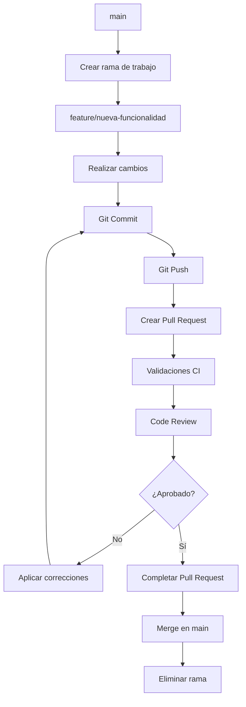
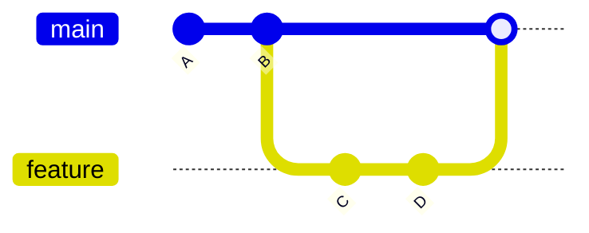

# Workflow de Pull Request en Git

## Visión General

Un Pull Request (PR) es un mecanismo que permite proponer cambios sobre una rama protegida (normalmente `main`) sin modificarla directamente.

El proceso de Pull Request garantiza:

- Revisión de código por otros miembros del equipo.
- Validaciones automáticas mediante pipelines de CI/CD.
- Cumplimiento de políticas del repositorio.
- Trazabilidad y control de cambios.

---

## Flujo General



---

## Paso 1 - Crear una rama

Partimos siempre de la última versión de `main`.

```bash
git checkout main
git pull

git checkout -b feature/alz-firewall-rules
```

---

## Paso 2 - Realizar cambios

Modificar los ficheros necesarios.

Ejemplo:

```text
terraform.tf
variables.tf
main.tf
azure-pipelines.yml
```

Verificar los cambios:

```bash
git status
```

---

## Paso 3 - Crear un commit

Añadir los cambios al área de staging:

```bash
git add .
```

Crear el commit:

```bash
git commit -m "Añadir configuración de Azure Firewall"
```

---

## Paso 4 - Publicar la rama

Subir la rama al repositorio remoto:

```bash
git push -u origin feature/alz-firewall-rules
```

---

## Paso 5 - Crear el Pull Request

Ir a:

```text
Azure DevOps
└── Repos
    └── Pull Requests
        └── New Pull Request
```

Configurar:

| Campo | Valor |
|---------|---------|
| Source Branch | feature/alz-firewall-rules |
| Target Branch | main |

Ejemplo:

```text
Título:
Añadir configuración de Azure Firewall

Descripción:
- Añadida Firewall Policy
- Añadidas reglas DNAT
- Actualizados módulos Terraform
```

---

## Paso 6 - Validaciones automáticas

Al crear el Pull Request se ejecutan automáticamente las pipelines configuradas.

Ejemplo:

```text
Terraform Init
Terraform Validate
Terraform Plan
Security Scan
Unit Tests
```

Si alguna validación falla:

```text
❌ Pull Request bloqueado
```

No será posible hacer el merge hasta corregir los errores.

---

## Paso 7 - Revisión de código

Los revisores analizan los cambios.

Ejemplo:

```text
Revisor A
✓ Aprobado

Revisor B
✗ Cambios solicitados
```

Comentarios típicos:

```text
La regla de firewall es demasiado permisiva.
Faltan etiquetas obligatorias.
La subnet debería ser más restrictiva.
```

---

## Paso 8 - Aplicar correcciones

Realizar los cambios solicitados en la misma rama:

```bash
git add .
git commit -m "Reducir alcance de la regla de firewall"
git push
```

El Pull Request existente se actualiza automáticamente.

No es necesario crear un nuevo PR.

---

## Paso 9 - Aprobación

El Pull Request podrá completarse cuando:

- Todas las pipelines finalicen correctamente.
- Los revisores requeridos lo aprueben.
- Se cumplan las políticas del repositorio.

```text
✓ CI Correcto
✓ Revisiones Aprobadas
✓ Políticas Cumplidas
```

---

## Paso 10 - Merge

Azure DevOps fusiona los cambios en la rama principal.



---

## Estrategias de Merge

### Merge Commit

Mantiene todo el historial de la rama.

```text
A---B---C------M main
     \        /
      D---E--
```

---

### Squash Merge

Combina todos los commits de la rama en uno único.

```text
A---B---C---S main
```

Donde:

```text
S = Todos los cambios de D y E combinados
```

Esta opción suele ser la más utilizada en repositorios de Terraform e Infrastructure as Code.

---

## Ejemplo práctico en Azure DevOps

Si al hacer push aparece el error:

```text
TF402455:
Pushes to this branch are not permitted;
you must use a pull request to update this branch.
```

Significa que la rama `main` está protegida y no permite cambios directos.

El flujo correcto es:

```bash
git checkout -b feature/alz-mgmt

# Realizar cambios

git add .
git commit -m "Actualizar Management Groups"

git push origin feature/alz-mgmt
```

Después:

```text
Azure DevOps
→ New Pull Request

Source:
feature/alz-mgmt

Target:
main
```

Una vez aprobado el Pull Request, Azure DevOps realizará el merge en `main`.

---

## Flujo típico en Terraform

```mermaid
flowchart LR

A[Desarrollador] --> B[Feature Branch]

B --> C[Terraform Code]

C --> D[Commit]

D --> E[Push]

E --> F[Pull Request]

F --> G[Terraform Validate]

G --> H[Terraform Plan]

H --> I[Code Review]

I --> J[Aprobación]

J --> K[Merge]

K --> L[Pipeline CD]

L --> M[Terraform Apply]
```



Este es el patrón habitual utilizado en Azure Landing Zones y despliegues de Terraform en Azure DevOps.
