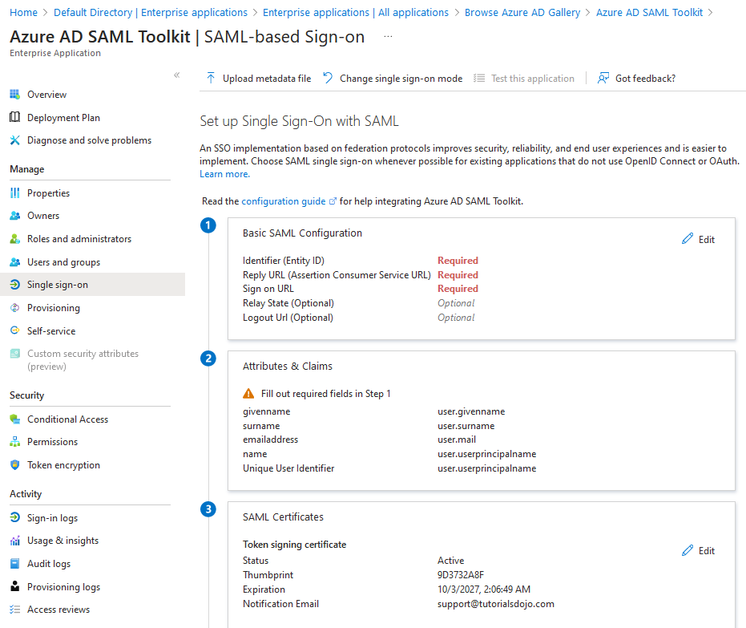

[Azure](https://github.com/magnum31415/wiki/blob/main/azure.md)

# 📚 Fundamentos de identidad, suscripciones y roles en Azure

---

# 📑 Índice

- [📊 Tabla resumen conceptual](#-tabla-resumen-conceptual)

- [Tipos de Licencias en Azure](#tipos-de-licencias-en-azure)
  - [1️⃣ Microsoft Entra ID (antes Azure AD)](#1️⃣-microsoft-entra-id-antes-azure-ad)
  - [2️⃣ Enterprise Mobility + Security (EMS)](#2️⃣-enterprise-mobility--security-ems)
  - [3️⃣ Microsoft Defender](#3️⃣-microsoft-defender)
  - [4️⃣ Tipos de Suscripción Azure](#4️⃣-tipos-de-suscripción-azure)

- [📌 Resumen Comparativo](#-resumen-comparativo)

- [Microsoft Entra tenant](#microsoft-entra-tenant)

- [Azure Subscription](#azure-subscription)

- [¿Qué son los roles en Azure?](#qué-son-los-roles-en-azure)

- [Tipos de roles en Azure](#tipos-de-roles-en-azure)
  - [Roles que NO son RBAC (Microsoft Entra Roles)](#roles-que-no-son-rbac-azure-resource-manager)
  - [Azure RBAC Roles (Control Plane)](#azure-rbac-roles-control-plane)
  - [Roles típicos](#roles-típicos)
  - [Custom Roles](#2️⃣-custom-roles)
  - [Microsoft Entra Roles (nivel identidad)](#3️⃣-microsoft-entra-roles-nivel-identidad)

- [Scope donde se asignan roles](#scope-donde-se-asignan-roles)

- [Diferencia crítica para AZ-305](#diferencia-crítica-para-az-305)

- [Microsoft Entra ID – Conceptos clave de autenticación y acceso](#-microsoft-entra-id--conceptos-clave-de-autenticación-y-acceso)
  - [Continuous Access Evaluation (CAE)](#continuous-access-evaluation-cae)
  - [Conditional Access Policies (CAP)](#conditional-access-policies-cap)
  - [OpenID Connect (OIDC)](#openid-connect-oidc)
  - [Multi-Factor Authentication (MFA)](#multi-factor-authentication-mfa)
  - [Access Reviews](#access-reviews)
  - [Azure AD Enterprise Applications](#azure-ad-enterprise-applications)
  - [Azure AD Application Proxy](#azure-ad-application-proxy)

- [Microsoft Entra ID Governance](#-microsoft-entra-id-governance)
  - [Access Reviews (Governance)](#-feature-access-reviews)

- [OAuth 2.0 + Entra ID + Web API](#1️⃣-microsoft-entra-id-identity-provider---teoría-resumida-oauth-20--entra-id--web-api)
  - [OAuth 2.0](#2️⃣-oauth-20-autorización)
  - [Access Token (Bearer Token)](#3️⃣-access-token-bearer-token)

- [Privileged Identity Management (PIM)](#privileged-identity-management-pim)

- [Métodos de autenticación híbrida](#-métodos-de-autenticación-híbrida-en-microsoft-entra-id)
  - [Comparativa rápida](#comparativa-rápida)
  - [¿Qué es Azure AD Connect?](#qué-es-azure-ad-connect)
  - [PHS – Password Hash Synchronization](#-phs--password-hash-synchronization)
  - [PTA – Pass-Through Authentication](#-pta--pass-through-authentication)
  - [AD FS – Federation Services](#-ad-fs--federation-services)
  - [Regla mental para AZ-305](#-regla-mental-para-az-305)
  - [Flujos simplificados](#-flujo-simplificado)

- [Microsoft Entra Entitlement Management](#-microsoft-entra-entitlement-management)
  - [Access Package](#1️⃣-access-package)
  - [Catálogo](#2️⃣-catalogo)
  - [Policies](#3️⃣-policies-políticas)
  - [Flujo de funcionamiento](#-flujo-de-funcionamiento)
  - [Diferencia con RBAC](#-diferencia-con-rbac-tradicional)
  - [Casos de uso](#-casos-de-uso-típicos)

- [🔐 Managed Identity en Azure](#-managed-identity-en-azure)

- [🎯 ¿Qué problema resuelve?](#-qué-problema-resuelve)

- [🧠 ¿Cómo funciona?](#-cómo-funciona)

- [🏗 Tipos de Managed Identity](#-tipos-de-managed-identity)
  - [1️⃣ System-Assigned](#1️⃣-system-assigned)
  - [2️⃣ User-Assigned](#2️⃣-user-assigned)

- [📌 Ejemplo típico](#-ejemplo-típico)

- [🔎 Qué NO es](#-qué-no-es)

- [🧩 Diferencias clave](#-diferencias-clave)

- [🧠 Regla mental (AZ-305)](#-regla-mental-az-305)

---

# 📊 Tabla resumen conceptual


# 📊 Tabla resumen conceptual ampliada

| Concepto | Qué controla | Ejemplo |
|-----------|-------------|----------|
| Tenant | Identidad y seguridad | Empresa con 500 usuarios, grupos y políticas MFA centralizadas |
| Subscription | Facturación y contenedor de recursos | Suscripción separada para PROD y otra para DEV |
| Resource Group | Agrupación lógica dentro de una subscription | RG “rg-app-prod” que contiene VM + SQL + Storage |
| RBAC Role | Recursos Azure (control plane) | Asignar Contributor sobre una Subscription |
| Data Plane Role | Acceso a datos dentro del recurso | Storage Blob Data Reader |
| Entra Role | Identidad y directorio | Global Administrator |
| Azure Policy | Lo que está permitido crear | Bloquear VMs fuera de West Europe |
| Resource Lock | Protección contra borrado/modificación | Lock “CanNotDelete” en Storage crítico |
| CAE | Revocación inmediata de acceso | Usuario deshabilitado pierde acceso al instante |
| Conditional Access | Reglas dinámicas de acceso | Exigir MFA fuera del país |
| OIDC | Protocolo moderno de autenticación | Login con Microsoft en app web |
| OAuth 2.0 | Autorización delegada | Web App accede a API con Bearer Token |
| Access Token (JWT) | Credencial firmada para acceso a APIs | Header Authorization: Bearer |
| MFA | Verificación multifactor | Password + código Authenticator |
| Access Reviews | Revisión periódica de accesos | Revisar acceso de usuarios B2B |
| Enterprise Applications | Gestión de apps integradas en el tenant | Configurar SAML SSO para Salesforce |
| App Registration | Definición global de una aplicación | Registrar una API protegida por Entra |
| Application Proxy | Publicar apps on-prem con identidad Entra | Publicar app IIS interna sin puertos inbound |
| PIM (Privileged Identity Management) | Acceso Just-In-Time a roles privilegiados | Activar Owner por 2 horas |
| Microsoft Entra Entitlement Management | Gestión automatizada del acceso mediante paquetes (Access Packages) | Usuario solicita paquete Finance con expiración automática |
| Managed Identity | Autenticación servicio → servicio sin secretos | Web App accede a Key Vault sin client_secret |
| Service Principal | Identidad de aplicación en Entra ID | Backend autenticándose contra API |
| Azure AD Connect / Entra Connect | Sincronización AD on-prem → Entra ID | Sincronizar usuarios híbridos |
| PHS | Autenticación en la nube con hash sincronizado | Usuario AD autenticándose en Entra |
| PTA | Validación de contraseña en AD on-prem | Login validado por agente PTA |
| AD FS | Autenticación federada | Redirección a servidor AD FS |
| Identity Protection | Detección de riesgo de identidad | Bloquear usuario con login sospechoso |
| Identity Governance | Gobierno del ciclo de vida de identidades | Automatizar revisión y expiración de accesos |
| EMS E3 | Suite con Entra ID P1 + Intune | Empresa con Conditional Access |
| EMS E5 | Suite con Entra ID P2 + seguridad avanzada | Entorno con PIM e Identity Protection |
| Entra ID Free | Gestión básica de identidad | Usuarios + SSO básico |
| Entra ID P1 | Conditional Access + Dynamic Groups | Control por dispositivo compliant |
| Entra ID P2 | PIM + Identity Protection | Acceso Just-In-Time |
| Defender for Cloud | Seguridad de workloads Azure | Protección de VMs y SQL |
| Defender for Endpoint | Seguridad avanzada de dispositivos | EDR en Windows 10 |
| Pay-As-You-Go | Modelo de pago por consumo | Startup sin compromiso anual |
| Enterprise Agreement (EA) | Contrato corporativo anual | Gran empresa con consumo elevado |
| Microsoft Customer Agreement (MCA) | Modelo contractual moderno | Facturación flexible |
| CSP (Cloud Solution Provider) | Suscripción gestionada por partner | Partner gestiona facturación |
| Custom Role | Rol RBAC personalizado | Permitir solo Start/Stop VM |


---
# Tipos de Licencias en Azure

## 1️⃣ Microsoft Entra ID (antes Azure AD)

### 🔹 Free
- Gestión básica de usuarios y grupos
- Single Sign-On (SSO)
- Sin funcionalidades avanzadas de seguridad

### 🔹 P1 (Premium P1)
- Incluye todo lo de Free
- Acceso Condicional
- Self-Service Password Reset (con write-back)
- Dynamic Groups
- Soporte para identidad híbrida
- Orientado a empresas con necesidades de control de acceso

### 🔹 P2 (Premium P2)
- Incluye todo lo de P1
- Identity Protection (detección de riesgos)
- Privileged Identity Management (PIM)
- Acceso Just-in-Time para roles administrativos
- Recomendado para entornos con altos requisitos de seguridad

---

## 2️⃣ Enterprise Mobility + Security (EMS)

### 🔹 EMS E3
- Incluye Entra ID P1
- Microsoft Intune
- Protección básica de identidad

### 🔹 EMS E5
- Incluye Entra ID P2
- Identity Protection
- Seguridad avanzada y análisis de riesgos

---

## 3️⃣ Microsoft Defender

### 🔹 Defender for Cloud
- Plan gratuito (CSPM básico)
- Planes de pago por workload (Servers, SQL, Containers, etc.)

### 🔹 Microsoft Defender for Endpoint
- Plan 1
- Plan 2 (EDR avanzado)

---

## 4️⃣ Tipos de Suscripción Azure

### 🔹 Pay-As-You-Go
- Pago por consumo
- Sin compromiso mínimo

### 🔹 Enterprise Agreement (EA)
- Para grandes organizaciones
- Compromiso de consumo anual

### 🔹 Microsoft Customer Agreement (MCA)
- Modelo contractual moderno
- Facturación flexible

### 🔹 Cloud Solution Provider (CSP)
- A través de partner
- Facturación gestionada por proveedor

---

# 📌 Resumen Comparativo

| Categoría      | Nivel Básico | Nivel Intermedio | Nivel Avanzado |
|---------------|-------------|------------------|----------------|
| Entra ID      | Free       | P1               | P2             |
| Seguridad     | Defender básico | Plan 1     | Plan 2         |
| Contrato Azure| PayG       | MCA              | EA             |


# Microsoft Entra tenant

🔝 [Volver al índice](#-índice)

Un Microsoft Entra tenant es el contenedor lógico de identidad y seguridad que representa a una organización dentro de Microsoft Cloud.

Es tu **directorio corporativo en la nube**.

**Microsoft Entra Tenant = Directorio de identidad y seguridad que contiene usuarios, apps y suscripciones de una organización en Azure.**

### Qué contiene

- Usuarios  
- Grupos  
- Aplicaciones registradas  
- Roles (RBAC, Global Admin, etc.)  
- Service Principals  
- Managed Identities  
- Configuración MFA / Conditional Access  

### Relación jerárquica

Microsoft Entra Tenant  
→ Usuarios y Grupos  
→ Aplicaciones  
→ Azure Subscriptions  
 → Resource Groups  
  → Recursos (VMs, SQL, Storage…)

### Claves examen AZ-305

- El tenant es el límite de identidad.
- RBAC vive dentro del tenant.
- Una subscription pertenece a un único tenant.
- Un tenant puede tener múltiples subscriptions.
- Cross-tenant requiere B2B explícito.

---

## Azure Subscription

🔝 [Volver al índice](#-índice)

Una Azure Subscription es el contenedor de **facturación y aislamiento de recursos**.

Es donde:

- Se genera la factura  
- Se aplican permisos RBAC  
- Se organizan recursos  

### Encaje jerárquico

Microsoft Entra Tenant  
→ Azure Subscriptions  
 → Resource Groups  
  → Recursos  

### Qué define una subscription

1. Facturación independiente  
2. Límite administrativo  
3. Límites y cuotas (vCPU, servicios, etc.)

### Claves examen AZ-305

- Puedes separar PROD / DEV en distintas subscriptions.
- RBAC se asigna a nivel Subscription / RG / Recurso.
- Una subscription solo pertenece a un tenant.

---

## ¿Qué son los roles en Azure?

🔝 [Volver al índice](#-índice)

Un rol en Azure define qué acciones puede hacer una identidad sobre recursos.

Forma parte de RBAC (Role-Based Access Control).

**Fórmula mental para el examen:**

``Permiso RBAC = Security Principal + Role + Scope``

- Security Principal = usuario, grupo, app
- Role = conjunto de permisos
- Scope = Management Group / Subscription / RG / Recurso

Un rol no es una persona, es un conjunto de permisos.

---

# Tipos de roles en Azure

## 🔶 Diferencia clave examen AZ-305

| Tipo de Rol | Controla | Ejemplo |
|-------------|----------|----------|
| Entra Role | Identidad y directorio | Global Admin |
| RBAC Role | Recursos Azure | Contributor |
| Data Plane Role | Acceso a datos | Storage Blob Data Reader |

### 🎯 Regla mental rápida

- ¿Gestiona usuarios, MFA, SSO, Conditional Access? → **Entra Role**
- ¿Gestiona VMs, Storage, SQL, redes? → **RBAC**
- ¿Accede a datos dentro del recurso? → **Data Plane Role**

##  Roles que NO son RBAC (Azure Resource Manager)

No todos los “roles” en Azure son RBAC sobre recursos.  
Algunos pertenecen al **plano de identidad (Microsoft Entra ID)** y no gestionan recursos como VMs, Storage o SQL.

### Microsoft Entra Roles (Directory Roles)

Estos roles gestionan **identidad y seguridad del tenant**, no recursos Azure.

Ejemplos:

| Rol | Qué controla | ¿Es RBAC sobre recursos Azure? |
|------|-------------|--------------------------------|
| Global Administrator | Control total del tenant Entra | ❌ No |
| Application Administrator | Gestionar App Registrations | ❌ No |
| Security Administrator | Configuración de seguridad identidad | ❌ No |
| Conditional Access Administrator | Políticas de acceso condicional | ❌ No |
| Privileged Role Administrator | Asignación de roles Entra | ❌ No |
| User Administrator | Crear y gestionar usuarios | ❌ No |
| Groups Administrator | Gestionar grupos | ❌ No |
| Identity Governance Administrator | Access Reviews, lifecycle | ❌ No |

👉 Estos roles viven en **Microsoft Entra ID**, no en Azure Resource Manager.


## Azure RBAC Roles (Control Plane)

Estos SÍ son RBAC y gestionan recursos Azure:

- Owner
- Contributor
- Reader
- Network Contributor
- Storage Account Contributor
- SQL Contributor
- etc.

👉 Se asignan en:
- Management Group
- Subscription
- Resource Group
- Recurso


### Roles típicos

Roles predefinidos por Microsoft.


| Rol | Puede hacer | No puede hacer | Escenario típico de uso |
|-----|------------|----------------|--------------------------|
| Owner | Control total sobre recursos y permisos | — | Administrador completo de una suscripción |
| Contributor | Crear y modificar recursos | Asignar roles | Equipo técnico que gestiona infraestructura |
| Reader | Ver recursos | Modificar o borrar | Auditoría o equipo de reporting |
| User Access Administrator | Asignar roles RBAC | Gestionar recursos | Equipo IAM que gestiona permisos |
| Network Contributor | Gestionar redes (VNet, NSG, LB) | Asignar roles | Equipo de networking |
| Virtual Machine Contributor | Crear y administrar VMs | Gestionar red completa | Equipo de sistemas |
| Storage Account Contributor | Gestionar cuentas de almacenamiento | Asignar roles | Equipo que administra storage |
| Storage Blob Data Contributor | Leer/escribir blobs | Gestionar configuración de la cuenta | App que necesita acceso a datos Blob |
| SQL DB Contributor | Gestionar bases Azure SQL | Gestionar servidor completo | DBA gestionando bases PaaS |
| SQL Server Contributor | Gestionar servidor SQL lógico | Acceso a datos internos | Administrador de servidor SQL |
| Cosmos DB Account Contributor | Gestionar cuentas Cosmos | Acceso granular a datos | Equipo que despliega NoSQL |
| Cosmos DB Built-in Data Contributor | Leer/escribir datos Cosmos | Configurar cuenta | Aplicación backend |
| Cosmos DB Built-in Data Reader | Leer datos Cosmos | Escribir datos | Reporting sobre Cosmos |
| Web Plan Contributor | Gestionar App Service Plan | Asignar roles | Administrador de hosting web |
| Website Contributor | Gestionar Web Apps | Cambiar plan base | Equipo DevOps |
| Application Insights Component Contributor | Gestionar App Insights | Control de recursos externos | Equipo de monitorización |
| Monitoring Contributor | Gestionar Azure Monitor | Acceso total recursos | Equipo observabilidad |
| Key Vault Contributor | Gestionar vault | Acceso a secretos | Administrador de Key Vault |
| Key Vault Secrets User | Leer secretos | Gestionar vault | Aplicación que consume secretos |
| Backup Contributor | Gestionar backups | Asignar roles | Equipo de backup |
| Reservations Administrator | Gestionar reservas de capacidad | Gestionar recursos | Equipo financiero optimizando costes |
| Cost Management Contributor | Gestionar presupuestos y costes | Crear recursos | Equipo FinOps |
| Security Admin (Entra) | Gestionar políticas seguridad tenant | Gestionar recursos Azure | Equipo seguridad identidad |
| Global Administrator (Entra) | Control total del tenant | — | Administración del directorio |
| Privileged Role Administrator | Gestionar roles Entra | Gestionar recursos Azure | Gestión de roles privilegiados |

---

## 🧠 Claves rápidas AZ-305

- Owner = todo.
- Contributor ≠ puede asignar roles.
- Data roles (Blob/Cosmos) = acceso a datos, no a infraestructura.
- Roles Entra ≠ RBAC Azure.
- FinOps → Reservations / Cost Management.
- Seguridad identidad → Entra roles.


Claves examen:

- Owner = todo.
- Contributor NO puede asignar roles.
- Reader = solo lectura.

### Roles específicos frecuentes AZ-305

- Network Contributor
- Virtual Machine Contributor
- Storage Account Contributor
- SQL DB Contributor
- Reservations Administrator
- Backup Contributor

---

## 2️⃣ Custom Roles

Cuando los built-in no encajan.

Permiten:

- Definir permisos exactos.
- Aplicar en scopes concretos.

Se usan en entornos empresariales estrictos.

---

## 3️⃣ Microsoft Entra Roles (nivel identidad)

Gestionan el tenant, no los recursos Azure.

Ejemplos:

- Global Administrator
- Application Administrator
- Security Administrator

Error típico examen:

RBAC ≠ Entra Roles

---

# Scope donde se asignan roles

Un rol puede asignarse en:

- Management Group
- Subscription
- Resource Group
- Recurso individual

Ejemplo mental:

Juan  
→ Contributor  
 → Scope: Subscription DEV  

---

# Diferencia crítica para AZ-305

| Concepto       | Controla                        |
|---------------|---------------------------------|
| RBAC Role     | Recursos Azure                  |
| Entra Role    | Identidad y directorio          |
| Azure Policy  | Lo que está permitido crear     |
| Resource Lock | Evita borrar o modificar        |

---

# Frase para memorizar

Un rol en Azure es un conjunto de permisos que se asigna a una identidad sobre un alcance específico.

---

# 🔐 Microsoft Entra ID – Conceptos clave de autenticación y acceso

---

## Continuous Access Evaluation (CAE)

🔝 [Volver al índice](#-índice)

**¿Qué es?**  
Mecanismo que permite que los tokens de acceso se validen en tiempo real, sin esperar a que expiren.

**Qué hace en la práctica**
- Revoca acceso inmediatamente si:
  - Se cambia la contraseña
  - Se deshabilita el usuario
  - Se detecta riesgo

**Clave examen AZ-305**  
CAE = Revocación casi inmediata de acceso.

---

## Conditional Access Policies (CAP)

🔝 [Volver al índice](#-índice)

Motor de políticas dinámicas que decide si un usuario puede acceder a un recurso.

Puede exigir:
- MFA
- Dispositivo compliant
- Bloqueo de acceso

**Clave examen**  
Si ocurre X → exige Y.

---

## OpenID Connect (OIDC)

🔝 [Volver al índice](#-índice)

Protocolo moderno de autenticación basado en OAuth 2.0.

Se usa para:
- Login con Microsoft
- SSO
- Apps cloud

**Clave examen**  
OIDC = Autenticación moderna.

---

## Multi-Factor Authentication (MFA)

🔝 [Volver al índice](#-índice)

Requiere más de un factor de autenticación.

**Clave examen**  
MFA reduce riesgo de credenciales comprometidas.

---

## Access Reviews

🔝 [Volver al índice](#-índice)

**¿Qué es?**  
Funcionalidad de Microsoft Entra ID (Identity Governance) que permite revisar periódicamente quién tiene acceso a qué recursos.

**Qué hace en la práctica**
- Revisa membresías de grupos
- Revisa asignaciones de roles
- Permite aprobar o revocar accesos
- Automatiza expiración de permisos

**Escenarios típicos**
- Revisar accesos de usuarios externos (B2B)
- Revisar miembros de grupos privilegiados
- Cumplimiento normativo (SOX, ISO, etc.)

**Clave examen AZ-305**
Access Reviews = Control periódico de privilegios para evitar acumulación de permisos.

---

## Azure AD Enterprise Applications

🔝 [Volver al índice](#-índice)

**Clave AZ-305**

Enterprise Applications = Gestión de acceso y autenticación de aplicaciones dentro del tenant (SSO + permisos + Conditional Access).

**¿Qué es?**  
Representa las aplicaciones que usan tu tenant para autenticarse (SaaS o apps internas).

Cuando registras o integras una app:
- Se crea un **Service Principal** en Enterprise Applications.
- Desde aquí gestionas:
  - Permisos
  - Asignación de usuarios/grupos
  - SSO
  - Conditional Access
  - Consentimientos

### 🔐 SAML-based Single Sign-On (SSO)

Las **Enterprise Applications en Microsoft Entra** permiten integrar aplicaciones (incluidas on-premises) mediante  **SAML-based Single Sign-On (SSO)**.

- Al configurar una aplicación como Enterprise Application:
  - Se establece federación basada en SAML.
  - Los usuarios se autentican en Entra ID.
  - Entra emite una SAML Assertion firmada.
  - El usuario accede a la aplicación sin volver a introducir credenciales.

👉 Resultado: **Inicio de sesión único (SSO)**.



### 🛡 Conditional Access

Las políticas de Conditional Access permiten aplicar controles de seguridad según condiciones como:
- Ubicación
- Dispositivo
- Nivel de riesgo
- Estado del usuario
Ejemplo típico:
- Si el usuario accede desde una ubicación diferente → Requerir MFA

Esto añade una capa adicional de seguridad verificando múltiples factores antes de conceder acceso.


**Diferencia clave examen**
- App Registration = definición global de la app.
- Enterprise Application = instancia en tu tenant.


---

## Azure AD Application Proxy

🔝 [Volver al índice](#-índice)

**¿Qué es?**  
Servicio que permite publicar aplicaciones on-premises de forma segura en Internet usando Microsoft Entra ID.

**Cómo funciona**
- Instalas un conector en tu red interna.
- El tráfico saliente se establece hacia Azure.
- Los usuarios acceden vía Entra ID (SSO + Conditional Access).

**Ventajas**
- No necesitas abrir puertos inbound.
- Integración con MFA y Conditional Access.
- Ideal para apps legacy web internas.

**Clave examen AZ-305**
Application Proxy = Publicar aplicaciones on-prem de forma segura usando identidad Entra.

---

# 🧠 Resumen rápido para examen

| Concepto | Qué controla |
|----------|-------------|
| CAE | Revocación inmediata de acceso |
| Conditional Access | Reglas dinámicas de acceso |
| OIDC | Protocolo de autenticación moderno |
| MFA | Verificación multifactor |
| Access Reviews | Revisión periódica de accesos |
| Enterprise Applications | Gestión de acceso a apps en el tenant |
| Application Proxy | Publicar apps on-prem con identidad Entra |


# # 🔐 Microsoft Entra ID Governance

## 🔹 Azure Service: Microsoft Entra ID Governance

Servicio cloud que permite **gestionar y controlar el acceso de usuarios a recursos** dentro de Microsoft Entra ID (antes Azure AD).

Su objetivo es asegurar que:
- Solo las personas adecuadas tengan acceso.
- El acceso sea revisado periódicamente.
- Se cumplan requisitos de seguridad y compliance.

Incluye funcionalidades como:
- Gestión del ciclo de vida de identidades.
- Control de acceso privilegiado.
- Revisiones de acceso.
- Políticas de gobernanza.

👉 En resumen: ayuda a mantener el acceso limpio, controlado y auditado.

---

## 🔹 Feature: Access Reviews

Funcionalidad dentro de Entra ID Governance que permite **revisar periódicamente quién tiene acceso a qué recursos**.

Permite:
- Crear revisiones automáticas (mensuales, trimestrales, etc.).
- Asignar revisores (ej: administradores o responsables).
- Confirmar o eliminar accesos.
- Revocar automáticamente accesos innecesarios.

Ejemplo típico:
- Revisar mensualmente qué usuarios (incluidos invitados/guest) tienen acceso a una aplicación.
- El administrador valida si aún lo necesitan.
- Si no → el acceso se elimina automáticamente.

👉 En resumen: automatiza la revisión y limpieza de permisos.
---

# 1️⃣ Microsoft Entra ID (Identity Provider) - Teoría resumida OAuth 2.0 + Entra ID + Web API


## Qué es
Servicio de identidad (IdP) que:
- Autentica usuarios
- Emite tokens (JWT)
- Soporta OAuth 2.0 y OpenID Connect

## Clave examen
- Entra **genera los access tokens**
- No la app
- No la API

---

# 2️⃣ OAuth 2.0 (Autorización)

## Qué es
Protocolo que permite que una aplicación acceda a un recurso en nombre del usuario sin almacenar su contraseña.

## Componentes

| Rol | Quién es en Azure |
|------|------------------|
| Resource Owner | Usuario |
| Client | Web App |
| Authorization Server | Microsoft Entra |
| Resource Server | Web API |

## Flujo simplificado

1. Usuario se autentica en Entra  
2. Entra devuelve Access Token  
3. Web App llama a API con Bearer Token  
4. API valida token y autoriza  

---

# 3️⃣ Access Token (Bearer Token)

## Qué es
Token JWT firmado digitalmente que contiene:

- Identidad del usuario
- Scopes
- Roles
- Expiración
- Firma

Se envía en el header:

````http
Authorization: Bearer <token>
````

# Privileged Identity Management (PIM)

## 🔎 ¿Qué es?

**Privileged Identity Management (PIM)** es un servicio de **Microsoft Entra ID** que permite **gestionar, controlar y auditar accesos privilegiados** en Azure y en el tenant.

👉 Sí, es parte de **Microsoft Entra ID (Identity Governance)**.

---

# 🎯 ¿Para qué sirve?

Sirve para aplicar el principio de **Just-In-Time (JIT)** en roles privilegiados.

En vez de que un usuario tenga permisos altos permanentemente:

- Se le asigna el rol como *eligible* (elegible)
- Lo activa solo cuando lo necesita
- Puede requerir:
  - MFA
  - Justificación
  - Aprobación
- El rol expira automáticamente tras un tiempo

---

# 🧠 Qué controla PIM

Puede gestionar:

### 1️⃣ Roles de Microsoft Entra (Directory Roles)
Ejemplo:
- Global Administrator
- Security Administrator

### 2️⃣ Roles RBAC de Azure
Ejemplo:
- Owner
- Contributor
- User Access Administrator

---

# 🔒 Problema que resuelve

Sin PIM:
- Un usuario puede ser Owner 24/7
- Si le roban credenciales → riesgo crítico

Con PIM:
- Solo tiene privilegios cuando los activa
- El acceso es temporal
- Todo queda auditado

---

# 📌 Ejemplo real

Empresa financiera:

- Juan es ingeniero cloud.
- No debe ser Owner permanente.
- Se le asigna Owner como *eligible*.
- Cuando necesita hacer un cambio crítico:
  1. Activa el rol desde PIM.
  2. Introduce justificación.
  3. Hace MFA.
  4. Tiene acceso durante 2 horas.
  5. El rol se desactiva automáticamente.

👉 Resultado: menos superficie de ataque.

---

# 🧩 Funcionalidades clave

- Just-In-Time access
- Aprobaciones
- MFA obligatorio
- Expiración automática
- Alertas de riesgo
- Auditoría de activaciones
- Access Reviews para roles privilegiados

# 📊 Métodos de autenticación híbrida en Microsoft Entra ID

## Comparativa rápida

| Método | Dónde se valida la contraseña | Infraestructura on-prem necesaria | Alta disponibilidad | Complejidad | Cuándo usarlo | Clave examen AZ-305 |
|----------|------------------------------|-----------------------------------|---------------------|-------------|--------------|------------------|
| **PHS** (Password Hash Synchronization) | En la nube (Entra ID) | Solo Entra Connect | Alta (servicio cloud) | Baja | Escenario híbrido estándar | ✅ Recomendado por Microsoft |
| **PTA** (Pass-Through Authentication) | En el AD on-prem | Agentes PTA en servidores on-prem | Depende de los agentes desplegados | Media | Cuando no se permite sincronizar hash | Requiere conectividad constante |
| **AD FS** (Federation Services) | En AD on-prem vía federación | Infraestructura AD FS completa (farm + WAP + certificados) | Depende del diseño on-prem | Alta | Requisitos avanzados (smart card, claims personalizadas) | ❌ Más complejo y costoso |

---
# ¿Qué es Azure AD Connect?

**Azure AD Connect** (ahora llamado **Microsoft Entra Connect**) es la herramienta que se instala en un servidor **on-premises** para sincronizar Active Directory con Microsoft Entra ID (Azure AD).

 **🎯 Resumen en una frase**  Azure AD Connect es el servicio on-prem que sincroniza identidades entre Active Directory local y Microsoft Entra ID en la nube.

 **🧠 Importante para examen AZ-305**

- Azure AD Connect = puente entre AD on-prem y Entra
- Es necesario en entornos híbridos
- Permite PHS, PTA o federación
- No es obligatorio en entornos cloud-only

---

## 🏗 ¿Dónde se instala?

Se instala en:

- Un servidor Windows dentro del dominio on-prem
- Unido al Active Directory local
- Con conectividad hacia Internet (saliente hacia Azure)
- No se instala en Azure.
- No es un servicio SaaS.
- Es un componente on-prem.


## 🔄 ¿Qué hace exactamente?

Permite:

### 1️⃣ Sincronización de identidades
- Usuarios
- Grupos
- Contactos

AD → Microsoft Entra ID

### 2️⃣ Sincronización de contraseñas (según método)

Dependiendo del modelo elegido:

| Método | Qué hace |
|--------|----------|
| PHS | Sincroniza hash de contraseña |
| PTA | No sincroniza hash, valida contra AD |
| AD FS | Autenticación federada |

### 3️⃣ Writeback (opcional)

Permite sincronización inversa:

- Password Writeback
- Group Writeback
- Device Writeback

Microsoft Entra ID → AD


# Métodos de autenticación híbrida

Son **métodos de autenticación híbrida** que permiten a usuarios de un Active Directory on-premises autenticarse en Microsoft Entra ID (Azure AD).

Se usan cuando una organización tiene:

- Active Directory local
- Microsoft Entra ID en la nube
- Identidades sincronizadas con Azure AD Connect


## 🔹 PHS – Password Hash Synchronization

**Qué es:**  
Método donde el hash de la contraseña del AD on-prem se sincroniza a Microsoft Entra ID.

**Cómo funciona:**
- El usuario se autentica directamente contra Entra ID.
- No depende del AD on-prem para validar la contraseña.

**Ventajas:**
- Más simple
- Más resiliente
- Funciona incluso si el AD on-prem está caído
- Soporta Conditional Access, Identity Protection y CAE

👉 Es la opción recomendada en la mayoría de escenarios.

**Resumen**
- Sincroniza el hash de la contraseña (no texto plano).
- Autenticación se realiza en Microsoft Entra ID.
- No depende del AD on-prem para login.
- Soporta:
  - Conditional Access
  - Identity Protection
  - Continuous Access Evaluation (CAE)

👉 Opción más simple, más resiliente y recomendada.

---

## 🔹 PTA – Pass-Through Authentication

**Qué es:**  
Método donde la validación de la contraseña ocurre en el AD on-prem.

**Cómo funciona:**
- Entra recibe el login.
- Reenvía la validación a un agente on-prem.
- El AD valida la contraseña.

**Importante:**
- No almacena la contraseña en la nube.
- Aplica las políticas de seguridad del AD local.
- Si el AD on-prem no está disponible, no hay autenticación.

👉 Se usa cuando no se permite sincronizar hashes.

**Resumen**
- La contraseña no se almacena en Azure.
- Entra envía la validación a un agente on-prem.
- Si el AD on-prem no está disponible, no hay autenticación.
- AD security and password policies can be enforced.

❌ No implica:
- Sincronización bidireccional de credenciales.
- Leak credential report.
- Que las credenciales se almacenen en Entra ID.

👉 Útil cuando la política prohíbe sincronizar hashes.

---

## 🔹 AD FS – Federation Services

**Qué es:**  
Modelo de autenticación federada.

**Cómo funciona:**
- Entra redirige al usuario al servidor AD FS on-prem.
- AD FS autentica y devuelve un token.

**Permite:**
- Smart Cards
- Claims personalizadas
- Autenticación avanzada específica

**Desventaja:**
- Infraestructura compleja
- Mayor mantenimiento
- Dependencia total del entorno on-prem

👉 Solo recomendable si hay requisitos avanzados que PHS/PTA no cubren.

**Resumen**
- Autenticación completamente federada.
- Entra redirige al usuario al entorno AD FS.
- Permite:
  - Smart Cards
  - Autenticación avanzada
  - Claims personalizadas

👉 Solo cuando existen requisitos específicos que PHS/PTA no cubren.

---

# 🎯 Regla mental para AZ-305

| Requisito | Solución correcta |
|------------|------------------|
| Simplicidad + alta resiliencia | PHS |
| No sincronizar hashes | PTA |
| Claims avanzadas / autenticación personalizada | AD FS |

---

# 🧩 Flujo simplificado

## PHS
Usuario → Entra ID → Autenticación en la nube

## PTA
Usuario → Entra ID → Agente PTA → AD on-prem → Resultado

## AD FS
Usuario → Entra ID → Redirección a AD FS → Validación en AD → Token emitido


---
# 🔐 Microsoft Entra Entitlement Management

**Microsoft Entra Entitlement Management** es una funcionalidad de **Microsoft Entra ID** que permite **automatizar, gobernar y auditar el acceso** a recursos dentro de una organización.

Está orientado a resolver problemas de:

- Accesos manuales
- Permisos acumulados sin control
- Falta de expiración
- Auditoría compleja

---

# 🎯 ¿Qué problema soluciona?

En entornos empresariales, dar acceso suele implicar:

- Añadir usuarios a varios grupos
- Asignar aplicaciones
- Dar permisos temporales
- Gestionar aprobaciones manuales

Esto genera:

- 🔴 Accesos excesivos
- 🔴 Usuarios con permisos antiguos
- 🔴 Dificultad para auditorías

Entitlement Management centraliza y automatiza todo ese proceso.

---

# 🧠 Conceptos Clave

## 1️⃣ Access Package

Es el elemento principal.

Un **Access Package** agrupa:

- Grupos de seguridad
- Aplicaciones empresariales
- Sitios de SharePoint
- Roles

Ejemplo:
````
Access Package: Finance-Team
- Grupo: Finance-Users
- App: ERP-System
- SharePoint: Finance Docs
````
En lugar de asignar cada recurso manualmente, el usuario solicita un único paquete.

---

## 2️⃣ Catálogo

Los Access Packages se organizan dentro de un **Catálogo**.

Ejemplo:

- Catálogo IT
- Catálogo Finance
- Catálogo Partners

Permite delegar administración por área.

---

## 3️⃣ Policies (Políticas)

Las políticas definen:

- Quién puede solicitar el acceso
- Quién debe aprobarlo
- Duración del acceso
- Revisión periódica obligatoria
- Expiración automática

Ejemplo:

- Solo empleados internos pueden solicitarlo
- Requiere aprobación del manager
- Expira en 90 días
- Revisión cada 6 meses

---

# 🔄 Flujo de funcionamiento

1. Usuario solicita un Access Package
2. Se activa flujo de aprobación
3. Si se aprueba → Se asignan automáticamente los recursos
4. Al expirar → Se revocan automáticamente

Todo queda auditado.

---

# 🏗 ¿Qué es técnicamente?

No es:

- ❌ Un rol
- ❌ Un grupo
- ❌ Una aplicación

Es una **funcionalidad de Identity Governance** dentro de Microsoft Entra ID (requiere licencia P2 o Entra ID Governance).

---

# 🔍 Diferencia con RBAC tradicional

| RBAC tradicional | Entitlement Management |
|------------------|------------------------|
| Asignación manual | Solicitud de paquetes |
| Sin expiración automática | Con expiración automática |
| Sin aprobación integrada | Con workflows de aprobación |
| Sin revisiones periódicas | Con Access Reviews |

---

# 🎯 Casos de uso típicos

- Acceso temporal a proyectos
- Gestión de usuarios externos (B2B)
- Onboarding / Offboarding
- Entornos regulados
- Control de accesos sensibles

---

# 🧠 Resumen

> Entitlement Management permite **paquetizar, aprobar, auditar y expirar accesos automáticamente** dentro de Microsoft Entra ID.


---

# 🔐 Managed Identity en Azure

Una **Managed Identity** es una identidad gestionada automáticamente por **Microsoft Entra ID** que permite que un recurso de Azure se autentique contra otros servicios **sin usar contraseñas, secretos o certificados almacenados en código**.

👉 Es identidad para aplicaciones o recursos, no para personas.

---

# 🎯 ¿Qué problema resuelve?

Sin Managed Identity:

- Guardas secretos en código o variables de entorno.
- Debes rotar credenciales manualmente.
- Existe riesgo de fuga de secretos.

Con Managed Identity:

- Azure crea y gestiona la identidad.
- No hay secretos que almacenar.
- Se usa RBAC para otorgar permisos.

---

# 🧠 ¿Cómo funciona?

1. Habilitas Managed Identity en un recurso (VM, Web App, Function, etc.).
2. Azure crea automáticamente un **Service Principal** en Entra ID.
3. Asignas permisos RBAC sobre el recurso destino.
4. La aplicación solicita un token al endpoint interno de Azure.
5. Accede al recurso usando ese token.

Todo sin manejar credenciales manualmente.

---

# 🏗 Tipos de Managed Identity

## 1️⃣ System-Assigned

- Se crea automáticamente al habilitarla en un recurso.
- Vive y muere con el recurso.
- Solo una identidad por recurso.

**Ejemplo:**  
Una VM con Managed Identity accede a Key Vault.

---

## 2️⃣ User-Assigned

- Se crea como recurso independiente.
- Puede asignarse a múltiples recursos.
- Persiste aunque borres un recurso.

**Ejemplo:**  
Varias Web Apps comparten la misma identidad para acceder a Storage.

---

# 📌 Ejemplo típico

Una Azure Web App necesita leer un secreto en Key Vault.

### ❌ Sin Managed Identity
- Guardas `client_id` y `client_secret`.
- Los almacenas en configuración.
- Riesgo de exposición.

### ✅ Con Managed Identity
- Habilitas identidad en la Web App.
- Asignas rol **Key Vault Secrets User**.
- El código obtiene el token automáticamente.

---

# 🔎 Qué NO es

- ❌ No es para usuarios humanos.
- ❌ No es para login interactivo.
- ❌ No reemplaza App Registration en autenticación de usuarios.
- ❌ No proporciona SSO.

Es para **autenticación servicio → servicio**.

---

# 🧩 Diferencias clave

| Concepto | Sirve para |
|----------|------------|
| App Registration | Autenticación de usuarios o aplicaciones |
| Managed Identity | Autenticación de recursos Azure |
| Service Principal | Identidad de aplicación en Entra ID |
| RBAC | Permisos sobre recursos |

---

# 🧠 Regla mental (AZ-305)

Si el enunciado dice:

> "Una aplicación necesita acceder a Key Vault / Storage / SQL sin almacenar credenciales"

La respuesta correcta suele ser:

👉 **Managed Identity**
