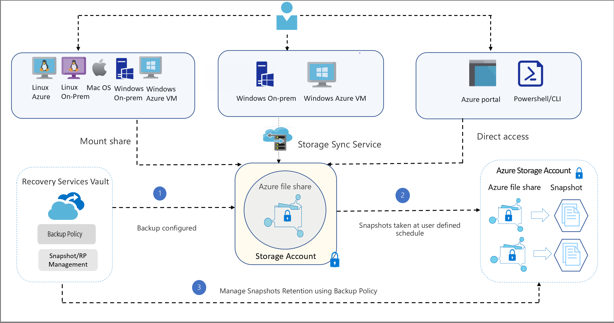

[Azure](https://github.com/magnum31415/wiki/blob/main/azure.md)

# 📂 AZ-104 – Azure File Sync (Teoría + Orden Correcto)

---

# 1️⃣ Teoría que debes saber para el examen AZ-104

## 🔹 ¿Qué es Azure Files?

Azure Files es un servicio que permite crear **file shares en la nube** accesibles vía:

- SMB
- REST

Permite:

- Compartir archivos entre VMs
- Migrar file servers on-prem
- Centralizar datos

---

## 🔹 ¿Qué es Azure File Sync?

Azure File Sync permite:

> Sincronizar un servidor Windows on-premises con un Azure File Share.

Convierte tu Windows Server en:

🗂️ Una **caché local** de un Azure File Share.

---

## 🔹 Arquitectura de Azure File Sync

Componentes clave:

| Componente | Función |
|------------|----------|
| **Azure File Share** | Donde viven los datos en la nube |
| **Storage Sync Service** | Orquesta la sincronización |
| **Sync Group** | Define qué endpoints se sincronizan |
| **Cloud Endpoint** | El Azure File Share dentro del Sync Group |
| **Server Endpoint** | Carpeta específica en el servidor on-prem |
| **Azure File Sync Agent** | Software instalado en Windows Server |

# 📂 Explicación del diagrama – Azure File Sync + Backup

La imagen representa cómo interactúan:

- Clientes (Linux, Windows, Mac, Azure VM)
- Servidores Windows
- Azure File Sync
- Azure File Share
- Storage Account
- Recovery Services Vault
- Snapshots

---

# 🧩 1️⃣ Vista general del diagrama

## Parte superior

### 🔹 Clientes
- Linux (Azure / On-prem)
- MacOS
- Windows (On-prem / Azure VM)

Estos pueden:

👉 Montar directamente el Azure File Share vía SMB  
👉 O acceder a través de un servidor sincronizado

---

### 🔹 Servidores Windows

- Windows On-Prem
- Windows Azure VM

Estos usan:

👉 **Azure File Sync Agent**

Y se conectan al:

👉 **Storage Sync Service**

---

### 🔹 Administración

Se gestiona desde:

- Azure Portal
- PowerShell / CLI

---

# 🧠 2️⃣ Núcleo del sistema

En el centro está:

## 🔐 Storage Account
Dentro:
- Azure File Share

Aquí viven realmente los datos en la nube.

---

# 🔄 3️⃣ Flujo funcional de Azure File Sync

El flujo correcto es:

Azure File Share  
⬇  
Storage Sync Service  
⬇  
Sync Group  
⬇  
Cloud Endpoint  
⬇  
Server Endpoint  
⬇  
Servidor Windows (con agente instalado)

Ahora lo explicamos paso a paso.

---

# 🔹 Paso 1 – Azure File Share

Es el almacenamiento central en Azure.

- Datos viven aquí
- Es la fuente principal
- Es altamente disponible

---

# 🔹 Paso 2 – Storage Sync Service

Es el “orquestador”.

- No almacena datos
- Solo gestiona sincronización
- Controla relaciones entre endpoints

---

# 🔹 Paso 3 – Sync Group

Define la topología.

Un Sync Group contiene:

- 1 Cloud Endpoint (Azure File Share)
- 1 o varios Server Endpoints

Todos los endpoints dentro del grupo se mantienen sincronizados.

---

# 🔹 Paso 4 – Cloud Endpoint

Es:

👉 El Azure File Share dentro del Sync Group.

Representa la parte en la nube.

---

# 🔹 Paso 5 – Server Endpoint

Es:

👉 Una carpeta concreta en el servidor Windows.

Ejemplo:D:\Data

Esa carpeta se sincroniza con el Azure File Share.

---

# 🔹 Paso 6 – Servidor Windows con agente

El agente:

- Detecta cambios locales
- Sincroniza con Azure
- Puede habilitar "cloud tiering"

Cloud tiering significa:

- Solo los archivos más usados permanecen locales
- El resto quedan como placeholders
- Ahorra espacio en disco

---

# 🔐 4️⃣ Parte de Backup (lado izquierdo del diagrama)

Aquí aparece:

## Recovery Services Vault

Se usa para:

- Configurar backup
- Definir políticas
- Gestionar retención
- Controlar snapshots

---

## Flujo de backup

1️⃣ Se configura backup desde el Vault  
2️⃣ Se generan snapshots del Azure File Share  
3️⃣ Se gestiona retención según política  

Importante:

El backup se hace sobre el Azure File Share, no sobre el servidor.

---

# 📸 5️⃣ Snapshots (lado derecho)

Los snapshots:

- Se toman según calendario definido
- Permiten recuperación de archivos
- Están dentro del Storage Account

Son point-in-time copies.

---

# 🎯 Diferencia clave para examen AZ-104

| Concepto | Qué hace |
|----------|----------|
| Azure File Sync | Sincroniza servidores con Azure |
| Azure Files | Almacenamiento SMB en la nube |
| Recovery Services Vault | Gestiona backup y retención |
| Snapshot | Copia puntual del file share |

---

# 🧠 Modelo mental simplificado

Azure File Share = Fuente de verdad  
Storage Sync Service = Coordinador  
Sync Group = Topología  
Server Endpoint = Carpeta local  
Recovery Vault = Backup  

---

# 🚨 Puntos típicos de examen

1. Azure File Sync no reemplaza el file server → lo extiende.
2. El Storage Sync Service no almacena datos.
3. Backup se configura en el Recovery Services Vault.
4. Snapshots se almacenan en el Storage Account.
5. Un servidor solo puede registrarse en un Storage Sync Service.

---

# 🏁 Resumen visual lógico

Usuarios  
⬇  
Servidor Windows (caché local)  
⬇  
Azure File Sync  
⬇  
Azure File Share (fuente real)  
⬇  
Snapshots / Backup gestionado por Vault  

---

Si quieres, te hago un esquema ultra simplificado solo con lo que cae en el examen AZ-104 para memorizar en 2 minutos.

---

# 🧠 Concepto clave de examen

Azure File Sync funciona así:

Azure File Share  
⬇  
Storage Sync Service  
⬇  
Sync Group  
⬇  
Cloud Endpoint  
⬇  
Server Endpoint  
⬇  
Servidor Windows (con agente instalado)

---

# 2️⃣ Análisis de la pregunta

## 📌 Escenario

Tienes:

- File Share en Azure
- Storage Sync Service creado
- Servidor on-prem TDFileServer1
- Quieres sincronizar archivos

---

## 📌 ¿Qué hay que hacer?

Para que un servidor on-prem sincronice con Azure necesitas:

1️⃣ Instalar el agente  
2️⃣ Registrar el servidor  
3️⃣ Crear Sync Group  
4️⃣ Configurar endpoints  

El orden es importante.

---

# 3️⃣ Orden correcto explicado

## ✅ Paso 1 – Deploy the Azure File Sync agent

Primero debes instalar el agente en:

TDFileServer1

Sin el agente el servidor no puede hablar con Azure.

---

## ✅ Paso 2 – Register TDFileServer1 with Storage Sync Service

Esto:

- Establece relación de confianza
- Vincula el servidor al servicio de sincronización

Un servidor solo puede registrarse en un Storage Sync Service.

---

## ✅ Paso 3 – Set up a sync group and configure a cloud endpoint

Aquí defines:

- Qué Azure File Share participa
- Qué grupo de sincronización se crea

El Cloud Endpoint representa el Azure File Share.

---

## ✅ Paso 4 – Create a server endpoint

Aquí defines:

- Qué carpeta local del servidor se sincroniza

Ejemplo:
D:\Shares\Finance

Ese es el Server Endpoint.

---

# 🎯 Orden final correcto

1. Deploy the Azure File Sync agent to TDFileServer1  
2. Register TDFileServer1 with Storage Sync Service  
3. Set up a sync group and configure a cloud endpoint  
4. Create a server endpoint  

---

# 🧩 Por qué ese orden

| Paso | Por qué va aquí |
|------|-----------------|
| Instalar agente | Sin agente no hay comunicación |
| Registrar servidor | Sin registro no puedes crear endpoints |
| Crear sync group | Define la topología |
| Crear server endpoint | Conecta carpeta local al grupo |

---

# 🧠 Regla mental para el examen

Si la pregunta menciona:

- Sincronizar servidor on-prem
- Azure File Share
- File Recovery
- Cache local

👉 Estás en Azure File Sync

Y el orden siempre es:

Agente → Registro → Sync Group → Endpoints

---

# 🔥 Trampa típica de examen

Muchos fallan porque ponen:

Crear Sync Group antes de registrar el servidor.

Eso es incorrecto porque:

No puedes crear un Server Endpoint si el servidor no está registrado.

---

# 🏁 Resumen ultra corto para memorizar

Azure File Sync siempre sigue este patrón:

Instalar → Registrar → Definir Cloud → Definir Server

Si recuerdas eso, esta pregunta nunca la fallas.
