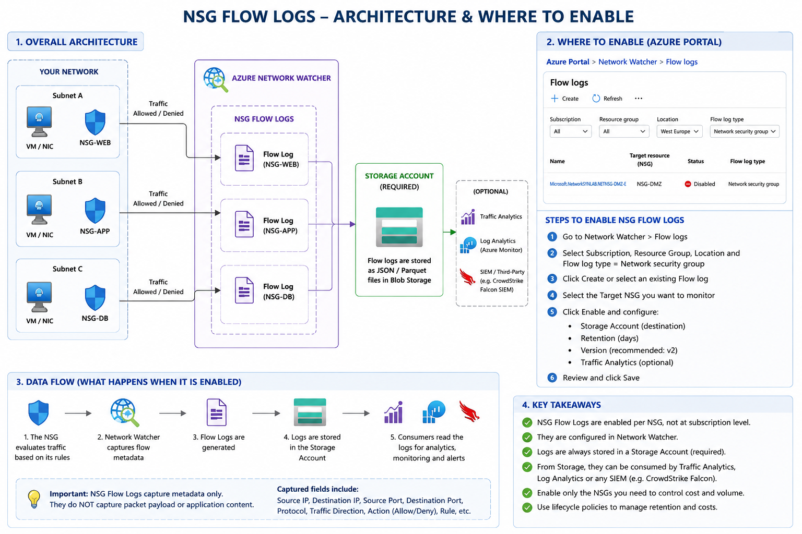

[Azure](https://github.com/magnum31415/wiki/blob/main/azure.md)

# Azure NSG Flow Logs — Technical Overview

## Servicios Azure relacionados con NSG
| Servicio Azure                 | Relación con NSG                |
| ------------------------------ | ------------------------------- |
| Virtual Network (VNet)         | NSG protege VNets/Subnets       |
| Subnet                         | NSG se asocia a subnets         |
| Network Interface (NIC)        | NSG puede asociarse a NICs      |
| Virtual Machines               | Protege VMs                     |
| Azure Kubernetes Service (AKS) | Controla tráfico de nodos/pods  |
| Load Balancer                  | Filtrado tráfico LB             |
| Application Gateway            | Protección backend              |
| Azure Firewall                 | Complementario                  |
| Bastion                        | Control acceso administrativo   |
| VPN Gateway                    | Protección conectividad híbrida |
| ExpressRoute                   | Segmentación/red enterprise     |
| Network Watcher                | Genera NSG Flow Logs            |
| Traffic Analytics              | Analiza Flow Logs               |
| Log Analytics                  | Almacena/análisis logs          |
| Microsoft Sentinel             | SIEM                            |
| CrowdStrike Falcon             | SIEM/XDR integration            |
| Azure Policy                   | Governance NSGs                 |
| Defender for Cloud             | Security recommendations        |
| DDoS Protection                | Protección volumétrica          |
| Application Security Groups    | Agrupación lógica workloads     |





## What are NSG Flow Logs?

Azure NSG Flow Logs are network telemetry logs generated by Azure Network Watcher that record traffic flows processed by a Network Security Group (NSG).

They provide visibility into:

- Source IP
- Destination IP
- Source Port
- Destination Port
- Protocol (TCP/UDP)
- Allowed or Denied traffic
- Direction (Inbound/Outbound)
- Number of packets/bytes
- Flow state

They are mainly used for:

- Security monitoring
- Traffic analysis
- Troubleshooting
- SIEM integration
- Compliance
- Forensics

---

# Important Context (2026)

Microsoft is gradually moving customers away from the classic:

- NSG Flow Logs

towards newer capabilities such as:

- Virtual Network Flow Logs
- Virtual Network TAP
- Enhanced network observability

Therefore, before enabling NSG Flow Logs massively in a new Landing Zone, it is important to validate:

- Long-term Microsoft roadmap
- CrowdStrike compatibility
- Cost implications
- Retention strategy

---

# Architecture

```text
VM/Resource
    ↓
NSG evaluates traffic
    ↓
Network Watcher captures metadata
    ↓
Flow Logs generated
    ↓
Stored in Storage Account
    ↓
(Optional)
Traffic Analytics / Log Analytics / SIEM
```

---

# Requirements

NSG Flow Logs require:

## 1. Network Watcher enabled

Azure automatically creates one per region:

Example:
- NetworkWatcherRG
- NetworkWatcher_westeurope

---

## 2. An NSG

Flow Logs are enabled at NSG level.

Example:
- nsg-prod-app01
- nsg-hub-firewall
- nsg-spoke-web

---

## 3. Storage Account

Logs are stored in a Storage Account.

Recommended:
- GPv2
- Standard
- Cool tier
- Lifecycle management enabled
- Private access only

---

# What information is logged?

Example:

```json
{
  "srcIp": "10.1.1.4",
  "destIp": "52.239.152.12",
  "srcPort": 51524,
  "destPort": 443,
  "protocol": "T",
  "flowState": "B",
  "trafficDecision": "A"
}
```

Meaning:

- T = TCP
- A = Allowed
- D = Denied
- B = Begin Flow

---

# Versions

## Version 1

Basic metadata only.

Not recommended anymore.

---

## Version 2

Recommended.

Adds:
- Throughput
- Packet count
- Byte count
- Better analytics

---

# Retention

Retention can be configured:

Example:
- 7 days
- 30 days
- 90 days

Or managed using Storage Lifecycle Policies.

---

# How to Enable NSG Flow Logs

## Azure Portal

### Step 1

Go to:

```text
Network Watcher
```

---

### Step 2

Select:

```text
NSG flow logs
```

---

### Step 3

Choose:
- Subscription
- Region
- NSG

---

### Step 4

Enable:
- Flow logs = ON
- Version = 2

---

### Step 5

Select:
- Storage Account

Optional:
- Traffic Analytics
- Log Analytics Workspace

---

# Azure CLI Example

```bash
az network watcher flow-log configure \
  --resource-group RG-NETWORK \
  --nsg nsg-prod-app01 \
  --enabled true \
  --version 2 \
  --storage-account mystorageaccount \
  --retention 30
```

---

# Terraform Example

```hcl
resource "azurerm_network_watcher_flow_log" "example" {
  network_watcher_name = "NetworkWatcher_westeurope"
  resource_group_name  = "NetworkWatcherRG"

  network_security_group_id = azurerm_network_security_group.example.id
  storage_account_id        = azurerm_storage_account.logs.id
  enabled                   = true
  version                   = 2

  retention_policy {
    enabled = true
    days    = 30
  }

  traffic_analytics {
    enabled               = true
    workspace_id          = azurerm_log_analytics_workspace.example.workspace_id
    workspace_region      = azurerm_log_analytics_workspace.example.location
    workspace_resource_id = azurerm_log_analytics_workspace.example.id
    interval_in_minutes   = 10
  }
}
```

---

# Traffic Analytics

Optional Azure feature.

Provides:
- Traffic maps
- Hotspots
- Threat visibility
- Top talkers
- Network topology analysis

Requires:
- Log Analytics Workspace

Extra cost applies.

---

# Common Landing Zone Design

## Centralized Model

```text
Spokes
   ↓
NSGs generate logs
   ↓
Central Storage Account
   ↓
Central Log Analytics
   ↓
SIEM / SOC
```

---

# Typical Landing Zone Recommendations

## Usually Recommended

### Enable for:

- Production workloads
- Internet-facing workloads
- Critical applications
- Hub networking
- Shared services
- Firewall subnets

---

## Sometimes NOT recommended for:

- Sandbox subscriptions
- Dev/Test with low criticality
- Very high throughput transient workloads

Reason:
- Cost explosion
- Huge log volume

---

# Cost Components

NSG Flow Logs are NOT free.

Main cost drivers:

## 1. Storage Account

Charged by:
- GB stored
- Transactions
- Retention duration

---

## 2. Traffic Analytics

Charged by:
- GB ingested into Log Analytics

This is usually the expensive part.

---

## 3. SIEM ingestion

Example:
- CrowdStrike
- Sentinel
- Splunk

May generate:
- Additional ingestion costs
- API costs
- Retention costs

---

# Real Cost Impact

Cost depends mainly on:

- Number of NSGs
- Traffic volume
- Retention
- Analytics enabled or not

---

# Example Approximation

## Small Environment

```text
5 NSGs
Low traffic
30-day retention
No analytics

≈ 10–50 €/month
```

---

## Medium Enterprise

```text
50–100 NSGs
Traffic Analytics enabled

≈ 300–1500 €/month
```

---

## Large Enterprise

```text
Hundreds of NSGs
Heavy east-west traffic
SIEM integration

Can become several thousand €/month
```

---

# Risks / Drawbacks

## 1. Cost Explosion

Most common issue.

Especially:
- East-West traffic
- AKS
- Kubernetes
- Large hub-spoke environments

---

## 2. Operational Noise

Huge amount of logs.

Requires:
- Filtering
- Retention strategy
- Governance

---

## 3. Not Packet Inspection

NSG Flow Logs are metadata only.

They do NOT capture:
- Packet payloads
- HTTP content
- TLS content

---

# Security Value

Very useful for:

- Detecting unexpected traffic
- Lateral movement analysis
- Identifying exposed workloads
- Forensics
- Compliance evidence

---

# Relationship with Azure Firewall

Important:

NSG Flow Logs ≠ Azure Firewall Logs

They complement each other.

## NSG Flow Logs

Visibility:
- NSG decisions

Good for:
- Subnet/workload visibility

---

## Azure Firewall Logs

Visibility:
- Central firewall traffic
- Application rules
- DNAT
- Threat intel

Good for:
- Centralized perimeter control

---

# Landing Zone Governance Approach

Typical enterprise approach:

## Audit First

Enable only:
- Critical subscriptions
- Critical NSGs

Measure:
- Cost
- Volume
- Value

---

## Then Standardize

Later:
- Azure Policy
- Mandatory diagnostics
- Centralized logging

---

# Azure Policy Possibility

Can enforce:

- NSG Flow Logs enabled
- Required retention
- Central storage account
- Mandatory analytics

Usually:
- Audit first
- Then DeployIfNotExists
- Finally Deny

---

# Important Design Questions Before Enabling

## 1. Which subscriptions?

---

## 2. Which NSGs?

All?
Only production?
Only internet-facing?

---

## 3. Centralized or decentralized logging?

---

## 4. Retention period?

---

## 5. Analytics enabled?

---

## 6. SIEM integration path?

CrowdStrike?
Sentinel?
Splunk?

---

## 7. Estimated ingestion volume?

Critical for FinOps.

---

# My Technical Recommendation

For a brownfield Azure Landing Zone:

## Recommended approach

```text
1. Pilot first
2. Enable only critical NSGs
3. Version 2 only
4. Central Storage Account
5. Short retention initially
6. Measure ingestion
7. Evaluate Traffic Analytics necessity
8. Validate Microsoft roadmap vs VNet Flow Logs
9. Define governance through Azure Policy
```

---

# Useful Azure Resources

## Azure Docs

- Network Watcher
- NSG Flow Logs
- Traffic Analytics
- Azure Monitor
- Virtual Network Flow Logs

---

# Short Summary

## NSG Flow Logs provide:

- Network visibility
- Security telemetry
- Traffic metadata

---

## But:

- Can become expensive
- Generate massive data volume
- Need governance
- Need retention strategy
- Need observability architecture

---

# Key Strategic Point

For modern Azure Landing Zones:

```text
Network observability should be:
- centralized
- governed
- policy-driven
- cost-controlled
- SIEM-integrated
```
