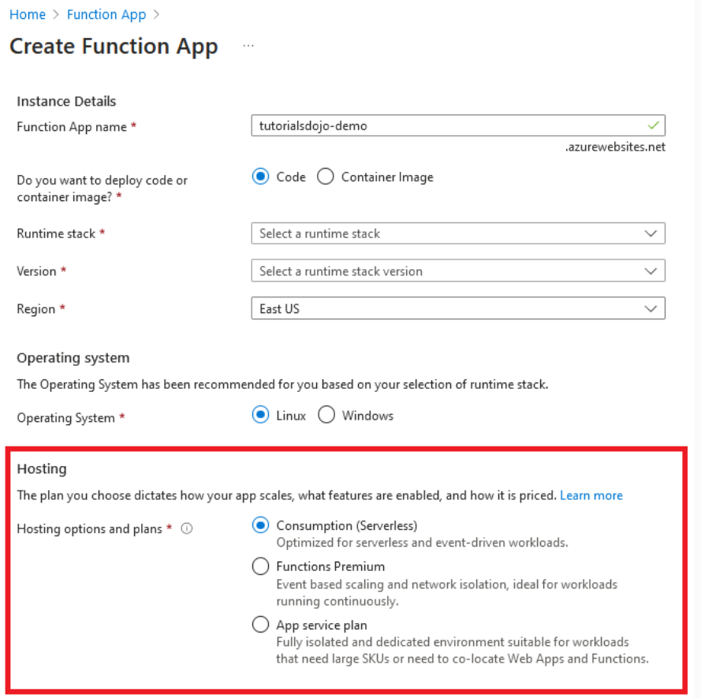
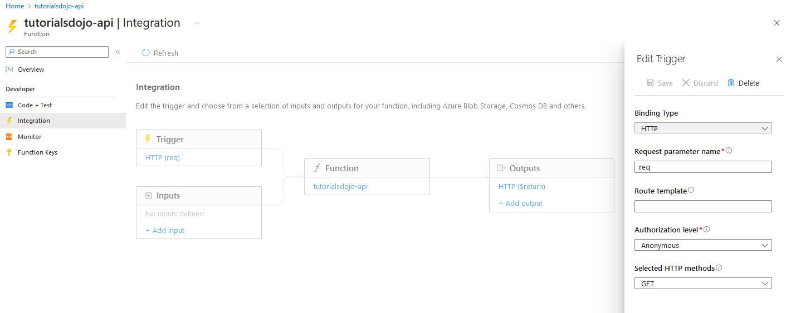

[Azure](https://github.com/magnum31415/wiki/blob/main/azure.md)
# Azure Functions

# 📑 Índice

1. [Azure Functions](#azure-functions)

2. [Planes de Hosting (MUY IMPORTANTE EN EXAMEN)](#-planes-de-hosting-muy-importante-en-examen)
   - [Consumption Plan (Serverless puro)](#1️⃣-consumption-plan-serverless-puro)
   - [Premium Plan](#2️⃣-premium-plan)
   - [Dedicated (App Service Plan)](#3️⃣-dedicated-app-service-plan)

3. [Triggers comunes](#-triggers-comunes)

4. [Niveles de autorización (HTTP Trigger)](#niveles-de-autorización-http-trigger)

5. [Métodos de autenticación adicionales](#-métodos-de-autenticación-adicionales)
   - [Function Keys](#1️⃣-function-keys)
   - [Master Key](#2️⃣-master-key)
   - [Azure AD (Microsoft Entra ID)](#3️⃣-azure-ad-microsoft-entra-id--recomendado)
   - [Managed Identity](#4️⃣-managed-identity)

6. [Comparativa rápida para examen](#comparativa-rápida-para-examen)

--- 

Azure Functions es un servicio serverless compute que permite ejecutar código en respuesta a eventos sin gestionar infraestructura.

- Escalado automático
- Basado en eventos (event-driven)
- Pago por ejecución (según plan)
- Soporta múltiples lenguajes (C#, Java, Python, Node.js, PowerShell, etc.)

## 🔷 Planes de Hosting (MUY IMPORTANTE EN EXAMEN)

1. Consumption Plan (Serverless puro)
2. Premium Plan
3. Dedicated (App Service Plan)

### 1️⃣ Consumption Plan (Serverless puro)

- Escala automáticamente
- Pago por ejecución
- Ideal para cargas intermitentes

**Especificaciones:**

- ⏱ Tiempo máximo ejecución: 5 min (por defecto) / hasta 10 min configurando
- 🌐 Acceso VNet: ❌ No directo (limitado)
- 🔄 Cold start: Sí
- 💰 Más barato para cargas esporádicas

**Cuándo usarlo:**

- Procesamiento por eventos
- APIs poco frecuentes
- Webhooks

### 2️⃣ Premium Plan

- Escalado automático
- Sin cold start
- Instancias pre-warmed

**Especificaciones:**

- ⏱ Tiempo máximo ejecución: Ilimitado (prácticamente)
- 🌐 Acceso VNet: ✅ Sí
- 🔄 Cold start: ❌ No
- 💰 Más caro que Consumption

**Cuándo usarlo:**

- Necesitas VNet
- Necesitas ejecución larga
- APIs críticas

### 3️⃣ Dedicated (App Service Plan)

- Corre sobre App Service Plan
- Instancias siempre activas

**Especificaciones:**

- ⏱ Tiempo máximo ejecución: Ilimitado
- 🌐 Acceso VNet: ✅ Sí
- 🔄 Cold start: ❌ No
- 💰 Pagas instancia siempre activa

**Cuándo usarlo:**

- Ya tienes App Service Plan
- Necesitas control total de recursos

### 🔷 Triggers comunes

- HTTP Trigger
- Timer Trigger
- Blob Trigger
- Queue Trigger
- Event Grid Trigger
- Service Bus Trigger
- Cosmos DB Trigger

## Niveles de autorización (HTTP Trigger)

Cuando configuras un HTTP Trigger, defines el nivel de autorización.
- 👉 Por defecto es function.

| Nivel         | Requiere API Key    | Uso típico                  |
| ------------- | ------------------- | --------------------------- |
| **anonymous** | ❌ No                | Endpoint público            |
| **function**  | ✅ Sí (function key) | APIs protegidas básicas     |
| **admin**     | ✅ Master key        | Operaciones administrativas |

## 🔷 Métodos de autenticación adicionales

Además del Authorization Level:

### 1️⃣ Function Keys

- Claves por función
- Compartibles
- No muy seguras para entornos críticos

### 2️⃣ Master Key

- Acceso total a todas las funciones
- Solo administración

### 3️⃣ Azure AD (Microsoft Entra ID) ✅ RECOMENDADO

- OAuth 2.0 / OpenID Connect
- Tokens JWT
- Control granular
- Ideal para producción

### 4️⃣ Managed Identity

- Permite a la Function acceder a otros recursos Azure sin secretos
- Muy usado para:
  - Acceder a Key Vault
  - Acceder a Storage
  - Acceder a SQL

## Comparativa rápida para examen

| Requisito               | Plan correcto       |
| ----------------------- | ------------------- |
| Pago por ejecución      | Consumption         |
| Ejecución larga         | Premium / Dedicated |
| Acceso VNet             | Premium / Dedicated |
| Evitar cold start       | Premium             |
| Coste mínimo esporádico | Consumption         |

