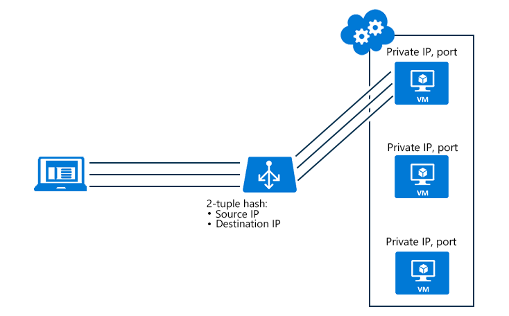

# Azure Public Load Balancer – Resumen para AZ-104

## 📌 ¿Qué es Azure Public Load Balancer?

Es un balanceador de carga **Layer 4 (TCP/UDP)** que:

- Distribuye tráfico **entrante desde Internet** hacia varias **VMs** en un *backend pool*.
- Puede proporcionar **conectividad saliente (outbound)** usando **SNAT**.

---

## 🏗 Componentes principales

Para que funcione necesitas:

- **Frontend IP** (normalmente una Public IP)
- **Backend pool** (VMs o NICs)
- **Load balancing rule** (regla que mapea puerto/protocolo frontend → backend)
- **Health probe** (verifica si una VM está saludable)

---

## 🌍 SNAT (Source Network Address Translation)

- Traduce **IP privada → IP pública**
- Permite que VMs sin IP pública tengan **salida a Internet**
- Muy importante en escenarios outbound

📌 Punto de examen:  
El Load Balancer puede proporcionar conectividad outbound mediante SNAT.

---

# 🔎 Health Probes

- Determinan si una VM está **healthy**
- Si una VM falla el probe → deja de recibir tráfico
- Tipos comunes:
  - TCP
  - HTTP/HTTPS

❗ Importante para examen:
- **Health probe NO controla la afinidad de sesión**
- Solo decide si la instancia puede recibir tráfico

---

# 🔁 Session Persistence (Session Affinity)

También conocida como:

- Session persistence
- Client IP affinity
- Source IP affinity

Permite que un cliente sea dirigido **siempre a la misma VM** (mientras esté saludable).

---

## 🎯 Modos de configuración

### 1️⃣ None
- No hay persistencia
- Cada conexión puede ir a cualquier VM saludable

---

### 2️⃣ Client IP (2-tuple)

Hash basado en:
- Source IP
- Destination IP

✔ Misma IP cliente → misma VM

📌 Respuesta típica de examen cuando piden mantener usuario en misma VM.

---

### 3️⃣ Client IP and Protocol (3-tuple)

Hash basado en:
- Source IP
- Destination IP
- Protocol (TCP/UDP)

✔ Misma IP + mismo protocolo → misma VM

---

# 🧠 Cuándo usar Session Persistence

Usar cuando:

- La aplicación guarda estado de sesión en memoria local
- No se usa almacenamiento distribuido (Redis, SQL, etc.)
- Se necesitan **sticky sessions**

---

# ⚠️ Errores comunes en el examen

❌ Elegir **Health Probe** para mantener sesiones  
❌ Elegir **None** cuando se necesita persistencia  
❌ Pensar que “hash-based” sin persistence garantiza misma VM  

✔ Si el requisito es:
> "El usuario debe conectarse siempre a la misma VM"

La respuesta correcta suele ser:
**Session persistence: Client IP**

---

# 📝 Resumen ultra rápido (para memorizar)

- Load Balancer = L4 (TCP/UDP)
- Health probe = detecta salud
- SNAT = outbound con IP pública
- Session persistence = mantiene usuario en misma VM
- Respuesta típica examen = **Client IP (2-tuple)**
