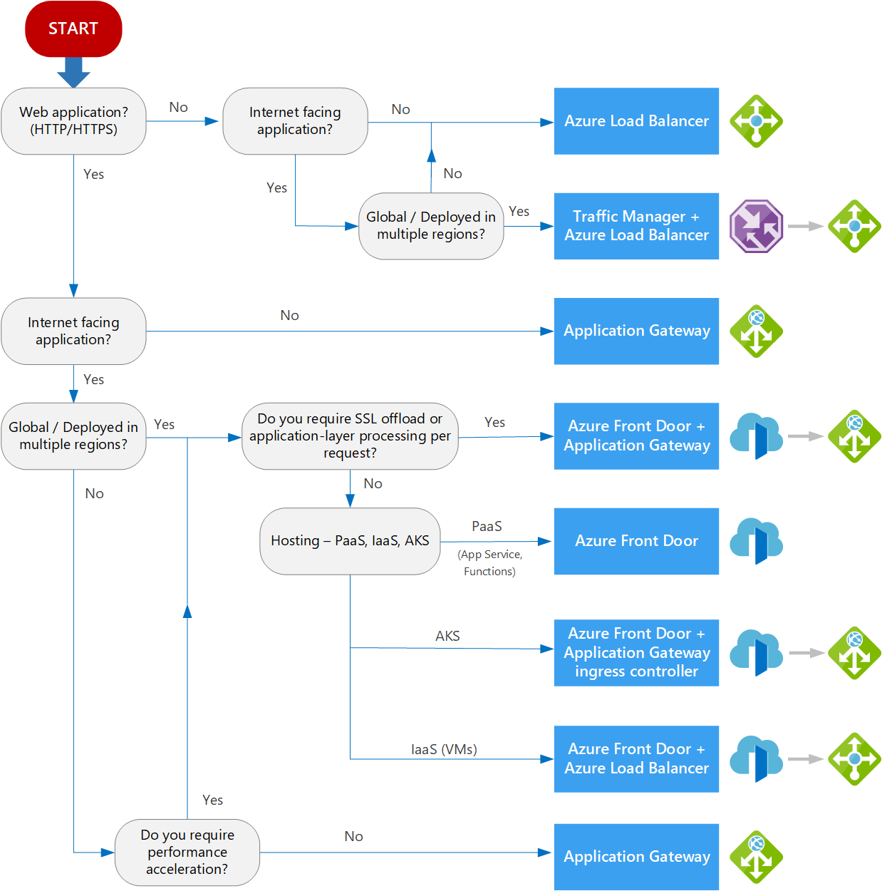
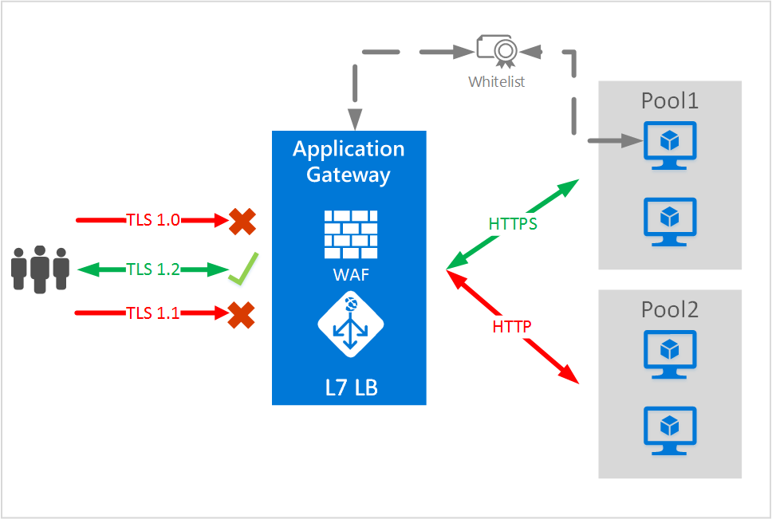

 Documento principal: [Azure](https://github.com/magnum31415/wiki/blob/main/azure.md)

# Índice – Load Balancing en Azure

## 📌 Contenido

- [LoadBalancer](#loadbalancer)
  - [¿Qué Load Balancer usar en Azure?](#qué-load-balancer-usar-en-azure)
  - [Comparativa Load Balancing en Azure (Referencia AZ-305)](#-comparativa-load-balancing-en-azure-referencia-az-305)
  - [Árbol de decisión – ¿Qué servicio elegir?](#-árbol-de-decisión--qué-servicio-elegir)
  - [Azure Application Gateway](#azure-application-gateway)
  - [SSL Termination](#ssl-termination)
  - [Azure Front Door – Tiers y Características (AZ-305)](#azure-front-door--tiers-y-características-az-305)
    - [Tiers disponibles](#tiers-disponibles)
    - [Tabla comparativa](#tabla-comparativa)
    - [Diferencia clave para examen](#diferencia-clave-para-examen)
    - [Regla mental rápida](#regla-mental-rápida)


# LoadBalancer

## ¿Qué Load Balancer usar en Azure?

| Si necesitas…             | Usa…                      |
| ------------------------- | ------------------------- |
| Global + Web inteligente  | **Azure Front Door**      |
| Global + solo DNS routing | **Traffic Manager**       |
| Regional + Web + WAF      | **Application Gateway**   |
| Regional + TCP/UDP        | **Azure Load Balancer**   |
| Insertar Firewall/NVA     | **Gateway Load Balancer** |
| Gestionar APIs            | **API Management**        |

---

## 🔷 Comparativa Load Balancing en Azure (Referencia AZ-305)

| Característica | L4 Load Balancer (Standard) | Internal Load Balancer (ILB) | Application Gateway (L7) | Azure Front Door | Traffic Manager | Gateway Load Balancer |
|----------------|-----------------------------|------------------------------|--------------------------|------------------|-----------------|-----------------------|
| Capa OSI | L4 (TCP/UDP) | L4 (TCP/UDP) | L7 (HTTP/HTTPS) | L7 Global | DNS (no OSI clásico) | L3/L4 |
| Ámbito | Regional | Regional | Regional | Global | Global | Regional |
| Público / Interno | Ambos | Interno | Ambos | Público | Público | Interno |
| Port forwarding | ✅ | ✅ | ❌ | ❌ | ❌ | ❌ |
| HTTPS health probe | ✅ | ❌ (TCP/HTTP) | ✅ | ✅ | ✅ (HTTP/HTTPS) | ❌ |
| URL-based routing | ❌ | ❌ | ✅ | ✅ | ❌ | ❌ |
| Path-based routing | ❌ | ❌ | ✅ | ✅ | ❌ | ❌ |
| Host-based routing | ❌ | ❌ | ✅ | ✅ | ❌ | ❌ |
| WAF | ❌ | ❌ | ✅ | ✅ | ❌ | ❌ |
| SSL termination | ❌ | ❌ | ✅ | ✅ | ❌ | ❌ |
| Global failover | ❌ | ❌ | ❌ | ✅ | ✅ | ❌ |
| Multi-region routing | ❌ | ❌ | ❌ | ✅ | ✅ | ❌ |
| Backend pool | VM / VMSS / AS | VM / VMSS / AS | VM / VMSS / App Service | Regional endpoints | DNS endpoints | NVAs (firewalls, appliances) |
| Protección SQL injection | ❌ | ❌ | ✅ (WAF) | ✅ (WAF) | ❌ | ❌ |
| Escalado automático | Sí | Sí | Sí | Sí | Sí | Sí |
| CDN / Edge caching | ❌ | ❌ | ❌ | ✅ | ❌ | ❌ |
| Backend típico | VM / VMSS | Aplicaciones privadas, AD, SQL, APIs internas | Web Apps / APIs | Multi-región | Endpoints regionales | NVAs |
| Accesible desde Internet | ✅ (si tiene Frontend público) | ❌ | ✅ (si tiene Frontend público) | ✅ | ✅ | ❌ |
| IP Frontend | Pública o privada | Solo privada | Pública o privada | Pública global | DNS | Transparente |

---




````
¿Necesitas balanceo GLOBAL entre varias regiones?
│
├── Sí →
│     │
│     ├── ¿Necesitas routing HTTP/HTTPS inteligente (L7), WAF,
│     │   SSL offload, path-based routing?
│     │
│     │       ├── Sí → Azure Front Door
│     │       │       ├── Capa: L7 (HTTP/HTTPS)
│     │       │       ├── Alcance: Global (multi-región)
│     │       │       ├── Tipo: Anycast global
│     │       │       ├── Failover: Automático entre regiones
│     │       │
│     │       │       ├── SKUs:
│     │       │       │
│     │       │       │   ├── Basic
│     │       │       │   │       ├── Routing L7: Sí
│     │       │       │   │       ├── SSL offload: Sí
│     │       │       │   │       ├── WAF: ❌ No
│     │       │       │   │       ├── Private Link backend: ❌ No
│     │       │       │   │       ├── Rules Engine avanzado: Limitado
│     │       │       │   │       └── Uso típico:
│     │       │       │           Apps web globales simples
│     │       │       │           Balanceo multi-región sin requisitos avanzados
│     │       │       │
│     │       │       │   └── Premium
│     │       │       │           ├── Routing L7: Sí
│     │       │       │           ├── SSL offload: Sí
│     │       │       │           ├── WAF: ✅ Sí (integrado)
│     │       │       │           ├── Private Link backend: ✅ Sí
│     │       │       │           ├── Rules Engine avanzado: Sí
│     │       │       │           ├── Bot protection: Sí
│     │       │       │           └── Uso típico:
│     │       │       │               SaaS enterprise
│     │       │       │               Exposición segura de backends privados
│     │       │       │               Requisitos avanzados de seguridad
│     │       │
│     │       │       └── Resumen examen:
│     │       │               Seguridad avanzada / WAF / Private Link → Premium
│     │       │               Solo balanceo global HTTP básico → Basic
│     │
│     │       └── No →
│     │              ¿Solo necesitas decidir a qué región enviar tráfico?
│     │
│     │              └── Sí → Traffic Manager
│     │                      ├── Capa: DNS
│     │                      ├── Alcance: Global
│     │                      ├── Tipo: DNS routing
│     │                      ├── Failover: Basado en DNS
│     │                      ├── Modos:
│     │                      │       Priority
│     │                      │       Weighted
│     │                      │       Performance
│     │                      │       Geographic
│     │                      └── Uso típico:
│     │                              DR entre regiones
│     │                              Routing geográfico simple
│
└── No (solo una región) →
      │
      ├── ¿Es tráfico HTTP/HTTPS (web)?
      │
      │       ├── Sí →
      │       │      ¿Necesitas WAF o routing por path/host?
      │       │
      │       │      ├── Sí → Application Gateway
      │       │      │       ├── Capa: L7
      │       │      │       ├── Alcance: 1 región
      │       │      │       ├── WAF: Sí
      │       │      │       ├── SSL termination: Sí
      │       │      │       └── Uso típico:
      │       │      │               Aplicaciones web regionales
      │       │      │               Protección OWASP
      │       │
      │       │      └── No →
      │       │             Azure Load Balancer
      │       │             ├── Capa: L4 (TCP/UDP)
      │       │             ├── Alcance: 1 región
      │       │             ├── WAF: No
      │       │             └── Uso típico:
      │       │                     Web simple sin WAF
      │       │                     Balanceo básico TCP
      │
      └── ¿Es tráfico no HTTP? (TCP/UDP puro)
              │
              └── Azure Load Balancer
                      ├── Capa: L4
                      ├── Interno o Público
                      ├── Standard SKU recomendado
                      └── Uso típico:
                              VMs
                              SQL
                              RDP
                              Servicios backend

¿Necesitas insertar un firewall/NVA en medio del tráfico?
│
└── Sí → Gateway Load Balancer
        ├── Capa: L3/L4
        ├── Alcance: 1 región
        ├── Función: Inserta NVAs (firewalls, IDS)
        └── Uso típico:
                Arquitecturas con appliances de seguridad

¿Estás exponiendo APIs como producto?
│
└── Sí → API Management
        ├── Capa: L7
        ├── Alcance: 1 región (multi-región con despliegue adicional)
        ├── Función: Gestión de APIs
        ├── Incluye:
        │       Throttling
        │       Autenticación
        │       Versionado
        └── Uso típico:
                API gateway empresarial
                Monetización de APIs

````

---


**Azure Application Gatewa**y is a web traffic load balancer that enables you to manage traffic to your web applications. Traditional load balancers operate at the transport layer (OSI layer 4 – TCP and UDP) and route traffic based on source IP address and port, to a destination IP address and port. Application Gateway can make routing decisions based on additional attributes of an HTTP request, for example, URI path or host headers.



SSL termination refers to the process of decrypting encrypted traffic before passing it along to a web server. TLS is just an updated, more secure version of SSL. An SSL connection sends encrypted data between a user and a web server by using a certificate for authentication. SSL termination helps speed up the decryption process and reduces the processing burden on the servers.

Azure Application Gateway is specifically designed to offer advanced routing capabilities, SSL offloading (which alleviates the load on web servers), and autoscaling features to efficiently handle varying traffic loads.
**Azure Front Door** . Although it supports SSL offloading, this service is not a load balancer. Azure Front Door is a global, scalable entry-point that uses the Microsoft global edge network to create fast, secure, and widely scalable web applications.


# Azure Front Door – Tiers y Características (AZ-305)

## Tiers disponibles
- Standard
- Premium
(Front Door Classic está en retirada y no es foco actual de examen)

---

## Tabla comparativa

| Característica | Standard | Premium |
|---------------|----------|----------|
| Global HTTP/HTTPS Load Balancing | ✅ | ✅ |
| Anycast global | ✅ | ✅ |
| Health probes automáticos | ✅ | ✅ |
| Path-based routing | ✅ | ✅ |
| Host-based routing | ✅ | ✅ |
| Redirecciones / Rewrites | ✅ | ✅ |
| Rules Engine | ✅ | ✅ |
| CDN integrado (edge caching) | ✅ | ✅ |
| Compresión | ✅ | ✅ |
| TLS termination | ✅ | ✅ |
| Certificados gestionados | ✅ | ✅ |
| WAF | ✅ | ✅ |
| Private Link hacia backend | ❌ | ✅ |
| Soporte para backend privado (App Service privado, AKS privado, etc.) | ❌ | ✅ |

---

## Diferencia clave para examen

### Standard
- Aplicaciones públicas globales
- CDN + WAF + Global Load Balancer
- Backend público

### Premium
- Todo lo anterior
- Soporte Private Link
- Backend privado (no expuesto a Internet)
- Arquitectura Zero Trust

---

## Regla mental rápida

Standard = Web pública global + CDN + WAF  
Premium = Standard + Private Link (backend privado)

