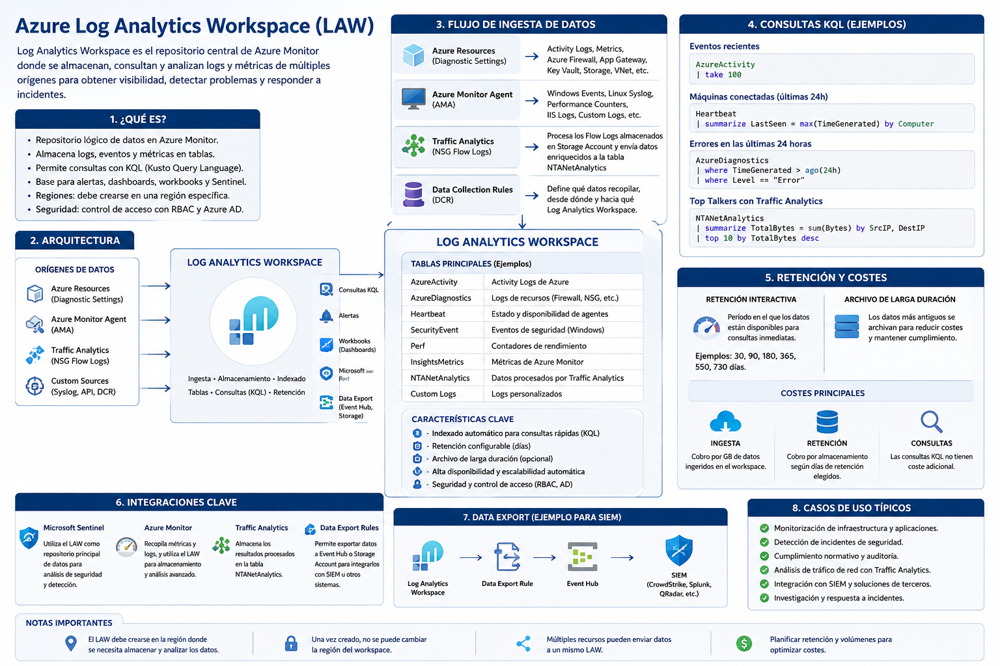

[Azure](https://github.com/magnum31415/wiki/blob/main/azure.md)

# Azure Log Analytics Workspace (LAW)





## ¿Qué es un Log Analytics Workspace?

Un Log Analytics Workspace (LAW) es el repositorio central de Azure Monitor donde se almacenan logs, eventos y métricas procedentes de recursos Azure, sistemas operativos, aplicaciones y servicios externos.

Permite:

- Centralizar información de monitorización.
- Realizar consultas mediante Kusto Query Language (KQL).
- Crear alertas.
- Generar dashboards y workbooks.
- Integrarse con Microsoft Sentinel.
- Exportar datos a Event Hub, Storage Account u otros sistemas.

---

# Arquitectura

```text
Azure Resources
       │
       ▼
Azure Monitor
       │
       ▼
Log Analytics Workspace
       │
       ├── KQL Queries
       ├── Alerts
       ├── Workbooks
       ├── Sentinel
       └── Data Export Rules
```

---

# Componentes principales

## Workspace

Es el contenedor lógico que almacena los datos.

Características:

- Región Azure específica.
- Retención configurable.
- Control de acceso mediante RBAC.
- Tablas de datos organizadas por tipo.

Ejemplo:

```text
law-prod-weu-001
```

---

## Tablas

Los datos se almacenan en tablas.

Ejemplos habituales:

| Tabla | Descripción |
|---------|---------|
| AzureActivity | Activity Logs |
| Heartbeat | Estado de máquinas |
| SecurityEvent | Eventos de seguridad |
| Perf | Métricas de rendimiento |
| InsightsMetrics | Métricas de Azure Monitor |
| NTANetAnalytics | Traffic Analytics |
| AzureDiagnostics | Diagnósticos Azure |

---

# Ingesta de datos - Flujo de datos

Los datos pueden llegar al Log Analytics Workspace desde múltiples orígenes.

## 1. Azure Resources mediante Diagnostic Settings

- Virtual Machines
- Azure Firewall
- Application Gateway
- Key Vault
- Storage Accounts
- Virtual Networks
- VPN Gateway
- ExpressRoute
- Azure Bastion
- Azure Kubernetes Service (AKS)

```text
Azure Resource
      │
      ▼
Diagnostic Settings
      │
      ▼
Log Analytics Workspace
```

---

## 2. Azure Monitor Agent (AMA)

Instalado en:

- Windows
- Linux
- Azure Arc Servers

```text
Operating System
       │
       ▼
Azure Monitor Agent
       │
       ▼
Log Analytics Workspace
```

---

## 3. Traffic Analytics

Traffic Analytics procesa los NSG Flow Logs almacenados en una Storage Account y genera registros enriquecidos que posteriormente se almacenan en el Log Analytics Workspace.

```text
NSG Flow Logs
      │
      ▼
Storage Account
      │
      ▼
Traffic Analytics
      │
      ▼
Log Analytics Workspace
      │
      ▼
NTANetAnalytics
```

Los datos procesados por Traffic Analytics se almacenan principalmente en la tabla:

```text
NTANetAnalytics
```

---

## 4. Data Collection Rules (DCR)

Las DCR permiten recopilar:

- Eventos Windows
- Syslog Linux
- Performance Counters
- Custom Logs
- Prometheus Metrics

```text
Data Source
      │
      ▼
DCR
      │
      ▼
Log Analytics Workspace
```

---

# Consultas KQL

KQL (Kusto Query Language) es el lenguaje utilizado para consultar los datos.

## Ver eventos recientes

```kusto
AzureActivity
| take 100
```

---

## Máquinas conectadas

```kusto
Heartbeat
| summarize LastSeen=max(TimeGenerated)
by Computer
```

---

## Errores en las últimas 24 horas

```kusto
AzureDiagnostics
| where TimeGenerated > ago(24h)
| where Level == "Error"
```

---

# Retención de datos

## Retención interactiva

Período durante el cual los datos están disponibles para consultas inmediatas.

Valores habituales:

- 30 días
- 90 días
- 180 días
- 730 días

---

## Archivo de larga duración

Los datos antiguos pueden archivarse para reducir costes.

```text
Interactive Retention
          +
Long Term Archive
```

---

# Costes

Azure cobra principalmente por:

## Ingesta

Cantidad de datos recibidos.

Ejemplo:

```text
50 GB/día
```

Facturación basada en GB ingeridos.

---

## Retención

Almacenamiento de datos más allá del período incluido.

---

## Consultas

Normalmente las consultas no tienen coste adicional.

---

# Data Collection Rules (DCR)

Las DCR controlan:

- Qué datos se recopilan.
- Desde dónde.
- Hacia qué Workspace.

Ejemplo:

```text
Azure Monitor Agent
         │
         ▼
Data Collection Rule
         │
         ▼
Log Analytics Workspace
```

---

# Azure Monitor Agent (AMA)

Agente moderno de Microsoft.

Sustituye a:

- Log Analytics Agent (MMA)
- OMS Agent

Funciones:

- Recopilar logs.
- Recopilar métricas.
- Enviar información a LAW.

---

# Relación con Azure Monitor

Azure Monitor utiliza Log Analytics Workspace como almacenamiento.

```text
Azure Monitor
      │
      ▼
Log Analytics Workspace
```

Azure Monitor:

- Recopila datos.
- Genera métricas.
- Dispara alertas.

LAW:

- Almacena datos.
- Permite consultas.

---

# Relación con Microsoft Sentinel

Microsoft Sentinel necesita un LAW.

```text
Sentinel
    │
    ▼
Log Analytics Workspace
```

Sentinel analiza los datos almacenados en el Workspace.

---

# Relación con Traffic Analytics

```text
NSG Flow Logs
       │
       ▼
Storage Account
       │
       ▼
Traffic Analytics
       │
       ▼
Log Analytics Workspace
       │
       ▼
NTANetAnalytics
```

Traffic Analytics utiliza un LAW para almacenar los resultados procesados.

---

# Alertas

Las Alert Rules pueden ejecutar acciones cuando una consulta devuelve resultados.

Ejemplo:

```kusto
Heartbeat
| summarize LastSeen=max(TimeGenerated)
by Computer
| where LastSeen < ago(15m)
```

Si una máquina deja de reportar durante 15 minutos:

```text
Alert Rule
      │
      ▼
Action Group
      │
      ├── Email
      ├── SMS
      ├── Webhook
      └── Logic App
```

---

# Workbooks

Permiten crear paneles visuales.

Ejemplos:

- Estado de servidores.
- Azure Firewall.
- Network Monitoring.
- Traffic Analytics.
- Costes.

---

# Data Export Rules

Permiten exportar datos automáticamente.

Destinos soportados:

- Event Hub
- Storage Account

Ejemplo:

```text
Log Analytics Workspace
          │
          ▼
Data Export Rule
          │
          ▼
Event Hub
          │
          ▼
SIEM
```

Caso típico:

```text
LAW
 │
 ▼
Event Hub
 │
 ▼
CrowdStrike NG-SIEM
```

---

# Casos de uso habituales AZ-104

## Centralizar logs

```text
VMs
Storage
Key Vault
Firewall
       │
       ▼
Log Analytics Workspace
```

---

## Monitorización de servidores

```kusto
Heartbeat
Perf
Event
```

---

## Azure Firewall Monitoring

```kusto
AzureDiagnostics
```

---

## Traffic Analytics

```kusto
NTANetAnalytics
```

---

## Sentinel

```text
Workspace + Sentinel
```

---

# Preguntas típicas de examen

## ¿Azure Monitor y Log Analytics Workspace son lo mismo?

No.

Azure Monitor recopila y procesa datos.

Log Analytics Workspace almacena los datos.

---

## ¿Puede existir Azure Monitor sin LAW?

Sí.

Las métricas pueden visualizarse directamente.

Sin embargo, muchas funcionalidades avanzadas requieren un Workspace.

---

## ¿Puede Sentinel funcionar sin LAW?

No.

Sentinel necesita obligatoriamente un Log Analytics Workspace.

---

## ¿Traffic Analytics necesita LAW?

Sí.

Traffic Analytics almacena los resultados procesados en el Workspace.

---

## ¿Puede exportarse información del LAW a Event Hub?

Sí.

Mediante Data Export Rules.

---

# Resumen rápido

| Concepto | Función |
|-----------|----------|
| Azure Monitor | Plataforma de monitorización |
| Log Analytics Workspace | Almacenamiento de logs |
| KQL | Lenguaje de consulta |
| AMA | Agente de recopilación |
| DCR | Define qué recopilar |
| Alert Rule | Detecta condiciones |
| Action Group | Ejecuta acciones |
| Workbook | Visualización |
| Sentinel | SIEM basado en LAW |
| Traffic Analytics | Analiza NSG Flow Logs |
| NTANetAnalytics | Tabla generada por Traffic Analytics |
| Data Export Rule | Exporta datos a Event Hub o Storage |
