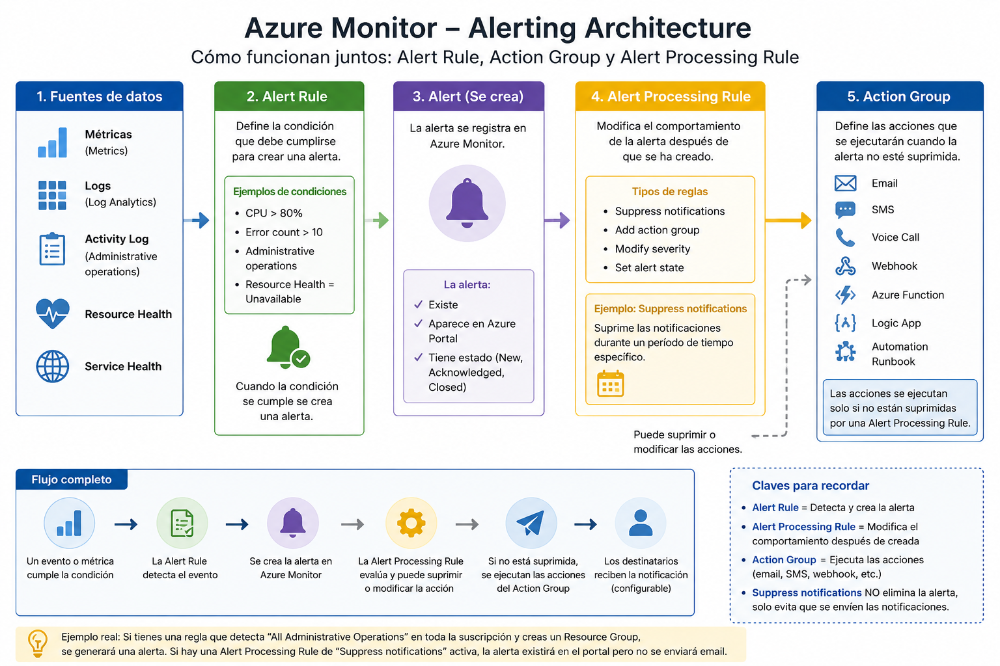

[Azure](https://github.com/magnum31415/wiki/blob/main/azure.md)

# Azure Monitor Alerts and Alert Processing Rules (AZ-104)



## Conceptos básicos

En Azure Monitor intervienen tres componentes principales:

1. Alert Rule
2. Alert
3. Alert Processing Rule
4. Action Group

Es fundamental distinguir claramente su función, ya que es una pregunta muy habitual en el AZ-104.

---

# Arquitectura

| Elemento                  | Función                                                 | ¿Lo configuras? |
| ------------------------- | ------------------------------------------------------- | --------------- |
| **Alert Rule**            | Detecta eventos y crea alertas                          | ✅ Sí            |
| **Alert**                 | Representa la alerta creada (New, Acknowledged, Closed) | ❌ No            |
| **Alert Processing Rule** | Modifica el tratamiento de una alerta ya creada         | ✅ Sí            |
| **Action Group**          | Ejecuta acciones (Email, SMS, Webhook, Logic App...)    | ✅ Sí            |


```text
                 Event / Metric / Log
                          │
                          ▼
                    1. Alert Rule
                   (detecta el evento)
                          │
                          ▼
                   2. Alert Created
              (la alerta existe y aparece
                 en Azure Monitor)
                          │
                          ▼
              3. Alert Processing Rule
          (suprime o modifica acciones)
                          │
                          ▼
                  4. Action Group
          (Email, SMS, Webhook, etc.)
```

---

## Alert Rule

Una Alert Rule es la encargada de detectar un evento o condición y generar una alerta.

Puede basarse en:

- Metrics
- Logs
- Activity Log
- Resource Health
- Service Health

Ejemplo:

```text
Condition:
CPU > 80%
        │
        ▼
Alert Created
```

Otro ejemplo:

```text
Condition:
Administrative Operation
        │
        ▼
Create Resource Group
        │
        ▼
Alert Created
```
**Alert Rule tiene estos componentes obligatorios:**

| Campo                | ¿Obligatorio?              | Descripción                                                                    |
| -------------------- | -------------------------- | ------------------------------------------------------------------------------ |
| **Name**             | ✅ Sí                       | Nombre de la alerta.                                                           |
| **Scope**            | ✅ Sí                       | Recursos sobre los que se evalúa la alerta.                                    |
| **Condition**        | ✅ Sí                       | La condición que dispara la alerta (métrica, log o evento administrativo).     |
| **Action Group**     | ❌ No                       | Acción que se ejecuta cuando se dispara la alerta (email, SMS, webhook, etc.). |
| **Severity**         | ✅ Sí                       | Nivel de severidad (Sev 0 a Sev 4).                                            |
| **Description**      | ❌ No                       | Descripción opcional.                                                          |
| **Enabled/Disabled** | ❌ No (por defecto Enabled) | Indica si la regla está activa.                                                |


---
## Alert

Aquí realmente no configuras nada. Es el resultado de que se haya disparado una Alert Rule.

Se crea automáticamente con información como:

| Campo                           | Existe |
| ------------------------------- | ------ |
| Name                            | ✅      |
| State (New/Acknowledged/Closed) | ✅      |
| Severity                        | ✅      |
| Time generated                  | ✅      |
| Monitor condition               | ✅      |
| Fired by Alert Rule             | ✅      |

No hay "campos obligatorios" porque no es un recurso que configures manualmente.

---
## Alert Processing Rule

Una Alert Processing Rule nunca crea una alerta. Su función es actuar después de que la Alert Rule haya generado la alerta.

````
Evento
   │
   ▼
Alert Rule
   │
   ▼
Se crea la ALERTA
   │
   ▼
Alert Processing Rule
   │
   ├── Suppress notifications
   ├── Apply action group
   ├── Change severity
   └── Change alert state
   │
   ▼
Action Group (si corresponde)
````

| Campo                    | Obligatorio | Descripción                                                                                                     | Ejemplo                                                |
| ------------------------ | ----------- | --------------------------------------------------------------------------------------------------------------- | ------------------------------------------------------ |
| **Name**                 | ✅ Sí        | Nombre de la Alert Processing Rule. Debe ser único dentro del Resource Group.                                   | `BusinessHoursSuppression`                             |
| **Scope**                | ✅ Sí        | Recursos sobre los que se aplicará la regla. Puede ser una suscripción, un Resource Group o recursos concretos. | `ProdSub1` (toda la suscripción)                       |
| **Rule Type**            | ✅ Sí        | Define qué hará la regla cuando una alerta coincida con ella.                                                   | `Suppress notifications` o `Apply action group`        |
| **Schedule**             | ❌ No        | Intervalo de tiempo durante el cual la regla estará activa. Si no se define, la regla está siempre activa.      | Del `10/09/2024 00:00` al `13/09/2024 23:59`           |
| **Conditions / Filters** | ❌ No        | Permite aplicar la regla solo a determinadas alertas (por severidad, tipo de monitor, recurso, etc.).           | Solo alertas con `Severity = Sev0` o `Severity = Sev1` |
| **Description**          | ❌ No        | Texto descriptivo para documentar el propósito de la regla.                                                     | `"Suppress notifications during planned maintenance"`  |

### Ejemplo completo 1: Suppress notifications
| Campo       | Valor                                                                |
| ----------- | -------------------------------------------------------------------- |
| Name        | `WeekendMaintenance`                                                 |
| Scope       | `ProdSub1`                                                           |
| Rule Type   | `Suppress notifications`                                             |
| Schedule    | Sábados y domingos                                                   |
| Conditions  | Solo `Severity = Sev3` y `Sev4`                                      |
| Description | Suprime las notificaciones durante el mantenimiento de fin de semana |

Resultado:

✅ La alerta se sigue creando.
✅ Sigue apareciendo en Azure Monitor.
❌ No se envían emails, SMS ni webhooks durante el horario configurado.


### Ejemplo completo 2: Apply action group

| Campo       | Valor                                                           |
| ----------- | --------------------------------------------------------------- |
| Name        | `CriticalAlertsToOps`                                           |
| Scope       | `ProdSub1`                                                      |
| Rule Type   | `Apply action group`                                            |
| Schedule    | Siempre activa                                                  |
| Conditions  | Solo `Severity = Sev0`                                          |
| Description | Añade automáticamente el Action Group del equipo de Operaciones |

Resultado:

✅ Se crea la alerta.
✅ La alerta aparece en Azure Monitor.
✅ Se añade automáticamente el Action Group OpsTeam.
✅ El equipo de Operaciones recibe el email/SMS/webhook configurado.


## Action Group

Un Action Group define qué acciones ejecutar cuando una alerta se dispara.

Puede realizar acciones como:

- Email
- SMS
- Push Notification
- Voice Call
- Webhook
- Azure Function
- Logic App
- Automation Runbook

| Campo                  | Obligatorio | Descripción                                                                   | Ejemplo                          |
| ---------------------- | ----------- | ----------------------------------------------------------------------------- | -------------------------------- |
| **Action Group Name**  | ✅ Sí        | Nombre del Action Group. Es el nombre que aparecerá en Azure Portal.          | `Ops-Team-Notifications`         |
| **Short Name**         | ✅ Sí        | Nombre corto utilizado en SMS y algunas notificaciones. Máximo 12 caracteres. | `OPS-NOTIF`                      |
| **Resource Group**     | ✅ Sí        | Resource Group donde se almacena el Action Group.                             | `rg-monitoring-prod`             |
| **Email**              | ❌ No        | Envía una notificación por correo electrónico.                                | `ops@contoso.com`                |
| **SMS**                | ❌ No        | Envía un mensaje SMS a uno o varios números.                                  | `+34 600123456`                  |
| **Voice Call**         | ❌ No        | Realiza una llamada telefónica automática.                                    | `+34 600123456`                  |
| **Webhook**            | ❌ No        | Invoca una URL HTTP/HTTPS cuando se dispara la alerta.                        | `https://api.contoso.com/alerts` |
| **Azure Function**     | ❌ No        | Ejecuta una Azure Function como respuesta a la alerta.                        | `ProcessCriticalAlert`           |
| **Logic App**          | ❌ No        | Ejecuta una Logic App para automatizar un flujo de trabajo.                   | `NotifyTeamsAndCreateTicket`     |
| **Automation Runbook** | ❌ No        | Ejecuta un Runbook de Azure Automation.                                       | `RestartVirtualMachine`          |
| **Event Hub**          | ❌ No        | Envía el evento a un Azure Event Hub para su procesamiento.                   | `monitoring-eventhub`            |
| **ITSM**               | ❌ No        | Crea automáticamente un ticket en una herramienta ITSM integrada.             | `Create Incident in ServiceNow`  |


Ejemplo:
| Campo                  | Valor                            |
| ---------------------- | -------------------------------- |
| **Action Group Name**  | `Ops-Team-Notifications`         |
| **Short Name**         | `OPS-NOTIF`                      |
| **Resource Group**     | `rg-monitoring-prod`             |
| **Email**              | `ops@contoso.com`                |
| **SMS**                | `+34 600123456`                  |
| **Voice Call**         | *(no configurado)*               |
| **Webhook**            | `https://api.contoso.com/alerts` |
| **Azure Function**     | `ProcessCriticalAlert`           |
| **Logic App**          | `NotifyTeamsAndCreateTicket`     |
| **Automation Runbook** | `RestartVirtualMachine`          |
| **Event Hub**          | *(no configurado)*               |
| **ITSM**               | `Create Incident in ServiceNow`  |


---

# Alert Processing Rule

Una Alert Processing Rule modifica el comportamiento de una alerta DESPUÉS de que ésta haya sido creada.

No detecta eventos.

No crea alertas.

Simplemente modifica qué ocurre con ellas.

Puede:

- Suppress notifications
- Apply Action Groups
- Ejecutarse según un horario
- Aplicarse a un Scope determinado

Arquitectura:

```text
Alert Created
        │
        ▼
Alert Processing Rule
        │
        ├── Suppress Notifications
        └── Add Action Group
```

---

# Suppress Notifications

Esta es una de las preguntas más frecuentes del AZ-104.

Supongamos:

```text
Alert Rule

Administrative Operations
        │
        ▼
Alert Created
```

Existe además:

```text
Alert Processing Rule

Rule Type:
Suppress Notifications

Start:
10 Sep

End:
13 Sep
```

Durante ese periodo:

```text
Administrative Operation
        │
        ▼
Alert Created ✅
        │
        ▼
Notification Sent ❌
```

La alerta:

- existe
- aparece en Azure Portal
- aparece en Azure Monitor

Simplemente NO se envían:

- emails
- SMS
- webhooks

---

# Ejemplo completo

## Configuración

```text
ProdSub1
        │
        ▼
Alert Rule

Scope:
All Resource Groups

Condition:
Administrative Operations

Action:
Action1
```

Action1:

```text
Action Group
        │
        ▼
Email
        │
        ▼
admin1@company.com
```

Existe además:

```text
Alert Processing Rule

Suppress Notifications

10 Sep

↓

13 Sep
```

El día 11 de septiembre:

```text
Create Resource Group
        │
        ▼
Administrative Operation
        │
        ▼
Alert Created ✅
        │
        ▼
Alert appears in Azure Portal ✅
        │
        ▼

Email sent ❌
```

---

# Scope

Las Alert Rules pueden aplicarse a distintos ámbitos:

- Subscription
- Resource Group
- Resource
- Multiple Resources

Ejemplo:

```text
Subscription
        │
        ├── RG1
        ├── RG2
        └── RG3
```

Si el Scope es:

```text
All Resource Groups
including future Resource Groups
```

cualquier nuevo Resource Group quedará automáticamente cubierto.

---

# Schedule en Alert Processing Rules

Las Alert Processing Rules pueden activarse únicamente durante determinadas fechas u horarios.

Ejemplo:

```text
10 Sep
     │
     ├───────────────────────┐
     │                       │
     ▼                       ▼

Notifications Suppressed

until

13 Sep
```

Fuera de ese periodo:

```text
Alert
    │
    ▼
Email ✅
```

---

# Resumen

| Componente | Función |
|------------|----------|
| Alert Rule | Detecta eventos y crea alertas |
| Action Group | Ejecuta acciones (Email, SMS, Webhook...) |
| Alert Processing Rule | Modifica el tratamiento de las alertas existentes |
| Suppress Notifications | Suprime las notificaciones pero NO elimina la alerta |
| Scope | Determina sobre qué recursos aplica |
| Schedule | Determina cuándo aplica la regla |

---

# Trampas típicas del AZ-104

## Trampa 1

Pensar que Suppress Notifications evita crear la alerta.

❌ Incorrecto

```text
Event
    │
    ▼
Alert Created ✅
    │
    ▼
No Email ❌
```

---

## Trampa 2

Pensar que Alert Processing Rule detecta eventos.

❌ Incorrecto

Detecta eventos:

```text
Alert Rule
```

Modifica el comportamiento:

```text
Alert Processing Rule
```

---

## Trampa 3

Pensar que Action Group genera alertas.

❌ Incorrecto

```text
Alert Rule
        │
        ▼
Alert
        │
        ▼
Action Group
```

El Action Group solo ejecuta acciones.

---

# Chuleta AZ-104

| Si lees... | Piensa en... |
|------------|--------------|
| CPU > 80% | Alert Rule |
| Administrative Operation | Alert Rule |
| Create Alert | Alert Rule |
| Send Email | Action Group |
| Send SMS | Action Group |
| Webhook | Action Group |
| Logic App | Action Group |
| Suppress Notifications | Alert Processing Rule |
| Scheduled suppression | Alert Processing Rule |
| Alert visible in Portal | ✅ Sí, aunque se supriman las notificaciones |
| Email enviado | ❌ Puede estar suprimido |

---

# Regla rápida para memorizar

```text
Event
    │
    ▼
Alert Rule
    │
    ▼
Alert Created ✅
    │
    ▼
Alert Processing Rule
    │
    ├── Suppress Email ❌
    ├── Suppress SMS ❌
    └── Add Action Group
    │
    ▼
Alert still exists in Azure Portal ✅
```
