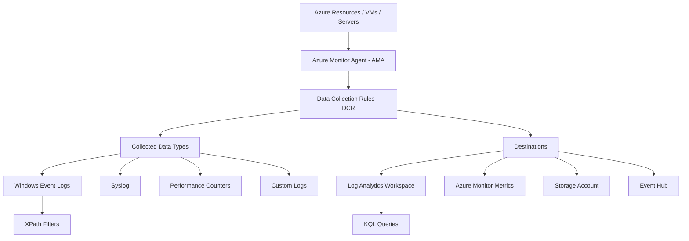

[Azure](https://github.com/magnum31415/wiki/blob/main/azure.md)

# Azure Monitor Data Collection (AZ-104)

# Índice

- [Azure Monitor DCR Queries - XPath vs KQL vs WQL vs T-SQL](#azure-monitor-dcr-queries---xpath-vs-kql-vs-wql-vs-t-sql-az-104)
- [Azure Monitor Data Collection](#azure-monitor-data-collection)
  
---

# Azure Monitor Data Collection

Azure Monitor Data Collection es el mecanismo que utiliza Azure Monitor para:

- recopilar datos
- filtrar datos
- transformar datos
- enviar datos

desde recursos Azure y máquinas hacia destinos de monitorización.

---

# Qué tipos de datos puede recopilar

Azure Monitor puede recopilar:

| Tipo de dato | Ejemplo |
|---|---|
| Logs | Windows Event Logs, Syslog |
| Métricas | CPU, memoria |
| Performance Counters | % CPU, Disk IOPS |
| Application Logs | Logs aplicaciones |
| Security Events | Eventos seguridad Windows |
| Custom Logs | Logs personalizados |

---

# Componentes principales



## 1. Azure Monitor Agent (AMA)

Agente moderno de Azure Monitor.

Se instala en:

- Azure VMs
- Arc-enabled servers
- máquinas híbridas

---

## 2. Data Collection Rules (DCR)

Definen:

```text
qué recopilar
cómo filtrarlo
dónde enviarlo
```
**qué es realmente un Data Collection Rule (DCR) en Azure Monitor.**

Un DCR no sirve para “leer cualquier recurso Azure”.
Sirve para definir:

- qué datos recoger
- desde qué origen compatible
- y a dónde enviarlos

Normalmente se usa con:

- Azure Monitor Agent (AMA)
- máquinas virtuales
- servidores híbridos
- eventos Windows
- syslog
- performance counters
- logs personalizados

**¿qué puede ser “data source” en un DCR?**

En Azure, los data sources soportados por DCR son principalmente:

# Azure Monitor - Data Collection Rules (DCR) Supported Data Sources

| Soportado por DCR | Elemento | Explicación |
|---|---|---|
| ✅ SI | Virtual Machines (Azure VM) | El DCR puede instalar/configurar el Azure Monitor Agent (AMA) y recoger métricas, eventos Windows, syslog, logs personalizados y performance counters desde la VM. |
| ✅ SI | Azure Arc Servers | Los servidores híbridos registrados con Azure Arc pueden ejecutar Azure Monitor Agent (AMA) y enviar datos mediante DCR igual que una Azure VM. |
| ✅ SI | Windows Events | Los eventos del Event Viewer de Windows pueden recogerse mediante AMA + DCR. Ejemplo: Security, Application o System logs. |
| ✅ SI | Syslog | Los servidores Linux pueden enviar logs Syslog mediante AMA y DCR. |
| ✅ SI | Performance Counters | El DCR puede recoger contadores de rendimiento de Windows/Linux como CPU, memoria, disco o red. |
| ✅ SI | IIS Logs | Los logs de Internet Information Services (IIS) pueden recopilarse desde servidores Windows mediante DCR. |
| ✅ SI | Custom Text Logs | El DCR puede monitorizar ficheros de texto personalizados y enviar sus logs a Azure Monitor / Log Analytics. |
| ✅ SI | Prometheus Metrics (AKS) | Azure Monitor Managed Prometheus puede usar DCR para recopilar métricas Prometheus desde AKS. |
| ❌ NO | Storage Accounts | Un Storage Account puede almacenar logs, enviar diagnósticos e integrarse con Azure Monitor. PERO no es un “data source” soportado directamente en un DCR. Se usan Diagnostic Settings, no AMA + DCR. |
| ❌ NO | Log Analytics Workspaces | El Workspace es normalmente el DESTINO de los datos, no el origen. Un DCR envía datos hacia Log Analytics, Metrics, Event Hub o Storage. |
| ❌ NO | Azure SQL Databases | Azure SQL puede enviar logs y métricas mediante Diagnostic Settings y SQL Auditing, pero no actúa como data source directo de un DCR basado en AMA. |
| ❌ NO | Azure Storage Blobs | Los blobs pueden contener logs o datos, pero no son orígenes soportados directamente por DCR. |
| ❌ NO | Azure Key Vault | Key Vault usa Diagnostic Settings para enviar logs y métricas, no DCR como data source directo. |
| ❌ NO | Azure Firewall | Azure Firewall exporta logs mediante Diagnostic Settings hacia Log Analytics/Event Hub/Storage, no mediante DCR clásico. |
| ❌ NO | NSG Flow Logs | Los NSG Flow Logs se configuran mediante Network Watcher y Storage Account, no mediante DCR. |
| ❌ NO | Application Gateway | Application Gateway envía logs mediante Diagnostic Settings, no como data source directo de DCR. |
| ❌ NO | Azure Load Balancer | El Load Balancer puede enviar métricas y diagnósticos, pero no es origen directo compatible con DCR. |
| ❌ NO | Azure Bastion | Bastion usa Diagnostic Settings para logs y métricas; no soporta AMA + DCR como origen directo. |


---

## 3. Destinos

Los datos pueden enviarse a:

| Destino | Uso |
|---|---|
| Log Analytics Workspace | Logs y consultas KQL |
| Azure Monitor Metrics | Métricas |
| Event Hub | Streaming |
| Storage Account | Archivado |

---

# Flujo típico

```text
VM / Resource
    ↓
Azure Monitor Agent (AMA)
    ↓
Data Collection Rule (DCR)
    ↓
Log Analytics Workspace
```

---

# Qué hace exactamente una DCR

Una DCR define:

- qué eventos recopilar
- qué métricas recopilar
- filtros
- transformaciones
- destinos

---

# Ejemplo típico

## Recopilar solo Event ID 4625

```text
Windows Security Events
```

↓

La DCR utiliza:

```text
XPath
```

para filtrar.

---

# Importante examen

DCR reemplaza gradualmente al antiguo:

```text
Log Analytics Agent (MMA/OMS Agent)
```

---

# Diferencia importante examen

| Tecnología | Estado |
|---|---|
| Log Analytics Agent (MMA) | Legacy / Deprecated |
| Azure Monitor Agent (AMA) | Recomendado |

---

# Qué puede recopilar una DCR

| Tipo | Compatible |
|---|---|
| Windows Event Logs | ✅ |
| Syslog | ✅ |
| Performance Counters | ✅ |
| IIS Logs | ✅ |
| Custom Logs | ✅ |

---

# XPath y KQL

| Lenguaje | Uso |
|---|---|
| XPath | Filtrar Windows Events en DCR |
| KQL | Consultar logs en Log Analytics |

---

# Trampa típica AZ-104

Pensar que:

```text
KQL define qué logs recopilar
```

❌ Incorrecto.

↓

KQL consulta datos ya ingeridos.

---

# Regla rápida examen

```text
DCR defines what data Azure Monitor collects.
```

```text
Azure Monitor Agent sends data according to DCR rules.
```

```text
XPath filters Windows Event Logs during ingestion.
```

```text
KQL queries data after ingestion.
```

---

# Frases clave AZ-104

```text
Data Collection Rules define data collection behavior in Azure Monitor.
```

```text
Azure Monitor Agent uses DCRs to collect and route monitoring data.
```

```text
DCRs support filtering, transformation, and routing of monitoring data.
```

---

# Azure Monitor DCR Queries - XPath vs KQL vs WQL vs T-SQL

---

# Concepto clave examen

La pregunta típica AZ-104 evalúa:

```text
qué lenguaje utiliza Azure Monitor DCR
para filtrar Windows Event Logs
```

---

# XPath

## Qué es

Lenguaje utilizado para navegar y filtrar datos XML.

---

# Por qué Azure lo usa

Windows Event Logs internamente utilizan formato XML.

Por eso Azure Monitor usa:

```text
xPathQueries
```

para filtrar eventos.

---

# Ejemplo XPath

```text
*[System[(EventID=4648)]]
```

---

# Importante examen

XPath se usa:

✅ DURANTE la recopilación  
✅ dentro de la DCR  
✅ para decidir qué eventos ingerir  

---

# KQL (Kusto Query Language)

## Qué es

Lenguaje de consultas de:

- Azure Monitor Logs
- Log Analytics
- Microsoft Sentinel
- Azure Data Explorer

---

# Para qué sirve

KQL se usa:

✅ DESPUÉS de la ingestión  
✅ para consultar logs ya almacenados  

---

# Ejemplo KQL

```kql
SecurityEvent
| where EventID == 4648
```

---

# Importante examen

KQL:

❌ NO define filtros DCR para Windows Event Logs  
✅ consulta datos ya recopilados  

---

# WQL (WMI Query Language)

## Qué es

Lenguaje asociado a:

```text
Windows Management Instrumentation (WMI)
```

---

# Uso típico

WQL se utiliza para:

- consultas WMI
- inventario Windows
- administración SO

---

# Importante examen

WQL:

❌ NO se usa en Azure Monitor DCR para Event Logs  

---

# T-SQL

## Qué es

Lenguaje SQL de Microsoft.

Usado en:

- SQL Server
- Azure SQL Database

---

# Importante examen

T-SQL:

❌ NO tiene relación con Azure Monitor DCRs  

---

# Diferencia clave examen

| Lenguaje | Uso principal |
|---|---|
| XPath | Filtrar Windows Event Logs en DCR |
| KQL | Consultar logs en Log Analytics |
| WQL | Consultas WMI |
| T-SQL | Bases de datos SQL |

---

# Flujo real

```text
Windows VM
   ↓
DCR with XPath filter
   ↓
Azure Monitor ingestion
   ↓
Log Analytics
   ↓
KQL queries
```

---

# Diferencia importante examen

| Tecnología | Estado |
|---|---|
| Log Analytics Agent (MMA) | Legacy / Deprecated |
| Azure Monitor Agent (AMA) | Recomendado |

---

# Qué puede recopilar una DCR

| Tipo | Compatible |
|---|---|
| Windows Event Logs | ✅ |
| Syslog | ✅ |
| Performance Counters | ✅ |
| IIS Logs | ✅ |
| Custom Logs | ✅ |

---

# Trampas típicas AZ-104

## Trampa 1

Pensar que:

```text
KQL define qué logs recopilar
```

❌ Incorrecto.

↓

KQL consulta datos ya ingeridos.

---

## Trampa 2

Pensar que WQL se usa para Event Logs en DCR.

❌ Incorrecto.

↓

DCR usa XPath.

---

## Trampa 3

Confundir:

```text
XPath
```

con:

```text
KQL
```

---

# Reglas rápidas examen

```text
DCR defines what data Azure Monitor collects.
```

```text
Azure Monitor Agent sends data according to DCR rules.
```

```text
XPath filters Windows Event Logs during ingestion.
```

```text
KQL queries data after ingestion.
```

---

# Frases clave AZ-104

```text
Data Collection Rules define data collection behavior in Azure Monitor.
```

```text
Azure Monitor Agent uses DCRs to collect and route monitoring data.
```

```text
XPath is used in DCRs to filter Windows Event Logs.
```

```text
KQL is used to query logs already stored in Log Analytics.
```
