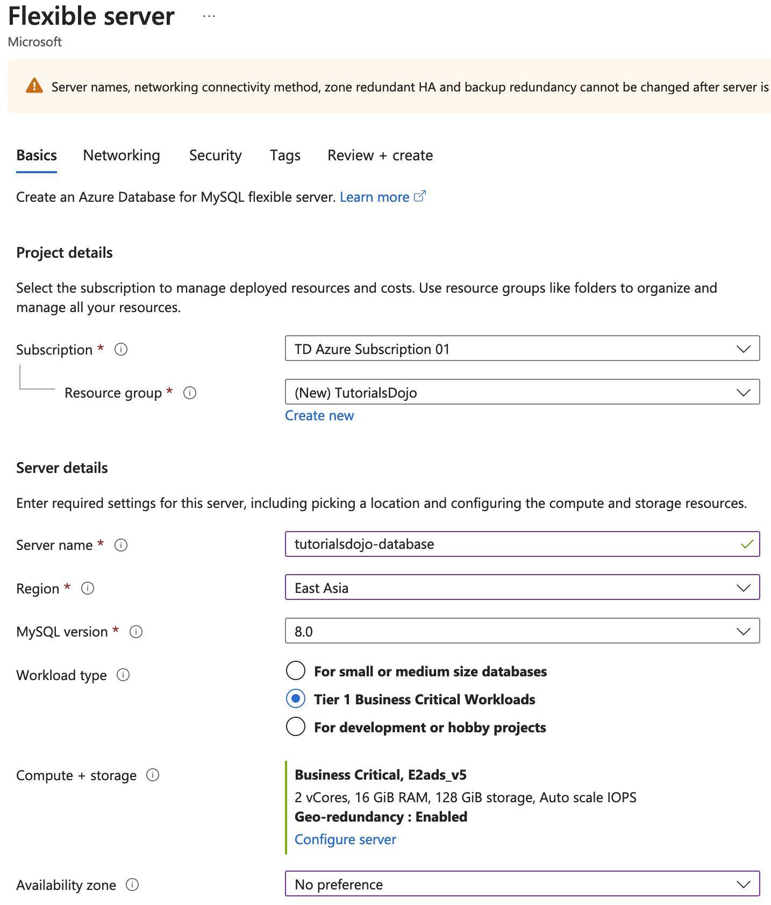

[Azure](https://github.com/magnum31415/wiki/blob/main/azure.md)
# Azure Database for MySQL

## ¿Qué es Azure Database for MySQL – Flexible Server?

Es un servicio PaaS totalmente gestionado para MySQL que ofrece:
- Más control sobre configuración
- Control del mantenimiento
- Opciones de alta disponibilidad
- Mejor optimización de costes

Es la versión moderna (reemplaza progresivamente a Single Server).

**🧩 Resumen mental rápido (tipo examen)**

Si lees:
- “Custom maintenance window” → Flexible Server
- “Zone redundant HA” → Flexible Server General Purpose
- “Cost saving dev/test” → Burstable
- “Predictable workload” → Reserved Instances

## Azure Database for MySQL – Comparativa

| Característica                | **Single Server**            | **Flexible Server – Burstable** | **Flexible Server – General Purpose** | **Flexible Server – Memory Optimized** |
| ----------------------------- | ---------------------------- | ------------------------------- | ------------------------------------- | -------------------------------------- |
| Estado del servicio           | Modelo antiguo (en retirada) | Actual                          | Actual                                | Actual                                 |
| Control ventana mantenimiento | ❌ No                         | ✅ Sí                            | ✅ Sí                                  | ✅ Sí                                   |
| Stop / Start                  | ❌ No                         | ✅ Sí                            | ✅ Sí                                  | ✅ Sí                                   |
| Alta disponibilidad (HA)      | Limitada                     | ❌ No                            | ✅ Sí                                  | ✅ Sí                                   |
| HA Zone-redundant             | ❌ No                         | ❌ No                            | ✅ Sí (solo al crear)                  | ✅ Sí (solo al crear)                   |
| Tipo replicación HA           | Interna gestionada           | —                               | Síncrona entre zonas                  | Síncrona entre zonas                   |
| Tier de computación           | Basic / GP                   | Burstable (B-series)            | D-series equivalente                  | E-series equivalente                   |
| Ideal para                    | Workloads legacy             | Dev/Test                        | Producción estándar                   | Producción intensiva                   |
| Soporta Reserved Instances    | Limitado                     | ✅ Sí                            | ✅ Sí                                  | ✅ Sí                                   |
| Coste                         | Medio                        | Bajo                            | Medio-Alto                            | Alto                                   |

### 🏗 Qué lo hace “Flexible”
- 1️⃣ Alta disponibilidad configurable

  Puedes elegir:
  - 🔹 Sin HA
  - 🔹 HA dentro de la misma zona
  - 🔹 HA zone-redundant (entre Availability Zones)

 Pero:

  - ⚠️ Solo disponible en General Purpose
  - ❌ No disponible en Burstable

### 2️⃣ Control del mantenimiento

  A diferencia de Single Server:

  - Puedes elegir ventana de mantenimiento
  - O dejar que sea gestionado por el sistema

  Esto es clave en entornos productivos.

### 3️⃣ Optimización de costes

  Flexible Server permite:

  - ⏸ Stop / Start del servidor (ahorro en entornos no productivos)
  - ⚡ Burstable tier (para cargas ligeras intermitentes)
  - 💰 Reserved Instances (hasta ~63% ahorro si uso predecible)

### 🧠 Diferencia entre tiers

  | Tier                 | Para qué sirve        | HA soportada |
| -------------------- | --------------------- | ------------ |
| **Burstable**        | Dev/Test o carga baja | ❌ No         |
| **General Purpose**  | Producción            | ✅ Sí         |
| **Memory Optimized** | Workloads intensivos  | ✅ Sí         |

 
# Geo-redundant Backup en Azure Database for MySQL – Flexible Server

## ¿Qué es?

**Geo-redundant backup** es una opción que permite que los **backups automáticos** de tu servidor MySQL se repliquen a una **región emparejada de Azure**.

Esto proporciona protección ante la caída completa de una región (disaster recovery regional).

## ¿Cómo funciona?

Cuando activas backups automáticos en MySQL Flexible Server:

- Azure realiza:
  - Backups completos diarios
  - Backups diferenciales
  - Backups de logs
- Permite restauración **Point-in-Time (PITR)** dentro del período de retención configurado

Si activas **Geo-redundant backup**:

- Los backups se almacenan en la región primaria
- Además, se replican automáticamente a una región secundaria emparejada
- Puedes restaurar el servidor en la región secundaria si ocurre un desastre regional

---

## Comparación: Backup Local vs Geo-redundant

| Característica | Backup Local (LRS) | Geo-redundant Backup (GRS) |
|---------------|--------------------|----------------------------|
| Copia en la misma región | ✅ Sí | ✅ Sí |
| Copia en región emparejada | ❌ No | ✅ Sí |
| Protección ante caída regional | ❌ No | ✅ Sí |
| Restauración en otra región | ❌ No | ✅ Sí |
| Coste | 💰 Menor | 💰💰 Mayor |

---

## Diferencia con Read Replica

No confundir con réplica de lectura:

| Característica | Geo-redundant Backup | Read Replica |
|---------------|----------------------|--------------|
| Replica datos en tiempo real | ❌ No | ✅ Sí |
| Replica solo backups | ✅ Sí | ❌ No |
| Se usa para DR regional | ✅ Sí | ✅ (según arquitectura) |
| Sirve para escalar lecturas | ❌ No | ✅ Sí |

---

## Importante para examen (AZ-305)

- No convierte el servidor en activo-activo
- No es replicación en tiempo real
- Solo replica backups
- La restauración en la región secundaria crea un **nuevo servidor**

---

## En una frase

> Geo-redundant backup = Backups automáticos replicados a otra región para recuperación ante desastre regional.

