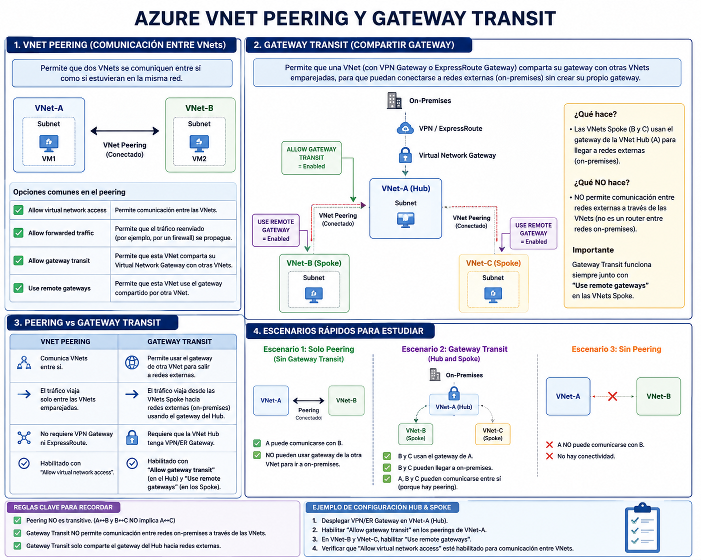

[Azure](https://github.com/magnum31415/wiki/blob/main/azure.md)

- [Azure Virtual Network Peering (AZ-104)](#azure-virtual-network-peering-az-104)
- [Azure Route Tables y Next Hop Types (AZ-104)](#azure-route-tables-y-next-hop-types-az-104)
- [Azure Connection Monitor (AZ-104)](#azure-connection-monitor-az-104)

---

# Azure Virtual Network Peering (AZ-104)



# Qué es VNet Peering

VNet Peering permite conectar:

```text
dos Virtual Networks (VNets)
```

de forma privada usando:

```text
la red backbone de Microsoft
```

sin usar:

- Internet
- VPN Gateway
- ExpressRoute

---

# Objetivo principal

Permitir comunicación:

```text
VNet ↔ VNet
```

como si fueran:

```text
una sola red
```

---

# Tipos de peering

| Tipo | Descripción |
|---|---|
| Regional VNet Peering | VNets en la misma región |
| Global VNet Peering | VNets en distintas regiones |

---

# Ejemplos

| VNet | Región |
|---|---|
| VNet-Prod | West Europe |
| VNet-Hub | West Europe |

↓

```text
Regional Peering
```

---

| VNet | Región |
|---|---|
| VNet-Europe | West Europe |
| VNet-US | East US |

↓

```text
Global Peering
```

---

# Características importantes

| Característica | VNet Peering |
|---|---|
| Tráfico privado | ✅ |
| Usa backbone Microsoft | ✅ |
| Baja latencia | ✅ |
| Alto throughput | ✅ |
| Requiere VPN Gateway | ❌ |
| Requiere Internet | ❌ |

---

# Comunicación entre VNets

Después del peering:

```text
VMs pueden comunicarse por IP privada
```

---

# Requisito importante

Las VNets NO pueden tener:

```text
overlapping IP ranges
```

---

# Ejemplo inválido

| VNet | Address Space |
|---|---|
| VNet1 | 10.0.0.0/16 |
| VNet2 | 10.0.0.0/24 |

❌ Overlap.

---

# Ejemplo válido

| VNet | Address Space |
|---|---|
| VNet1 | 10.0.0.0/16 |
| VNet2 | 10.1.0.0/16 |

✅ Correcto.

---

# Concepto clave examen

```text
Overlapping address spaces prevent VNet peering.
```

---

# Peering es NO transitivo

MUY importante.

---

# Ejemplo

```text
VNetA ↔ VNetB
VNetB ↔ VNetC
```

↓

```text
VNetA NO puede hablar con VNetC automáticamente
```

---

# Esto se llama

```text
Non-transitive routing
```

---

# Para tránsito necesitas

- Azure Firewall
- NVA
- VPN Gateway transit
- Virtual WAN

---

# Hub & Spoke

Peering se usa muchísimo en:

```text
Hub & Spoke architectures
```

---

# Arquitectura típica

```text
Spoke1
    │
    ▼
Hub VNet
    ▲
    │
Spoke2
```

---

# El Hub normalmente contiene

- Azure Firewall
- VPN Gateway
- DNS
- Bastion
- Shared Services

---

# Opciones importantes del peering

| Opción | Función |
|---|---|
| Allow virtual network access | Permite comunicación básica |
| Allow forwarded traffic | Permite tráfico reenviado por firewall/NVA |
| Allow gateway transit | Permite compartir VPN Gateway |
| Use remote gateways | Usa gateway remoto del Hub |

---

# Gateway Transit

Permite que Spokes usen:

```text
el VPN Gateway del Hub
```

---

# Ejemplo típico

```text
On-Prem
   │
VPN Gateway (Hub)
   │
Hub VNet
   │
Spokes
```

---

# Reglas importantes Gateway Transit

| Regla | Valor |
|---|---|
| Solo un remote gateway por VNet | ✅ |
| Gateway debe estar en Hub | ✅ |
| Use Remote Gateway y Gateway Transit se complementan | ✅ |

---

# Costes importantes

| Elemento | Coste |
|---|---|
| Inbound peering traffic | Normalmente gratis |
| Outbound peering traffic | Puede tener coste |
| Global Peering | Más caro |

---

# Límites importantes

| Límite | Valor |
|---|---|
| Peering por VNet | Muy alto (depende SKU/subscription) |
| Overlapping IPs | ❌ No permitido |
| Transitividad automática | ❌ No |

---

# DNS importante

Peering NO resuelve DNS automáticamente.

Debes configurar:

- Azure DNS Private Resolver
- custom DNS
- forwarders

---

# Private Endpoints y Peering

Private Endpoints funcionan a través de peering si:

✅ routing correcto  
✅ DNS correcto  

---

# Trampas típicas AZ-104

## Trampa 1

```text
Peering = transitive
```

❌ Incorrecto.

---

## Trampa 2

```text
Peering requiere VPN Gateway
```

❌ Incorrecto.

---

## Trampa 3

```text
VNets con overlap pueden hacer peering
```

❌ Incorrecto.

---

## Trampa 4

```text
DNS funciona automáticamente
```

❌ Incorrecto.

---

# Comparativa rápida

| Característica | Peering | VPN Gateway |
|---|---|---|
| Usa Internet | ❌ | Puede |
| Baja latencia | ✅ | Menor |
| Alto throughput | ✅ | Menor |
| Encryption automática | ❌ |
| Comunicación privada | ✅ | ✅ |

---

# Conceptos importantes AZ-104

| Concepto | Muy importante |
|---|---|
| Non-overlapping IPs | ✅ |
| Non-transitive routing | ✅ |
| Hub & Spoke | ✅ |
| Gateway Transit | ✅ |
| Global vs Regional Peering | ✅ |
| Allow forwarded traffic | ✅ |

---

# Reglas rápidas examen

```text
VNet peering uses the Microsoft backbone network.
```

```text
Peered VNets cannot have overlapping address spaces.
```

```text
VNet peering is not transitive.
```

```text
Gateway transit allows spokes to use the hub VPN gateway.
```
---
# Azure Route Tables y Next Hop Types (AZ-104)

## Índice

- [Azure Route Tables y Next Hop Types (AZ-104)](#azure-route-tables-y-next-hop-types-az-104)
- [Escenario](#escenario)
- [Qué quiere el ejercicio](#qué-quiere-el-ejercicio)
- [Respuesta correcta](#respuesta-correcta)
- [Qué es una Route Table](#qué-es-una-route-table)
- [Qué es una Route](#qué-es-una-route)
- [Qué es Next Hop](#qué-es-next-hop)
- [Tipos de Next Hop](#tipos-de-next-hop)
- [Virtual Appliance](#virtual-appliance)
- [Qué es una NVA](#qué-es-una-nva)
- [Por qué Virtual Appliance es correcto](#por-qué-virtual-appliance-es-correcto)
- [Qué ocurre realmente](#qué-ocurre-realmente)
- [Ejemplo conceptual](#ejemplo-conceptual)
- [Por qué las otras respuestas son incorrectas](#por-qué-las-otras-respuestas-son-incorrectas)
- [Internet](#internet)
- [Virtual Network Gateway](#virtual-network-gateway)
- [Virtual Network](#virtual-network)
- [Concepto importante examen](#concepto-importante-examen)
- [Trampa típica AZ-104](#trampa-típica-az-104)
- [Tabla resumen Next Hop Types](#tabla-resumen-next-hop-types)
- [Reglas rápidas AZ-104](#reglas-rápidas-az-104)
- [Frases clave AZ-104](#frases-clave-az-104)

---
## Conceptos

| Concepto | Descripción |
|---|---|
| Route Table | Conjunto de reglas de routing que define por dónde debe viajar el tráfico en Azure |
| Route | Regla individual dentro de una Route Table que define destino y siguiente salto |
| Next Hop | Siguiente dispositivo/recurso al que Azure enviará el tráfico |
| Virtual Appliance | Máquina virtual especializada en networking/security (firewall, router, NVA) |
| NVA (Network Virtual Appliance) | Firewall/router virtual desplegado como VM en Azure |
| UDR (User Defined Route) | Ruta personalizada creada manualmente por el usuario |


## Escenario

Tenemos:

| Recurso | Tipo |
|---|---|
| RT1 | Route Table |

Debemos:

```text
crear una ruta
```

que necesita:

```text
especificar una IP para el next hop
```

---

## Qué quiere el ejercicio

Microsoft pregunta:

```text
¿Qué tipo de Next Hop requiere una IP address?
```

---

## Respuesta correcta

✅

```text
Virtual appliance
```

---

## Qué es una Route Table

Una Route Table contiene reglas de routing.

---

## Para qué sirve

Define:

```text
por dónde debe viajar el tráfico
```

---

## Qué es una Route

Una route define:

| Elemento | Significado |
|---|---|
| Destination | Red destino |
| Next Hop | Siguiente salto |

---

## Qué es Next Hop

El:

```text
Next Hop
```

es:

```text
el siguiente dispositivo/recurso al que Azure enviará el tráfico
```

---

## Tipos de Next Hop

| Tipo | Uso |
|---|---|
| Internet | Salida Internet |
| Virtual Network | Dentro VNet |
| Virtual Network Gateway | VPN/ExpressRoute |
| Virtual Appliance | NVA / Firewall |

---

## Virtual Appliance

Es el único tipo que requiere:

✅ una IP address manual  

---

## Qué es una NVA

NVA significa:

```text
Network Virtual Appliance
```

Es normalmente:

- firewall virtual
- router virtual
- appliance seguridad

ejecutándose como VM.

---

## Ejemplos típicos

| Vendor | Producto |
|---|---|
| Fortinet | FortiGate |
| Palo Alto | VM-Series |
| Cisco | CSR |

---

## Por qué Virtual Appliance es correcto

Porque Azure necesita saber:

```text
la IP privada de la NVA
```

---

## Qué ocurre realmente

La route queda algo así:

| Campo | Valor |
|---|---|
| Destination | 10.2.0.0/16 |
| Next Hop Type | Virtual Appliance |
| Next Hop IP | 10.1.0.4 |

---

## Ejemplo conceptual

```text
Subnet
    ↓
UDR
    ↓
10.1.0.4 (NVA)
    ↓
Firewall inspection
```

---

## Por qué las otras respuestas son incorrectas

## Internet

Azure ya conoce automáticamente:

```text
Internet
```

NO necesitas IP manual.

---

## Virtual Network Gateway

Se usa para:

- VPN Gateway
- ExpressRoute

Azure ya conoce el gateway.

NO necesitas IP manual.

---

## Virtual Network

Se usa para:

```text
routing interno VNet
```

NO necesita IP manual.

---

## Concepto importante examen

Solo:

```text
Virtual Appliance
```

requiere:

```text
Next Hop IP Address
```

---

## Trampa típica AZ-104

Muchos candidatos piensan:

```text
Virtual Network Gateway requiere IP manual
```

❌ Incorrecto.

Azure ya conoce el gateway automáticamente.

---

## Otra trampa típica

Confundir:

```text
Virtual Appliance
```

con:

```text
Virtual Network Gateway
```

---

## Diferencia rápida

| Concepto | Función |
|---|---|
| Virtual Appliance | Firewall/router VM |
| Virtual Network Gateway | VPN/ExpressRoute gateway |

---

## Tabla resumen Next Hop Types

| Next Hop Type | Requiere IP manual | Uso |
|---|---|---|
| Internet | ❌ | Internet |
| Virtual Network | ❌ | Routing interno |
| Virtual Network Gateway | ❌ | VPN/ER |
| Virtual Appliance | ✅ | NVA |

---

## Reglas rápidas AZ-104

```text
Virtual Appliance routes require a next hop IP address.
```

```text
NVAs are commonly used with User Defined Routes.
```

```text
Virtual Network Gateway is used for VPN and ExpressRoute connectivity.
```

---

## Frases clave AZ-104

```text
A virtual appliance is typically a firewall or routing VM.
```

```text
User Defined Routes can redirect traffic to a virtual appliance.
```

```text
Only the Virtual Appliance next hop type requires specifying an IP address.
```
---
# Azure Connection Monitor (AZ-104)

# Qué es Connection Monitor

Connection Monitor es una funcionalidad de:

```text
Azure Network Watcher
```

que permite monitorizar:

```text
conectividad de red extremo a extremo
```

entre recursos.

---

# Objetivo principal

Verificar:

- conectividad
- latencia
- pérdida paquetes
- disponibilidad red

entre:

- VMs
- endpoints
- aplicaciones
- URLs
- on-prem
- Azure

---

# Qué puede monitorizar

| Origen | Destino |
|---|---|
| Azure VM | Azure VM |
| Azure VM | URL pública |
| Azure VM | On-prem |
| Azure VM | IP privada |
| Azure VM | Endpoint TCP |

---

# Qué comprueba

| Métrica | Explicación |
|---|---|
| Reachability | ¿Hay conectividad? |
| Latency | Tiempo respuesta |
| Packet loss | Pérdida paquetes |
| Topology | Ruta/red utilizada |
| Hop analysis | Saltos/red intermedia |

---

# Servicio relacionado

Connection Monitor pertenece a:

```text
Azure Network Watcher
```

---

# Arquitectura típica

```text
VM Source
    ↓
Connection Monitor
    ↓
Target Endpoint
```

---

# Restricción regional MUY IMPORTANTE

Azure Network Watcher's Connection Monitor requiere que:

```text
la VM origen
```

y:

```text
la instancia Connection Monitor
```

estén en:

```text
la MISMA región Azure
```

---

# Ejemplo correcto

| Recurso | Región |
|---|---|
| VM origen | West Europe |
| Connection Monitor | West Europe |

✅ Correcto.

---

# Ejemplo incorrecto

| Recurso | Región |
|---|---|
| VM origen | West Europe |
| Connection Monitor | North Europe |

❌ No soportado.

---

# Importante

El destino monitorizado:

```text
puede estar en otra región
```

o incluso:

- on-prem
- Internet
- otra nube

---

# Ejemplo típico

Quieres comprobar si:

```text
VM-App
```

puede llegar a:

```text
SQL Server
```

por:

```text
TCP 1433
```

↓

usas:

```text
Connection Monitor
```

---

# Casos típicos examen

| Escenario | Solución |
|---|---|
| Verificar conectividad VM ↔ VM | Connection Monitor |
| Detectar latencia red | Connection Monitor |
| Monitorizar acceso endpoint | Connection Monitor |
| Verificar puertos abiertos | Connection Monitor |

---

# Muy importante AZ-104

Connection Monitor:

```text
NO reemplaza NSG
```

NO hace:

- filtering
- firewalling
- routing

↓

solo:

```text
monitoriza conectividad
```

---

# Diferencia importante

| Servicio | Función |
|---|---|
| NSG | Filtrar tráfico |
| Route Table | Routing |
| Connection Monitor | Monitorizar conectividad |
| Network Watcher | Herramientas networking |

---

# Requisitos importantes

| Requisito | Necesario |
|---|---|
| Network Watcher habilitado | ✅ |
| Azure VM Agent | Normalmente ✅ |
| Región soportada | ✅ |

---

# Relación con Log Analytics

Puede enviar:

- logs
- métricas
- resultados

a:

```text
Log Analytics Workspace
```

---

# Concepto importante

Connection Monitor puede detectar:

```text
dónde falla la conectividad
```

---

# Ejemplo visual

```text
VM1
  ↓
NSG
  ↓
Firewall
  ↓
Route Table
  ↓
VM2
```

↓

Connection Monitor ayuda a identificar:

```text
en qué punto falla
```

---

# Versiones

| Versión | Estado |
|---|---|
| Classic | Antigua |
| Connection Monitor v2 | Actual/recomendada |

---

# Trampas típicas AZ-104

## Trampa 1

```text
Connection Monitor abre puertos
```

❌ Incorrecto.

---

# Trampa 2

```text
Connection Monitor modifica routing
```

❌ Incorrecto.

---

# Trampa 3

```text
Connection Monitor reemplaza Network Watcher
```

❌ Incorrecto.

---

# Conceptos importantes examen

| Concepto | Importancia |
|---|---|
| Azure Network Watcher | Muy alta |
| Connection Monitor | Alta |
| Connectivity troubleshooting | Muy alta |
| Restricciones regionales | Muy alta |
| NSG troubleshooting | Alta |
| Latency monitoring | Alta |

---

# Herramientas relacionadas Network Watcher

| Herramienta | Función |
|---|---|
| Connection Monitor | Monitorizar conectividad |
| IP Flow Verify | Verificar NSG |
| Next Hop | Ver routing |
| Packet Capture | Captura paquetes |
| NSG Flow Logs | Logs tráfico NSG |
| Topology | Visualizar red |


# La clave de la pregunta NO es:

``cuántas VNets hay`` 

La clave REAL es: ``cuántas regiones Azure hay``

Porque Connection Monitor tiene esta restricción: ``la VM origen y el Connection Monitor deben estar en la MISMA región``

NO: ``en la misma VNet``

---

# Reglas rápidas examen

```text
Connection Monitor monitors end-to-end network connectivity.
```

```text
Connection Monitor is part of Azure Network Watcher.
```

```text
Connection Monitor requires the source VM and the Connection Monitor instance to be in the same Azure region.
```

```text
Connection Monitor does not filter or route traffic.
```
