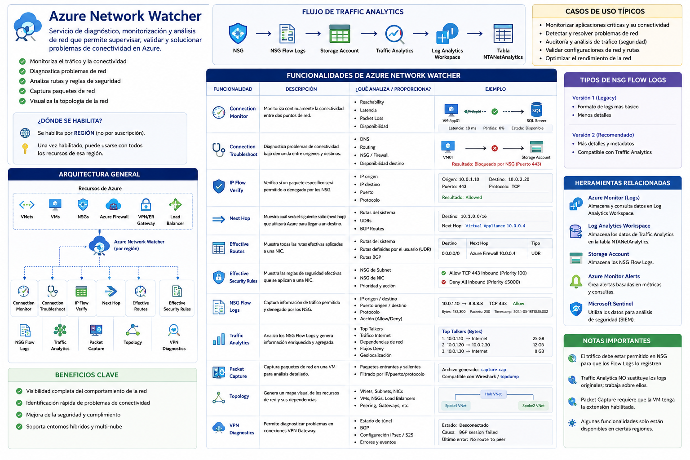

# Azure Network Watcher


## ¿Qué es Azure Network Watcher?





Azure Network Watcher es un servicio de diagnóstico, monitorización y análisis de red de Azure que permite supervisar, validar y solucionar problemas de conectividad dentro de una suscripción Azure.

Proporciona herramientas para:

- Monitorizar tráfico de red.
- Diagnosticar problemas de conectividad.
- Analizar rutas de red.
- Capturar paquetes.
- Verificar reglas de seguridad.
- Analizar dependencias entre recursos.
- Obtener visibilidad operacional de redes virtuales.

Azure Network Watcher se habilita por región y actúa sobre recursos como:

- Virtual Networks (VNets)
- Network Security Groups (NSGs)
- Azure Firewall
- Virtual Machines
- VPN Gateway
- Application Gateway
- Load Balancer
- ExpressRoute

---

## Arquitectura General

```text
Azure Subscription
        │
        ▼
Azure Network Watcher
        │
        ├── Traffic Analytics
        ├── NSG Flow Logs
        ├── Connection Monitor
        ├── Packet Capture
        ├── IP Flow Verify
        ├── Next Hop
        ├── Effective Security Rules
        ├── Effective Routes
        ├── Topology
        ├── Connection Troubleshoot
        └── VPN Diagnostics
```

---

# Connection Monitor

## ¿Qué es?

Permite monitorizar continuamente la conectividad entre dos puntos de red.

Puede verificar:

- VM ↔ VM
- VM ↔ Internet
- VM ↔ Endpoint externo
- VM ↔ Azure Service

---

## Qué comprueba

- Reachability
- Latencia
- Packet Loss
- Disponibilidad

---

## Casos de uso

- Monitorizar aplicaciones críticas.
- Detectar caídas de conectividad.
- Supervisar enlaces híbridos.

---

## Ejemplo

```text
VM-App01
      │
      ▼
SQL Server
```

Verificar cada 5 minutos:

- Latencia
- Disponibilidad
- Tiempo de respuesta

---

## Tabla resumen

| Función | Descripción | Ejemplo |
|----------|-------------|----------|
| Connection Monitor | Supervisa conectividad continua | VM → SQL Server |

---

# Connection Troubleshoot

## ¿Qué es?

Diagnostica problemas de conectividad puntuales.

Realiza una comprobación bajo demanda.

---

## Qué analiza

- DNS
- Routing
- NSG
- Firewall
- Disponibilidad destino

---

## Casos de uso

- Un servidor no puede acceder a Internet.
- Una VM no alcanza una base de datos.

---

## Ejemplo

```text
VM01
 │
 ▼
Storage Account
```

Resultado:

```text
Blocked by NSG
```

---

## Tabla resumen

| Función | Descripción | Ejemplo |
|----------|-------------|----------|
| Connection Troubleshoot | Diagnóstico puntual de conectividad | VM → Storage bloqueado por NSG |

---

# IP Flow Verify

## ¿Qué es?

Verifica si un paquete específico será permitido o denegado por los NSG.

---

## Qué analiza

- Dirección origen
- Dirección destino
- Puerto
- Protocolo

---

## Casos de uso

Validar reglas NSG antes de realizar cambios.

---

## Ejemplo

```text
Origen: 10.0.1.10
Destino: 10.0.2.20
Puerto: 443
```

Resultado:

```text
Allowed
```

---

## Tabla resumen

| Función | Descripción | Ejemplo |
|----------|-------------|----------|
| IP Flow Verify | Comprueba si un flujo será permitido | TCP 443 permitido |

---

# Next Hop

## ¿Qué es?

Muestra qué ruta utilizará Azure para enviar tráfico hacia un destino.

---

## Qué analiza

- UDRs
- System Routes
- BGP Routes

---

## Casos de uso

Diagnosticar problemas de routing.

---

## Ejemplo

```text
Destino: 10.1.0.0/16
```

Resultado:

```text
Virtual Appliance
10.0.0.4
```

---

## Tabla resumen

| Función | Descripción | Ejemplo |
|----------|-------------|----------|
| Next Hop | Muestra la siguiente ruta utilizada | Tráfico enviado a Azure Firewall |

---

# Effective Routes

## ¿Qué es?

Muestra todas las rutas efectivas aplicadas a una NIC.

---

## Incluye

- System Routes
- User Defined Routes
- BGP Routes

---

## Casos de uso

Entender por qué una VM utiliza una ruta determinada.

---

## Ejemplo

```text
0.0.0.0/0
Next Hop: Azure Firewall
```

---

## Tabla resumen

| Función | Descripción | Ejemplo |
|----------|-------------|----------|
| Effective Routes | Lista rutas efectivas | Ver UDR aplicada a una VM |

---

# Effective Security Rules

## ¿Qué es?

Muestra las reglas de seguridad efectivas aplicadas a una NIC.

---

## Incluye

- NSG de Subnet
- NSG de NIC

---

## Casos de uso

Resolver problemas de acceso.

---

## Ejemplo

```text
Allow TCP 443
Deny All Inbound
```

---

## Tabla resumen

| Función | Descripción | Ejemplo |
|----------|-------------|----------|
| Effective Security Rules | Lista reglas efectivas NSG | Verificar acceso HTTPS |

---

# NSG Flow Logs

## ¿Qué es?

Captura información de tráfico permitido y denegado por NSGs.

---

## Información capturada

- IP origen
- IP destino
- Puerto origen
- Puerto destino
- Protocolo
- Acción (Allow/Deny)

---

## Casos de uso

- Auditoría
- Seguridad
- Análisis de tráfico

---

## Ejemplo

```text
10.0.1.10 → 8.8.8.8 TCP 443 Allow
```

---

## Tabla resumen

| Función | Descripción | Ejemplo |
|----------|-------------|----------|
| NSG Flow Logs | Registra tráfico Allow/Deny | Conexión HTTPS a Internet |

---

# Traffic Analytics

## ¿Qué es?

Analiza los NSG Flow Logs almacenados en Storage Account.

---

## Qué proporciona

- Top Talkers
- Tráfico Internet
- Tráfico Deny
- Dependencias de red
- Geolocalización

---

## Flujo

```text
NSG Flow Logs
       │
       ▼
Storage Account
       │
       ▼
Traffic Analytics
       │
       ▼
NTANetAnalytics
```

---

## Ejemplo

```text
VM01 → Internet
15 GB
```

---

## Tabla resumen

| Función | Descripción | Ejemplo |
|----------|-------------|----------|
| Traffic Analytics | Analiza y enriquece Flow Logs | Top 10 máquinas con más tráfico |

---

# Packet Capture

## ¿Qué es?

Captura paquetes de red directamente desde una VM Azure.

---

## Casos de uso

- Troubleshooting avanzado.
- Problemas TCP.
- Análisis de protocolos.

---

## Resultado

Archivo:

```text
capture.cap
```

Compatible con:

- Wireshark
- tcpdump

---

## Tabla resumen

| Función | Descripción | Ejemplo |
|----------|-------------|----------|
| Packet Capture | Captura paquetes de red | Analizar handshake TCP |

---

# Topology

## ¿Qué es?

Genera un mapa visual de recursos de red.

---

## Recursos detectados

- VNets
- Subnets
- NICs
- VMs
- NSGs
- Load Balancers

---

## Casos de uso

Documentación de arquitectura.

---

## Ejemplo

```text
Hub VNet
    │
 ┌──┴──┐
 ▼     ▼
Spoke1 Spoke2
```

---

## Tabla resumen

| Función | Descripción | Ejemplo |
|----------|-------------|----------|
| Topology | Genera mapa de red | Visualizar Hub & Spoke |

---

# VPN Diagnostics

## ¿Qué es?

Permite diagnosticar conexiones VPN Gateway.

---

## Qué analiza

- Estado del túnel
- BGP
- Configuración IPsec
- Errores de conexión

---

## Casos de uso

Resolver problemas Site-to-Site VPN.

---

## Ejemplo

```text
VPN Down
Cause:
BGP session failed
```

---

## Tabla resumen

| Función | Descripción | Ejemplo |
|----------|-------------|----------|
| VPN Diagnostics | Diagnóstico VPN Gateway | Error BGP Site-to-Site |

---

# Comparativa rápida

| Funcionalidad | Objetivo principal |
|---------------|-------------------|
| Connection Monitor | Monitorización continua |
| Connection Troubleshoot | Diagnóstico puntual |
| IP Flow Verify | Verificar reglas NSG |
| Next Hop | Verificar routing |
| Effective Routes | Ver rutas efectivas |
| Effective Security Rules | Ver reglas NSG efectivas |
| NSG Flow Logs | Capturar tráfico |
| Traffic Analytics | Analizar tráfico |
| Packet Capture | Capturar paquetes |
| Topology | Visualizar arquitectura |
| VPN Diagnostics | Diagnosticar VPN |

---

# Resumen para examen AZ-104

| Pregunta | Respuesta |
|-----------|-----------|
| ¿Qué herramienta verifica si un NSG bloquea tráfico? | IP Flow Verify |
| ¿Qué herramienta muestra la ruta utilizada? | Next Hop |
| ¿Qué herramienta muestra todas las rutas? | Effective Routes |
| ¿Qué herramienta muestra reglas NSG efectivas? | Effective Security Rules |
| ¿Qué herramienta captura paquetes? | Packet Capture |
| ¿Qué herramienta genera mapas de red? | Topology |
| ¿Qué herramienta registra tráfico? | NSG Flow Logs |
| ¿Qué herramienta analiza Flow Logs? | Traffic Analytics |
| ¿Qué herramienta monitoriza conectividad continuamente? | Connection Monitor |
| ¿Qué herramienta diagnostica una conexión concreta? | Connection Troubleshoot |
