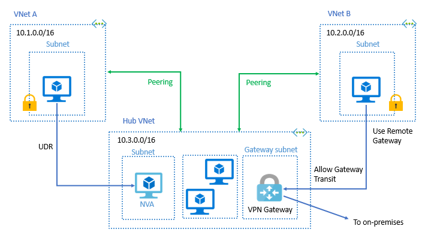
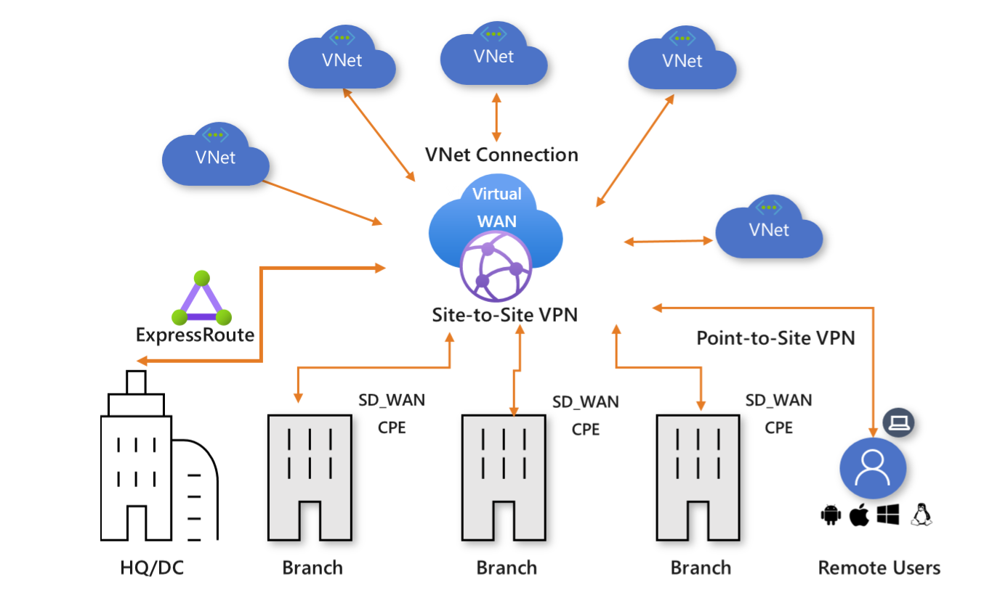

[Azure](https://github.com/magnum31415/wiki/blob/main/azure.md)
# Networking

- [Virtual network peering](#virtual-network-peering)
- [Azure - Tamaño mínimo recomendado de subredes para servicios administrados](#azure---tamaño-mínimo-recomendado-de-subredes-para-servicios-administrados)

---

# Azure - Tamaño mínimo recomendado de subredes para servicios administrados

## Resumen

| Servicio | Recomendado | Obligatorio | Comentario |
|----------|:-----------:|:-----------:|------------|
| Azure Container Apps (Workload Profiles) | /23 | ✅ /23 | Necesita muchas IP para revisiones, escalado e infraestructura administrada. |
| Azure Firewall | /26 | ✅ /26 | Requiere una subred dedicada llamada `AzureFirewallSubnet`. |
| Azure Firewall Management | /26 | ✅ /26 | Solo si utilizas Forced Tunneling. Debe llamarse `AzureFirewallManagementSubnet`. |
| Azure Bastion | /26 | ✅ /26 | Desde noviembre de 2021 Microsoft exige /26 para permitir el escalado del servicio. |
| VPN Gateway | /27 o mayor | ✅ /27 | Debe desplegarse en una subred llamada `GatewaySubnet`. |
| ExpressRoute Gateway | /27 o mayor | ✅ /27 | Comparte el mismo requisito que VPN Gateway. |
| Azure Route Server | /26 | ✅ /26 | Debe desplegarse en una subred llamada `RouteServerSubnet`. |
| Azure DNS Private Resolver | /28 | ✅ /28 | Requiere dos subredes dedicadas (Inbound y Outbound). |
| Application Gateway v2 | /24 | ❌ No | Microsoft recomienda /24 para facilitar el escalado automático. |
| App Service Environment v3 (ASE) | /23 | ❌ No | /24 puede ser suficiente, pero /23 es recomendable para entornos grandes. |
| Azure Kubernetes Service (AKS) | Depende | ❌ No | El tamaño depende del número de nodos, pods y del plugin de red utilizado. |
| Azure Container Instances (ACI) | Depende | ❌ No | Sin requisito específico; depende del número de contenedores. |
| Private Endpoints | /24 compartida | ❌ No | Pueden compartir subred con otros Private Endpoints. El tamaño depende del crecimiento esperado. |

---

# Detalle de cada servicio

## Azure Container Apps (ACA)

- **Subred mínima:** `/23`
- **Obligatoria:** Sí
- **Subred dedicada:** Sí

### ¿Por qué?

Azure reserva un gran número de direcciones IP para:

- Réplicas
- Escalado automático
- Revisiones (Revisions)
- Infraestructura administrada

Por ello Microsoft exige una subred relativamente grande.

---

## Azure Firewall

- **Subred mínima:** `/26`
- **Obligatoria:** Sí
- **Nombre obligatorio:** `AzureFirewallSubnet`

### ¿Por qué?

El Firewall necesita reservar IPs para:

- Alta disponibilidad
- Escalado
- Instancias internas

---

## Azure Firewall Management

- **Subred mínima:** `/26`
- **Obligatoria:** Sí (solo si se usa Forced Tunneling)
- **Nombre obligatorio:** `AzureFirewallManagementSubnet`

Esta subred aloja la interfaz de administración del firewall.

---

## Azure Bastion

- **Subred mínima:** `/26`
- **Obligatoria:** Sí
- **Nombre obligatorio:** `AzureBastionSubnet`

### Antes

Microsoft permitía `/27`.

### Actualmente

El mínimo es `/26` para permitir:

- Escalado
- Nuevas funcionalidades
- Alta disponibilidad

---

## VPN Gateway

- **Subred mínima:** `/27`
- **Obligatoria:** Sí
- **Nombre obligatorio:** `GatewaySubnet`

Puede utilizarse para:

- Site-to-Site VPN
- Point-to-Site VPN
- VNet-to-VNet

Aunque `/27` es el mínimo, muchos arquitectos utilizan `/26` para dejar margen de crecimiento.

---

## ExpressRoute Gateway

- **Subred mínima:** `/27`
- **Obligatoria:** Sí
- **Nombre obligatorio:** `GatewaySubnet`

Comparte exactamente el mismo requisito que VPN Gateway.

---

## Azure Route Server

- **Subred mínima:** `/26`
- **Obligatoria:** Sí
- **Nombre obligatorio:** `RouteServerSubnet`

Permite intercambiar rutas dinámicamente mediante BGP con:

- NVA
- SD-WAN
- Firewalls virtuales

---

## Azure DNS Private Resolver

- **Subred mínima:** `/28`
- **Obligatoria:** Sí

Requiere dos subredes independientes:

- Inbound Endpoint
- Outbound Endpoint

Cada una debe ser como mínimo `/28`.

---

## Application Gateway v2

- **Subred mínima:** No existe
- **Recomendado:** `/24`

¿Por qué?

El servicio puede escalar automáticamente creando numerosas instancias.

Con un `/24` normalmente nunca tendrás problemas de falta de IPs.

---

## App Service Environment v3

- **Subred mínima:** Variable
- **Recomendado:** `/23`

En entornos pequeños un `/24` suele ser suficiente.

Si esperas un gran crecimiento Microsoft recomienda `/23`.

---

## Azure Kubernetes Service (AKS)

No existe un tamaño fijo.

Depende de:

- Azure CNI
- Azure CNI Overlay
- Kubenet
- Número de nodos
- Máximo de Pods por nodo

Es uno de los servicios donde más conviene planificar previamente el direccionamiento IP.

---

## Azure Container Instances (ACI)

No tiene una subred mínima.

El tamaño dependerá únicamente del número de contenedores que vayas a desplegar.

---

## Private Endpoints

No existe un mínimo.

Lo habitual es crear una subred compartida para todos los Private Endpoints.

Muchas empresas utilizan:

- `/24`
- `/25`

para evitar quedarse sin direcciones en el futuro.

---

# Regla mnemotécnica

| CIDR | Servicios típicos |
|------|-------------------|
| **/23** | Container Apps, ASE grande |
| **/24** | Application Gateway, Private Endpoints |
| **/26** | Firewall, Bastion, Route Server |
| **/27** | VPN Gateway, ExpressRoute Gateway |
| **/28** | DNS Private Resolver |

---

# Servicios con nombre obligatorio de subred

| Servicio | Nombre requerido |
|----------|------------------|
| Azure Firewall | `AzureFirewallSubnet` |
| Azure Firewall Management | `AzureFirewallManagementSubnet` |
| Azure Bastion | `AzureBastionSubnet` |
| VPN Gateway | `GatewaySubnet` |
| ExpressRoute Gateway | `GatewaySubnet` |
| Azure Route Server | `RouteServerSubnet` |

---

# Consejos para el examen AZ-104

✅ Memoriza estos cuatro valores:

- **Container Apps → /23**
- **Firewall → /26**
- **Bastion → /26**
- **VPN Gateway → /27**

Conocer estos requisitos suele ser suficiente para responder la mayoría de las preguntas del examen relacionadas con el direccionamiento de subredes para servicios administrados de Azure.

--- 

# Virtual network peering 



Enables you to seamlessly connect two or more Virtual Networks in Azure.
The virtual networks appear as one for connectivity purposes. The traffic between virtual machines in peered virtual networks uses the Microsoft backbone infrastructure.
Like traffic between virtual machines in the same network, traffic is routed through Microsoft’s private network only.

To to connect the two VNets in different regions, you need to configure Azure Virtual Network Peering.

## Azure Virtual Network Gateway or VPN Gateway
Azure VPN Gateway (tipo de Virtual Network Gateway) es el servicio que permite conectar una VNet de Azure con tu red on-premises mediante un túnel cifrado sobre Internet.

Puntos clave:

- 🔐 Usa IPsec/IKE (IKEv1 o IKEv2) para cifrar el tráfico.
- 🌐 Permite conexión Site-to-Site (S2S) entre tu CPD y Azure.
- 🧩 Cada VNet solo puede tener un VPN Gateway.
- 🔗 Puedes crear varias conexiones hacia ese gateway.
- 📶 Todas las conexiones comparten el ancho de banda del gateway.

En resumen:
**Es la opción estándar cuando necesitas conectividad segura sobre Internet entre tu red local y Azure, sin usar un circuito dedicado como ExpressRoute.**

---

## Escenarios

| Escenario                                                        | Servicio recomendado        |
| ---------------------------------------------------------------- | --------------------------- |
| Conexión económica y rápida                                      | Virtual WAN + VPN           |
| Empresa mediana con tráfico regional                             | ExpressRoute Standard       |
| Empresa grande con tráfico global                                | ExpressRoute Premium        |
| Corporación multinacional con alto throughput y conexión directa | ExpressRoute Premium Direct |

---

| Servicio                                    | Úsalo cuando…                                                                                                                                     | Tipo de conexión                                 | Ventajas clave                                                                 | Alcance                            |
| ------------------------------------------- | ------------------------------------------------------------------------------------------------------------------------------------------------- | ------------------------------------------------ | ------------------------------------------------------------------------------ | ---------------------------------- |
| 🌐 **Azure Virtual WAN + Site-to-Site VPN** | - No necesitas conexión dedicada<br>- Buscas menor costo<br>- La latencia no es crítica<br>- Sucursales pequeñas o despliegues rápidos            | Conexión sobre Internet cifrada (VPN IPSec)      | - Más flexible<br>- Más económico<br>- Implementación rápida                   | Regional / Global (sobre Internet) |
| 🔵 **ExpressRoute Standard**                | - Necesitas conexión privada dedicada<br>- Usas proveedor de conectividad (carrier)<br>- Solo necesitas conectividad regional                     | Conexión privada dedicada (no pasa por Internet) | - Mejor latencia<br>- Mayor estabilidad<br>- SLA superior a VPN                | Regional (limitado al geo)         |
| 🟣 **ExpressRoute Premium Direct**          | - Necesitas conectividad global entre regiones<br>- Alto volumen de tráfico<br>- Conexión directa a Microsoft<br>- Alta resiliencia y 10/100 Gbps | Conexión física directa a Microsoft              | - Máximo rendimiento<br>- Control total<br>- Escenarios enterprise/global      | Global                             |
| 🟢 **ExpressRoute Standard Direct**         | - Conexión directa a Microsoft<br>- No necesitas conectividad global<br>- Alto tráfico regional                                                   | Conexión física directa a Microsoft              | - Alto rendimiento<br>- Más económico que Premium Direct<br>- Enfoque regional | Regional                           |

---
## Arbol de decisión  
````
¿Necesitas conexión privada dedicada a Azure?
│
├── ❌ NO → Usa Azure Virtual WAN con VPN Site-to-Site
│
└── ✅ SÍ → ExpressRoute
      │
      ├── ¿Quieres conectarte directamente a la infraestructura de Microsoft 
      │   (sin proveedor intermedio)?
      │
      │   ├── ✅ SÍ → ExpressRoute Direct
      │   │       │
      │   │       ├── ¿Necesitas conectividad global entre regiones?
      │   │       │       ├── ✅ Sí → ExpressRoute Premium Direct
      │   │       │       └── ❌ No → ExpressRoute Standard Direct
      │   │
      │   └── ❌ NO → ExpressRoute Standard
      │
      └── ¿Requieres acceso global entre regiones o más VNets?
              ├── ✅ Sí → ExpressRoute Premium
              └── ❌ No → ExpressRoute Standard

````
---

## Service Endpoints en Azure
En Azure, los Service Endpoints se configuran por servicio específico en una subnet, no existe un endpoint global para todos los servicios.

En Azure, un Service Endpoint:

- Se habilita a nivel de subnet
- Se configura por servicio específico
- Permite acceso privado desde la VNet al servicio PaaS
- Mantiene el tráfico dentro del backbone de Microsoft

En una subnet activas:
- VM acceda a Azure Storage → activas Microsoft.Storage
- VM acceda a Azure SQL → activas Microsoft.Sql
- VM acceda a Key Vault → activas Microsoft.KeyVault

- 👉 No activas “Azure completo”.
- 👉 Activar Storage NO activa SQL.


#### ✅ Procedimiento recomendado (Private Endpoint)
**1) Crear Private Endpoint para Azure SQL Database**
- Azure SQL Server → Networking → Private endpoint connections
- Crear Private Endpoint en:
  - **La VNet de la app**
  - **La subnet donde están las VMs** (o una subnet dedicada a Private Endpoints, si tu estándar lo exige)
- Seleccionar target:
  - Microsoft.Sql/servers (tu SQL logical server) y el database si aplica

**2) Configurar DNS privado (imprescindible)**
- Crear o usar una Private DNS Zone:
privatelink.database.windows.net
- Vincularla a la VNet (VNet link)
- Verificar que el registro A del SQL server apunta a la IP privada del Private Endpoint

✅ Resultado: desde las VMs, tu-servidor.database.windows.net resolverá a IP privada.

**3) Bloquear acceso público al SQL**
- En Azure SQL Server → **Networking**
- **Public network access: Disabled**
- (Opcional) Asegúrate que “Allow Azure services…” esté Off, si existe esa opción en tu blade

**4) Verificación**

- Desde una VM en esa subnet:
  - nslookup tu-servidor.database.windows.net → debe devolver IP privada
  - Conexión SQL OK
- Desde fuera (tu PC, otra red):
 - No resuelve a IP pública útil o directamente no conecta

**5) Cómo funciona con Service Endpoint**

Cuando habilitas:

``
VNet Subnet → Service Endpoint → Microsoft.Sql
``

Lo que ocurre ea que el tráfico sigue yendo al endpoint público de SQL: ``*.database.windows.net``

Pero Azure marca el tráfico como proveniente de esa VNet.

Entonces necesitas **configurar el firewall del SQL Server (PaaS Firewall)** para:

- ❌ Bloquear todo
- ✅ Permitir esa VNet/Subnet específica

- **Porque con Service Endpoint el firewall es obligatorio para restringir acceso.**

# Azure Network Watcher

Azure Network Watcher es un servicio de diagnóstico y monitorización para redes en Azure. Proporciona herramientas para analizar conectividad, seguridad y tráfico de red.

---

## 🔵 VPN Troubleshoot

Herramienta específica para diagnosticar problemas en **Azure VPN Gateway**.

### ¿Qué hace?

- Verifica el estado de la conexión VPN.
- Comprueba que el gateway esté correctamente aprovisionado.
- Valida que el túnel IPsec/IKE esté operativo.
- Detecta problemas de configuración o conectividad.

### ¿Cuándo usarlo?

- La VPN no conecta.
- El túnel está caído o inestable.
- Necesitas validar el estado del gateway.

> Es la herramienta adecuada para troubleshooting de VPN.

---

## 🔵 NSG Diagnostics

Permite analizar cómo las reglas de un **Network Security Group (NSG)** afectan al tráfico.

### ¿Qué hace?

- Indica si el tráfico es **Allow** o **Deny**.
- Muestra qué regla NSG se está aplicando.
- Ayuda a validar la configuración de seguridad.

### ¿Cuándo usarlo?

- Una VM no puede comunicarse con otra.
- Un puerto parece estar bloqueado.

> No sirve para diagnosticar problemas de VPN.

---

## 🔵 Packet Capture

Permite capturar tráfico de red en:

- Máquinas virtuales (VMs)
- Virtual Machine Scale Sets

### ¿Qué hace?

- Captura paquetes para análisis detallado.
- Ayuda a detectar anomalías de red.
- Permite depurar comunicaciones cliente-servidor.
- Apoya investigaciones de seguridad.

### ¿Cuándo usarlo?

- Problemas de red complejos.
- Análisis de tráfico en profundidad.
- Investigación de incidentes.

> No está diseñado específicamente para troubleshooting de VPN.

---

## 🎯 Resumen para examen

| Herramienta        | Uso principal                         | No usar para              |
|-------------------|----------------------------------------|---------------------------|
| VPN Troubleshoot  | Diagnóstico de Azure VPN Gateway       | Análisis de NSG           |
| NSG Diagnostics   | Ver reglas Allow/Deny de un NSG        | Problemas de túnel VPN    |
| Packet Capture    | Analizar tráfico de red en detalle     | Diagnóstico específico VPN |


# Azure Virtual WAN

| Azure Virtual WAN Característica | Basic  SKU | Standard   SKU |
|---------------|--------|----------|
| Site-to-Site VPN | ✅ Sí | ✅ Sí |
| Point-to-Site VPN | ❌ No | ✅ Sí |
| ExpressRoute | ❌ No | ✅ Sí |
| Conectividad Hub-to-VNet | ❌ No | ✅ Sí |
| Branch-to-Branch Transit | ❌ No | ✅ Sí |
| Global Transit Network | ❌ No | ✅ Sí |
| Routing intent & policies | ❌ No | ✅ Sí |
| Secured Virtual Hub (Azure Firewall integrado) | ❌ No | ✅ Sí |
| Inspección de tráfico Internet | ❌ No | ✅ Sí (con Secured Hub) |
| Inspección de tráfico entre VNets | ❌ No | ✅ Sí (con Secured Hub) |
| Coste | 💰 Más bajo | 💰💰 Más alto |


---
## Diferencias clave

### 🔹 Basic
- Solo soporta **Site-to-Site VPN**
- No soporta ExpressRoute
- No soporta Point-to-Site VPN
- No permite conectividad entre VNets
- No permite tránsito entre sucursales
- No incluye capacidades de seguridad integradas
- Pensado para escenarios simples

---

### 🔹 Standard
Incluye todas las capacidades:

- Site-to-Site VPN
- Point-to-Site VPN
- ExpressRoute
- Conectividad VNet
- Tránsito global entre hubs
- Routing avanzado
- Soporte para **Secured Virtual Hub**
- Integración con Azure Firewall
- Inspección centralizada de tráfico

---

## Clave para examen (AZ-305)

Si el escenario menciona:

- ExpressRoute  
- Conectividad entre VNets  
- Seguridad centralizada  
- Azure Firewall gestionado  
- Routing policies  

👉 La respuesta es **Standard**.

Si solo menciona:

- Site-to-Site VPN básica  

👉 Puede ser **Basic**.



