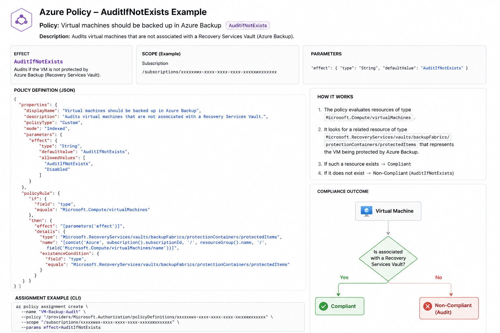

[Azure](https://github.com/magnum31415/wiki/blob/main/azure.md)

## Index

- [Minimum Azure Policy JSON](#minimum-azure-policy-json)
- [Required fields](#required-fields)
- [Common optional fields](#common-optional-fields)
- [Typical (but not minimal) policy example](#typical-but-not-minimal-policy-example)
- [Summary](#summary)
- [Azure Service Endpoint Policy (AZ-104)](#azure-service-endpoint-policy-az-104)
- [Azure Policy Effects](#azure-policy-effects)
- [Recursos y conceptos de Azure que contienen "Policy" (AZ-104)](#recursos-y-conceptos-de-azure-que-contienen-policy-az-104)
---
## Where Policy definitions can be assigned?

Policy definitions can be assigned at any level in the Azure hierarchy, including the tenant root group, management groups, subscriptions,  resource groups, and individual resource.

Policy Assignment → se puede hacer en cualquier nivel de la jerarquía.

It should be noted that policy cannot be applied to an individual resource from the Azure Portal, however, it can be done via Azure CLI or PowerShell.

| Scope               | ¿Se puede asignar una Policy? | Azure Portal                                  | PowerShell | Azure CLI | Efecto                                                         |
| ------------------- | ----------------------------- | --------------------------------------------- | ---------- | --------- | -------------------------------------------------------------- |
| Tenant Root Group   | ✅ Sí                          | ✅                                             | ✅          | ✅         | Afecta a todos los Management Groups, subscriptions y recursos |
| Management Group    | ✅ Sí                          | ✅                                             | ✅          | ✅         | Afecta a todas las subscriptions y recursos descendientes      |
| Subscription        | ✅ Sí                          | ✅                                             | ✅          | ✅         | Afecta a todos los Resource Groups y recursos                  |
| Resource Group      | ✅ Sí                          | ✅                                             | ✅          | ✅         | Afecta a todos los recursos del RG                             |
| Resource individual | ✅ Sí                          | ⚠️ No directamente desde el selector estándar | ✅          | ✅         | Afecta únicamente a ese recurso                                |


## Exclusiones de Azure Policy

Al asignar una Azure Policy, se pueden excluir determinados ámbitos de la evaluación de la policy.

Las exclusiones se configuran mediante: `` Not scopes ``

Una exclusión puede aplicarse a:

| Nivel             | Asignar Policy | Excluir |
| ----------------- | -------------- | ------- |
| Tenant Root Group | ✅              | ❌       |
| Management Group  | ✅              | ✅       |
| Subscription      | ✅              | ✅       |
| Resource Group    | ✅              | ✅       |
| Resource          | ✅              | ✅       |


**Recursos que pueden especificarse como exclusiones**

- Management Group
- Subscription
- Resource Group
- Resource

El ``Tenant Root Group`` no puede especificarse como exclusión.

## Minimum Azure Policy JSON

The **minimum valid JSON document for an Azure Policy** requires only `properties`, `displayName`, and `policyRule` with an `if` condition and a `then` effect.

```json
{
  "properties": {
    "displayName": "Minimal policy",
    "policyRule": {
      "if": {
        "field": "type",
        "equals": "Microsoft.Resources/subscriptions/resourceGroups"
      },
      "then": {
        "effect": "deny"
      }
    }
  }
}
```

## Required fields

- **properties**
- **displayName**
- **policyRule**
- **if**
- **then.effect**

## Common optional fields

These fields are commonly included but are **not required**:

```json
"description": "Policy description",
"mode": "All",
"parameters": {}
```

## Typical (but not minimal) policy example

```json
{
  "properties": {
    "displayName": "Deny specific resource type",
    "description": "Example policy",
    "mode": "All",
    "policyRule": {
      "if": {
        "field": "type",
        "equals": "Microsoft.Compute/virtualMachines"
      },
      "then": {
        "effect": "deny"
      }
    }
  }
}
```

## Summary

The **absolute minimal structure** for an Azure Policy is:

- `properties`
- `displayName`
- `policyRule`
- `if`
- `then.effect`

---
# Azure Service Endpoint Policy (AZ-104)

---

# Qué es Service Endpoint Policy

`Service Endpoint Policy` es una feature avanzada de red Azure relacionada con:

```text
Virtual Network Service Endpoints
```

y sirve para:

```text
restringir a qué recursos PaaS concretos
puede acceder una subnet
```

---

# Qué hace un Service Endpoint normal

Un:

```text
Service Endpoint
```

permite que una subnet acceda de forma privada/optimizada a servicios PaaS Azure:

- Storage Accounts
- SQL
- CosmosDB
- etc.

SIN usar Internet pública.

---

# Problema del Service Endpoint normal

Si habilitas:

```text
Microsoft.Storage
```

en una subnet:

↓

esa subnet puede acceder a:

```text
CUALQUIER Storage Account Azure
```

(si firewall/ACL lo permiten).

---

# Qué añade Service Endpoint Policy

Permite restringir:

```text
qué Storage Accounts específicas
pueden usarse
```

desde esa subnet.

---

# Ejemplo práctico

## Sin Policy

Subnet:

```text
subnet-app
```

↓

Puede acceder a:

- storage1
- storage2
- storage-random-external

---

## Con Service Endpoint Policy

Policy:

```text
solo storage-finance-prod
```

↓

Ahora la subnet SOLO puede acceder a:

```text
storage-finance-prod
```

---

# Concepto clave

Service Endpoint Policy añade:

```text
control granular
```

sobre:

```text
Service Endpoints
```

---

# Servicios soportados

| Servicio | Compatible |
|---|---|
| Azure Storage | ✅ |
| Otros servicios | Muy limitado/no común |

---

# Arquitectura conceptual

```text
Subnet
   ↓
Service Endpoint
   ↓
Service Endpoint Policy
   ↓
Allowed Storage Accounts
```

---

# Por qué tiene región

Porque:

```text
Service Endpoint Policies son recursos regionales
```

igual que:
- VNets
- NSGs
- Route Tables

---

# Relación con VNets

La policy se asocia a:

```text
subnets concretas
```

y las subnets pertenecen a:

```text
VNets regionales
```

---

# Importante examen

La policy debe existir en:

```text
la misma región que la VNet/subnet
```

---

# Ejemplo

## VNet

```text
West Europe
```

↓

La:

```text
Service Endpoint Policy
```

también debe estar en:

```text
West Europe
```

---

# Muy importante examen

La región de la policy:

```text
NO depende del Storage Account
```

depende de:

```text
la VNet/subnet
```

---

# Trampa típica AZ-104

Pensar que:

```text
la policy debe estar en la región del Storage Account
```

❌ Incorrecto.

---

# Diferencia importante

| Feature | Función |
|---|---|
| Service Endpoint | Conectar subnet a servicio Azure |
| Service Endpoint Policy | Restringir recursos permitidos |

---

# Comparación con Private Endpoint

| Feature | Nivel |
|---|---|
| Service Endpoint | Servicio PaaS completo |
| Service Endpoint Policy | Filtrado granular |
| Private Endpoint | NIC privada directa |

---

# Caso típico uso

## Empresa

Subnet producción:

```text
subnet-prod
```

↓

Solo debe acceder a:

```text
storage-prod-company
```

NO:
- storage externos
- otras subscripciones
- storage personales

↓

Se usa:

```text
Service Endpoint Policy
```

---

# Regla rápida examen

```text
Service Endpoint Policies restrict which Azure Storage accounts can be accessed through a Service Endpoint.
```

---

# Frases clave AZ-104

```text
Service Endpoint Policies provide granular access control for Service Endpoints.
```

```text
Service Endpoint Policies are regional resources.
```

```text
The policy region must match the VNet/subnet region.
```

---
# Azure Policy Effects

Azure Policy tiene más efectos de los que normalmente se ven. Para el AZ-104 y para una Azure Landing Zone, estos son los importantes:

| Effect                       | ¿Bloquea? |       ¿Modifica?      | ¿Despliega? | ¿Audita? | Uso típico                                                     |
| ---------------------------- | :-------: | :-------------------: | :---------: | :------: | -------------------------------------------------------------- |
| **Deny**                     |     ✅     |           ❌           |      ❌      |     ❌    | Impedir crear recursos no conformes.                           |
| **Audit**                    |     ❌     |           ❌           |      ❌      |     ✅    | Marcar recursos como Non-Compliant.                            |
| **AuditIfNotExists**         |     ❌     |           ❌           |      ❌      |     ✅    | Auditar que exista un recurso o configuración relacionada.     |
| **DeployIfNotExists (DINE)** |     ❌     |           ❌           |      ✅      |     ✅    | Desplegar automáticamente un recurso o configuración si falta. |
| **Modify**                   |     ❌     |           ✅           |      ❌      |     ✅    | Modificar propiedades del recurso durante el despliegue.       |
| **Append**                   |     ❌     | ✅ (añade propiedades) |      ❌      |     ✅    | Añadir automáticamente propiedades al recurso.                 |
| **Disabled**                 |     ❌     |           ❌           |      ❌      |     ❌    | Desactivar temporalmente la política.                          |

## Ejemplo de  AuditIfNotExists

upongamos una política: ``"Las máquinas virtuales deben estar protegidas por Azure Backup."``

La evaluación sería:

````
Virtual Machine
        │
        ▼
¿Existe una asociación con un Recovery Services Vault?
        │
   ┌────┴────┐
   │         │
  Sí         No
   │         │
   ▼         ▼
Compliant  Non-Compliant
````

La VM sigue funcionando perfectamente.

La política únicamente informa de que no existe una protección de backup.



---
# Recursos y conceptos de Azure que contienen "Policy" (AZ-104)

| Recurso / Entidad | Servicio | ¿Para qué sirve? | Ejemplo |
|-------------------|----------|------------------|----------|
| **Azure Policy** | Governance | Auditar, aplicar o denegar configuraciones de recursos Azure. | Denegar la creación de **Public IPs** o permitir únicamente las regiones **Germany West Central** y **Sweden Central**. |
| **Policy Definition** | Azure Policy | Define la regla o política. | Crear una definición llamada **Allowed Locations** que solo permita desplegar recursos en dos regiones. |
| **Policy Assignment** | Azure Policy | Asigna una Policy a un Management Group, Subscription, Resource Group o Resource. | Asignar la Policy **Allowed Locations** a toda una suscripción. |
| **Policy Initiative (Policy Set Definition)** | Azure Policy | Agrupa varias Policy Definitions en una única iniciativa. | Crear una iniciativa llamada **Corporate Governance** que incluya *Allowed Locations*, *Required Tags* y *Deny Public IP*. |
| **Service Endpoint Policy** | Networking | Restringe a qué recursos de Azure Storage puede acceder una subnet mediante Service Endpoints. | Permitir que la subnet solo pueda acceder al **StorageAccount-Backups**, aunque tenga habilitado `Microsoft.Storage`. |
| **Azure Firewall Policy** | Networking | Configuración centralizada de reglas de Azure Firewall. | Crear reglas para permitir **HTTPS**, bloquear **FTP** y publicar un servidor mediante **DNAT**. |
| **WAF Policy** | Application Gateway / Front Door | Reglas de protección del Web Application Firewall (OWASP, reglas personalizadas, exclusiones, rate limiting, etc.). | Bloquear ataques **SQL Injection** y **Cross-Site Scripting (XSS)** mediante las reglas OWASP. |
| **Backup Policy** | Azure Backup | Define la programación de las copias de seguridad y el período de retención. | Realizar un backup diario a las **23:00** y conservarlo durante **30 días**. |
| **Storage Management Policy (Lifecycle Management Policy)** | Azure Storage | Automatiza el ciclo de vida de los blobs (mover a Cool, Cold, Archive o eliminar blobs automáticamente según reglas). | Mover los blobs a **Cool** tras **30 días**, a **Archive** tras **180 días** y eliminarlos tras **7 años**. |
| **Immutable Storage Policy (WORM Policy)** | Azure Storage | Impide modificar o eliminar los datos durante un período determinado (**Time-based Retention**) o indefinidamente (**Legal Hold**). | Proteger documentos financieros durante **10 años** para cumplir requisitos legales. |
| **DCR (Data Collection Rule)** *(no contiene "Policy")* | Azure Monitor | Define qué datos recoge Azure Monitor Agent y a dónde enviarlos. Se suele confundir con una Policy, pero no lo es. | Recoger los **IIS Logs** de todas las VMs y enviarlos a un **Log Analytics Workspace**. |

---

> [!IMPORTANT]
> **Claves para el AZ-104**
>
> No confundas estos conceptos:
>
> - **Azure Policy** → Gobierno y cumplimiento (**Governance**).
> - **Azure Firewall Policy** → Configuración del **Azure Firewall**.
> - **Service Endpoint Policy** → Restringe el acceso desde una **Subnet** a recursos específicos de Azure Storage.
> - **Storage Management Policy** → Automatiza el ciclo de vida de los **Blob Storage**.
> - **Immutable Storage Policy (WORM)** → Protege los blobs para que no puedan modificarse ni eliminarse.
