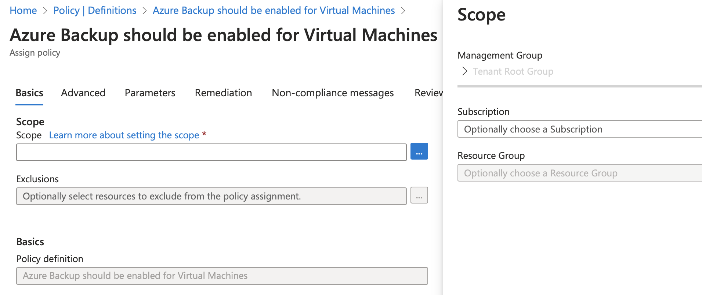

[Azure](https://github.com/magnum31415/wiki/blob/main/azure.md)

# Azure Policy

# 📑 Índice

1. [Azure Policy](#azure-policy)

2. [¿A qué se puede asignar una Azure Policy?](#-a-qué-se-puede-asignar-una-azure-policy)

3. [Tipos de efectos (Effects) en Azure Policy](#-qué-tipos-de-efectos-effects-tiene-azure-policy)
   - [Principales efectos](#principales-efectos)
   - [Regla mental para examen](#regla-mental-para-examen)

4. [¿Cuándo se evalúa una Azure Policy?](#-cuándo-se-evalúa-una-azure-policy)
   - [En tiempo de creación o modificación (Request time)](#1️⃣-en-tiempo-de-creación-o-modificación-request-time)
   - [Evaluación periódica (Compliance scan)](#2️⃣-evaluación-periódica-compliance-scan)

5. [Orden correcto para aplicar Remediation](#orden-correcto-para-aplicar-remediation)
   - [Versión corta perfecta para examen](#versión-corta-perfecta-para-examen)
   - [Crear o seleccionar la Policy Definition](#1️⃣-crear-o-seleccionar-la-policy-definition)
   - [Crear la Policy Assignment](#2️⃣-crear-la-policy-assignment-muy-importante)
   - [Conceder permisos a la Managed Identity](#3️⃣-conceder-permisos-a-la-managed-identity)
   - [Esperar evaluación o forzar compliance scan](#4️⃣-esperar-evaluación-o-forzar-compliance-scan)
   - [Crear la Remediation Task](#5️⃣-crear-la-remediation-task)


## 🔵 ¿A qué se puede asignar una Azure Policy?

Una Azure Policy se puede asignar en cualquier nivel del scope jerárquico de Azure.

| Nivel                  | ¿Se puede asignar? | Qué implica                                   |
| ---------------------- | ------------------ | --------------------------------------------- |
| **Management Group**   | ✅ Sí               | Aplica a todas las suscripciones debajo       |
| **Subscription**       | ✅ Sí               | Aplica a todos los recursos de la suscripción |
| **Resource Group**     | ✅ Sí               | Solo afecta a ese RG                          |
| **Recurso individual** | ✅ Sí               | Solo ese recurso                              |





**Azure tiene jerarquía:**
````
Tenant
 └── Management Group
      ├── Management Group
      └── Subscription
           └── Resource Group
                └── Resource
````

La policy **hereda hacia abajo**.

- Si la asignas en:
  - Management Group → impacta todo lo que cuelgue debajo.
  - Subscription → impacta toda la suscripción.
  - Resource Group → solo ese grupo.
 

| Nivel                | Puede contener dentro                        | Notas clave examen                                                |
| -------------------- | -------------------------------------------- | ----------------------------------------------------------------- |
| **Tenant**           | Management Groups                            | Nivel más alto. Representa la organización en Microsoft Entra ID. |
| **Management Group** | Management Groups (anidados) y Subscriptions | Permite jerarquía. Las policies y RBAC heredan hacia abajo.       |
| **Subscription**     | Resource Groups                              | Límite de facturación y aislamiento lógico.                       |
| **Resource Group**   | Resources                                    | Agrupa recursos relacionados para gestión conjunta.               |
| **Resource**         | — (no contiene nada)                         | Es el nivel más bajo (VM, Storage, VNet, etc.).                   |

  

## 🔵 ¿Qué tipos de efectos (Effects) tiene Azure Policy?

**Principales efectos**

| Effect                | Qué hace                                                | Uso típico                               |
| --------------------- | ------------------------------------------------------- | ---------------------------------------- |
| **Deny**              | Bloquea la creación o modificación del recurso          | Impedir recursos no permitidos           |
| **Audit**             | Permite el recurso pero lo marca como no compliant      | Control y monitorización                 |
| **Append**            | Añade propiedades automáticamente                       | Añadir tags obligatorios                 |
| **Modify**            | Modifica propiedades en creación/actualización          | Corregir configuraciones automáticamente |
| **DeployIfNotExists** | Despliega recursos automáticamente si no existen        | Instalar agente, habilitar diagnóstico   |
| **AuditIfNotExists**  | Marca como no compliant si falta un recurso relacionado | Verificar configuración                  |
| **Disabled**          | No aplica la policy                                     | Desactivar temporalmente                 |

Los Effects definen qué hace la policy cuando detecta que una condición se cumple.

**Regla mental para examen**

- Si lees:
  - “Administrator must fix non-compliant resources” → Es Audit
  - “Automatically fix missing configuration” → Es Modify o DeployIfNotExists
  - “Prevent creation” → Es Deny

## 🔵 ¿Cuándo se evalúa una Azure Policy?

Una policy se evalúa en dos momentos principales:

### 1️⃣ En tiempo de creación o modificación (Request time)

- Cuando:
  - Creas un recurso
  - Modificas un recurso existente

👉 Azure evalúa la policy antes de confirmar la operación.

- Aquí aplican efectos como:
  - Deny
  - Append
  - Modify

Si es Deny, bloquea la operación inmediatamente.

### 2️⃣ Evaluación periódica (Compliance scan)

Azure también ejecuta evaluaciones periódicas automáticas.

- Aproximadamente cada 24 horas
- También puedes forzarla manualmente

Aquí aplican efectos como:

- Audit
- AuditIfNotExists
- DeployIfNotExists

Esto sirve para:

- Detectar recursos ya existentes que no cumplen
- Marcar estado de compliance


| Momento                  | Qué ocurre            |
| ------------------------ | --------------------- |
| Antes de crear/modificar | Puede bloquear (Deny) |
| Evaluación periódica     | Solo marca compliance |


## Orden correcto para aplicar Remediation

### Versión corta perfecta para examen
````
1. Policy Definition (Modify / DeployIfNotExists)
2. Policy Assignment (con Managed Identity)
3. Asignar permisos a la Identity
4. Crear Remediation Task
````

### 1️⃣ Crear o seleccionar la Policy Definition

Debe tener effect:
- Modify
- DeployIfNotExists

Sin esto no hay remediation posible.

### 2️⃣ Crear la Policy Assignment (MUY IMPORTANTE)

Aquí es donde realmente empieza todo.

En la asignación:
- Defines el scope (MG / Subscription / RG)
- Configuras parámetros
- **Habilitas Managed Identity**

⚠️ La Managed Identity se configura en la assignment, no en la definition.

### 3️⃣ Conceder permisos a la Managed Identity

La identity necesita permisos sobre los recursos que va a modificar.

Normalmente:

- Contributor
- O un rol específico mínimo necesario

Sin esto → remediation falla.

### 4️⃣ Esperar evaluación o forzar compliance scan

Se detectan recursos non-compliant.

### 5️⃣ Crear la Remediation Task

Desde: `` Policy → Compliance → Remediation``

Azure ejecuta la corrección.
