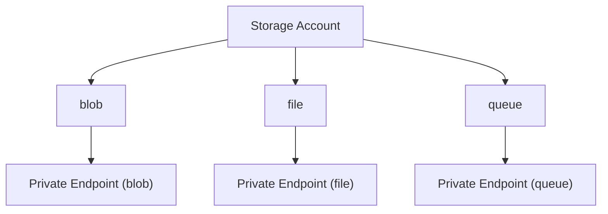

[Azure](https://github.com/magnum31415/wiki/blob/main/azure.md)

# ¿Qué tipos de Private Endpoint existen?

En realidad **solo existe un tipo de recurso:**

```text
Microsoft.Network/privateEndpoints
```

Lo que cambia es **el servicio Azure al que se conecta**.

## Servicios más habituales (AZ-104)

| Servicio Azure | Soporta Private Endpoint |
|---------------|--------------------------|
| Storage Account | ✅ Sí |
| Azure SQL Database | ✅ Sí |
| Cosmos DB | ✅ Sí |
| Azure Key Vault | ✅ Sí |
| Recovery Services Vault | ✅ Sí |
| Azure Monitor (AMPLS) | ✅ Sí |
| Log Analytics Workspace (a través de AMPLS) | ✅ Sí |
| Azure Container Registry | ✅ Sí |
| App Service | ✅ Sí |
| Event Hub | ✅ Sí |
| Service Bus | ✅ Sí |
| Azure Automation | ✅ Sí |
| Azure AI Services | ✅ Sí |
| Azure Database for PostgreSQL | ✅ Sí |
| Azure Database for MySQL | ✅ Sí |
| SQL Managed Instance | ❌ Utiliza un modelo de red diferente |

---

# Subrecursos (Group IDs)

Algunos servicios permiten crear Private Endpoints para distintos subrecursos.

## Ejemplo: Storage Account

| Group ID | Servicio |
|-----------|----------|
| `blob` | Blob Storage |
| `file` | Azure Files |
| `queue` | Queue Storage |
| `table` | Table Storage |
| `dfs` | Data Lake Storage Gen2 |
| `web` | Static Website |

Visualmente:





---

# Ejemplos típicos

## Storage Account

```text
Azure VM
    │
    ▼
Private Endpoint
    │
    ▼
Blob Storage
```

---

## Azure Key Vault

```text
Azure VM
    │
    ▼
Private Endpoint
    │
    ▼
Azure Key Vault
```

---

## Azure SQL Database

```text
Azure VM
    │
    ▼
Private Endpoint
    │
    ▼
Azure SQL Database
```

---

## Azure Monitor

```text
Azure VM
    │
    ▼
Private Endpoint
    │
    ▼
Azure Monitor Private Link Scope (AMPLS)
    │
    ▼
Log Analytics Workspace
```
