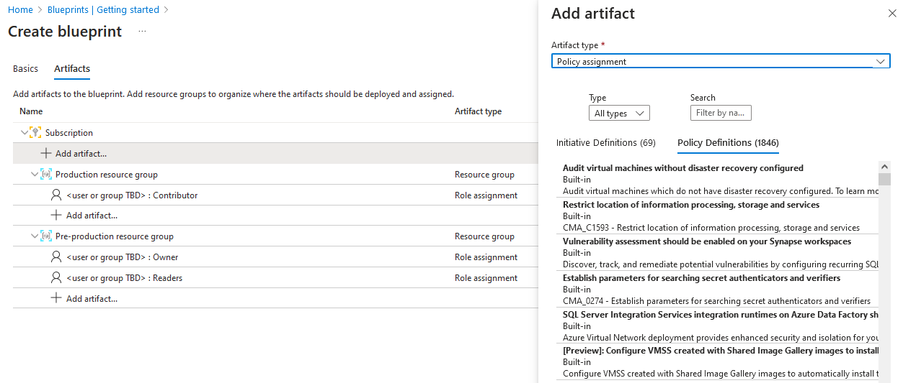
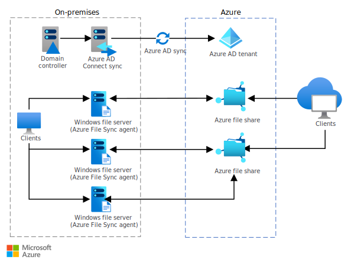

[Azure](https://github.com/magnum31415/wiki/blob/main/azure.md)

# 📚 Resumen comparativo de servicios Azure

## 📑 Índice

- [Tabla comparativa rápida](#tabla-comparativa-rápida)
- [Azure Analysis Services](#azure-analysis-services)
- [Azure Arc](#azure-arc)
- [Azure Automation](#azure-automation)
- [Azure Backup](#azure-backup)
- [Azure Blueprints](#azure-blueprints)
- [Azure Data Box](#azure-data-box)
- [Azure Data Box Edge](#azure-data-box-edge)
- [Azure Data Box Gateway](#azure-data-box-gateway)
- [Azure Data Factory](#azure-data-factory)
- [Azure Data Lake Storage](#azure-data-lake-storage)
- [Azure Database Migration Service](#azure-database-migration-service)
- [Azure DevOps](#azure-devops)
- [Azure Event Hubs](#azure-event-hubs)
- [Azure File Sync](#azure-file-sync)
- [Azure Functions](#azure-functions)
- [Azure Import/Export service](#azure-importexport-service)
- [Azure Logic Apps](#azure-logic-apps)
- [Azure Logs Analytics](#azure-logs-analytics)
- [Azure Logs Analytics Workspace](#azure-logs-analytics-workspace)
- [Azure Migrate](#azure-migrate)
- [Azure Monitor](#azure-monitor)
- [Azure Monitor Activity Log](#azure-monitor-activity-log)
- [Azure Notification Hubs](#azure-notification-hubs)
- [Azure Resource Manager](#azure-resource-manager)
- [Azure Service Bus](#azure-service-bus)
- [Azure Stack Hub](#azure-stack-hub)
- [Azure Storage Explorer](#azure-storage-explorer)
- [Azure Storage Sync](#azure-storage-sync)
- [Azure Stream Analytics](#azure-stream-analytics)
- [Azure Synapse Analytics](#azure-synapse-analytics)
- [AzCopy](#azcopy)
- [Role-based access control (RBAC)](#role-based-access-control-rbac)

---

# 📊 Tabla comparativa rápida

| Servicio | Resumen en pocas palabras | Propósito principal | Orientado a |
|----------|--------------------------|--------------------|-------------|
| Azure Analysis Services | Motor tabular BI | Modelos analíticos | BI |
| Azure Arc | Gestión híbrida | Gobierno centralizado | Infra |
| Azure Automation | Runbooks cloud | Automatización | DevOps |
| Azure Backup | Backup gestionado | Protección datos | DR |
| Azure Blueprints | Plantillas governance | Estándares | Governance |
| Azure Data Box | Migración física | Transferencia offline | Migración |
| Azure Data Box Edge | Edge + transferencia | Procesamiento local | Edge |
| Azure Data Box Gateway | Gateway virtual híbrido | Cache + subida | Híbrido |
| Azure Data Factory | ETL/ELT cloud | Integración datos | Data |
| Azure Data Lake Storage | Data lake escalable | Big Data | Analytics |
| Azure Database Migration Service | Migración bases datos | Migración DB | Migración |
| Azure DevOps | CI/CD | Dev lifecycle | DevOps |
| Azure Event Hubs | Streaming masivo | Ingesta eventos | Big Data |
| Azure File Sync | Sincroniza file servers | Extensión Azure Files | Híbrido |
| Azure Functions | Compute serverless | Ejecución por eventos | Serverless |
| Azure Import/Export service | Discos físicos | Migración offline | Migración |
| Azure Logic Apps | Workflows low-code | Integración procesos | Integración |
| Azure Logs Analytics | Consulta logs (KQL) | Análisis logs | Monitor |
| Azure Logs Analytics Workspace | Contenedor logs | Centralización | Monitor |
| Azure Migrate | Evaluación + migración | Migración infra | Migración |
| Azure Monitor | Métricas + logs + alertas | Observabilidad | Operaciones |
| Azure Monitor Activity Log | Log de cambios Azure | Auditoría | Seguridad |
| Azure Notification Hubs | Push móvil | Notificaciones masivas | Usuarios |
| Azure Resource Manager | Motor despliegue | IaC | Infra |
| Azure Service Bus | Mensajería enterprise | Comunicación apps | Backend |
| Azure Stack Hub | Azure on-prem | Extensión híbrida | Infra |
| Azure Storage Explorer | Cliente GUI storage | Gestión blobs | Storage |
| Azure Storage Sync | Sincroniza storage | Extensión Azure Files | Híbrido |
| Azure Stream Analytics | Procesamiento stream en tiempo real | Transformación eventos | Big Data |
| Azure Synapse Analytics | Plataforma analítica unificada | Data warehouse + Big Data | Analytics |
| AzCopy | CLI transferencia | Copia masiva | Storage |
| RBAC | Control acceso granular | Seguridad | Seguridad |

---
### 🔝 [Volver al índice](#-índice)
## Azure Analysis Services

PaaS para modelos tabulares empresariales (semantic layer).  
En AZ-305 debes asociarlo con soluciones BI centralizadas y rendimiento en consultas analíticas.

---

### 🔝 [Volver al índice](#-índice)
## Azure Arc

Extiende gestión Azure a on-prem y multi-cloud sin mover recursos.  
Clave para gobierno, Azure Policy y administración híbrida.

---

### 🔝 [Volver al índice](#-índice)
## Azure Automation

Automatiza tareas mediante runbooks (PowerShell/Python).  
Usado para mantenimiento, apagado de VMs y automatización operativa.

---

### 🔝 [Volver al índice](#-índice)
## Azure Backup

Servicio gestionado de backup con retención configurable.  
En arquitectura se usa para protección de VMs, SQL y cargas críticas.

---

### 🔝 [Volver al índice](#-índice)
## Azure Blueprints

Define entornos estandarizados combinando ARM, RBAC y Policy.  
Importante en escenarios enterprise con compliance y landing zones.

**¿Para qué sirven realmente los Azure Blueprints?**

``Estandarizar y automatizar la creación de suscripciones seguras y gobernadas.``

Piensa en esto:

- Cuando creas una nueva suscripción en una empresa, normalmente necesitas:
  - Políticas obligatorias
  - RBAC preconfigurado
  - Resource Groups creados
  - Networking base
  - Tags obligatorios
- En vez de hacerlo manualmente cada vez…
  - 👉 Usas un Blueprint.

**Analogía simple**

 `` Blueprint = plantilla corporativa de suscripción``

**Qué puede incluir un Blueprint**

- Azure Policy
- Role Assignments
- ARM templates
- Resource Groups

**🎯 Ejemplo real**

Empresa crea un Blueprint llamado:

``Corp-Standard-Subscription``

- Incluye:
  - Policy: Solo regiones EU
  - Policy: Tags obligatorios
  - RBAC: Security Team como Reader
  - Resource Group: Networking
  - VNet base
-Cada vez que crean una nueva suscripción:
  - → La asignan al Blueprint
  - → Todo se despliega automáticamente

**Azure Blueprints tiene dos partes principales:**

  1. **Blueprint Definition**  Define qué se va a desplegar y gobernar.
  2. **Blueprint Assignment**  Es cuando aplicas la definición (Sólo  a nivel de Subscription)
   
**Donde se pueden aplicar**

| Componente           | Se crea en                      | Se aplica en |
| -------------------- | ------------------------------- | ------------ |
| Blueprint Definition | Management Group o Subscription | —            |
| Blueprint Assignment | —                               | Subscription |

**🧠 Regla mental examen**

- Definition → nivel organizativo (MG recomendado)
- Assignment → nivel operativo (Subscription)

---

### 🔝 [Volver al índice](#-índice)
## Azure Data Box

Dispositivo físico para mover grandes volúmenes de datos offline.  
Se elige cuando el ancho de banda es limitado.

---

### 🔝 [Volver al índice](#-índice)
## Azure Data Box Edge

Dispositivo físico con capacidad de procesamiento local (GPU opcional).  
Ideal para edge computing y preprocesado antes de enviar a Azure.

---

### 🔝 [Volver al índice](#-índice)
## Azure Data Box Gateway

Gateway virtual con caché local que sube datos a Azure Storage.  
Se usa en escenarios híbridos y DR con transferencia continua.

---

### 🔝 [Volver al índice](#-índice)
## Azure Data Factory

Servicio ETL/ELT para integrar y transformar datos.  
En arquitectura se usa para pipelines de datos y migraciones complejas.

---

### 🔝 [Volver al índice](#-índice)
## Azure Data Lake Storage

Almacenamiento optimizado para Big Data y analítica masiva.  
Clave en soluciones de analytics con Synapse, Databricks o Spark.

---

### 🔝 [Volver al índice](#-índice)
## Azure Database Migration Service

Migra bases de datos online u offline con mínimo downtime.  
Se elige cuando se necesita transición controlada a PaaS o Azure VM.

---

### 🔝 [Volver al índice](#-índice)
## Azure DevOps

Plataforma CI/CD con repositorios, pipelines y boards.  
En AZ-305 aparece en escenarios de automatización y despliegue.

---

### 🔝 [Volver al índice](#-índice)
## Azure Event Hubs

Servicio de streaming masivo para ingestión en tiempo real.  
Se diferencia de Service Bus por volumen y orientación a Big Data.

---

### 🔝 [Volver al índice](#-índice)
## Azure File Sync

Sincroniza file servers locales con Azure Files.  
Permite cloud tiering y extensión híbrida del almacenamiento.

---

### 🔝 [Volver al índice](#-índice)
## Azure Functions

Compute serverless orientado a eventos.  
Modelos: Consumption (pago por uso), Premium (sin cold start), Dedicated (App Service).

---

### 🔝 [Volver al índice](#-índice)
## Azure Import/Export service

Permite enviar discos físicos a Azure para migraciones offline.  
Alternativa cuando Data Box no está disponible.

---

### 🔝 [Volver al índice](#-índice)
## Azure Logs Analytics

Servicio para consultar logs con KQL.  
Parte fundamental de Azure Monitor para troubleshooting.

---

### 🔝 [Volver al índice](#-índice)
## Azure Logs Analytics Workspace

Contenedor lógico donde se almacenan logs.  
Diseño arquitectónico clave para centralización y retención.

---

### 🔝 [Volver al índice](#-índice)
## Azure Migrate

Evalúa y migra VMs, apps y bases de datos.  
Primera herramienta que se usa en proyectos de migración.

---

### 🔝 [Volver al índice](#-índice)
## Azure Monitor

Servicio central de observabilidad (métricas, logs, alertas).  
En AZ-305 debes asociarlo con arquitectura resiliente y operativa.

---

### 🔝 [Volver al índice](#-índice)
## Azure Monitor Activity Log

Registra cambios en recursos Azure.  
Se usa para auditoría y compliance.

---

### 🔝 [Volver al índice](#-índice)
## Azure Notification Hubs

Servicio para enviar push notifications masivas a móviles.  
No es mensajería backend, sino comunicación con usuarios finales.

---

### 🔝 [Volver al índice](#-índice)
## Azure Resource Manager

Motor de despliegue de recursos mediante ARM templates.  
Base de Infraestructura como Código en Azure.

---

### 🔝 [Volver al índice](#-índice)
## Azure Service Bus

Mensajería enterprise (queues y topics).  
Se usa para desacoplar microservicios con entrega confiable.

---

### 🔝 [Volver al índice](#-índice)
## Azure Stack Hub

Permite ejecutar servicios Azure en tu datacenter.  
Clave en escenarios híbridos con requisitos regulatorios.

---

### 🔝 [Volver al índice](#-índice)
## Azure Storage Explorer

Cliente gráfico para gestionar blobs, files y tables.  
Herramienta operativa, no arquitectónica.

---

### 🔝 [Volver al índice](#-índice)
## Azure Storage Sync

Sincroniza almacenamiento local con Azure Files.  
Se usa para extender almacenamiento on-prem a la nube.

---

### 🔝 [Volver al índice](#-índice)
## AzCopy

CLI para copiar grandes volúmenes de datos a Azure Storage.  
Muy usado en migraciones y cargas masivas.

---

### 🔝 [Volver al índice](#-índice)
## Role-based access control (RBAC)

Modelo de autorización basado en Security Principal + Role + Scope.  
Clave en diseño de seguridad y gobierno en AZ-305.

---

### 🔝 [Volver al índice](#-índice)
## Azure Logic Apps

Servicio de integración y automatización basado en workflows low-code.  
Se usa para integrar sistemas (SaaS, on-prem, APIs) sin escribir código complejo.

---

### 🔝 [Volver al índice](#-índice)
## Azure Stream Analytics

Motor de procesamiento de eventos en tiempo real mediante consultas SQL-like.  
Se usa junto a Event Hubs o IoT Hub para transformar y enrutar datos en streaming.

---

### 🔝 [Volver al índice](#-índice)
## Azure Synapse Analytics

Plataforma analítica unificada que combina Data Warehouse, Spark y Data Lake.  
Clave en arquitecturas de Big Data y análisis empresarial a gran escala.

---
