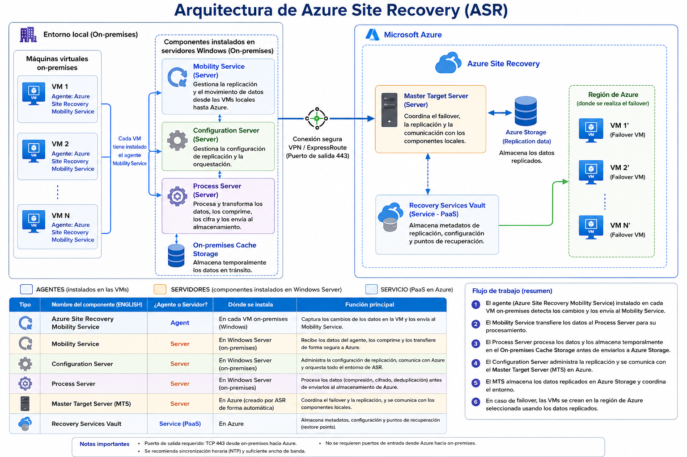
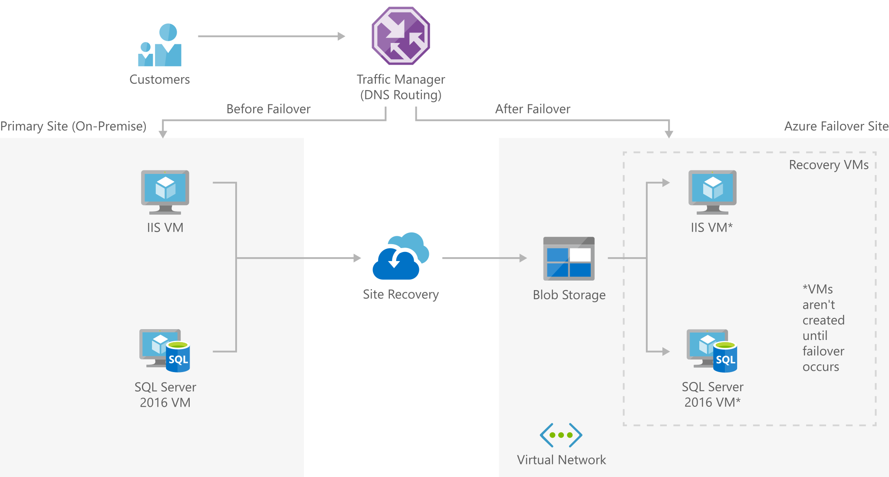
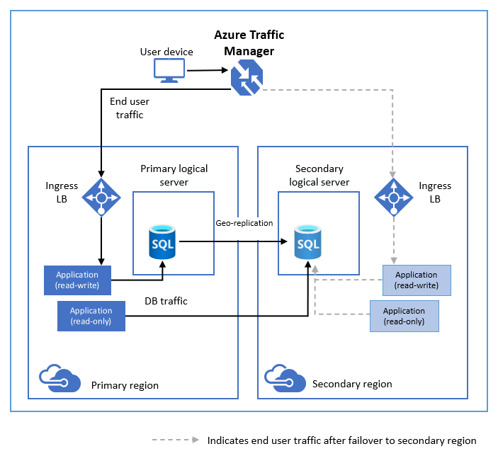

[Azure](https://github.com/magnum31415/wiki/blob/main/azure.md)


[→ Azure Site Recovery (ASR) - Migración de VMware On-Premises a Azure (AZ-104)](#azure-site-recovery-asr---migración-de-vmware-on-premises-a-azure-az-104)


# Azure Site Recovery 

Es un servicio de Disaster Recovery (DR) que replica máquinas (VMs o físicas) a otra ubicación para poder arrancarlas allí si el sitio principal falla.

- 👉 No es backup.
- 👉 No es alta disponibilidad local.

-🔹 Es **recuperación ante desastre completo.**

-🔹 ASR es principalmente para **replicación entre regiones**.

-🔹 **No está diseñado para replicación entre Availability Zones**.




  


**Resumen mental rápido**

````
Azure Site Recovery =
Replica VMs → No ejecuta VMs secundarias → Arranca solo si hay desastre → Permite failback → DR completo
````




| Característica | Azure Site Recovery |
|---------------|--------------------|
| Tipo de servicio | Disaster Recovery (DR) |
| ¿Es Backup? | ❌ No |
| ¿Es Alta Disponibilidad local (HA)? | ❌ No |
| Objetivo principal | Recuperación ante desastre completo (datacenter o región) |
| Qué replica | Máquinas completas (VMs o físicas) |
| Nivel de replicación | Nivel de máquina (disco/infraestructura), no aplicación |
| Tipo de protección | Infraestructura completa |
| Regiones soportadas | Cualquier región Azure |
| Azure → Azure | ✅ Sí |
| On-prem → Azure | ✅ Sí |
| Azure Stack → Azure | ✅ Sí |
| Azure Public MEC | ✅ Sí |
| Servidores físicos | ✅ Sí |
| ¿Replica aplicaciones (SQL/IIS)? | ❌ No (replica VM completa) |
| ¿Mantiene VM secundaria encendida? | ❌ No |
| ¿Consume compute en secundario antes del failover? | ❌ No |
| ¿Dónde guarda datos replicados? | Azure Storage |
| RPO (Recovery Point Objective) | ~5 minutos (crash-consistent) |
| RPO con consistencia aplicación | ~1 hora (application-consistent) |
| RTO (Recovery Time Objective) | Normalmente < 15 minutos |
| Failover por defecto | Manual |
| Planned failover | ✅ Sí |
| Unplanned failover | ✅ Sí |
| Failover automático nativo | ❌ No |
| Automatización posible | ✅ Con Azure Automation + Recovery Plans |
| Permite failback | ✅ Sí |
| Protección ante caída de región | ✅ Sí |
| Protección ante caída de VM individual | ❌ No (eso es HA) |
| Protección ante error lógico en DB | ❌ No |
| SLA | 99.9% para el servicio |
| Coste | Bajo mientras no hay failover (solo storage + replicación) |
| Tipo de consistencia | Crash-consistent y Application-consistent |
| Orquestación de recuperación | ✅ Recovery Plans |
| Test Failover sin impacto | ✅ Sí |

---

# 🧠 Diferencia clave frente a otras soluciones

| Servicio | Qué protege | Failover automático |
|-----------|-------------|--------------------|
| Availability Zones | Fallo de zona | ✅ Sí |
| SQL Availability Group | Base de datos | ✅ Sí |
| SQL Failover Group | Base de datos | ✅ Sí |
| Azure Site Recovery | Infraestructura completa (VMs) | ❌ No (manual por defecto) |

---

# 🎯 Resumen mental rápido

Azure Site Recovery =

Replica VMs → No ejecuta VMs secundarias → Arranca solo en desastre → Permite failback → DR completo de infraestructura

**🧠 Qué problema resuelve**

Si tu datacenter o región Azure cae:
1. Se activa failover
2. Las máquinas se arrancan en la ubicación secundaria
3. Cuando el primario vuelve, puedes hacer failback

**🏗 Qué puede replicar**

ASR puede gestionar replicación de:
- ✅ Azure VM → otra región Azure
- ✅ Azure Public MEC → región
- ✅ Azure Public MEC → otro MEC
- ✅ On-prem VMs
- ✅ Azure Stack VMs
- ✅ Servidores físicos

**⚙ Cómo funciona técnicamente**
- 1️⃣ Replica sin interceptar datos de aplicación
  No se mete en SQL, IIS, etc. Replica a nivel de máquina.

- 2️⃣ Guarda datos en Azure Storage
  Mientras replica:
  - Solo almacena discos
  - No crea VMs activas
  - No consume compute (coste más bajo)

- 3️⃣ Solo crea la VM en el momento del failover
  Por eso:
  - Es más barato que tener una VM secundaria encendida.

**🌍 DR global**

Puedes replicar entre **cualquier región Azure del mundo.**

Ejemplo:
- West Europe → East US
- France Central → North Europe

**⏱ RTO y RPO**
- RTO (Recovery Time Objective)
  - Tiempo para volver a operar = 👉 Normalmente < 15 minutos.
- RPO (Recovery Point Objective)
  - 🟢 Consistencia de aplicación → ~1 hora
  - 🔵 Consistencia tipo crash → ~5 minutos

**Diferencia clave con otras soluciones**
| Servicio             | Qué protege                                     |
| -------------------- | ----------------------------------------------- |
| Availability Zones   | Fallo de zona                                   |
| Failover Group (SQL) | Caída de región (solo DB)                       |
| Azure Site Recovery  | Caída completa de infraestructura (VMs enteras) |

**¿El failover en Azure Site Recovery es automático o manual?**

- 👉 Por defecto es manual.

Pero puedes configurarlo como:
- ✅ Planned failover (migración controlada)
- ⚠️ Unplanned failover (desastre real)
- 🤖 Automático → Solo si lo integras con Azure Automation + Recovery Plans
- ASR no hace failover automático “mágico” como un Availability Zone.

**🧠 ¿Qué problema resuelve realmente?**

- Resuelve esto:
  - “Mi datacenter entero o región Azure ha caído. Necesito arrancar todo en otro sitio.”
- No protege contra:
  - Caída de una VM individual (eso es HA local)
  - Fallo de disco puntual
  - Errores lógicos en base de datos
- Protege contra:
  - 🔥 Incendio en CPD
  - 🌍 Caída regional completa
  - 🧨 Desastre mayor

**🔄 Flujo real**

1. 1️⃣ Replicas continuamente las VMs al secundario
2. 2️⃣ El primario cae
3. 3️⃣ Tú (o un plan automatizado) ejecutas failover
4. 4️⃣ Azure crea las VMs en la región secundaria
5. 5️⃣ Cuando el primario vuelve → haces failback

**Diferencia clave**

| Servicio               | Failover automático real  |
| ---------------------- | ------------------------- |
| Zone Redundancy        | ✅ Sí                      |
| SQL Availability Group | ✅ Sí                      |
| Failover Group (SQL)   | ✅ Sí                      |
| Azure Site Recovery    | ❌ No (por defecto manual) |


## Virtual Machines:

Azure Site Recovery ensures continuous replication to a secondary Azure region, facilitating rapid service restoration in an alternate region during primary region outages.
This capability is critical for meeting the rapid recovery requirement.

## Azure SQL Database:

Active Geo-Replication offers real-time data replication to a secondary region, which is crucial for data protection.
Auto-failover groups enhance this by automating the failover process, which is essential for achieving rapid recovery with minimal manual intervention.

## Blob Storage:

GRS provides data replication to a secondary geographic location, ensuring data is protected against regional outages. 
RA-GRS adds the benefit of read access to the replicated data in the secondary region, ensuring data availability even if the primary region is compromised. Both features satisfy the requirement of storing the unstructured data in another region.



---

# Azure Site Recovery (ASR) - Migración de VMware On-Premises a Azure (AZ-104)

Cuando utilizas **Azure Site Recovery (ASR)** para migrar máquinas virtuales desde un entorno **VMware on-premises** a **Azure**, el proceso sigue siempre el mismo flujo.

---

# Arquitectura

```text
┌─────────────────────────────── On-Premises ───────────────────────────────┐

VM1 ─┐
VM2 ─┼──► Mobility Service (Agent)
VM3 ─┘

            │
            ▼

   Configuration Server
            │
            ▼
      Process Server
            │
            ▼
      HTTPS (TCP 443)
            │
            ▼

┌────────────────────────────── Microsoft Azure ────────────────────────────┐

Recovery Services Vault
        │
        ▼
Azure Storage (replicación)
        │
        ▼
Azure Virtual Network
        │
        ▼
Azure Virtual Machines
```

---

# Pasos de implementación

## Paso 1. Crear un Recovery Services Vault

Crear un:

```text
Recovery Services Vault
```

Será el punto central desde donde se administrará la replicación y el failover.

---

## Paso 2. Crear la infraestructura de destino en Azure

Crear:

- Virtual Network
- Subnets
- (Opcional) NSGs
- Resource Groups

Las máquinas virtuales migradas se desplegarán en esta VNet.

---

## Paso 3. Preparar el entorno VMware

Disponer de:

- VMware vCenter
- Hosts ESXi
- Máquinas virtuales

---

## Paso 4. Implementar el Configuration Server

Desplegar un servidor Windows que actuará como:

```text
Configuration Server
```

Funciones:

- Registrar el entorno VMware.
- Comunicarse con Azure.
- Administrar la replicación.

---

## Paso 5. Configurar el Process Server

El **Process Server** normalmente forma parte del Configuration Server.

Funciones:

- Recibir los datos replicados.
- Comprimirlos.
- Cifrarlos.
- Enviarlos a Azure.

---

## Paso 6. Instalar el Mobility Service

Instalar el agente:

```text
Azure Site Recovery Mobility Service
```

en **cada máquina virtual** que se quiera migrar.

Funciones:

- Detectar cambios en los discos.
- Enviar los cambios al Process Server.

---

## Paso 7. Registrar el entorno en Azure

Desde el **Recovery Services Vault**:

- Registrar el Configuration Server.
- Detectar VMware.
- Detectar las VMs.

---

## Paso 8. Configurar la replicación

Seleccionar:

- VM(s)
- Disco(s)
- Resource Group destino
- Virtual Network destino
- Subnet
- Tipo de almacenamiento

Y habilitar:

```text
Enable Replication
```

---

## Paso 9. Replicación inicial

Azure realiza la primera copia completa de los discos.

Después solo replica los cambios (replicación incremental).

---

## Paso 10. Test Failover

Ejecutar:

```text
Test Failover
```

Azure crea una VM temporal sin afectar a producción.

Permite validar:

- Arranque
- Red
- Aplicación
- Servicios

---

## Paso 11. Planned Failover / Migration

Cuando todo está validado:

```text
Planned Failover
```

o

```text
Migration
```

La VM se crea definitivamente en Azure.

---

## Paso 12. Complete Migration

Una vez verificado que todo funciona:

```text
Complete Migration
```

Se elimina la replicación.

La VM pasa a ejecutarse únicamente en Azure.

---

# Componentes utilizados

| Componente | Tipo | ¿Dónde se instala? | Función |
|------------|------|--------------------|---------|
| **Recovery Services Vault** | Servicio Azure | Azure | Administra la replicación y el failover. |
| **Azure Site Recovery Mobility Service** | **Agente** | En cada VM on-premises | Detecta cambios y replica los discos. |
| **Configuration Server** | **Servidor** | On-premises | Coordina toda la replicación con Azure. |
| **Process Server** | **Servidor** | On-premises | Comprime, cifra y envía los datos a Azure. |
| **Azure Virtual Network** | Servicio Azure | Azure | Red donde se desplegarán las VMs migradas. |

---

# Flujo completo

```text
1. Recovery Services Vault

↓

2. Azure Virtual Network

↓

3. Configuration Server

↓

4. Process Server

↓

5. Instalar Mobility Service en cada VM

↓

6. Registrar VMware

↓

7. Enable Replication

↓

8. Replicación inicial

↓

9. Replicación incremental

↓

10. Test Failover

↓

11. Planned Failover / Migration

↓

12. Complete Migration
```

---

> [!IMPORTANT]
> **Claves para el AZ-104**
>
> - El **Recovery Services Vault** es el primer recurso que se crea.
> - Antes de migrar, debe existir la **Virtual Network** de destino en Azure.
> - Cada VM on-premises debe tener instalado el **Azure Site Recovery Mobility Service**.
> - El **Configuration Server** coordina la replicación.
> - El **Process Server** comprime, cifra y envía los datos a Azure.
> - Tras la replicación inicial, ASR realiza **replicación continua (incremental)**, no copias de seguridad tradicionales.
