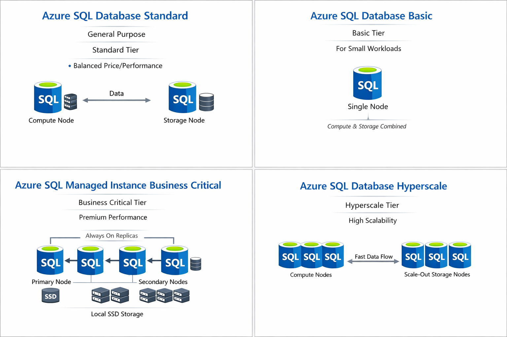
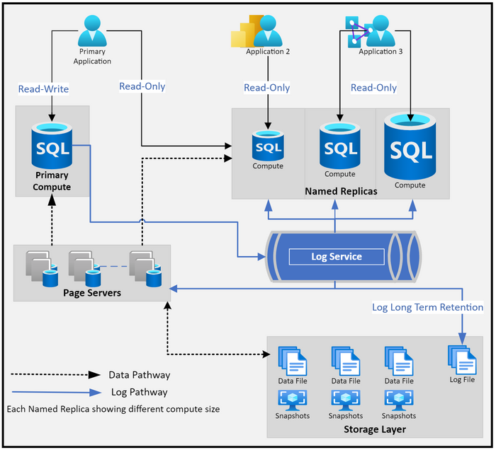

[Azure](https://github.com/magnum31415/wiki/blob/main/azure.md)
# Azure SQL Database 

Servicio PaaS basado en SQLServer totalmente gestionado 

---
# 📑 Índice

1. [Arquitectura Hyperscale](#arquitectura-de-azure-sql-database--hyperscale)
2. [Funcionalidades](#funcionalidades)
   - [Zone Redundancy](#azure-sql-database-with-zone-redundancy)
   - [Geo-replication](#geo-replication)
   - [Failover Group](#azure-sql-failover-group-o-auto-failover-group)
   - [Availability Group](#availability-group-ag)
   - [Tabla comparativa](#tabla-comparativa)
3. [Mapa Jerárquico de Azure SQL](#mapa-jerárquico-de-azure-sql-servicios-y-modelos-de-compra---servicios-paas)
4. [Guía de Selección PaaS](#guía-de-selección-de-azure-sql-según-requisitos-técnicos)
5. [Tabla Completa Comparativa](#tabla-completa-agrupada-por-servicio)
6. [PITR vs RPO vs RTO vs LTR](#comparativa-pitr-vs-rpo-vs-rto-vs-ltr)
7. [Guía Completa Selección (IaaS + PaaS)](#guía-de-selección-de-azure-sql--según-requisitos-técnicos--)
8. [DR](#dr)
9. [Árbol de Herramientas de Migración](#-árbol-de-herramientas-de-migración-a-azure-sql)
10. [Tabla comparativa herramientas migración Azure](#tabla-comparativa-herramientas-migracion-azure)
11.  [Azure Data Studio (ADS) vs SQL Server Management Studio (SSMS)](#azure-data-studio-ads-vs-sql-server-management-studio-ssms)


---




#  Arquitectura de Azure SQL Database – Hyperscale
🔝 [Volver al índice](#-índice)

La imagen representa la **arquitectura interna de Azure SQL Database en el tier Hyperscale**.

Hyperscale se caracteriza por separar **compute, log y almacenamiento**, permitiendo escalar cada componente de forma independiente.



## 🏗 Componentes principales

### 1️⃣ Primary Compute

- Nodo principal de base de datos.
- Atiende tráfico **Read-Write**.
- Ejecuta el motor SQL.
- No almacena físicamente todos los datos.

🔎 En Hyperscale el compute es desacoplado del storage.

---

### 2️⃣ Named Replicas (Read-Only)

- Réplicas adicionales de solo lectura.
- Cada una puede tener distinto tamaño de compute.
- Se usan para:
  - Escalar consultas analíticas
  - Reducir carga del primario
  - Separar workloads OLTP y reporting

✔ Tienen **read-only endpoints dedicados**.

---

### 3️⃣ Log Service

Es el corazón de Hyperscale.

- Recibe el transaction log del Primary.
- Replica los cambios a:
  - Page Servers
  - Named Replicas
- Permite recuperación rápida.

🔎 Diferencia clave:
En Hyperscale el log está desacoplado del compute.

---

### 4️⃣ Page Servers

- Almacenan los datos reales en páginas.
- Arquitectura distribuida.
- Permiten:
  - Escalado hasta 100 TB+
  - Acceso paralelo a datos
  - Snapshots rápidos

Cada Page Server gestiona un rango de datos.

---

### 5️⃣ Storage Layer

Incluye:

- Data files
- Log files
- Snapshots automáticos

✔ Los backups se basan en snapshots (rápidos y eficientes).
✔ Soporta LTR (Long Term Retention).

---

### 🔁 Flujos representados en la imagen

#### 🟢 Data Pathway (línea punteada negra)
- Acceso a datos desde compute hacia Page Servers.

#### 🔵 Log Pathway (línea azul)
- Flujo del transaction log:
  Primary → Log Service → Page Servers → Replicas

---

### 📊 Qué significa esta arquitectura

#### Separación total de capas

| Capa | Función |
|------|--------|
| Compute | Ejecutar consultas |
| Log Service | Gestionar transacciones |
| Page Servers | Almacenar datos |
| Storage | Persistencia y backups |

---

### 🚀 Ventajas de Hyperscale

- Escalado independiente de compute y almacenamiento
- Múltiples réplicas de lectura
- Snapshots rápidos
- Soporte para bases muy grandes
- Escalado casi inmediato

---

### ❗ Limitaciones importantes

- Replicación interna asincrónica → RPO > 0
- No es Always On síncrono como Business Critical
- No es 100% compatible con todas las features de SQL Server on-prem

---

### 🎯 Claves para el examen AZ-305

Hyperscale =

- Compute separado del storage
- Log service independiente
- Page servers distribuidos
- Snapshots rápidos
- Read replicas múltiples
- Diseñado para bases de datos muy grandes

---

Si quieres, puedo prepararte un esquema comparativo visual entre:

- General Purpose
- Business Critical
- Hyperscale


# Funcionalitats
🔝 [Volver al índice](#-índice)

### Azure SQL Database with Zone Redundancy
🔝 [Volver al índice](#-índice)

Es una opción de alta disponibilidad dentro de una misma región, donde la base de datos se replica automáticamente entre Availability Zones distintas.

**Tipo de replicación**
- Es síncrona.
- Objetivo: RPO = 0 (sin pérdida de datos).
- Es alta disponibilidad (HA), no DR regional.

**Cuando activas Zone Redundancy:**

- Azure crea réplicas síncronas en distintas zonas físicas dentro de la misma región.
- Si una zona completa cae (ej: AZ1), la base sigue funcionando desde otra (AZ2/AZ3).
- El failover es automático.
- No hay cambio en la connection string.

|             | Zone Redundancy | Geo-Replication     |
| ----------- | --------------- | ------------------- |
| Alcance     | Misma región    | Entre regiones      |
| Replicación | Síncrona        | Asíncrona           |
| RPO         | 0               | Puede haber pérdida |
| DR regional | ❌ No            | ✅ Sí                |


## Geo-replication
🔝 [Volver al índice](#-índice)

**Geo-replication** provides geographic redundancy and enables read operations only in the secondary region during a primary region outage.
However, it does not support write operations in the secondary region when the primary region is down.

Active geo-replication is configured per database, and only supports manual failover.

**Cómo funciona Active Geo-Replication**
- Se configura por base de datos individual.
- Cada DB replica y hace failover de forma independiente.
- Si tienes 10 bases → debes configurarlo 10 veces.
- Tienes una base primaria.
- Creas hasta 4 réplicas secundarias en otras regiones.
- La replicación es asíncrona.
- Si cae la primaria: 
  - Debes ejecutar failover manual.

**Entonces… ¿cuándo es el Failover automático?**
- Cuando usas:  - **Auto-Failover Group**

| Característica      | Active Geo-Replication | Auto-Failover Group |
| ------------------- | ---------------------- | ------------------- |
| Replicación         | Asíncrona              | Asíncrona           |
| Failover automático | ❌ No                   | ✅ Sí                |
| Endpoint único      | ❌ No                   | ✅ Sí                |
| DR empresarial      | ⚠️ Parcial             | ✅ Sí                |
| Nivel de configuración | Base individual        | Grupo de bases           |
| Failover               | Manual                 | Automático               |
| Cambia una sola DB     | ✅                      | ❌ (cambia todo el grupo) |
| Pensado para           | Casos puntuales        | DR empresarial           |


## Azure SQL Failover Group o Auto-Failover Group
🔝 [Volver al índice](#-índice)

Ese sí:
- Detecta caída regional.
- Cambia automáticamente.
- Mantiene un endpoint único.
- Se configura a nivel de servidor lógico (Azure SQL Database).
- Dentro del Failover Group puedes añadir varias bases de datos.
- El failover se hace en bloque, todas juntas.


Un Failover Group es un mecanismo de disaster recovery (DR) entre regiones para:
- Azure SQL Database (Single DB / Elastic Pool)
- Azure SQL Managed Instance
Permite agrupar una o varias bases de datos y replicarlas automáticamente a otra región de Azure.


#### ¿Qué problema resuelve?

Alta disponibilidad dentro de una región ya viene incluida (HA local).

Pero si se cae una región entera (region outage), necesitas:
- Réplica en otra región
- Failover automático
- Endpoint estable que no cambie
Ahí entra Failover Group.

#### 🏗 Cómo funciona

Cuando creas un Failover Group:

##### 1️⃣ Seleccionas:

- Servidor primario (ej: West Europe)
- Servidor secundario (ej: North Europe)

##### 2️⃣ Azure crea:

- Réplica secundaria asincrónica
- Sincronización continua (geo-replication)

##### 3️⃣ Se generan 2 endpoints:
| Endpoint      | Uso                        |
| ------------- | -------------------------- |
| 🔵 Read/Write | Apunta siempre al primario |
| 🟢 Read-only  | Apunta al secundario       |


##### 🔁 Tipo de replicación

- 🌍 Geo-replication
- 🔄 Asincrónica
- RPO → segundos/minutos
- RTO → minutos
No es síncrona, por lo tanto:
- ❌ No garantiza RPO = 0
- ✅ Sí garantiza continuidad regional

##### 🚀 Ventajas clave

- Failover automático opcional
- Failover manual posible
- Endpoint DNS estable (no cambia string de conexión)
- Agrupa múltiples bases en una sola operación

---
## Availability Group (AG)
🔝 [Volver al índice](#-índice)

Un Availability Group (AG) es una tecnología de alta disponibilidad (HA) y opcionalmente disaster recovery (DR) de Microsoft SQL Server, basada en Windows Server Failover Clustering (WSFC).
Permite replicar una o varias bases de datos entre varias instancias de SQL Server.

#### 🧠 Idea rápida

**Availability Group = Always On + múltiples réplicas + failover automático + endpoint virtual**

#### ¿Dónde se usa?

- SQL Server on-premises
- SQL Server en Azure Virtual Machines
- Azure SQL Managed Instance (Business Critical usa una arquitectura similar internamente)
No aplica a Azure SQL Database Single DB (PaaS puro).

#### Cómo funciona

Un AG tiene:

- 🔵 1 réplica primaria (read/write)
- 🟢 1 o más réplicas secundarias (read-only opcional)
- 🎯 Un Listener (DNS virtual)

``App → AG Listener → Primaria``

- Si la primaria falla:

``→ Se promueve automáticamente una secundaria.``

**La aplicación no cambia el connection string.**

## Tabla comparativa 
🔝 [Volver al índice](#-índice)

| Característica         | **Zone Redundancy**               | **Geo-replication** | **Failover Group**           | **Availability Group (AG)** |
| ---------------------- | --------------------------------- | ------------------- | ---------------------------- | --------------------------- |
| Objetivo principal     | Alta disponibilidad (HA)          | DR básico           | DR empresarial automatizado  | HA / DR configurable        |
| Alcance                | Misma región (Availability Zones) | Entre regiones      | Entre regiones               | Dentro o entre regiones     |
| Tipo de replicación    | Síncrona                          | Asíncrona           | Asíncrona                    | Síncrona o asíncrona        |
| RPO                    | ≈ 0                               | > 0                 | > 0                          | 0 (si síncrona)             |
| RTO                    | Muy bajo (segundos)               | Manual (minutos)    | Minutos (automático posible) | Muy bajo (segundos)         |
| Failover automático    | ✅ Sí                              | ❌ No                | ✅ Sí (si se configura)       | ✅ Sí (si síncrono)          |
| Endpoint único estable | ✅ Sí                              | ❌ No                | ✅ Sí                         | ✅ Sí (Listener)             |
| Nivel configuración    | Base de datos                     | Base individual     | Grupo de bases               | Grupo de bases              |
| Pensado para           | Caída de zona                     | Réplica secundaria  | Caída de región completa     | SQL Server tradicional      |
| Dónde aplica           | Azure SQL Database / MI           | Azure SQL Database  | Azure SQL Database / MI      | SQL Server on-prem o en VM  |


---
## Mapa Jerárquico de Azure SQL (Servicios y Modelos de Compra) - Servicios PaaS 
🔝 [Volver al índice](#-índice)


````graph
Azure SQL (Familia de servicios)
│
├── 1️⃣ Azure SQL Database
│   │
│   ├── A) Single Database
│   │   │
│   │   ├── Modelo de compra
│   │   │   ├── DTU
│   │   │   │   ├── Basic
│   │   │   │   ├── Standard
│   │   │   │   └── Premium
│   │   │   │
│   │   │   └── vCore
│   │   │       ├── Service Tier
│   │   │       │   ├── General Purpose
│   │   │       │   ├── Business Critical
│   │   │       │   └── Hyperscale
│   │   │       │
│   │   │       └── Compute Option
│   │   │           ├── Provisioned
│   │   │           └── Serverless (solo General Purpose)
│   │   │
│   │
│   └── B) Elastic Pool
│       │
│       ├── Modelo de compra
│       │   ├── DTU
│       │   │   ├── Basic
│       │   │   ├── Standard
│       │   │   └── Premium
│       │   │
│       │   └── vCore
│       │       ├── General Purpose
│       │       └── Business Critical
│       │
│       └── ❌ No existe Hyperscale
│       └── ❌ No existe Serverless
│
└── 2️⃣ Azure SQL Managed Instance
    │
    ├── Modelo de compra
    │   └── vCore (único modelo)
    │
    ├── Service Tier
    │   ├── General Purpose
    │   └── Business Critical
    │
    └── ❌ No existe DTU
    └── ❌ No existe Hyperscale
    └── ❌ No existe Serverless

````


## Guía de Selección de Azure SQL según Requisitos Técnicos
🔝 [Volver al índice](#-índice)

````yaml
¿Necesita compatibilidad casi total con SQL Server (SQL Agent, cross-DB, CLR)?
│
├── Sí → Azure SQL Managed Instance
│       │
│       ├── Modelo: Solo vCore
│       ├── Service Tier:
│       │       ├── General Purpose
│       │       └── Business Critical
│       │
│       ├── 🔎 Equivalencia conceptual:
│       │       Business Critical (MI)
│       │       ≈ Premium (DTU en Single DB)
│       │
│       ├── HA: Sí (Always On interno)
│       ├── DR: Sí (Auto-failover groups / Geo-replication)
│       ├── Read replicas: Sí (Business Critical)
│       ├── Backups: Automáticos + PITR + LTR
│       └── In-Memory OLTP: Sí (Business Critical)
│
└── No →
      ¿Carga OLTP muy alta / In-Memory / baja latencia?
      │
      ├── Sí → Azure SQL Database
      │       │
      │       ├── Modelo moderno (vCore):
      │       │       └── Business Critical
      │       │
      │       ├── Modelo antiguo (DTU):
      │       │       └── Premium
      │       │
      │       ├── 🔎 Equivalencia:
      │       │       Premium (DTU)
      │       │       ⇄ Business Critical (vCore)
      │       │
      │       ├── HA: Sí (réplicas síncronas locales)
      │       ├── DR: Sí (Auto-failover group / Geo-replication)
      │       ├── Read replicas: Sí (hasta 3)
      │       ├── Backups: Automáticos + PITR + LTR
      │       └── In-Memory OLTP: Sí
      │
      └── No →
            ¿Muchas bases con uso variable?
            │
            ├── Sí → Elastic Pool
            │       │
            │       ├── Modelo DTU:
            │       │       ├── Basic
            │       │       ├── Standard
            │       │       └── Premium
            │       │
            │       ├── Modelo vCore:
            │       │       ├── General Purpose
            │       │       └── Business Critical
            │       │
            │       ├── 🔎 Equivalencias:
            │       │       Basic (DTU)     ≈ GP bajo
            │       │       Standard (DTU)  ⇄ General Purpose (vCore)
            │       │       Premium (DTU)   ⇄ Business Critical (vCore)
            │       │
            │       ├── HA: Sí (integrado)
            │       ├── DR: Sí (Geo-replication)
            │       ├── Read replicas: Solo si Business Critical / Premium
            │       ├── Backups: Automáticos
            │       └── In-Memory OLTP: Solo en Premium / Business Critical
            │
            └── No →
                  ¿Carga intermitente / dev-test?
                  │
                  ├── Sí → Single DB – General Purpose Serverless
                  │       │
                  │       ├── Modelo: vCore (General Purpose)
                  │       ├── 🔎 Equivalencia aproximada:
                  │       │       Standard (DTU) ≈ General Purpose (vCore)
                  │       │
                  │       ├── HA: Sí (remota)
                  │       ├── DR: Sí
                  │       ├── Read replicas: No dedicadas
                  │       ├── Auto-pause: Sí
                  │       └── In-Memory OLTP: No
                  │
                  └── No → Single DB – General Purpose (Provisioned)
                          │
                          ├── Modelo vCore:
                          │       └── General Purpose
                          │
                          ├── Modelo DTU equivalente:
                          │       └── Standard
                          │
                          ├── 🔎 Equivalencia:
                          │       Standard (DTU)
                          │       ⇄ General Purpose (vCore)
                          │
                          ├── HA: Sí (réplica remota)
                          ├── DR: Sí
                          ├── Read replicas: No dedicadas
                          ├── Backups: Automáticos
                          └── In-Memory OLTP: No


````
## Tabla Completa Agrupada por Servicio
🔝 [Volver al índice](#-índice)

<table border="1" cellpadding="6" cellspacing="0">
<thead>
<tr>
<th rowspan="2">Característica</th>
<th colspan="3">Azure SQL Database – Single Database</th>
<th colspan="2">Azure SQL Database – Elastic Pool</th>
<th colspan="2">Azure SQL Managed Instance</th>
</tr>
<tr>
<th>General Purpose</th>
<th>Business Critical</th>
<th>Hyperscale</th>
<th>General Purpose</th>
<th>Business Critical</th>
<th>General Purpose</th>
<th>Business Critical</th>
</tr>
</thead>
<tbody>

<tr>
<td>Modelo basado en vCore</td>
<td>✅</td><td>✅</td><td>✅</td>
<td>✅</td><td>✅</td>
<td>✅</td><td>✅</td>
</tr>

<tr>
<td>Modelo basado en DTU disponible</td>
<td>✅</td><td>❌</td><td>❌</td>
<td>✅</td><td>❌</td>
<td>❌</td><td>❌</td>
</tr>

<tr>
<td>In-Memory OLTP</td>
<td>❌</td><td>✅</td><td>❌</td>
<td>❌</td><td>✅</td>
<td>❌</td><td>✅</td>
</tr>

<tr>
<td>Memory-Optimized Tables</td>
<td>❌</td><td>✅</td><td>❌</td>
<td>❌</td><td>✅</td>
<td>❌</td><td>✅</td>
</tr>

<tr>
<td>Columnstore Indexes</td>
<td>✅</td><td>✅</td><td>✅</td>
<td>✅</td><td>✅</td>
<td>✅</td><td>✅</td>
</tr>

<tr>
<td>Alta disponibilidad integrada</td>
<td>✅</td><td>✅</td><td>✅</td>
<td>✅</td><td>✅</td>
<td>✅</td><td>✅</td>
</tr>

<tr>
<td>Recuperación ante desastres (Geo-replication)</td>
<td>✅</td><td>✅</td><td>✅</td>
<td>✅</td><td>✅</td>
<td>✅</td><td>✅</td>
</tr>

<tr>
<td>Auto-failover groups</td>
<td>✅</td><td>✅</td><td>✅</td>
<td>✅</td><td>✅</td>
<td>✅</td><td>✅</td>
</tr>

<tr>
<td>Réplicas de solo lectura dedicadas</td>
<td>❌</td><td>✅</td><td>✅</td>
<td>❌</td><td>✅</td>
<td>❌</td><td>✅</td>
</tr>

<tr>
<td>Escalado sin downtime</td>
<td>✅</td><td>✅</td><td>✅</td>
<td>✅</td><td>✅</td>
<td>✅</td><td>✅</td>
</tr>

<tr>
<td>Escalado automático de computación</td>
<td>✅ (solo Serverless)</td><td>❌</td><td>❌</td>
<td>❌</td><td>❌</td>
<td>❌</td><td>❌</td>
</tr>

<tr>
<td>Modo Serverless disponible</td>
<td>✅</td><td>❌</td><td>❌</td>
<td>❌</td><td>❌</td>
<td>❌</td><td>❌</td>
</tr>

<tr>
<td>Auto-pause disponible</td>
<td>✅</td><td>❌</td><td>❌</td>
<td>❌</td><td>❌</td>
<td>❌</td><td>❌</td>
</tr>

<tr>
<td>Almacenamiento local SSD</td>
<td>❌</td><td>✅</td><td>❌</td>
<td>❌</td><td>✅</td>
<td>❌</td><td>✅</td>
</tr>

<tr>
<td>Almacenamiento remoto</td>
<td>✅</td><td>❌</td><td>✅</td>
<td>✅</td><td>❌</td>
<td>✅</td><td>❌</td>
</tr>

<tr>
<td>Recursos dedicados</td>
<td>✅</td><td>✅</td><td>✅</td>
<td>❌</td><td>❌</td>
<td>✅</td><td>✅</td>
</tr>

<tr>
<td>SQL Agent disponible</td>
<td>❌</td><td>❌</td><td>❌</td>
<td>❌</td><td>❌</td>
<td>✅</td><td>✅</td>
</tr>

<tr>
<td>Consultas cross-database completas</td>
<td>❌</td><td>❌</td><td>❌</td>
<td>❌</td><td>❌</td>
<td>✅</td><td>✅</td>
</tr>

<tr>
<td>Compatibilidad casi total con SQL Server</td>
<td>❌</td><td>❌</td><td>❌</td>
<td>❌</td><td>❌</td>
<td>✅</td><td>✅</td>
</tr>

<tr>
<td>Compatible con Azure Hybrid Benefit</td>
<td>✅</td><td>✅</td><td>✅</td>
<td>✅</td><td>✅</td>
<td>✅</td><td>✅</td>
</tr>

<tr>
<td>Compatible con Reserved Capacity</td>
<td>✅</td><td>✅</td><td>✅</td>
<td>✅</td><td>✅</td>
<td>✅</td><td>✅</td>
</tr>

</tbody>
</table>

### Comparativa: PITR vs RPO vs RTO vs LTR
🔝 [Volver al índice](#-índice)

| Concepto | Significado              | ¿Es objetivo o tecnología? | ¿Qué mide / permite?                                                   | Ejemplo práctico                                           | En Azure SQL                                          |
| -------- | ------------------------ | -------------------------- | ---------------------------------------------------------------------- | ---------------------------------------------------------- | ----------------------------------------------------- |
| **PITR** | Point-In-Time Restore    | Tecnología                 | Restaurar una base a un momento exacto dentro del período de retención | Restaurar la BD a las 10:04 antes de un borrado accidental | Incluido por defecto (7–35 días según configuración)  |
| **LTR**  | Long-Term Retention      | Tecnología                 | Retención de backups durante años                                      | Mantener backups 7 años por normativa                      | Configurable (hasta 10 años)                          |
| **RPO**  | Recovery Point Objective | Objetivo de negocio        | Cuánta pérdida de datos es aceptable                                   | “Máximo 5 minutos de pérdida”                              | Depende de arquitectura (BC ≈ 0, Geo-replication > 0) |
| **RTO**  | Recovery Time Objective  | Objetivo de negocio        | Cuánto tiempo puede tardar el sistema en volver a estar operativo      | “Debe estar disponible en 2 minutos”                       | HA síncrona → bajo RTO                                |

## Guía de Selección de Azure SQL  según Requisitos Técnicos -  
🔝 [Volver al índice](#-índice)

````yml
¿Necesita control total del sistema operativo
o configuración específica del motor SQL?
│
├── Sí → SQL Server on Azure Virtual Machines (IaaS)
│       │
│       ├── Tipo servicio: IaaS (VM + SQL instalado)
│       ├── Compatible 100% SQL Server: ✅ Sí (idéntico a on-prem)
│       │
│       ├── HA: ❌ No viene de serie
│       │       ├── Debe configurarse:
│       │       │       Always On Availability Groups
│       │       │       Failover Cluster Instance
│       │       │       Log Shipping
│       │       ├── RPO/RTO → Depende de tu configuración
│       │       └── Zero data loss → Solo si configuras síncrono
│       │
│       ├── DR: ❌ No viene de serie
│       │       ├── Se configura manualmente
│       │       ├── Azure Site Recovery
│       │       └── Always On entre regiones
│       │
│       ├── Backups: ❌ No automáticos (salvo extensión SQL IaaS Agent)
│       ├── Patching: ❌ Lo gestionas tú (o mantenimiento automático)
│       ├── Escalado: Manual
│       ├── Gestión: Completa responsabilidad tuya
│       │
│       └── Escenario ideal:
│               Lift-and-shift sin cambios
│               Requisitos muy específicos de SO
│               Versiones antiguas SQL
│               Control total de configuración
│
└── No →
        ¿Necesita compatibilidad casi total con SQL Server (SQL Agent, cross-DB, CLR)?
        │
        ├── Sí → Azure SQL Managed Instance
        │       │
        │       ├── Modelos disponibles:
        │       │       vCore → General Purpose / Business Critical
        │       │       DTU → ❌ No disponible
        │       │
        │       ├── HA: Sí (de serie)
        │       │       ├── Tipo redundancia:
        │       │       │       General Purpose → Locally redundant (asincrónica dentro región)
        │       │       │       Business Critical → Zone-redundant (síncrona)
        │       │       ├── RPO:
        │       │       │       General Purpose → > 0 segundos
        │       │       │       Business Critical → ≈ 0
        │       │       ├── RTO:
        │       │       │       General Purpose → Bajo (segundos)
        │       │       │       Business Critical → Muy bajo (segundos)
        │       │       ├── Réplicas:
        │       │       │       General Purpose → 1 réplica asincrónica interna 
        │       │       │       Business Critical → 3 réplicas síncronas (Always On AG)
        │       │       ├── Read-only endpoints:
        │       │       │       General Purpose → ❌ No
        │       │       │       Business Critical → ✅ Sí
        │       │       ├── Automatic failover with zero data loss:
        │       │       │       General Purpose → ❌ No (asincrónica)
        │       │       │       Business Critical → ✅ Sí (síncrona)
        │       │
        │       ├── DR: Sí (Auto-failover group / Geo-replication)
        │       │       ├── Tipo redundancia: Geo-replication (entre regiones)
        │       │       ├── Tipo sincronización → Asincrónica
        │       │       ├── RPO → Segundos a minutos (depende del lag)
        │       │       └── RTO → Minutos
        │       │       └── Requiere activación: Sí (no viene configurado)
        │       │       ├── Réplicas:
        │       │       │       Secundaria asincrónica en otra región
        │       │       ├── Read-only endpoint:
        │       │       │       ✅ Sí (si se configura secondary)
        │       │       └── Requiere activación: Sí
        │       │
        │       ├── Read replicas: Solo en Business Critical  (síncronas)
        │       ├── Backups: Automáticos + PITR + LTR
        │       ├── In-Memory OLTP: Solo en Business Critical
        │       │
        │       ├── Patching: Automático (gestionado por Azure)
        │       ├── Escalado sin downtime: Sí (con pequeño failover)
        │       ├── Escalado automático: No
        │       ├── Computación: Dedicada
        │       ├── Almacenamiento:
        │       │       General Purpose → remoto
        │       │       Business Critical → local SSD
        │       ├── Compatible 100% SQL Server: Muy alta compatibilidad
        │       ├── Reserved Capacity: Sí (vCore)
        │       ├── Azure Hybrid Benefit: Sí (vCore)
        │       │
        │       └── Escenario ideal:
        │               Migración lift-and-shift
        │               Aplicaciones legacy
        │               Necesita SQL Agent y cross-database
        │
        └── No →
              ¿Base de datos muy grande (varios TB hasta 100 TB+) o
              necesita escalar almacenamiento independientemente del cómputo?
              │
              ├── Sí → Azure SQL Database – Hyperscale
              │       │
              │       ├── Modelos disponibles:
              │       │       vCore → Hyperscale
              │       │       DTU → ❌ No disponible
              │       │
              │       ├── HA: Sí (arquitectura distribuida)
              │       │       └── Réplicas asincrónicas internas (log service + page servers)
              │       │       ├── Tipo redundancia: Zone-redundant interna
              │       │       ├── Sincronización: Asincrónica distribuida 
              │       │       └── Built-in: Sí
              │       │       └── Automatic failover with zero data loss: ❌ No (asincrónica)
              │       │       ├── Réplicas:
              │       │       │       Múltiples réplicas asincrónicas distribuidas
              │       │       ├── Read-only endpoints:
              │       │       │       ✅ Sí (múltiples)
              │       │       └── Automatic failover with zero data loss: ❌ No
              │       │       ├── RPO → > 0 
              │       │       └── RTO → Bajo (segundos)
              │       │
              │       ├── DR: Sí (Auto-failover group / Geo-replication)
              │       │       ├── Tipo redundancia: Geo-replication
              │       │       ├── Sincronización: Asincrónica
              │       │       └── Requiere activación: Sí
              │       │
              │       ├── Read replicas: Sí (múltiples,asincrónicas)
              │       ├── Backups: Automáticos (snapshots + PITR + LTR)
              │       ├── In-Memory OLTP: No
              │       │
              │       ├── Patching: Automático
              │       ├── Escalado sin downtime: Sí
              │       ├── Escalado automático: Solo almacenamiento
              │       ├── Computación: Dedicada
              │       ├── Almacenamiento: Arquitectura distribuida separada del cómputo
              │       ├── Compatible 100% SQL Server: No
              │       ├── Reserved Capacity: Sí (vCore)
              │       ├── Azure Hybrid Benefit: Sí (vCore)
              │       │
              │       └── Escenario ideal:
              │               Bases de datos muy grandes
              │               Crecimiento impredecible
              │               Workloads mixtos (OLTP + analítico)
              │               Necesita escalar almacenamiento rápidamente
              │
              └── No →
                    ¿Carga OLTP muy alta / In-Memory / baja latencia?
                    │
                    ├── Sí → Azure SQL Database – Business Critical
                    │       │
                    │       ├── Modelos disponibles:
                    │       │       vCore → Business Critical
                    │       │       DTU → Premium
                    │       │
                    │       ├── Equivalencia:
                    │       │       Premium (DTU) ⇄ Business Critical (vCore)
                    │       │
                    │       ├── HA: Sí (réplicas síncronas locales – Always On AG)
                    │       │       ├── Tipo redundancia: Zone-redundant
                    │       │       ├── Sincronización: Síncrona
                    │       │       ├── RPO → ≈ 0
                    │       │       └── RTO → Muy bajo (segundos)
                    │       │       └── Built-in: Sí
                    │       │       └── Automatic failover with zero data loss: ✅ Sí
                    │       │       ├── Réplicas:
                    │       │       │       3 réplicas síncronas (Always On AG)
                    │       │       ├── Read-only endpoints: ✅ Sí (hasta 3)
                    │       │       │       
                    │       │       └── Automatic failover with zero data loss:  ✅ Sí
                    │       │              
                    │       │ 
                    │       ├── DR: Sí (Auto-failover group / Geo-replication)
                    │       │       ├── Tipo redundancia: Geo-replication
                    │       │       ├── Sincronización: Asincrónica entre regiones
                    │       │       └── Requiere activación: Sí
                    │       │       ├── RPO → Segundos a minutos
                    │       │       └── RTO → Minutos
                    │       │
                    │       ├── Read replicas: Sí (hasta 3)
                    │       ├── Backups: Automáticos + PITR + LTR
                    │       ├── In-Memory OLTP: Sí
                    │       │
                    │       ├── Patching: Automático
                    │       ├── Escalado sin downtime: Sí (failover breve)
                    │       ├── Escalado automático: No
                    │       ├── Computación: Dedicada
                    │       ├── Almacenamiento: Local SSD
                    │       ├── Compatible 100% SQL Server: No (pero alta compatibilidad)
                    │       ├── Reserved Capacity: Sí (vCore)
                    │       ├── Azure Hybrid Benefit: Sí (vCore)
                    │       │
                    │       └── Escenario ideal:
                    │               Sistemas críticos
                    │               Alta concurrencia
                    │               Latencia mínima
                    │
                    └── No →
                          ¿Muchas bases con uso variable?
                          │
                          ├── Sí → Elastic Pool
                          │       │
                          │       ├── Modelos disponibles:
                          │       │       vCore → General Purpose / Business Critical
                          │       │       DTU → Basic / Standard / Premium
                          │       │
                          │       ├── Equivalencias:
                          │       │       Basic (DTU)    ≈ General Purpose bajo
                          │       │       Standard (DTU) ⇄ General Purpose (vCore)
                          │       │       Premium (DTU)  ⇄ Business Critical (vCore)
                          │       │
                          │       ├── HA: Sí (integrado)
                          │       │       ├── General Purpose → Locally redundant (asincrónica)
                          │       │       ├── Business Critical → Zone-redundant (síncrona)
                          │       │       ├── General Purpose → Asincrónica
                          │       │       │       RPO → > 0
                          │       │       │       RTO → Bajo
                          │       │       ├── Business Critical → Síncrona
                          │       │       │       RPO → ≈ 0
                          │       │       │       RTO → Muy bajo
                          │       │       └── Built-in: Sí
                          │       │       └── Automatic failover with zero data loss:
                          │       │       │       General Purpose → ❌ No
                          │       │       │       Business Critical / Premium → ✅ Sí
                          │       │       ├── Réplicas:
                          │       │       │       General Purpose → 1 asincrónica interna
                          │       │       │       Business Critical → 3 síncronas
                          │       │       ├── Read-only endpoints:
                          │       │       │       General Purpose → ❌ No
                          │       │       │       Business Critical → ✅ Sí
                          │       │       └── Automatic failover with zero data loss:
                          │       │               General Purpose → ❌ No
                          │       │               Business Critical → ✅ Sí
                          │       │     
                          │       ├── DR: Sí asincrónica entre regiones)
                          │       │       ├── Sincronización: Asincrónica
                          │       │       ├── RPO → Segundos a minutos
                          │       │       └── RTO → Minutos
                          │       ├── Read replicas: Solo si BC / Premium
                          │       ├── Backups: Automáticos
                          │       ├── In-Memory OLTP: Solo si BC / Premium
                          │       │
                          │       ├── Patching: Automático
                          │       ├── Escalado sin downtime: Sí
                          │       ├── Escalado automático: No
                          │       ├── Computación: Compartida entre DBs
                          │       ├── Almacenamiento: Remoto (GP) / Local (BC)
                          │       ├── Compatible 100% SQL Server: No
                          │       ├── Reserved Capacity: Sí (vCore)
                          │       ├── Azure Hybrid Benefit: Sí (vCore)
                          │       │
                          │       └── Escenario ideal:
                          │               SaaS multi-tenant
                          │               Muchas bases pequeñas
                          │               Optimización de costes
                          │
                          └── No →
                                ¿Carga intermitente / dev-test?
                                │
                                ├── Sí → Single DB – General Purpose Serverless
                                │       │
                                │       ├── Modelos disponibles:
                                │       │       vCore → General Purpose (Serverless)
                                │       │       DTU → ❌ No disponible
                                │       │
                                │       ├── Equivalente aproximado en DTU:
                                │       │       Standard
                                │       │
                                │       ├── HA: Sí (réplica asincrónica)
                                │       │       ├── RPO → > 0
                                │       │       └── RTO → Bajo
                                │       │       ├── Tipo redundancia: Locally redundant
                                │       │       └── Built-in: Sí
                                │       │       └── Automatic failover with zero data loss: ❌ No
                                │       │       ├── Réplicas:
                                │       │       │       1 asincrónica interna
                                │       │       ├── Read-only endpoints: ❌ No
                                │       │       └── Automatic failover with zero data loss: ❌ No
                                │       │               
                                │       │     
                                │       ├── DR: Sí (asincrónica)
                                │       │       ├── Tipo redundancia: Geo-replication
                                │       │       ├── Sincronización: Asincrónica  
                                │       │       ├── RPO → Segundos a minutos
                                │       │       └── RTO → Minutos
                                │       │       └── Requiere activación: Sí
                                │       │  
                                │       ├── Read replicas: No dedicadas
                                │       ├── Backups: Automáticos
                                │       ├── In-Memory OLTP: No
                                │       │
                                │       ├── Patching: Automático
                                │       ├── Escalado sin downtime: Sí
                                │       ├── Escalado automático: Sí (computación),
                                |       │       ├──Escala automáticamente la computación según la carga y se factura por segundo.
                                |       │       └──Se pausa automáticamente en inactividad y solo cobra almacenamiento.
                                │       │
                                │       ├── Computación: Dedicada pero elástica
                                │       ├── Almacenamiento: Remoto
                                │       ├── Compatible 100% SQL Server: No
                                │       ├── Reserved Capacity: No
                                │       ├── Azure Hybrid Benefit: Sí
                                │       │
                                │       └── Escenario ideal:
                                │               Dev/Test
                                │               Workloads impredecibles
                                │               Uso intermitente
                                │               Optimización de costes
                                │
                                └── No → Single DB – General Purpose (Provisioned)
                                        │
                                        ├── Modelos disponibles:
                                        │       vCore → General Purpose
                                        │       DTU → Standard
                                        │
                                        ├── Equivalencia:
                                        │       Standard (DTU) ⇄ General Purpose (vCore)
                                        │
                                        ├── HA: Sí (réplica asincrónica)
                                        │       ├── Tipo redundancia: Locally redundant
                                        │       └── Built-in: Sí
                                        │       └── Automatic failover with zero data loss: ❌ No
                                        │       ├── Réplicas:
                                        │       │       1 asincrónica interna
                                        │       ├── Read-only endpoints: ❌ No
                                        │       └── Automatic failover with zero data loss: ❌ No
                                        │       ├── RPO → > 0
                                        │       └── RTO → Bajo
                                        │  
                                        ├── DR: Sí (asincrónica)
                                        │       ├── Tipo redundancia: Geo-replication
                                        │       ├── Sincronización: Asincrónica
                                        │       └── Requiere activación: Sí
                                        │       ├── RPO → Segundos a minutos
                                        │       └── RTO → Minutos
                                        │  
                                        ├── Read replicas: No dedicadas
                                        ├── Backups: Automáticos
                                        ├── In-Memory OLTP: No
                                        │
                                        ├── Patching: Automático
                                        ├── Escalado sin downtime: Sí
                                        ├── Escalado automático: No
                                        ├── Computación: Dedicada
                                        ├── Almacenamiento: Remoto
                                        ├── Compatible 100% SQL Server: No
                                        ├── Reserved Capacity: Sí (vCore)
                                        ├── Azure Hybrid Benefit: Sí (vCore)
                                        │
                                        └── Escenario ideal:
                                                Aplicaciones estándar
                                                OLTP moderado
            

````
## DR
🔝 [Volver al índice](#-índice)
-👉 Zone-redundant ≠ DR
-👉 DR es entre regiones (asincrónico)

- “Protect against zone-level failure” → Zone-redundant
- “Protect against datacenter hardware failure” → Locally redundant
- “Protect against regional outage” → Geo-replication / Failover group

| Tipo              | Protege contra           |
| ----------------- | ------------------------ |
| Locally redundant | Fallo de hardware        |
| Zone-redundant    | Fallo de zona completa   |
| Geo-replication   | Fallo de región completa |


## 🌳 Árbol de Herramientas de Migración a Azure SQL
🔝 [Volver al índice](#-índice)
````
Migración a Azure SQL
│
├── 1️⃣ ¿Necesitas migrar?
│       │
│       ├── No →
│       │       ¿Qué necesitas hacer?
│       │
│       │       ├── Administración avanzada (SQL Agent, Always On, Jobs)?
│       │       │       → SQL Server Management Studio (SSMS)
│       │       │
│       │       └── Consultas, desarrollo ligero, multiplataforma?
│       │               → Azure Data Studio (ADS)
│       │
│       └── Sí →
│
│
├── 2️⃣ Fase de Evaluación (Assessment)
│       │
│       ├── ¿Origen NO es SQL Server?
│       │       (Oracle, MySQL, PostgreSQL, DB2, Access)
│       │
│       │       → SQL Server Migration Assistant (SSMA)
│       │            - Analiza compatibilidad
│       │            - Convierte esquema
│       │            - Migra datos
│       │
│       └── ¿Origen es SQL Server?
│               │
│               → Azure SQL Migration Extension
│                    (dentro de Azure Data Studio)
│                    - Evalúa compatibilidad
│                    - Identifica breaking changes
│                    - Recomienda destino:
│                          Azure SQL Database
│                          Managed Instance
│                          SQL en VM
│
│
├── 3️⃣ Fase de Migración (Ejecución)
│       │
│       └── Azure Database Migration Service (DMS)
│               │
│               ├── Servicio PaaS en Azure
│               │
│               ├── Soporta:
│               │       - Migración Online (mínimo downtime)
│               │       - Migración Offline
│               │
│               ├── Orígenes:
│               │       SQL Server
│               │       Oracle
│               │       MySQL
│               │       PostgreSQL
│               │
│               └── Uso típico:
│                       Producción
│                       Sistemas críticos
│                       Migración con continuidad
│
│
└── 4️⃣ Entorno Cliente / Gestión
        │
        ├── Azure Data Studio
        │       - Cliente moderno
        │       - Multiplataforma
        │       - Usa Migration Extension
        │
        └── SQL Server Management Studio (SSMS)
                - Administración avanzada
                - Always On
                - SQL Agent
                - Configuración profunda


````
### Tabla comparativa herramientas migracion azure

| Herramienta                                | Tipo                           | Para qué sirve                                    | Migra datos                               | Evalúa compatibilidad    | Dónde se ejecuta            | Uso típico                                       |
| ------------------------------------------ | ------------------------------ | ------------------------------------------------- | ----------------------------------------- | ------------------------ | --------------------------- | ------------------------------------------------ |
| **SQL Server Migration Assistant (SSMA)**  | Herramienta cliente            | Migrar desde otros motores a SQL Server/Azure SQL | ✅ Sí                                      | ✅ Sí                     | Local (Windows)             | Migración heterogénea (Oracle, MySQL, DB2, etc.) |
| **Azure SQL Migration Extension**          | Extensión de Azure Data Studio | Analizar SQL Server antes de migrar a Azure       | ❌ No directamente (evalúa)                | ✅ Sí                     | Dentro de Azure Data Studio | Assessment previo a migración                    |
| **Azure Data Studio (ADS)**                | Cliente ligero multiplataforma | Gestión y consultas SQL                           | ❌ No (por sí solo)                        | ❌ No (sin extensión)     | Windows, macOS, Linux       | Desarrollo y administración ligera               |
| **Azure Database Migration Service (DMS)** | Servicio PaaS en Azure         | Orquestar migraciones online/offline              | ✅ Sí                                      | ❌ No (ejecuta migración) | Azure (servicio gestionado) | Migraciones productivas con mínimo downtime      |
| **SQL Server Management Studio (SSMS)**    | Cliente completo Windows       | Administración avanzada de SQL Server             | ❌ No (no migra como herramienta dedicada) | ❌ No                     | Windows                     | Administración DBA tradicional                   |


## Azure Data Studio (ADS) vs SQL Server Management Studio (SSMS)

| Característica                                 | **Azure Data Studio (ADS)**     | **SQL Server Management Studio (SSMS)** |
| ---------------------------------------------- | ------------------------------- | --------------------------------------- |
| Tipo de herramienta                            | Cliente moderno multiplataforma | Cliente clásico Windows                 |
| Sistema operativo                              | Windows, macOS, Linux           | Solo Windows                            |
| Enfoque principal                              | Desarrollo y consultas          | Administración completa                 |
| Interfaz                                       | Ligera, estilo VS Code          | Completa, estilo MMC clásico            |
| Gestión avanzada (Agent, Jobs, Linked Servers) | ❌ Limitada                      | ✅ Completa                              |
| Extensiones                                    | ✅ Sí (Marketplace)              | ❌ No                                    |
| Notebooks (Jupyter)                            | ✅ Sí                            | ❌ No                                    |
| Soporte Azure nativo                           | Muy bueno                       | Bueno                                   |
| Performance tuning GUI avanzado                | Limitado                        | Completo                                |
| Ideal para                                     | Desarrolladores / Cloud         | DBAs tradicionales                      |

### 🧠 Diferencia conceptual
- **🔹 Azure Data Studio**
  - Pensado para:
    - Consultas
    - Desarrollo
    - Azure-first
    - Multiplataforma
  - Más ligero y moderno
  - Soporta notebooks y extensiones

- **🔹 SSMS**
  - Pensado para:
    - Administración profunda
    - Configuración avanzada
    - SQL Agent
    - Always On
  - Herramienta tradicional de DBA

### 🎯 Regla rápida tipo examen

- “Administrar SQL Agent, configurar Always On” → SSMS
- “Trabajo en Mac/Linux o notebooks” → Azure Data Studio
- “Gestión avanzada de SQL Server on-prem” → SSMS
- “Entorno cloud moderno y scripts” → ADS

