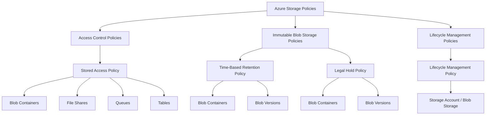

[Azure](https://github.com/magnum31415/wiki/blob/main/azure.md)

# Azure Storage

# Índice

- [Azure Storage](#azure-storage)
- [Modelos de autenticación en Azure Storage](#modelos-de-autenticación-en-azure-storage)
- [Permissions in Azure can be assigned at different scopes within the resource hierarchy](#permissions-in-azure-can-be-assigned-at-different-scopes-within-the-resource-hierarchy)
- [Authentication Methods for Azure Storage](#authentication-methods-for-azure-storage)
- [Comparison](#comparison)
- [Recommended Method](#recommended-method)
- [Summary](#summary)
- [Azure Storage Accounts, Data Lake y Replication (AZ-104)](#azure-storage-accounts-data-lake-y-replication-az-104)
- [Qué es un Azure Storage Account](#qué-es-un-azure-storage-account)
- [Azure Data Lake Storage Gen2 (ADLS Gen2)](#azure-data-lake-storage-gen2-adls-gen2)
- [Hierarchical Namespace](#hierarchical-namespace)
- [Access Tiers](#access-tiers)
- [Tipos de replicación Azure Storage](#tipos-de-replicación-azure-storage)
- [GRS vs ZRS](#grs-vs-zrs)
- [Conceptos importantes AZ-104](#conceptos-importantes-az-104)
- [Trampas típicas examen](#trampas-típicas-examen)
- [Tabla resumen examen](#tabla-resumen-examen)
- [Frases clave AZ-104](#frases-clave-az-104)
- [Azure Storage Policies](#azure-storage-policies)
- [Azure Storage - Hierarchical Namespace vs Azure Files](#azure-storage---hierarchical-namespace-vs-azure-files)
- [Azure Storage Routing Preference (AZ-104)](#azure-storage-routing-preference-az-104)
- [Azure Storage - Encryption Scope](#azure-storage---encryption-scope)
---

## Modelos de autenticación en Azure Storage

| Model | Uses Claims | Uses Keys | Example | Related Concept | What it is | Where it is used |
|---|---|---|---|---|---|---|
| Microsoft Entra ID (RBAC) | ✔ | ❌ | A user or application authenticates with Entra ID and accesses a blob using a role like **Storage Blob Data Contributor**. | **Claim** | Information about an identity included in an authentication token. | OAuth / OpenID Connect / Microsoft Entra ID |
| Shared Key (Access Keys) | ❌ | ✔ | An application connects to a storage account using a **connection string with the AccountKey**. | **Access Key (Storage)** | Secret key that provides direct access to the Storage Account. | Key-based authentication |
| SAS Token | ❌ | ✔ | **Shared Access Signature Token** : A temporary URL is generated to allow download of a specific blob for a limited time. | **Access Key (or delegation key)** | Token generated from a storage key or delegation key to grant temporary access. | Delegated access to storage resources |

---

## Permissions in Azure can be assigned at different scopes within the resource hierarchy

| Scope | Description | Example |
|---|---|---|
| Container | Permissions apply only to a specific container inside a storage account. | A user can read blobs only in `images-container`. |
| Storage Account | Permissions apply to all containers and services within a storage account. | A user can manage all blobs in `mystorageaccount`. |
| Resource Group | Permissions apply to all resources inside a resource group. | A user can manage the storage account and VMs inside `rg-app-prod`. |
| Subscription | Permissions apply to every resource in the subscription. | An administrator can manage all resources in the subscription. |

---

# Authentication Methods for Azure Storage

## 1. Microsoft Entra ID (RBAC)

Authentication is performed using identities managed in Microsoft Entra ID.

Users, applications, or managed identities authenticate with Entra ID and receive a token containing claims.

Azure then evaluates RBAC permissions.

### How it works

```text
User / Application
        │
        ▼
Microsoft Entra ID authentication
        │
        ▼
Token with claims
        │
        ▼
Azure RBAC evaluates permissions
        │
        ▼
Access to Storage resource
```

### Characteristics

| Feature | Description |
|---|---|
| Identity-based | Yes |
| Uses tokens | Yes |
| Uses RBAC roles | Yes |
| Supports least privilege | Yes |
| Supports audit and governance | Yes |

Example roles:

- Storage Blob Data Reader
- Storage Blob Data Contributor
- Storage Blob Data Owner

---

## 2. Shared Key (Access Keys)

Authentication is performed using a secret key associated with the storage account.

Each storage account has two keys:

```text
Key1
Key2
```

### How it works

```text
Application
      │
      ▼
Uses Storage Account Access Key
      │
      ▼
Azure Storage authenticates request
      │
      ▼
Access granted
```

### Characteristics

| Feature | Description |
|---|---|
| Identity-based | No |
| Uses tokens | No |
| Uses secret keys | Yes |
| Access scope | Full storage account |
| Security risk | Higher if keys are exposed |

---

## 3. SAS Token (Shared Access Signature)

A SAS token provides delegated and time-limited access to specific storage resources.

It is generated using:

- Access Key
- User Delegation Key

### How it works

```text
Storage Account
      │
Generate SAS token
      │
      ▼
Client receives token
      │
      ▼
Temporary access to specific resource
```

### Example

```text
https://storage.blob.core.windows.net/container/file.txt?sv=...&sig=...
```

### Characteristics

| Feature | Description |
|---|---|
| Identity-based | Optional |
| Time limited | Yes |
| Granular permissions | Yes |
| Scope | Specific container/blob/file |
| Common use case | Temporary sharing |

---

# Comparison

| Method | Identity-based | Security Level | Typical Use |
|---|---|---|---|
| Microsoft Entra ID (RBAC) | Yes | Highest | Applications and services |
| Shared Key | No | Lower | Legacy integrations |
| SAS Token | Partial | Medium | Temporary access |

---

# Recommended Method

The recommended method is:

```text
Microsoft Entra ID + RBAC
```

Reasons:

- least privilege
- governance
- auditing
- avoids secret exposure

---

# Summary

| Method | Recommended |
|---|---|
| Microsoft Entra ID (RBAC) | Yes |
| SAS Token | Temporary delegated access |
| Shared Key | Avoid when possible |

---

# Azure Storage Accounts, Data Lake y Replication (AZ-104)

## Qué es un Azure Storage Account

Es el servicio principal de almacenamiento en Azure.

---

## Qué puede almacenar

| Tipo | Ejemplo |
|---|---|
| Blob Storage | Archivos |
| Azure Files | SMB shares |
| Queues | Mensajes |
| Tables | NoSQL |

---

# Azure Data Lake Storage Gen2 (ADLS Gen2)

## Qué es

ADLS Gen2 es una extensión de Azure Blob Storage optimizada para Big Data y Analytics.

---

## Uso típico

| Caso | Ejemplo |
|---|---|
| Big Data | Hadoop |
| Analytics | Synapse |
| Data Engineering | ETL pipelines |
| Machine Learning | Data Science |

---

# Hierarchical Namespace

## Qué es

Permite organizar blobs usando:

```text
carpetas y directorios reales
```

---

## Importante

Azure Data Lake Storage Gen2 requiere:

```text
Hierarchical Namespace
```

---

## Sin Hierarchical Namespace

```text
Flat namespace
```

---

## Con Hierarchical Namespace

```text
/storage/folder1/folder2/file.csv
```

---

# Access Tiers

## Hot Tier

Optimizado para:

✅ acceso frecuente

| Característica | Hot |
|---|---|
| Storage cost | Alto |
| Access cost | Bajo |
| Access frequency | Alta |

---

## Cool Tier

Optimizado para:

✅ acceso poco frecuente

| Característica | Cool |
|---|---|
| Storage cost | Bajo |
| Access cost | Más alto |
| Access frequency | Baja |

---

## Archive Tier

Optimizado para:

✅ retención largo plazo

| Característica | Archive |
|---|---|
| Storage cost | Muy bajo |
| Retrieval latency | Alta |
| Immediate access | ❌ |

---

# Tipos de replicación Azure Storage

| Tipo | Replicación | Región secundaria |
|---|---|---|
| LRS | Datacenter local | ❌ |
| ZRS | Availability Zones | ❌ |
| GRS | Otra región | ✅ |
| RA-GRS | Otra región + lectura | ✅ |

---

# LRS

```text
Locally Redundant Storage
```

Replica datos dentro de un único datacenter.

---

# ZRS

```text
Zone-Redundant Storage
```

Replica datos entre Availability Zones dentro de la misma región.

---

# GRS

```text
Geo-Redundant Storage
```

Replica datos automáticamente a otra región Azure.

---

# RA-GRS

```text
Read-Access Geo-Redundant Storage
```

Igual que GRS pero permitiendo lectura desde la región secundaria.

---

# GRS vs ZRS

| Feature | GRS | ZRS |
|---|---|---|
| Replicación cross-region | ✅ | ❌ |
| Availability Zones | ❌ | ✅ |
| Disaster Recovery | ✅ | Parcial |
| Alta disponibilidad regional | ❌ | ✅ |

---

# Conceptos importantes AZ-104

| Concepto | Importancia |
|---|---|
| GRS vs ZRS | Muy alta |
| Cool vs Hot Tier | Muy alta |
| Hierarchical Namespace | Muy alta |
| ADLS Gen2 | Muy alta |

---

# Trampas típicas examen

## Trampa 1

Pensar que:

```text
ZRS replica a otra región
```

❌ Incorrecto.

ZRS replica solo dentro de la misma región.

---

## Trampa 2

Confundir:

```text
Cool Tier
```

con:

```text
Archive Tier
```

---

## Diferencia rápida

| Tier | Uso |
|---|---|
| Hot | Acceso frecuente |
| Cool | Acceso poco frecuente |
| Archive | Retención largo plazo |

---

## Trampa 3

Pensar que:

```text
Azure Data Lake es un servicio separado
```

❌ Incorrecto.

ADLS Gen2 realmente es:

```text
Blob Storage + Hierarchical Namespace
```

---

# Tabla resumen examen

| Necesidad | Solución |
|---|---|
| Data Lake | Hierarchical Namespace |
| Datos poco accedidos | Cool Tier |
| Replicación otra región | GRS |
| Alta disponibilidad misma región | ZRS |

---

# Frases clave AZ-104

```text
Azure Data Lake Storage Gen2 requires hierarchical namespace.
```

```text
Geo-redundant storage replicates data to another region.
```

```text
Cool tier reduces costs for infrequently accessed data.
```
---

# Azure Storage Policies 

---

# Tabla resumen de Policies

| Tipo de Policy | Categoría | Objetivo | Recursos compatibles | Máximo |
|---|---|---|---|---|
| Stored Access Policy | Access Control Policy | Controlar permisos SAS | Blob Containers, File Shares, Queues, Tables | Máx. 5 policies por recurso |
| Immutable Blob Storage Policy | WORM / Immutable Policy | Protección WORM contra modificación y borrado | Blob Containers, Blob Versions | 1 policy de inmutabilidad por scope |
| Time-Based Retention Policy | Immutable Blob Storage Policy | Bloquear blobs durante un tiempo definido | Blob Containers, Blob Versions | 1 policy activa por scope |
| Legal Hold Policy | Immutable Blob Storage Policy | Bloquear blobs indefinidamente | Blob Containers, Blob Versions | 1 legal hold policy por scope (con múltiples tags posibles) |
| Lifecycle Management Policy | Lifecycle / Data Management Policy | Automatizar movimiento/borrado de datos | Storage Account / Blob Storage | 1 lifecycle management policy por Storage Account |




---

# 1. Stored Access Policy

## Qué es

Una:

```text
Stored Access Policy
```

permite definir permisos SAS reutilizables sobre recursos Azure Storage.

En vez de poner permisos directamente dentro del SAS token,
el SAS referencia una policy almacenada.

---

## Recursos compatibles

| Recurso | Compatible |
|---|---|
| Blob Containers | ✅ |
| File Shares | ✅ |
| Queues | ✅ |
| Tables | ✅ |

---

## Máximo

```text
Maximum 5 stored access policies per resource
```

Aplica a:
- container
- queue
- table
- file share

---

## Qué controla

Puede controlar:

- permisos
- expiración
- start time

---

## Ventaja importante

Permite:

✅ revocar SAS fácilmente  
✅ modificar expiración sin regenerar SAS  
✅ centralizar permisos  

---

## Importante examen

Stored Access Policies:

❌ NO protegen contra borrado  
❌ NO son WORM  
❌ NO son Immutable Policies  

Solo controlan acceso SAS.

---

# 2. Immutable Blob Storage Policy

## Qué es

Protección:

```text
WORM
```

sobre blobs.

---

## WORM significa

```text
Write Once Read Many
```

↓

Los datos:

✅ pueden escribirse  
✅ pueden leerse  
❌ no pueden modificarse  
❌ no pueden borrarse  

---

## Recursos compatibles

| Recurso | Compatible |
|---|---|
| Blob Containers | ✅ |
| Blob Versions | ✅ |
| Tables | ❌ |
| Queues | ❌ |
| File Shares | ❌ |

---

## Máximo

```text
1 immutable policy per scope
```

---

## Qué protege

Impide:

❌ modificar blobs  
❌ borrar blobs  

incluso para administradores.

---

## Importante examen

Immutable Policies:
- solo existen en Blob Storage
- NO existen para Tables o Queues

---

# 3. Time-Based Retention Policy

## Qué es

Tipo de Immutable Policy.

Bloquea blobs durante un tiempo definido.

---

## Ejemplo

```text
Retention = 7 years
```

↓

Durante 7 años:

❌ no borrar  
❌ no modificar  

---

## Recursos compatibles

| Recurso | Compatible |
|---|---|
| Blob Containers | ✅ |
| Blob Versions | ✅ |

---

## Máximo

```text
1 active retention policy per scope
```

---

## Estados importantes

| Estado | Significado |
|---|---|
| Unlocked | Editable |
| Locked | Inmutable definitiva |

---

## Importante examen

Una vez:

```text
Locked
```

↓

❌ no puede reducirse fácilmente  
❌ no puede eliminarse fácilmente  

---

# 4. Legal Hold Policy

## Qué es

Tipo de Immutable Policy.

Bloquea blobs indefinidamente.

---

## Cómo funciona

Los blobs quedan protegidos:

```text
hasta eliminar manualmente el legal hold
```

---

## Uso típico

- litigios
- auditorías
- investigaciones

---

## Recursos compatibles

| Recurso | Compatible |
|---|---|
| Blob Containers | ✅ |
| Blob Versions | ✅ |

---

## Máximo

```text
1 legal hold policy per scope
```

pero:

✅ puede contener múltiples tags  

---

## Diferencia clave examen

| Feature | Duración |
|---|---|
| Time-Based Retention | Tiempo definido |
| Legal Hold | Indefinido |

---

# 5. Lifecycle Management Policy

## Qué es

Policy automática para mover o borrar blobs.

---

## Qué permite

Automatizar:

- mover Hot → Cool
- mover Cool → Archive
- borrar blobs antiguos
- borrar snapshots/versiones

---

## Recursos compatibles

| Recurso | Compatible |
|---|---|
| Storage Account | ✅ |

---

## Máximo

```text
1 lifecycle management policy per Storage Account
```

---

## Importante

Dentro de esa única policy:

✅ múltiples reglas permitidas  

---

## Ejemplo típico

```text
Move blobs to Cool after 30 days
Move blobs to Archive after 90 days
Delete after 365 days
```

---

# Comparativa rápida examen

| Policy | Protege borrado | Controla acceso | Automatiza lifecycle |
|---|---|---|---|
| Stored Access Policy | ❌ | ✅ | ❌ |
| Immutable Policy | ✅ | ❌ | ❌ |
| Time-Based Retention | ✅ | ❌ | ❌ |
| Legal Hold | ✅ | ❌ | ❌ |
| Lifecycle Management | ❌ | ❌ | ✅ |

---

# Frases clave AZ-104

```text
Stored Access Policies control SAS permissions.
```

```text
Immutable Blob Storage provides WORM protection.
```

```text
Time-Based Retention prevents modification and deletion during retention.
```

```text
Legal Holds preserve blobs indefinitely.
```

```text
Lifecycle Management Policies automate blob tiering and deletion.
```

---

# Azure Storage - Hierarchical Namespace vs Azure Files

---

# Concepto clave del examen

La pregunta evalúa la diferencia entre:

- Azure Blob Storage
- Azure Data Lake Storage Gen2
- Azure Files

y especialmente:

```text
cómo organizan contenido
```

---

# 1. Azure Blob Storage normal

Azure Blob Storage tradicional utiliza un:

```text
flat namespace
```

↓

Esto significa:

❌ no existen directorios reales  
❌ las carpetas son simuladas  

---

## Ejemplo

```text
folder1/file.txt
```

realmente es:

```text
un único nombre de blob
```

NO un directorio real.

---

# Importante examen

Blob Storage normal:

✅ almacena blobs  
❌ NO tiene jerarquía real de directorios  

---

# 2. Hierarchical Namespace (HNS)

Cuando habilitas:

```text
Hierarchical Namespace
```

↓

Azure Blob Storage se convierte en:

```text
Azure Data Lake Storage Gen2
```

---

# Qué aporta HNS

Con HNS:

✅ directorios reales  
✅ subdirectorios reales  
✅ operaciones filesystem-like  
✅ mejor organización contenido  

---

# Ejemplo

Ahora sí existe:

```text
/folder1/folder2/file.txt
```

como estructura jerárquica real.

---

# Importante examen

Para:

```text
organizar contenido en directorios reales
```

Blob Storage necesita:

```text
Hierarchical Namespace enabled
```

---

# 3. Azure Files

Azure Files funciona distinto.

Azure Files ya es:

```text
un sistema de ficheros compartido
```

---

# Qué soporta Azure Files

Azure Files soporta:

✅ directorios  
✅ subdirectorios  
✅ estructura jerárquica  

SIN necesidad de:

```text
Hierarchical Namespace
```

---

# Importante examen

Azure Files:

❌ NO necesita HNS  
✅ soporta carpetas por diseño  

---

# Trampa típica AZ-104

Pensar que:

```text
todos los servicios Azure Storage necesitan HNS
para usar directorios
```

❌ Incorrecto.

---

# Diferencia clave examen

| Servicio | Directorios reales | Requiere HNS |
|---|---|---|
| Blob Storage normal | ❌ | — |
| Blob Storage + HNS | ✅ | ✅ |
| Azure Files | ✅ | ❌ |

---

# Regla rápida examen

```text
Blob Storage needs Hierarchical Namespace for real directory organization.
```

```text
Azure Files supports directories natively.
```

---

# Ejemplo típico examen

## Escenario

La empresa necesita:

```text
organize content using directories
```

---

## Respuesta correcta

| Recurso | Resultado |
|---|---|
| Blob container SIN HNS | ❌ |
| Blob container CON HNS | ✅ |
| Azure File Share | ✅ |

---

# Frases clave AZ-104

```text
Hierarchical Namespace enables filesystem semantics in Blob Storage.
```

```text
Azure Data Lake Storage Gen2 requires Hierarchical Namespace.
```

```text
Azure Files supports directories without requiring Hierarchical Namespace.
```

```text
Blob Storage without HNS uses a flat namespace.
```
---

# Azure Storage Routing Preference (AZ-104)

---

# Qué es Azure Storage Routing Preference

Azure Storage Routing Preference permite controlar:

```text
cómo el tráfico de usuarios llega a una Storage Account
```

---

# Objetivo principal

Permite elegir si el tráfico:

- usa la red global privada de Microsoft
- o viaja más por Internet pública

---

# Opciones principales

| Routing Preference | Descripción |
|---|---|
| Microsoft network routing | Usa la red backbone global de Microsoft |
| Internet routing | Usa más Internet pública |

---

# Concepto clave examen

Si quieres:

```text
minimizar latencia
optimizar rendimiento
usar el POP más cercano
```

↓

debes usar:

```text
Microsoft network routing
```

---

# Qué es un POP

POP significa:

```text
Point Of Presence
```

---

# Qué hace un POP

Es un punto de entrada a la red global de Microsoft.

---

# Flujo con Microsoft Network Routing

```text
Usuario
   ↓
POP Microsoft más cercano
   ↓
Backbone global Microsoft
   ↓
Storage Account
```

---

# Ventajas de Microsoft Network Routing

| Ventaja | Explicación |
|---|---|
| Menor latencia | Menos recorrido por Internet pública |
| Mejor rendimiento | Backbone Microsoft optimizado |
| Mayor estabilidad | Red privada Microsoft |
| Entrada POP cercano | Mejor experiencia usuario |

---

# Qué significa "Microsoft edge network"

También llamado:

```text
Microsoft edge network
```

↓

El tráfico entra rápidamente en la red privada de Microsoft usando el POP más cercano.

---

# Backbone de Microsoft

Microsoft tiene una red global privada enorme entre datacenters Azure.

Cuando usas:

```text
Microsoft network routing
```

↓

el tráfico utiliza esa red interna lo antes posible.

---

# Internet Routing

## Qué hace

El tráfico usa más recorrido sobre:

```text
Internet pública
```

antes de entrar en la red Microsoft.

---

# Ventajas

Puede reducir costes de egress en algunos escenarios.

---

# Desventajas

| Problema | Explicación |
|---|---|
| Mayor latencia | Más recorrido Internet |
| Menor predictibilidad | Dependencia ISP |
| Menor optimización | Menos backbone Microsoft |

---

# Comparativa examen

| Característica | Microsoft Network Routing | Internet Routing |
|---|---|---|
| Usa backbone Microsoft | ✅ | Parcial |
| Usa POP más cercano | ✅ | ❌ |
| Menor latencia | ✅ | ❌ |
| Mejor rendimiento | ✅ | ❌ |
| Más Internet pública | ❌ | ✅ |
| Optimizado para usuarios globales | ✅ | ❌ |

---

# Caso típico examen

## Requisito

```text
Ensure inbound user traffic uses the Microsoft POP closest to the user.
```

↓

Respuesta correcta:

```text
Microsoft network routing
```

---

# Configuración conceptual

```text
Storage Account
    ↓
Routing Preference
    ↓
Microsoft Network Routing
```

---

# Importante examen

Routing Preference afecta:

```text
cómo entra el tráfico a Azure
```

NO:
- cifrado
- replicación
- firewall
- private endpoints

---

# Trampas típicas AZ-104

## Trampa 1

Pensar que:

```text
Internet routing = más rápido
```

❌ Incorrecto.

---

## Trampa 2

Confundir:

```text
Routing Preference
```

con:

```text
Traffic Manager / Front Door
```

---

## Trampa 3

Pensar que esto afecta tráfico interno Azure.

❌ Principalmente afecta tráfico usuario → Storage.

---

# Arquitectura conceptual

## Microsoft Network Routing

```text
User
 ↓
Nearest Microsoft POP
 ↓
Microsoft Backbone
 ↓
Azure Storage
```

---

## Internet Routing

```text
User
 ↓
Internet pública
 ↓
Azure region
 ↓
Azure Storage
```

---

# Reglas rápidas AZ-104

```text
Microsoft network routing uses the Microsoft global backbone network.
```

```text
Microsoft routing minimizes latency and improves performance.
```

```text
Internet routing uses more public Internet paths.
```

```text
POP means Point Of Presence.
```

---

# Frases clave AZ-104

```text
Microsoft network routing routes traffic through the Microsoft global network.
```

```text
The closest Microsoft POP is used to optimize inbound traffic.
```

```text
Microsoft network routing improves performance and reduces latency.
```
---
# Azure Storage - Encryption Scope

La clave de esta pregunta está en una frase:

> **One container must use a separate encryption key for data encrypted at rest.**

La respuesta correcta es **Create an encryption scope**.

En una cuenta de Azure Storage, por defecto los datos se cifran **a nivel de Storage Account**. Pero si quieres que un contenedor concreto use una clave diferente, necesitas un **Encryption Scope**.

| Concepto | Configuración | ¿Qué protege/controla? | Ejemplo |
|---|---|---|---|
| 🔐 Cifrado independiente | **Encryption Scope** | Datos **at rest** con una clave diferente | `container-sensitive` usa su propia clave |
| 🔑 Autenticación | Access Keys | Acceso al Storage Account | Una aplicación se autentica con la key |
| 🌐 Cifrado en tránsito | Minimum TLS version | Comunicación cliente ↔ Azure | Obligar a usar TLS 1.2 |
| 🎟️ Acceso delegado | SAS | Acceso temporal y limitado | Permitir descargar un blob durante 2 horas |

## ¿Qué es exactamente un Encryption Scope?

Imagina este Storage Account con 10 contenedores:

```text
Storage Account
│
├── container-01 ─┐
├── container-02  │
├── container-03  │── Clave por defecto del Storage Account 🔑 A
├── container-04  │
├── ...
├── container-09 ─┘
│
└── container-sensitive ── Encryption Scope ── 🔑 B
```

El **Encryption Scope** crea un "ámbito de cifrado" que puede asociarse a un contenedor.

```text
Encryption Scope: sensitive-data
        │
        ▼
Container: confidential
        │
        ▼
Cifrado con una clave diferente 🔑
```

Por eso, antes de crear el contenedor:

```text
1. Crear Encryption Scope
          ↓
2. Crear el Blob Container
          ↓
3. Asignarle el Encryption Scope
```

## Encryption Scope vs Customer-Managed Key (CMK)

| Configuración | Alcance |
|---|---|
| **Customer-managed key (CMK)** del Storage Account | Todo el Storage Account |
| **Encryption Scope** | Contenedores o blobs concretos |

Un Encryption Scope puede usar:

- **Microsoft-managed key**
- **Customer-managed key** almacenada en Key Vault o Managed HSM

La idea importante es que el **scope** define qué clave se aplica a determinados datos.

## Por qué `Rotate the access keys` es incorrecto

Las **Access Keys no cifran los datos almacenados**. Sirven para autenticarse contra el Storage Account.

```text
Access Key
    ↓
¿Puedes acceder al Storage Account?
```

Mientras que:

```text
Encryption Scope
    ↓
¿Con qué clave se cifran estos datos?
```

Son capas de seguridad completamente diferentes.

## Cómo identificar la respuesta en AZ-104

| Si la pregunta dice... | Piensa en... |
|---|---|
| **Different key per container/blob** | 🔐 Encryption Scope |
| **Encrypt entire Storage Account with own key** | 🔐 Customer-managed key |
| **Regenerate/compromised account key** | 🔑 Rotate Access Keys |
| **Data in transit / protocol version** | 🌐 TLS |
| **Temporary delegated access** | 🎟️ SAS |

## Regla para el examen

 **Encryption Scope = usar claves de cifrado diferentes para blobs o contenedores específicos dentro del mismo Storage Account.**
