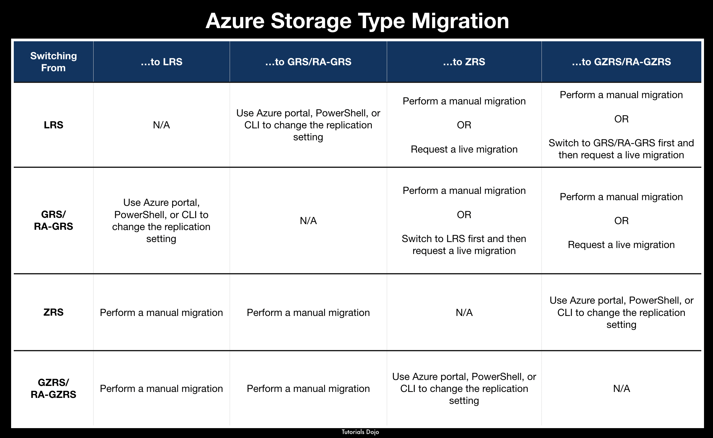

[Azure](https://github.com/magnum31415/wiki/blob/main/azure.md)

# 📑 Índice – Azure Storage AZ-104

[Azure](https://github.com/magnum31415/wiki/blob/main/azure.md)

# 📑 Índice – Azure Storage AZ-104

- [📦 Azure Storage – Resumen ampliado para AZ-104](#-azure-storage--resumen-ampliado-para-az-104)
- [🧱 Servicios principales de Azure Storage](#-servicios-principales-de-azure-storage)
- [2️⃣ Azure Blob Storage](#2️⃣-azure-blob-storage)
- [3️⃣ Azure Files](#3️⃣-azure-files)
- [4️⃣ AzCopy](#4️⃣-azcopy)
- [5️⃣ Azure Queue Storage](#5️⃣-azure-queue-storage)
- [6️⃣ Azure Table Storage](#6️⃣-azure-table-storage)
- [7️⃣ Comparativa rápida](#7️⃣-comparativa-rápida)
- [🎯 Puntos críticos para AZ-104](#-puntos-críticos-para-az-104)
- [🔥 Cuándo usar cada servicio](#-cuándo-usar-cada-servicio)
- [🧠 Claves de examen](#-claves-de-examen)
- [🔄 Conversiones permitidas entre tipos de redundancia en Azure Storage](#-conversiones-permitidas-entre-tipos-de-redundancia-en-azure-storage)
- [🗂 Tipos de Storage Account (según la pregunta AZ-104)](#-tipos-de-storage-account-según-la-pregunta-az-104)
- [🎯 ¿Qué cuenta puede convertirse a ZRS mediante Live Migration?](#-qué-cuenta-puede-convertirse-a-zrs-mediante-live-migration)
- [🔄 Live Migration from Azure Support](#-live-migration-from-azure-support)
- [❓ ¿Por qué Live Migration solo funciona en cuentas Standard y no Premium?](#-por-qué-live-migration-solo-funciona-en-cuentas-standard-y-no-premium)
- [✅ Respuesta correcta](#-respuesta-correcta)
- [Azure Storage Immutability (AZ-104)](#azure-storage-immutability-az-104)
---

# 📦 Azure Storage – Resumen ampliado para AZ-104
[⬆ Volver al índice](#-índice--azure-storage-az-104)

## 1️⃣ ¿Qué es Azure Storage?

Azure Storage es la plataforma de almacenamiento en la nube de Microsoft. Está diseñada para ser:


- Masivamente escalable  
- Altamente disponible  
- Segura  
- Durable  
- Accesible desde cualquier lugar
  
Data in an Azure Storage account is always replicated three times in the primary region.

Permite almacenar distintos tipos de datos según el escenario.

---

# 🧱 Servicios principales de Azure Storage
[⬆ Volver al índice](#-índice--azure-storage-az-104)
| Servicio | Tipo de datos | Caso típico en examen |
|-----------|--------------|-----------------------|
| **Blob Storage** | Objetos (no estructurados) | Imágenes, backups, logs |
| **Azure Files** | File share (SMB) | Migrar file servers |
| **Disk Storage** | Discos para VMs | IaaS |
| **Queue Storage** | Mensajería | Comunicación entre apps |
| **Table Storage** | NoSQL key-value | Datos estructurados simples |

---

# 2️⃣ Azure Blob Storage
[⬆ Volver al índice](#-índice--azure-storage-az-104)


| Categoría | Contenido |
|------------|------------|
| **¿Qué es?** | Servicio de almacenamiento de **objetos** optimizado para grandes volúmenes de datos **no estructurados** (sin esquema definido). |
| **Ejemplos de datos no estructurados** | Texto, archivos binarios, imágenes, vídeos, logs |
| **Casos de uso principales** | Servir imágenes/documentos a navegador, almacenamiento distribuido, streaming vídeo/audio, logs, backup & DR, archivado, análisis de datos |
| **Tipos de Blob** | **Block Blob** → Archivos normales (docs, imágenes, backups)<br>**Append Blob** → Logs<br>**Page Blob** → Discos de VM |

---

# 3️⃣ Azure Files

| Categoría | Contenido |
|------------|------------|
| **¿Qué es?** | Servicio de **file shares en la nube** accesible vía **SMB** y **REST API**. Permite que múltiples VMs compartan archivos con lectura y escritura. |
| **Protocolos soportados** | SMB (Server Message Block) <br> REST API |
| **Diferencia clave vs file server tradicional** | Acceso desde cualquier lugar mediante URL pública del storage + autenticación segura. |
| **Ejemplo de acceso** | `https://storageaccount.file.core.windows.net/share/file` |
| **¿Qué es un SAS Token?** | Mecanismo que permite **acceso temporal** con **permisos limitados** (read/write/delete) a recursos privados. |
| **Casos de uso comunes** | Migración de file servers on-prem, compartir configuración entre VMs, herramientas compartidas de equipo, almacenamiento de logs, métricas y crash dumps |

---

# 4️⃣ AzCopy
[⬆ Volver al índice](#-índice--azure-storage-az-104)

| Categoría | Contenido |
|------------|------------|
| **¿Qué es?** | Herramienta de **línea de comandos** para copiar datos hacia o desde una **Storage Account**. |
| **Servicios soportados** | ✅ Blob <br> ✅ File |
| **No soporta** | ❌ Table <br> ❌ Queue |
| **Pregunta típica de examen** | ¿Qué servicios puede copiar AzCopy? → ✔ Blob y File <br> ✘ Table y Queue |
---

# 5️⃣ Azure Queue Storage
[⬆ Volver al índice](#-índice--azure-storage-az-104)
- Servicio de mensajería
- Permite desacoplar aplicaciones
- Comunicación entre componentes

📌 No compatible con AzCopy.

---

# 6️⃣ Azure Table Storage

- Base de datos NoSQL
- Modelo clave/valor
- Alto rendimiento y bajo coste

📌 No compatible con AzCopy.

---

# 7️⃣ Comparativa rápida
[⬆ Volver al índice](#-índice--azure-storage-az-104)
| Servicio | Tipo | Protocolo | Caso típico |
|-----------|------|------------|--------------|
| Blob | Object storage | REST | Imágenes, backup |
| Files | File share | SMB + REST | Migración file server |
| Table | NoSQL | REST | Datos estructurados simples |
| Queue | Messaging | REST | Comunicación entre apps |

---

# 🎯 Puntos críticos para AZ-104
[⬆ Volver al índice](#-índice--azure-storage-az-104)

| Concepto | Resumen clave |
|-----------|---------------|
| **Blob vs Files** | **Blob** → Almacenamiento de objetos <br> **Files** → File share vía SMB |
| **AzCopy** | Funciona solo con **Blob y File** <br> No funciona con **Table ni Queue** |
| **SAS Token** | Proporciona **acceso temporal** con **permisos limitados**. Muy preguntado en escenarios de seguridad. |

---

### 🔥 Cuándo usar cada servicio

| Categoría | Contenido |
|------------|------------|
| **Cuándo usar cada servicio** | **Backup** → Blob <br> **Logs** → Blob (Append) <br> **Compartir archivos entre VMs** → Files <br> **Comunicación entre servicios** → Queue <br> **Datos estructurados simples** → Table |
| **Claves de examen (palabra clave → servicio)** | “object storage” → Blob <br> “SMB” / “file share” → Azure Files <br> “NoSQL” → Table <br> “messaging” → Queue <br> “command-line copy tool” → AzCopy (solo Blob + File) |

---

# Conversiones permitidas entre tipos de redundancia en Azure Storage
[⬆ Volver al índice](#-índice--azure-storage-az-104)
## 📌 Regla general importante

- ✅ Puedes **aumentar el nivel de resiliencia**
- ⚠️ Algunas conversiones requieren que la **región soporte ZRS / GZRS**
- ❌ No puedes cambiar entre **LRS y ZRS directamente** (requiere migración manual)
- ❌ No puedes convertir de **GRS a ZRS directamente**
- ❌ No puedes convertir de **GZRS a ZRS**
- 🔎 La migración en vivo (Live Migration) a ZRS/GZRS solo está soportada inicialmente para cuentas con **LRS o GRS**

---

## 🔄 Tabla de conversiones entre replicaciones

| Desde ↓ | Puede convertirse a → |
|----------|------------------------|
| **LRS** | GRS, RA-GRS, ZRS*, GZRS*, RA-GZRS* |
| **ZRS** | GZRS, RA-GZRS |
| **GRS** | RA-GRS, GZRS*, RA-GZRS* |
| **RA-GRS** | GRS, GZRS*, RA-GZRS* |
| **GZRS** | RA-GZRS |
| **RA-GZRS** | GZRS |

\* Puede requerir migración manual vía Azure Support y que la región soporte zonas de disponibilidad.

---

# 🗂 Tipos de Storage Account (según la pregunta AZ-104)
[⬆ Volver al índice](#-índice--azure-storage-az-104)



| Nombre        | Kind                  | Performance | Replication | Access Tier |
|--------------|-----------------------|-------------|-------------|------------|
| tdaccount1   | General-purpose v2    | Standard    | LRS         | Cool       |
| tdaccount2   | General-purpose v2    | Premium     | RA-GRS      | Hot        |
| tdaccount3   | General-purpose v1    | Premium     | GRS         | None       |
| tdaccount4   | BlobStorage           | Standard    | LRS         | Hot        |

---

# 🎯 ¿Qué cuenta puede convertirse a ZRS mediante Live Migration?
[⬆ Volver al índice](#-índice--azure-storage-az-104)
## 🔎 Reglas clave para Live Migration a ZRS

- ✔ Solo soportado inicialmente para cuentas con **LRS o GRS**
- ✔ Si es **RA-GRS**, primero debe cambiarse a LRS o GRS
- ✔ Debe ser **Standard**, no Premium
- ✔ Debe estar en región que soporte ZRS
- ✔ Algunas combinaciones de Kind no soportan ZRS

---

# 🔄 Live Migration from Azure Support
[⬆ Volver al índice](#-índice--azure-storage-az-104)
## 📌 ¿Qué es?

Una **Live Migration from Azure Support** es un proceso gestionado por el equipo de soporte de Microsoft que permite cambiar ciertas configuraciones críticas de un recurso (por ejemplo, el tipo de replicación de una Storage Account) **sin downtime y sin pérdida de datos**.

No es una acción que puedas ejecutar directamente desde el Portal, CLI o PowerShell.  
Debe solicitarse formalmente a Microsoft mediante un **support request**.

---

## 🎯 ¿Cuándo se usa?

Principalmente cuando necesitas cambiar:

- LRS → ZRS
- LRS → GZRS
- GRS → GZRS
- GRS → RA-GZRS

Especialmente cuando el cambio afecta a **cómo se replica el dato en la región primaria**, algo que no se puede hacer automáticamente.

---

## ⚙️ Qué significa “Live”

“Live” implica que:

- ✅ No hay interrupción del servicio
- ✅ No hay que recrear la Storage Account
- ✅ No se pierden datos
- ✅ La aplicación puede seguir funcionando

Azure realiza internamente la redistribución de los datos.

---

## 🚫 Qué NO es

- No es un simple cambio de configuración en el portal.
- No es eliminar y recrear la cuenta.
- No es una migración entre regiones.
- No siempre está disponible (depende del tipo de cuenta y la región).

---

## 🧠 Clave para examen AZ-104

Si la pregunta menciona:

- Cambio de LRS a ZRS
- Cambio de GRS a GZRS
- Sin downtime
- Gestionado por Microsoft

👉 La respuesta suele ser: **Solicitar una Live Migration a través de Azure Support**.

# ❓ ¿Por qué Live Migration solo funciona en cuentas Standard y no Premium?
[⬆ Volver al índice](#-índice--azure-storage-az-104)

## Diferencia arquitectónica

| Característica | Standard | Premium |
|---------------|-----------|-----------|
| Tipo de hardware | Hardware compartido | Hardware dedicado (SSD alto rendimiento) |
| Modelo de escalado | Escalado horizontal | Arquitectura optimizada para baja latencia |
| Arquitectura | Distribuida multitenant | Diseño más rígido y especializado |
| Flexibilidad de redistribución | Permite reubicar y redistribuir datos internamente sin interrupción | Datos vinculados a infraestructura física concreta |
| Redistribución entre zonas (ZRS) | Posible mediante Live Migration | No soportado sin recrear la cuenta |
| Enfoque principal | Flexibilidad y resiliencia | Rendimiento y baja latencia |
| Casos de uso típicos | Workloads generales, almacenamiento flexible | Discos de VM, workloads de alta IOPS, baja latencia constante |
| Cambios dinámicos de replicación | Soportados (según escenario) | No diseñado para cambios dinámicos |
| Migración LRS ↔ ZRS | Posible vía soporte (según requisitos) | No soportado |
| Reconfiguración interna del layout de datos | Posible | No soportado |

---

## ZRS implica distribución entre Availability Zones

Para pasar de LRS a ZRS:

- Los datos deben replicarse entre **3 Availability Zones**
- Esto requiere redistribución física

En Standard, Azure puede hacerlo internamente.
En Premium, el modelo de hardware no permite ese cambio sin recrear la cuenta.

---

## Limitaciones oficiales

Live Migration a ZRS/GZRS está soportado únicamente cuando:

- La cuenta usa **LRS o GRS**
- Es de tipo **Standard**
- La región soporta ZRS

Si es Premium, la única opción es:

👉 Crear una nueva cuenta con la replicación deseada  
👉 Migrar los datos manualmente  

## Resumen conceptual para examen

| Característica | Standard | Premium |
|---------------|----------|----------|
| Arquitectura flexible | ✅ | ❌ |
| Soporta Live Migration (Azure Support) | ✅ | ❌ |
| Tipo de migración soportada | Live Migration gestionada por Azure Support (sin downtime, según escenario) | Solo migración manual: crear nueva cuenta y copiar datos (AzCopy / Data Movement) |
| Orientado a rendimiento extremo | ❌ | ✅ |
| Permite cambio dinámico de replicación | ✅ | ❌ |

**🎯 Idea clave**

**Standard = más flexible en replicación**  
**Premium = más rígido pero más rápido**

Por eso Live Migration solo aplica a Standard.

---
# Azure Storage Immutability (AZ-104)

## Concepto

La **immutability** (inmutabilidad) impide que los datos puedan ser:

- modificados
- sobrescritos
- eliminados

durante un período determinado o indefinidamente.

Se utiliza principalmente para:

- WORM (Write Once Read Many)
- requisitos legales
- cumplimiento normativo (compliance)
- auditorías
- protección frente a ransomware

---

## ¿A qué nivel puede configurarse?

| Nivel | Soportado | Comentario |
|----------|-----------|------------|
| Storage Account | ✅ Sí (Version-level immutability) | Configuración para proteger versiones de blobs. |
| Blob Container | ✅ Sí | El caso más habitual. Se aplica a todos los blobs del contenedor. |
| Blob (Object Level / Version) | ✅ Sí (Version-level immutability) | Puede aplicarse sobre versiones individuales de blobs. |
| Azure Files | ❌ No | No soporta Blob Immutability Policy. |
| Queue Storage | ❌ No | No soporta inmutabilidad. |
| Table Storage | ❌ No | No soporta inmutabilidad. |

## 1. Storage Account (Version-level Immutability)

Puede habilitarse una política de inmutabilidad a nivel del Storage Account para proteger versiones de blobs.

Conceptualmente:

```text
Storage Account
       │
       ▼
Version-level Immutability
       │
       ▼
Blob Versions
```

Se configura desde:

```text
Storage Account
    ▼
Data Protection
    ▼
Version-level Immutability
```

Requisitos:

- Blob Versioning habilitado.
- Servicio Blob Storage.


## 2. Blob Container

Es el escenario más habitual y el más preguntado en el AZ-104.

La política se aplica al contenedor completo.

```text
Storage Account
      │
      ▼
Blob Container
      │
      ▼
Immutability Policy
      │
      ▼
Todos los blobs del contenedor
```

Se configura desde:

```text
Storage Account
    ▼
Containers
    ▼
Seleccionar Container
    ▼
Immutability Policy
```

Se puede definir:

- Time-based Retention
- Legal Hold

## 3. Blob Version (Object Level)

Con Version-level Immutability:

```text
Blob

    │

    ├── Version 1

    ├── Version 2

    └── Version 3
```

Cada versión puede quedar protegida frente a:

- modificación
- eliminación

durante el período definido.

---

## Tipos de políticas

### Time-based Retention Policy

Protege los datos durante un período determinado.

Ejemplo:

```text
Retention 365 days
```

Durante ese tiempo:

```text
Delete ❌
Modify ❌
Overwrite ❌
```

Una vez expirado el período:

```text
Delete ✅
```

## Legal Hold

No depende del tiempo.

Los datos permanecen protegidos hasta eliminar explícitamente el Legal Hold.

```text
    Blob
      │
Legal Hold
      │
      ▼
Cannot Delete
Cannot Modify
```


## Activación en Azure Portal

### Storage Account (Version-level)

```text
Storage Account
      ▼
Data Protection
      ▼
Version-level Immutability
      ▼
    Enable
```


### Blob Container

```text
Storage Account
      ▼
Containers
      ▼
Container
      ▼
Immutability Policy
      ▼
Configure
      ▼
Time-based Retention
      or
  Legal Hold
```


## Resumen

| Nivel | Soporta Immutability | Cómo se activa |
|----------|---------------------|----------------|
| Storage Account | ✅ Sí (Version-level) | Data Protection → Version-level Immutability |
| Blob Container | ✅ Sí | Container → Immutability Policy |
| Blob Version | ✅ Sí | Mediante Version-level Immutability |
| Azure Files | ❌ No | No soportado |
| Queue Storage | ❌ No | No soportado |
| Table Storage | ❌ No | No soportado |


## Trampas típicas del AZ-104

### Trampa 1

Pensar que toda la Storage Account queda WORM automáticamente ❌ Incorrecto.

Normalmente la política protege:

- Blob Containers
- Blob Versions


### Trampa 2

Pensar que Azure Files soporta Blob Immutability. ❌ Incorrecto.

Azure Files no soporta esta funcionalidad.


### Trampa 3

Pensar que Queue o Table Storage soportan políticas WORM. ❌ Incorrecto.

No soportan Blob Immutability Policy.


## Regla rápida para memorizar

```text
Blob Container
       │
       ▼
Immutability Policy
```

```text
Storage Account
       │
       ▼
Version-level Immutability
```

```text
Azure Files
       │
       ▼
No Blob Immutability
```

```text
Queue Storage
       │
       ▼
No Blob Immutability
```

```text
Table Storage
       │
       ▼
No Blob Immutability
```

---

## Chuleta AZ-104

| Si lees... | Piensa en... |
|------------|--------------|
| WORM | Immutability Policy |
| Blob Container | Immutability Policy |
| Time-based retention | Blob Immutability |
| Legal Hold | Blob Immutability |
| Version-level immutability | Storage Account + Blob Versioning |
| Azure Files | ❌ No soporta Blob Immutability |
| Queue Storage | ❌ No soporta Blob Immutability |
| Table Storage | ❌ No soporta Blob Immutability |

