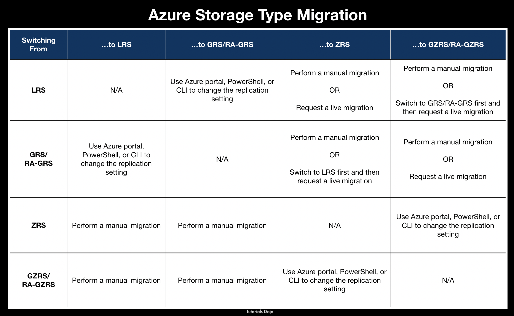
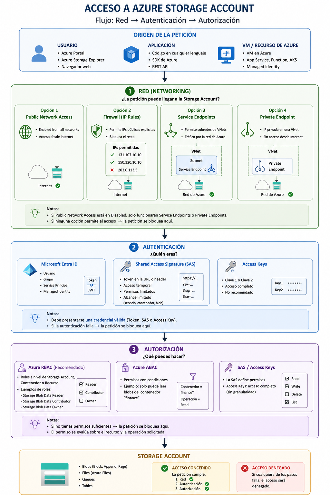

[Azure](https://github.com/magnum31415/wiki/blob/main/azure.md)

# 📑 Índice – Azure Storage AZ-104
- [Azure Blob Storage - Características de protección de datos](#azure-blob-storage---características-de-protección-de-datos)
- [⬅️ Volver a: Azure Storage - Roles de Management Plane vs Data Plane (AZ-104)](#azure-storage---roles-de-management-plane-vs-data-plane-az-104)
- [Métodos de autenticación y autorización para Azure Storage Account (AZ-104)](#métodos-de-autenticación-y-autorización-para-azure-storage-account-az-104)
- [📦 Azure Storage – Resumen ampliado para AZ-104](#-azure-storage--resumen-ampliado-para-az-104)
- [🧱 Servicios principales de Azure Storage](#-servicios-principales-de-azure-storage)
- [2️⃣ Azure Blob Storage](#2️⃣-azure-blob-storage)
- [3️⃣ Azure Files](#3️⃣-azure-files)
- [4️⃣ AzCopy](#4️⃣-azcopy)
- [5️⃣ Azure Queue Storage](#5️⃣-azure-queue-storage)
- [6️⃣ Azure Table Storage](#6️⃣-azure-table-storage)
- [7️⃣ Comparativa rápida](#7️⃣-comparativa-rápida)
- [🎯 Puntos críticos para AZ-104](#-puntos-críticos-para-az-104)
- [🔥 Cuándo usar cada servicio](#-cuándo-usar-cada-servicio)
- [🧠 Claves de examen](#-claves-de-examen)
- [🔄 Conversiones permitidas entre tipos de redundancia en Azure Storage](#-conversiones-permitidas-entre-tipos-de-redundancia-en-azure-storage)
- [🗂 Tipos de Storage Account (según la pregunta AZ-104)](#-tipos-de-storage-account-según-la-pregunta-az-104)
- [🎯 ¿Qué cuenta puede convertirse a ZRS mediante Live Migration?](#-qué-cuenta-puede-convertirse-a-zrs-mediante-live-migration)
- [🔄 Live Migration from Azure Support](#-live-migration-from-azure-support)
- [❓ ¿Por qué Live Migration solo funciona en cuentas Standard y no Premium?](#-por-qué-live-migration-solo-funciona-en-cuentas-standard-y-no-premium)
- [✅ Respuesta correcta](#-respuesta-correcta)
- [Azure Storage Immutability (AZ-104)](#azure-storage-immutability-az-104)
- [Pregunta típica del AZ-104: "Access Policy"](#pregunta-típica-del-az-104-access-policy)
- [Stored Access Policy vs Shared Access Signature (SAS)](#stored-access-policy-vs-shared-access-signature-sas)
- [⬅️ Volver a: Azure Blob Storage - Tipos de Blob (AZ-104)](#azure-blob-storage---tipos-de-blob-az-104)
- [⬅️ Volver a: Azure Storage - Account Kind (AZ-104)](#azure-storage---account-kind-az-104)
- [⬅️ Volver a: Azure Storage - User Delegation SAS vs Service SAS vs Account SAS (AZ-104)](#azure-storage---user-delegation-sas-vs-service-sas-vs-account-sas-az-104)
- [Azure Blob Inventory Rules](#azure-blob-inventory-rules)
- [Azure Blob Storage - Encryption Scope](#azure-blob-storage---encryption-scope)
- [Acceso a una Azure Storage Account](#acceso-a-una-azure-storage-account)

  
---
# Azure Blob Storage - Características de protección de datos

| Característica | ¿Qué protege? | ¿Recupera datos? | Uso principal |
|----------------|---------------|------------------|---------------|
| **Blob Versioning** | Sobrescrituras y eliminaciones | ✅ Sí | Mantener versiones anteriores de un blob. |
| **Soft Delete** | Eliminaciones accidentales | ✅ Sí | Recuperar blobs eliminados. |
| **Blob Snapshots** | Estado puntual del blob | ✅ Sí | Crear copias puntuales antes de modificar un blob. |
| **Object Replication** | Desastres regionales | ❌ No (replica) | Replicar automáticamente blobs entre Storage Accounts. |
| **Change Feed** | Historial de cambios | ❌ No | Registrar todas las operaciones realizadas sobre los blobs. |
| **Lifecycle Management** | Coste de almacenamiento | ❌ No | Mover o eliminar blobs automáticamente según reglas. |

---
# Azure Storage - Roles de Management Plane vs Data Plane (AZ-104)

En Azure Storage existen dos grandes categorías de roles:

1. **Management Plane** → Administran el recurso (**Storage Account**).
2. **Data Plane** → Acceden a los datos (**Blobs, Files, Queues y Tables**).

La mayoría de preguntas del AZ-104 consisten en distinguir entre ambos.

---

# 1. Management Plane

Estos roles permiten administrar el **Storage Account**, pero **NO acceder al contenido** (salvo que posteriormente utilicen una Access Key, SAS o se asignen un rol de Data Plane).

| Rol | ¿Qué administra? | ¿Puede leer datos? | Ejemplo |
|------|------------------|:------------------:|----------|
| **Reader** | Ver la configuración del Storage Account | ❌ | Ver el tipo de replicación o las reglas del firewall. |
| **Contributor** | Administrar el Storage Account y casi cualquier recurso de Azure | ❌ | Crear un Storage Account o cambiar su configuración. |
| **Storage Account Contributor** | Administrar exclusivamente Storage Accounts | ❌ | Crear un File Share o habilitar Soft Delete. |
| **Owner** | Administración completa + asignar RBAC | ❌* | Crear Storage Accounts y asignar permisos a otros usuarios. |
| **User Access Administrator** | Gestionar asignaciones RBAC | ❌ | Asignar el rol **Storage Blob Data Reader** a un usuario. |

> **\*** El rol **Owner** tampoco puede leer los datos directamente; únicamente puede asignarse a sí mismo un rol de **Data Plane**.

---

# 2. Data Plane (Blob Storage)

Permiten acceder a los **Blob Containers** y a los blobs.

| Rol | Leer | Escribir | Eliminar | Crear User Delegation SAS | Ejemplo |
|------|:----:|:--------:|:--------:|:--------------------------:|----------|
| **Storage Blob Data Reader** | ✅ | ❌ | ❌ | ❌ | Descargar y listar blobs. |
| **Storage Blob Data Contributor** | ✅ | ✅ | ✅ | ❌ | Subir, modificar y eliminar blobs. |
| **Storage Blob Data Owner** | ✅ | ✅ | ✅ | ❌ | Administrar blobs, propietarios y ACL de ADLS Gen2. |
| **Storage Blob Delegator** | ❌ | ❌ | ❌ | ✅ | Obtener una User Delegation Key para generar una User Delegation SAS. |

Ejemplo:

```text
container1

├── foto.jpg
├── informe.pdf
└── backup.zip
```

- **Reader** → Descargar `foto.jpg`.
- **Contributor** → Subir `nuevo.pdf`.
- **Owner** → Cambiar permisos y administrar el contenido.

---

# 3. Data Plane (Azure Files)

Permiten acceder a **Azure File Shares** mediante SMB.

| Rol | Leer | Escribir | Modificar ACL NTFS | Ejemplo |
|------|:----:|:--------:|:------------------:|----------|
| **Storage File Data SMB Share Reader** | ✅ | ❌ | ❌ | Abrir un archivo. |
| **Storage File Data SMB Share Contributor** | ✅ | ✅ | ❌ | Crear, modificar o borrar archivos. |
| **Storage File Data SMB Share Elevated Contributor** | ✅ | ✅ | ✅ | Cambiar permisos NTFS de carpetas y archivos. |
| **Storage File Data SMB Share Owner** | ✅ | ✅ | ✅ *(incluye Take Ownership)* | Control total sobre el Azure File Share: administrar permisos NTFS y tomar posesión de archivos y carpetas. |

Ejemplo:

```text
share1

├── Informe.docx
└── Datos.xlsx
```

- **Reader** → Leer `Informe.docx`.
- **Contributor** → Crear `Nuevo.docx`.
- **Elevated Contributor** → Modificar permisos NTFS de `Datos.xlsx`.

---

# 4. Data Plane (Queue Storage)

Permiten acceder a **Azure Queue Storage** y administrar los mensajes de las colas.

Actualmente Azure proporciona un único rol de Data Plane.

| Rol | Leer | Insertar | Actualizar | Eliminar | Ejemplo |
|------|:----:|:--------:|:-----------:|:--------:|----------|
| **Storage Queue Data Contributor** | ✅ | ✅ | ✅ | ✅ | Leer, insertar y eliminar mensajes de una cola. |

Ejemplo:

```text
queue1

├── Mensaje 1
├── Mensaje 2
└── Mensaje 3
```

- **Contributor** → Leer, insertar, actualizar y eliminar mensajes.

> **No existe un rol específico `Storage Queue Data Reader`.**

---

# 5. Data Plane (Table Storage)

Permiten acceder a **Azure Table Storage** y administrar las entidades de una tabla.

Actualmente Azure proporciona un único rol de Data Plane.

| Rol | Leer | Insertar | Actualizar | Eliminar | Ejemplo |
|------|:----:|:--------:|:-----------:|:--------:|----------|
| **Storage Table Data Contributor** | ✅ | ✅ | ✅ | ✅ | Leer y administrar entidades de una tabla. |

Ejemplo:

```text
Customers

├── RowKey = 1001
├── RowKey = 1002
└── RowKey = 1003
```

- **Contributor** → Leer, crear, modificar y eliminar entidades.

> **No existe un rol específico `Storage Table Data Reader`.**

---

# ¿Qué rol necesito?

## Quiero crear un Storage Account

```text
Storage Account Contributor
```

---

## Quiero cambiar la replicación

```text
Storage Account Contributor
```

---

## Quiero configurar el Firewall del Storage

```text
Storage Account Contributor
```

---

## Quiero crear un Blob Container

```text
Storage Account Contributor
```

---

## Quiero leer un Blob

```text
Storage Blob Data Reader
```

---

## Quiero subir un Blob

```text
Storage Blob Data Contributor
```

---

## Quiero administrar completamente un Blob Container

```text
Storage Blob Data Owner
```

---

## Quiero leer un Azure File Share

```text
Storage File Data SMB Share Reader
```

---

## Quiero escribir en un Azure File Share

```text
Storage File Data SMB Share Contributor
```

---

## Quiero modificar permisos NTFS

```text
Storage File Data SMB Share Elevated Contributor
```

---

## Quiero leer o procesar mensajes de una Queue

```text
Storage Queue Data Contributor
```

---

## Quiero leer o modificar entidades de una Table

```text
Storage Table Data Contributor
```

---

# Comparación rápida

| Acción | Rol necesario |
|----------|----------------|
| Crear un Storage Account | Storage Account Contributor |
| Configurar Networking | Storage Account Contributor |
| Configurar Replicación | Storage Account Contributor |
| Crear un Blob Container | Storage Account Contributor |
| Descargar un Blob | Storage Blob Data Reader |
| Subir un Blob | Storage Blob Data Contributor |
| Administrar ACL de Blobs | Storage Blob Data Owner |
| Leer un Azure File | Storage File Data SMB Share Reader |
| Crear archivos en Azure Files | Storage File Data SMB Share Contributor |
| Cambiar ACL NTFS | Storage File Data SMB Share Elevated Contributor |
| Leer o procesar mensajes de una Queue | Storage Queue Data Contributor |
| Leer o modificar entidades de una Table | Storage Table Data Contributor |
| Asignar roles RBAC | Owner o User Access Administrator |

---

# Comparación por servicio

| Servicio | Reader | Contributor | Owner / Elevated |
|----------|--------|-------------|------------------|
| **Blob Storage** | Storage Blob Data Reader | Storage Blob Data Contributor | Storage Blob Data Owner |
| **Azure Files** | Storage File Data SMB Share Reader | Storage File Data SMB Share Contributor | Storage File Data SMB Share Elevated Contributor |
| **Queue Storage** | ❌ No existe | Storage Queue Data Contributor | ❌ No existe |
| **Table Storage** | ❌ No existe | Storage Table Data Contributor | ❌ No existe |

---

# Regla mnemotécnica

```text
Storage Account...

↓

Administra el Storage
```

```text
Storage Blob Data...

↓

Accede a los Blobs
```

```text
Storage File Data...

↓

Accede a Azure Files
```

```text
Storage Queue Data...

↓

Accede a las Queues
```

```text
Storage Table Data...

↓

Accede a las Tables
```

---

> [!IMPORTANT]
> **Claves para el AZ-104**
>
> - Los roles **Management Plane** administran el **Storage Account**, pero **no permiten acceder a los datos**.
> - Los roles **Data Plane** permiten acceder al contenido almacenado (**Blobs, Azure Files, Queues y Tables**).
> - **Storage Account Contributor** puede crear un Blob Container o un File Share, pero **no leer su contenido**.
> - Para leer un Blob necesitas **Storage Blob Data Reader**.
> - Para leer un Azure File Share necesitas **Storage File Data SMB Share Reader**.
> - Para trabajar con **Queue Storage** se utiliza **Storage Queue Data Contributor**.
> - Para trabajar con **Table Storage** se utiliza **Storage Table Data Contributor**.
> - Si el nombre del rol contiene **"Data"**, casi siempre pertenece al **Data Plane**.
> - Si el nombre del rol contiene **"Storage Account"**, normalmente pertenece al **Management Plane**.
---
# Métodos de autenticación y autorización para Azure Storage Account (AZ-104)

| Método | ¿Qué es? | Credenciales utilizadas | Nivel de acceso | Seguridad | Casos de uso típicos | Ejemplo | Recomendado |
|---------|----------|-------------------------|-----------------|-----------|----------------------|----------|-------------|
| **Microsoft Entra ID + Azure RBAC (IAM)** | Autenticación basada en identidad mediante Microsoft Entra ID y permisos RBAC. | Usuario, Grupo, Service Principal o Managed Identity. | Granular (roles RBAC). | ⭐⭐⭐⭐⭐ Muy alta | Aplicaciones Azure, usuarios corporativos, automatización. | Una **Managed Identity** de una Azure Function accede a un contenedor Blob con el rol **Storage Blob Data Contributor**. | ✅ Sí |
| **User Delegation SAS** | SAS firmado mediante una User Delegation Key obtenida desde Microsoft Entra ID. | User Delegation Key. | Granular (recurso, permisos, tiempo, IP, protocolo). | ⭐⭐⭐⭐⭐ Muy alta | Aplicaciones modernas que usan Entra ID. | Una aplicación genera un enlace SAS válido durante **30 minutos** para que un cliente descargue un blob. | ✅ Mejor opción para SAS |
| **Service SAS** | SAS para un único servicio (Blob, Files, Queue o Table). | Storage Account Key. | Granular. | ⭐⭐⭐⭐ Alta | Compartir acceso temporal a blobs, archivos, etc. | Enviar a un proveedor un enlace SAS para subir un fichero a un contenedor Blob durante **24 horas**. | ✅ Sí |
| **Account SAS** | SAS que puede abarcar varios servicios del Storage Account. | Storage Account Key. | Amplio. | ⭐⭐⭐ Media-Alta | Administración temporal de varios servicios. | Una herramienta de backup necesita acceder temporalmente a **Blob y File Shares** del mismo Storage Account. | ⚠️ Solo cuando sea necesario |
| **Stored Access Policy** | Política almacenada en un contenedor o file share que controla uno o varios Service SAS. Permite modificar o revocar los SAS asociados sin regenerarlos. | Se utiliza junto con un **Service SAS**. | Granular. | ⭐⭐⭐⭐⭐ Muy alta | Compartir recursos durante largos periodos con posibilidad de revocación centralizada. | Se crean 20 enlaces SAS para distintos proveedores y, si es necesario revocarlos, basta con eliminar la **Stored Access Policy**. | ✅ Muy recomendable cuando se usan Service SAS |
| **Storage Account Access Keys (Shared Key)** | Claves maestras del Storage Account. Existen dos claves (Key1 y Key2). | Storage Account Key. | Acceso completo al Storage Account. | ⭐⭐ Baja | Compatibilidad con aplicaciones antiguas y scripts heredados. | Un script heredado utiliza la **Key1** para copiar blobs entre Storage Accounts. | ❌ Evitar cuando sea posible |
| **Anonymous Public Access** | Acceso sin autenticación. | Ninguna. | Solo recursos públicos. | ⭐ Muy baja | Sitios web estáticos, contenido público. | Un contenedor Blob aloja imágenes públicas para una página web sin necesidad de autenticación. | ❌ Solo si el contenido debe ser público |

---

## Notas importantes para el AZ-104

- **Stored Access Policies NO son un método de autenticación por sí mismas.**
- Una **Stored Access Policy** únicamente puede asociarse a un **Service SAS**.
- **No pueden utilizarse** con:
  - User Delegation SAS
  - Account SAS
- Su principal ventaja es que permiten:
  - Cambiar la fecha de expiración.
  - Cambiar los permisos.
  - Revocar todos los SAS asociados eliminando la política.

---

## Comparativa rápida

| Característica | Entra ID (IAM) | User Delegation SAS | Service SAS | Account SAS | Storage Keys |
|----------------|---------------|---------------------|-------------|-------------|--------------|
| Basado en identidad | ✅ | ✅ | ❌ | ❌ | ❌ |
| Permisos granulares | ✅ | ✅ | ✅ | ✅ | ❌ |
| Puede expirar | N/A | ✅ | ✅ | ✅ | ❌ |
| Puede revocarse fácilmente | ✅ | ❌ | ⚠️ Solo con Stored Access Policy | ❌ | ❌ (hay que regenerar la clave) |
| Compatible con Stored Access Policy | ❌ | ❌ | ✅ | ❌ | N/A |
| Acceso completo al Storage | ❌ | ❌ | ❌ | ⚠️ Puede abarcar varios servicios | ✅ |
| Recomendado por Microsoft | ✅ | ✅ | ✅ | ⚠️ | ❌ |

[!IMPORTANT] **Clave para el examen AZ-104**

Las **Stored Access Policies** suelen aparecer como una respuesta independiente, pero **no son un mecanismo de autenticación**.
En realidad, son un mecanismo para **gestionar y revocar los permisos** de un **Service SAS**.
Esta distinción es una de las claves de varias preguntas del examen AZ-104.

---

# 📦 Azure Storage – Resumen ampliado para AZ-104
[⬆ Volver al índice](#-índice--azure-storage-az-104)

## 1️⃣ ¿Qué es Azure Storage?

Azure Storage es la plataforma de almacenamiento en la nube de Microsoft. Está diseñada para ser:


- Masivamente escalable  
- Altamente disponible  
- Segura  
- Durable  
- Accesible desde cualquier lugar
  
Data in an Azure Storage account is always replicated three times in the primary region.

Permite almacenar distintos tipos de datos según el escenario.

---

# 🧱 Servicios principales de Azure Storage
[⬆ Volver al índice](#-índice--azure-storage-az-104)
| Servicio | Tipo de datos | Caso típico en examen |
|-----------|--------------|-----------------------|
| **Blob Storage** | Objetos (no estructurados) | Imágenes, backups, logs |
| **Azure Files** | File share (SMB) | Migrar file servers |
| **Disk Storage** | Discos para VMs | IaaS |
| **Queue Storage** | Mensajería | Comunicación entre apps |
| **Table Storage** | NoSQL key-value | Datos estructurados simples |

---

# 2️⃣ Azure Blob Storage
[⬆ Volver al índice](#-índice--azure-storage-az-104)


| Categoría | Contenido |
|------------|------------|
| **¿Qué es?** | Servicio de almacenamiento de **objetos** optimizado para grandes volúmenes de datos **no estructurados** (sin esquema definido). |
| **Ejemplos de datos no estructurados** | Texto, archivos binarios, imágenes, vídeos, logs |
| **Casos de uso principales** | Servir imágenes/documentos a navegador, almacenamiento distribuido, streaming vídeo/audio, logs, backup & DR, archivado, análisis de datos |
| **Tipos de Blob** | **Block Blob** → Archivos normales (docs, imágenes, backups)<br>**Append Blob** → Logs<br>**Page Blob** → Discos de VM |

---

# 3️⃣ Azure Files

| Categoría | Contenido |
|------------|------------|
| **¿Qué es?** | Servicio de **file shares en la nube** accesible vía **SMB** y **REST API**. Permite que múltiples VMs compartan archivos con lectura y escritura. |
| **Protocolos soportados** | SMB (Server Message Block) <br> REST API |
| **Diferencia clave vs file server tradicional** | Acceso desde cualquier lugar mediante URL pública del storage + autenticación segura. |
| **Ejemplo de acceso** | `https://storageaccount.file.core.windows.net/share/file` |
| **¿Qué es un SAS Token?** | Mecanismo que permite **acceso temporal** con **permisos limitados** (read/write/delete) a recursos privados. |
| **Casos de uso comunes** | Migración de file servers on-prem, compartir configuración entre VMs, herramientas compartidas de equipo, almacenamiento de logs, métricas y crash dumps |

---

# 4️⃣ AzCopy
[⬆ Volver al índice](#-índice--azure-storage-az-104)

| Categoría | Contenido |
|------------|------------|
| **¿Qué es?** | Herramienta de **línea de comandos** para copiar datos hacia o desde una **Storage Account**. |
| **Servicios soportados** | ✅ Blob <br> ✅ File |
| **No soporta** | ❌ Table <br> ❌ Queue |
| **Pregunta típica de examen** | ¿Qué servicios puede copiar AzCopy? → ✔ Blob y File <br> ✘ Table y Queue |
---

# 5️⃣ Azure Queue Storage
[⬆ Volver al índice](#-índice--azure-storage-az-104)
- Servicio de mensajería
- Permite desacoplar aplicaciones
- Comunicación entre componentes

📌 No compatible con AzCopy.

---

# 6️⃣ Azure Table Storage

- Base de datos NoSQL
- Modelo clave/valor
- Alto rendimiento y bajo coste

📌 No compatible con AzCopy.

---

# 7️⃣ Comparativa rápida
[⬆ Volver al índice](#-índice--azure-storage-az-104)
| Servicio | Tipo | Protocolo | Caso típico |
|-----------|------|------------|--------------|
| Blob | Object storage | REST | Imágenes, backup |
| Files | File share | SMB + REST | Migración file server |
| Table | NoSQL | REST | Datos estructurados simples |
| Queue | Messaging | REST | Comunicación entre apps |

---

# 🎯 Puntos críticos para AZ-104
[⬆ Volver al índice](#-índice--azure-storage-az-104)

| Concepto | Resumen clave |
|-----------|---------------|
| **Blob vs Files** | **Blob** → Almacenamiento de objetos <br> **Files** → File share vía SMB |
| **AzCopy** | Funciona solo con **Blob y File** <br> No funciona con **Table ni Queue** |
| **SAS Token** | Proporciona **acceso temporal** con **permisos limitados**. Muy preguntado en escenarios de seguridad. |

---

### 🔥 Cuándo usar cada servicio

| Categoría | Contenido |
|------------|------------|
| **Cuándo usar cada servicio** | **Backup** → Blob <br> **Logs** → Blob (Append) <br> **Compartir archivos entre VMs** → Files <br> **Comunicación entre servicios** → Queue <br> **Datos estructurados simples** → Table |
| **Claves de examen (palabra clave → servicio)** | “object storage” → Blob <br> “SMB” / “file share” → Azure Files <br> “NoSQL” → Table <br> “messaging” → Queue <br> “command-line copy tool” → AzCopy (solo Blob + File) |

---

# Conversiones permitidas entre tipos de redundancia en Azure Storage
[⬆ Volver al índice](#-índice--azure-storage-az-104)
## 📌 Regla general importante

- ✅ Puedes **aumentar el nivel de resiliencia**
- ⚠️ Algunas conversiones requieren que la **región soporte ZRS / GZRS**
- ❌ No puedes cambiar entre **LRS y ZRS directamente** (requiere migración manual)
- ❌ No puedes convertir de **GRS a ZRS directamente**
- ❌ No puedes convertir de **GZRS a ZRS**
- 🔎 La migración en vivo (Live Migration) a ZRS/GZRS solo está soportada inicialmente para cuentas con **LRS o GRS**

---
## Tabla Nº de copias por region

| Redundancia | Nº de copias | Región primaria | Región secundaria | ¿Entre Availability Zones? | Lectura desde secundaria |
|-------------|-------------:|-----------------|-------------------|----------------------------|--------------------------|
| **LRS (Locally Redundant Storage)** | **3** | 3 copias en **un único datacenter** (no entre AZ) | ❌ | ❌ No | ❌ |
| **ZRS (Zone-Redundant Storage)** | **3** | 1 copia en **cada una de 3 Availability Zones** | ❌ | ✅ Sí | ❌ |
| **GRS (Geo-Redundant Storage)** | **6** | 3 copias LRS en **un único datacenter** | 3 copias LRS en **un único datacenter** de la región emparejada | ❌ No | ❌ |
| **RA-GRS (Read-Access Geo-Redundant Storage)** | **6** | 3 copias LRS en **un único datacenter** | 3 copias LRS en **un único datacenter** de la región emparejada | ❌ No | ✅ Sí |
| **GZRS (Geo-Zone-Redundant Storage)** | **6** | 1 copia en **cada una de 3 Availability Zones** | 3 copias LRS en **un único datacenter** | ✅ Solo en la región primaria | ❌ |
| **RA-GZRS (Read-Access Geo-Zone-Redundant Storage)** | **6** | 1 copia en **cada una de 3 Availability Zones** | 3 copias LRS en **un único datacenter** | ✅ Solo en la región primaria | ✅ Sí |

## 🔄 Tabla de conversiones entre replicaciones

| Desde ↓ | Puede convertirse a → |
|----------|------------------------|
| **LRS** | GRS, RA-GRS, ZRS*, GZRS*, RA-GZRS* |
| **ZRS** | GZRS, RA-GZRS |
| **GRS** | RA-GRS, GZRS*, RA-GZRS* |
| **RA-GRS** | GRS, GZRS*, RA-GZRS* |
| **GZRS** | RA-GZRS |
| **RA-GZRS** | GZRS |

\* Puede requerir migración manual vía Azure Support y que la región soporte zonas de disponibilidad.

---

# 🗂 Tipos de Storage Account (según la pregunta AZ-104)
[⬆ Volver al índice](#-índice--azure-storage-az-104)



| Nombre        | Kind                  | Performance | Replication | Access Tier |
|--------------|-----------------------|-------------|-------------|------------|
| tdaccount1   | General-purpose v2    | Standard    | LRS         | Cool       |
| tdaccount2   | General-purpose v2    | Premium     | RA-GRS      | Hot        |
| tdaccount3   | General-purpose v1    | Premium     | GRS         | None       |
| tdaccount4   | BlobStorage           | Standard    | LRS         | Hot        |

---

# 🎯 ¿Qué cuenta puede convertirse a ZRS mediante Live Migration?
[⬆ Volver al índice](#-índice--azure-storage-az-104)
## 🔎 Reglas clave para Live Migration a ZRS

- ✔ Solo soportado inicialmente para cuentas con **LRS o GRS**
- ✔ Si es **RA-GRS**, primero debe cambiarse a LRS o GRS
- ✔ Debe ser **Standard**, no Premium
- ✔ Debe estar en región que soporte ZRS
- ✔ Algunas combinaciones de Kind no soportan ZRS

---

# 🔄 Live Migration from Azure Support
[⬆ Volver al índice](#-índice--azure-storage-az-104)
## 📌 ¿Qué es?

Una **Live Migration from Azure Support** es un proceso gestionado por el equipo de soporte de Microsoft que permite cambiar ciertas configuraciones críticas de un recurso (por ejemplo, el tipo de replicación de una Storage Account) **sin downtime y sin pérdida de datos**.

No es una acción que puedas ejecutar directamente desde el Portal, CLI o PowerShell.  
Debe solicitarse formalmente a Microsoft mediante un **support request**.

---

## 🎯 ¿Cuándo se usa?

Principalmente cuando necesitas cambiar:

- LRS → ZRS
- LRS → GZRS
- GRS → GZRS
- GRS → RA-GZRS

Especialmente cuando el cambio afecta a **cómo se replica el dato en la región primaria**, algo que no se puede hacer automáticamente.

---

## ⚙️ Qué significa “Live”

“Live” implica que:

- ✅ No hay interrupción del servicio
- ✅ No hay que recrear la Storage Account
- ✅ No se pierden datos
- ✅ La aplicación puede seguir funcionando

Azure realiza internamente la redistribución de los datos.

---

## 🚫 Qué NO es

- No es un simple cambio de configuración en el portal.
- No es eliminar y recrear la cuenta.
- No es una migración entre regiones.
- No siempre está disponible (depende del tipo de cuenta y la región).

---

## 🧠 Clave para examen AZ-104

Si la pregunta menciona:

- Cambio de LRS a ZRS
- Cambio de GRS a GZRS
- Sin downtime
- Gestionado por Microsoft

👉 La respuesta suele ser: **Solicitar una Live Migration a través de Azure Support**.

# ❓ ¿Por qué Live Migration solo funciona en cuentas Standard y no Premium?
[⬆ Volver al índice](#-índice--azure-storage-az-104)

## Diferencia arquitectónica

| Característica | Standard | Premium |
|---------------|-----------|-----------|
| Tipo de hardware | Hardware compartido | Hardware dedicado (SSD alto rendimiento) |
| Modelo de escalado | Escalado horizontal | Arquitectura optimizada para baja latencia |
| Arquitectura | Distribuida multitenant | Diseño más rígido y especializado |
| Flexibilidad de redistribución | Permite reubicar y redistribuir datos internamente sin interrupción | Datos vinculados a infraestructura física concreta |
| Redistribución entre zonas (ZRS) | Posible mediante Live Migration | No soportado sin recrear la cuenta |
| Enfoque principal | Flexibilidad y resiliencia | Rendimiento y baja latencia |
| Casos de uso típicos | Workloads generales, almacenamiento flexible | Discos de VM, workloads de alta IOPS, baja latencia constante |
| Cambios dinámicos de replicación | Soportados (según escenario) | No diseñado para cambios dinámicos |
| Migración LRS ↔ ZRS | Posible vía soporte (según requisitos) | No soportado |
| Reconfiguración interna del layout de datos | Posible | No soportado |

---

## ZRS implica distribución entre Availability Zones

Para pasar de LRS a ZRS:

- Los datos deben replicarse entre **3 Availability Zones**
- Esto requiere redistribución física

En Standard, Azure puede hacerlo internamente.
En Premium, el modelo de hardware no permite ese cambio sin recrear la cuenta.

---

## Limitaciones oficiales

Live Migration a ZRS/GZRS está soportado únicamente cuando:

- La cuenta usa **LRS o GRS**
- Es de tipo **Standard**
- La región soporta ZRS

Si es Premium, la única opción es:

👉 Crear una nueva cuenta con la replicación deseada  
👉 Migrar los datos manualmente  

## Resumen conceptual para examen

| Característica | Standard | Premium |
|---------------|----------|----------|
| Arquitectura flexible | ✅ | ❌ |
| Soporta Live Migration (Azure Support) | ✅ | ❌ |
| Tipo de migración soportada | Live Migration gestionada por Azure Support (sin downtime, según escenario) | Solo migración manual: crear nueva cuenta y copiar datos (AzCopy / Data Movement) |
| Orientado a rendimiento extremo | ❌ | ✅ |
| Permite cambio dinámico de replicación | ✅ | ❌ |

**🎯 Idea clave**

**Standard = más flexible en replicación**  
**Premium = más rígido pero más rápido**

Por eso Live Migration solo aplica a Standard.

---
# Azure Storage Immutability (AZ-104)

## Concepto

La **immutability** (inmutabilidad) impide que los datos puedan ser:

- modificados
- sobrescritos
- eliminados

durante un período determinado o indefinidamente.

Se utiliza principalmente para:

- WORM (Write Once Read Many)
- requisitos legales
- cumplimiento normativo (compliance)
- auditorías
- protección frente a ransomware

---

## ¿A qué nivel puede configurarse?

| Nivel | Soportado | Comentario |
|----------|-----------|------------|
| Storage Account | ✅ Sí (Version-level immutability) | Configuración para proteger versiones de blobs. |
| Blob Container | ✅ Sí | El caso más habitual. Se aplica a todos los blobs del contenedor. |
| Blob (Object Level / Version) | ✅ Sí (Version-level immutability) | Puede aplicarse sobre versiones individuales de blobs. |
| Azure Files | ❌ No | No soporta Blob Immutability Policy. |
| Queue Storage | ❌ No | No soporta inmutabilidad. |
| Table Storage | ❌ No | No soporta inmutabilidad. |

En realidad, son dos mecanismos distintos de inmutabilidad.

| Característica                              | Storage Account (Version-level Immutability)                       | Blob Container Immutability                            |
| ------------------------------------------- | ------------------------------------------------------------------ | ------------------------------------------------------ |
| Ámbito                                      | Versiones individuales de blobs                                    | Todo el contenedor                                     |
| Granularidad                                | Nivel de versión del blob                                          | Nivel de contenedor                                    |
| Requiere Blob Versioning                    | ✅ Sí                                                               | ❌ No necesariamente                                    |
| Se aplica automáticamente a todos los blobs | ❌ No, protege las versiones                                        | ✅ Sí                                                   |
| Caso de uso típico                          | Proteger versiones frente a borrados o modificaciones              | Cumplimiento normativo (WORM) sobre todo el contenedor |
| Se configura en                             | **Storage Account → Data Protection → Version-level immutability** | **Container → Immutability Policy**                    |

### 1. Blob Container Immutability

Es la opción clásica y la más preguntada en el AZ-104.

````
Storage Account
        │
        ▼
   Blob Container
        │
        ▼
 Immutability Policy
        │
        ▼
 ┌─────────────┐
 │ blob1       │
 │ blob2       │
 │ blob3       │
 └─────────────┘
````

Todos los blobs del contenedor quedan protegidos por la política.

Se pueden configurar:
- Time-based Retention
- Legal Hold

### 2. Storage Account - Version-level Immutability

Aquí la protección es sobre las versiones de los blobs, no sobre el contenedor.

````
Storage Account
        │
        ▼
Version-level Immutability
        │
        ▼
  blob.txt
    │
    ├── Version 1   🔒
    ├── Version 2   🔒
    └── Version 3   🔒
````
Si el blob cambia:
````
    blob.txt
        │
     Modificar
        │
        ▼
   Nueva versión
````
las versiones anteriores permanecen protegidas.

Para ello es necesario tener habilitado:
````
Storage Account
        │
        ▼
Data Protection
        │
        ├── Blob Versioning ✅
        └── Version-level Immutability ✅
````        

### Regla rápida para el AZ-104
````
Blob Container
        │
        ▼
Protege todos los blobs del contenedor
````
````
Storage Account
        │
        ▼
Version-level Immutability
        │
        ▼
Protege las versiones de los blobs
````

**Forma fácil de recordarlo**

- **Blob Container Immutability** = "🔒 Este contenedor es WORM".
- **Version-level Immutability** = "🔒 Las versiones de cada blob quedan protegidas".


## 1. Storage Account (Version-level Immutability)

Puede habilitarse una política de inmutabilidad a nivel del Storage Account para proteger versiones de blobs.

Conceptualmente:

```text
Storage Account
       │
       ▼
Version-level Immutability
       │
       ▼
Blob Versions
```

Se configura desde:

```text
Storage Account
    ▼
Data Protection
    ▼
Version-level Immutability
```

Requisitos:

- Blob Versioning habilitado.
- Servicio Blob Storage.


## 2. Blob Container

Es el escenario más habitual y el más preguntado en el AZ-104.

La política se aplica al contenedor completo.

```text
Storage Account
      │
      ▼
Blob Container
      │
      ▼
Immutability Policy
      │
      ▼
Todos los blobs del contenedor
```

Se configura desde:

```text
Storage Account
    ▼
Containers
    ▼
Seleccionar Container
    ▼
Immutability Policy
```

Se puede definir:

- Time-based Retention
- Legal Hold

## 3. Blob Version (Object Level)

Con Version-level Immutability:

```text
Blob

    │

    ├── Version 1

    ├── Version 2

    └── Version 3
```

Cada versión puede quedar protegida frente a:

- modificación
- eliminación

durante el período definido.

---

## Tipos de políticas

### Time-based Retention Policy

Protege los datos durante un período determinado.

Ejemplo:

```text
Retention 365 days
```

Durante ese tiempo:

```text
Delete ❌
Modify ❌
Overwrite ❌
```

Una vez expirado el período:

```text
Delete ✅
```

## Legal Hold

No depende del tiempo.

Los datos permanecen protegidos hasta eliminar explícitamente el Legal Hold.

```text
    Blob
      │
Legal Hold
      │
      ▼
Cannot Delete
Cannot Modify
```


## Activación en Azure Portal

### Storage Account (Version-level)

```text
Storage Account
      ▼
Data Protection
      ▼
Version-level Immutability
      ▼
    Enable
```


### Blob Container

```text
Storage Account
      ▼
Containers
      ▼
Container
      ▼
Immutability Policy
      ▼
Configure
      ▼
Time-based Retention
      or
  Legal Hold
```


## Resumen

| Nivel | Soporta Immutability | Cómo se activa |
|----------|---------------------|----------------|
| Storage Account | ✅ Sí (Version-level) | Data Protection → Version-level Immutability |
| Blob Container | ✅ Sí | Container → Immutability Policy |
| Blob Version | ✅ Sí | Mediante Version-level Immutability |
| Azure Files | ❌ No | No soportado |
| Queue Storage | ❌ No | No soportado |
| Table Storage | ❌ No | No soportado |


## Trampas típicas del AZ-104

### Trampa 1

Pensar que toda la Storage Account queda WORM automáticamente ❌ Incorrecto.

Normalmente la política protege:

- Blob Containers
- Blob Versions


### Trampa 2

Pensar que Azure Files soporta Blob Immutability. ❌ Incorrecto.

Azure Files no soporta esta funcionalidad.


### Trampa 3

Pensar que Queue o Table Storage soportan políticas WORM. ❌ Incorrecto.

No soportan Blob Immutability Policy.


## Regla rápida para memorizar

```text
Blob Container
       │
       ▼
Immutability Policy
```

```text
Storage Account
       │
       ▼
Version-level Immutability
```

```text
Azure Files
       │
       ▼
No Blob Immutability
```

```text
Queue Storage
       │
       ▼
No Blob Immutability
```

```text
Table Storage
       │
       ▼
No Blob Immutability
```

---

## Chuleta AZ-104

| Si lees... | Piensa en... |
|------------|--------------|
| WORM | Immutability Policy |
| Blob Container | Immutability Policy |
| Time-based retention | Blob Immutability |
| Legal Hold | Blob Immutability |
| Version-level immutability | Storage Account + Blob Versioning |
| Azure Files | ❌ No soporta Blob Immutability |
| Queue Storage | ❌ No soporta Blob Immutability |
| Table Storage | ❌ No soporta Blob Immutability |

---

# Pregunta típica del AZ-104: "Access Policy"

## Trampa del examen

Es frecuente encontrar preguntas como:

> You must ensure that any new blobs uploaded to a blob container cannot be altered or deleted for one year.
>
> Which configuration should you apply?

La respuesta correcta suele ser:

✅ **Access Policy**

Sin embargo, esto puede resultar confuso.

Muchos candidatos piensan inmediatamente en una **Stored Access Policy** para SAS Tokens, pero **NO es eso**.

En este contexto, Microsoft se está refiriendo a la configuración de **Immutable Blob Storage** disponible dentro de:

```text
Storage Account
      │
      ▼
Containers
      │
      ▼
archivecontainer
      │
      ▼
Access Policy
      │
      ▼
Immutable Blob Storage
      │
      ├── Time-based Retention
      └── Legal Hold
```

## Ejemplo

- Supongamos que hoy es:``14/06/2026``
- Se configura: ``Time-based Retention = 365 days``

Se suben estos blobs:

| Blob | Fecha creación | Protegido hasta |
|------|---------------|-----------------|
| blob1.pdf | 14/06/2026 | 14/06/2027 |
| blob2.pdf | 20/08/2026 | 20/08/2027 |
| blob3.zip | 01/01/2027 | 01/01/2028 |

Cada blob queda protegido durante **365 días desde su creación**.

Durante ese período:

```text
Modify      ❌
Overwrite   ❌
Delete      ❌
```

Una vez finalizado:

```text
Delete      ✅
```

## Dónde se configura

En Azure Portal:

```text
Storage Account
      │
      ▼
Containers
      │
      ▼
archivecontainer
      │
      ▼
Access Policy
      │
      ▼
Immutable Blob Storage
      │
      ├── Time-based Retention
      └── Legal Hold
```

## No confundir con
| Concepto                                | ¿Qué controla?                                            | Ejemplo                                                                                                                                       | ¿Protege contra borrado/modificación? |
| --------------------------------------- | --------------------------------------------------------- | --------------------------------------------------------------------------------------------------------------------------------------------- | ------------------------------------- |
| **Access Policy (Immutability Policy)** | Inmutabilidad de los blobs (WORM)                         | Configurar **Time-based Retention = 365 días** para que cualquier blob nuevo del contenedor no pueda modificarse ni eliminarse durante 1 año. | ✅ Sí                                  |
| **Stored Access Policy (SAS)**          | Restricciones para los **Shared Access Signatures (SAS)** | Crear una política llamada `read-policy` que permita generar SAS con permisos de solo lectura y fecha de expiración determinada.              | ❌ No                                  |
| **Access Control (IAM)**                | Permisos de usuarios, grupos y aplicaciones               | Asignar el rol **Storage Blob Data Contributor** a un usuario para que pueda subir y modificar blobs.                                         | ❌ No                                  |
| **Access Level**                        | Nivel de acceso público del contenedor                    | Configurar el contenedor como **Private**, **Blob** o **Container**.                                                                          | ❌ No                                  |
| **Access Tier**                         | Nivel de almacenamiento y coste                           | Configurar un blob o una cuenta como **Hot**, **Cool** o **Archive**.                                                                         | ❌ No                                  |

## Ejemplo comparando Immutability y SAS

### 1. Immutability Policy (Access Policy)

```text
Storage Account
      │
      ▼
archivecontainer
      │
      ▼
Access Policy
      │
      ▼
Time-based Retention = 365 days

blob1.pdf   🔒
blob2.zip   🔒
blob3.docx  🔒
```

Resultado:

```text
Modify      ❌
Overwrite   ❌
Delete      ❌
```

---

### 2. Stored Access Policy (SAS)

```text
Storage Account
      │
      ▼
archivecontainer
      │
      ▼
Stored Access Policy
          │
          ├── Name: read-policy
          ├── Permission: Read
          └── Expiry: 31/12/2026

                    │
                    ▼

        SAS Token
?sp=r&st=...&se=...&sig=...
```

Resultado:

* Controla **quién puede acceder** y **durante cuánto tiempo**.
* **No protege** el blob contra modificaciones o eliminaciones.
* Si un usuario tiene permisos suficientes por otro mecanismo (IAM, otra SAS, etc.), podrá modificar o borrar el blob.

## Regla rápida para el AZ-104

| Si lees en el enunciado...      | Piensa en...                    |
| ------------------------------- | ------------------------------- |
| WORM                            | ✅ Immutability Policy           |
| Cannot modify                   | ✅ Immutability Policy           |
| Cannot delete                   | ✅ Immutability Policy           |
| Retain for 1 year               | ✅ Time-based Retention          |
| Legal Hold                      | ✅ Immutability Policy           |
| SAS Token                       | ✅ Stored Access Policy          |
| Temporary URL                   | ✅ SAS                           |
| Expiration Date                 | ✅ SAS                           |
| Read / Write / List permissions | ✅ SAS o IAM (según el contexto) |


---

## Chuleta para el examen

| Si lees... | Piensa en... |
|------------|--------------|
| Access Policy + cannot delete/modify blobs | ✅ Immutability Policy |
| Time-based Retention | ✅ Immutability |
| Legal Hold | ✅ Immutability |
| Access Control (IAM) | Permisos |
| Access Level | Acceso público |
| Access Tier | Hot / Cool / Cold / Archive |

## Regla para memorizar

```text
Access Policy
      │
      ▼
Immutable Blob Storage
      │
      ├── Time-based Retention
      └── Legal Hold
```

**En el AZ-104, si el requisito dice:**

- "cannot be modified"
- "cannot be deleted"
- "WORM"
- "retain for 1 year"
- "immutable"

la respuesta casi siempre apunta a una **Immutability Policy (Access Policy del Blob Container)** y **no** a IAM, Access Level ni Access Tier.

---

# Stored Access Policy vs Shared Access Signature (SAS)

## Concepto

Una **Shared Access Signature (SAS)** es el **token** que concede acceso limitado a un recurso de Azure Storage.

Una **Stored Access Policy** es una **política almacenada en Azure Storage** que puede utilizar una SAS para definir sus permisos y fechas de validez.

En otras palabras:

```text
Stored Access Policy
        │
        ▼
Defines:
- Permissions
- Start Time
- Expiry Time

        │
        ▼

Shared Access Signature (SAS)

        │
        ▼

Access to Blob / Container
```

---

## Diferencia principal

| Stored Access Policy | Shared Access Signature (SAS) |
|----------------------|-------------------------------|
| Es una política almacenada en Azure Storage. | Es el token que se entrega al cliente. |
| Define permisos y periodo de validez. | Se utiliza para acceder al recurso. |
| Puede modificarse o eliminarse posteriormente. | Una vez emitida, contiene una referencia a la política (Service SAS) o sus propios parámetros. |
| **Se crea sobre un Blob Container o un Azure File Share.** | Puede ser **Service SAS**, **Account SAS** o **User Delegation SAS**. |
| **Solo puede utilizarse con Service SAS.** | **Service SAS** puede referenciar una Stored Access Policy; **Account SAS** y **User Delegation SAS** no. |
| Permite revocar o modificar muchas **Service SAS** cambiando una única política. | Se distribuye a usuarios o aplicaciones para acceder temporalmente al recurso. |

---

## SAS sin Stored Access Policy

La propia SAS incluye toda la información:

```text
Generate SAS

Permissions : Read, Write
Start       : 14 Jun 2026
Expiry      : 21 Jun 2026

        │
        ▼

https://storage.blob.core.windows.net/container/blob.txt
?sp=rw
&st=...
&se=...
&sig=...
```

Si quieres cambiar la expiración o los permisos:

- ❌ Hay que generar una nueva SAS.

---

## SAS con Stored Access Policy

Primero se crea una política:

```text
Stored Access Policy

Name        : backup-policy
Permissions : Read
Expiry      : 31 Dec 2026
```

Después se genera una SAS que referencia esa política:

```text
Stored Access Policy
        │
        ▼
backup-policy
        │
        ▼
        SAS
        │
        ▼
blob.txt
```

La SAS utiliza la política para obtener sus permisos y fechas de validez.

Si posteriormente modificas:

```text
backup-policy

Expiry:
31 Dec 2026
        │
        ▼
15 Jul 2026
```

todas las SAS asociadas quedan afectadas automáticamente.

---

## Ejemplo práctico

### Sin Stored Access Policy

```text
Customer A
      │
      ▼

SAS (Read, 1 year)

      │
      ▼

blob.pdf
```

Si quieres revocarla:

- Crear una nueva SAS.
- Invalidar la anterior por otros mecanismos.

---

### Con Stored Access Policy

```text
                 backup-policy
              (Read, 1 year)
                      │
        ┌─────────────┴─────────────┐
        │                           │
      SAS 1                       SAS 2
        │                           │
        └─────────────┬─────────────┘
                      │
                  blob.pdf
```

Si eliminas o modificas `backup-policy`:

```text
backup-policy ❌

        │

        ▼

SAS 1 ❌
SAS 2 ❌
```

Todas las SAS asociadas quedan revocadas o modificadas automáticamente.

---

## Comparativa rápida con Immutability Policy

| Concepto | ¿Qué controla? | Ejemplo | ¿Protege contra borrado/modificación? |
|----------|----------------|----------|---------------------------------------|
| **Immutability Policy (Access Policy)** | Inmutabilidad de los blobs (WORM) | Time-based Retention = 365 días | ✅ Sí |
| **Stored Access Policy** | Permisos y validez de una SAS | `backup-policy` (Read, 1 año) | ❌ No |
| **Shared Access Signature (SAS)** | Token temporal de acceso | URL con `?sp=...&sig=...` | ❌ No |
| **Access Control (IAM)** | Permisos de usuarios y aplicaciones | Storage Blob Data Contributor | ❌ No |
| **Access Level** | Acceso público | Private / Blob / Container | ❌ No |
| **Access Tier** | Nivel de almacenamiento | Hot / Cool / Cold / Archive | ❌ No |

---

## Regla rápida para el AZ-104

| Si lees... | Piensa en... |
|------------|--------------|
| Shared Access Signature (SAS) | Token de acceso |
| Stored Access Policy | Política reutilizable para SAS |
| Revocar muchas SAS fácilmente | Stored Access Policy |
| Cambiar permisos sin regenerar todas las SAS | Stored Access Policy |
| URL con `?sp=...&sig=...` | SAS |
| Immutability / WORM | ❌ No tiene relación con SAS |
| Time-based Retention | ❌ No tiene relación con SAS |
| Legal Hold | ❌ No tiene relación con SAS |

---

## Forma fácil de recordarlo

```text
Stored Access Policy
        │
        ▼
Define las reglas

        │
        ▼

Shared Access Signature (SAS)
        │
        ▼
Es el token que usa el cliente
```

O aún más resumido:

```text
Stored Access Policy = Reglas

Shared Access Signature (SAS) = Token

Immutability Policy = Protección WORM
```

---

# Azure Blob Storage - Tipos de Blob (AZ-104)

Azure Blob Storage admite **tres tipos de blobs**, cada uno diseñado para un escenario diferente.

| Tipo de Blob | Uso principal | ¿Permite modificaciones? | Tamaño máximo | Casos de uso |
|---------------|--------------|-------------------------|--------------|--------------|
| **Block Blob** | Almacenamiento general de archivos | ✅ Sí (se reemplazan bloques) | Hasta **190,7 TiB** | Imágenes, vídeos, documentos, backups |
| **Append Blob** | Escritura secuencial (append) | ✅ Solo añadir al final | Hasta **195 GiB** | Logs, auditorías, telemetría |
| **Page Blob** | Escritura aleatoria por páginas | ✅ Sí (lectura/escritura aleatoria) | Hasta **8 TiB** | Discos administrados (VHD), bases de datos |

---

# 1. Block Blob

Es el tipo de blob **más utilizado**.

Los datos se almacenan en **bloques** independientes.

```text
Archivo

↓

Bloque 1
Bloque 2
Bloque 3
Bloque 4
```

Si modificas un archivo, Azure solo vuelve a subir los bloques que cambian.

### Casos de uso

- Documentos
- Imágenes
- PDFs
- Vídeos
- Backups
- Archivos ZIP

> **Es el tipo por defecto cuando subes un archivo a Blob Storage.**

---

# 2. Append Blob

Está diseñado para datos que **solo crecen**.

Solo permite:

```text
Añadir datos

↓

Final del archivo
```

Nunca modifica información existente.

Ejemplo:

```text
LOG

Error 1
Error 2
Error 3

↓

Append

Error 4
```

No puede modificar:

```text
Error 2
```

Solo puede añadir:

```text
Error 5
```

### Casos de uso

- Logs
- Auditorías
- Eventos
- Telemetría

---

# 3. Page Blob

Los datos se almacenan en **páginas de 512 bytes**.

Permite acceder directamente a cualquier posición del archivo.

```text
Página 0

Página 1

Página 2

Página 3
```

Puede modificarse cualquier página sin reescribir el resto.

### Casos de uso

- Virtual Hard Disks (VHD)
- Azure Managed Disks (internamente)
- Bases de datos
- Aplicaciones que realizan muchas escrituras aleatorias

---

# Comparación

| Característica | Block Blob | Append Blob | Page Blob |
|----------------|------------|-------------|-----------|
| Tipo más utilizado | ✅ | ❌ | ❌ |
| Permite modificar datos existentes | ✅ | ❌ | ✅ |
| Solo añadir al final | ❌ | ✅ | ❌ |
| Escritura aleatoria | ❌ | ❌ | ✅ |
| Optimizado para archivos | ✅ | ❌ | ❌ |
| Optimizado para logs | ❌ | ✅ | ❌ |
| Optimizado para discos VHD | ❌ | ❌ | ✅ |

---

# Regla mnemotécnica

## Block Blob

Piensa en un documento de Word.

```text
Documento

↓

Bloques
```

---

## Append Blob

Piensa en un archivo de log.

```text
LOG

↓

Añadir líneas

↓

Nunca modificar
```

---

## Page Blob

Piensa en un disco duro.

```text
Disco

↓

Páginas

↓

Acceso aleatorio
```

---

# ¿Cuál aparece más en el AZ-104?

| Escenario | Blob correcto |
|------------|---------------|
| Subir un PDF | **Block Blob** |
| Subir una imagen | **Block Blob** |
| Copia de seguridad | **Block Blob** |
| Almacenar logs | **Append Blob** |
| Azure Managed Disk (VHD) | **Page Blob** |
| Escrituras aleatorias | **Page Blob** |

---

> [!IMPORTANT]
> **Claves para el AZ-104**
>
> - **Block Blob** es el tipo de blob más utilizado y el predeterminado para almacenar archivos.
> - **Append Blob** solo permite añadir datos al final del blob y está diseñado para **logs**.
> - **Page Blob** permite acceso aleatorio a páginas de **512 bytes** y se utiliza para **discos virtuales (VHD)** y cargas de trabajo con muchas escrituras aleatorias.
>

---

# Azure Storage - Account Kind (AZ-104)

El **Account Kind** define el tipo de cuenta de almacenamiento de Azure y determina:

- Qué servicios puede almacenar.
- Qué características están disponibles.
- Qué funcionalidades modernas soporta.

---

# Tipos de Account Kind

| Account Kind | Estado | Servicios soportados | ¿Recomendado? |
|---------------|--------|----------------------|:-------------:|
| **StorageV2 (General Purpose v2)** | Actual | Blob, File, Queue, Table | ✅ Sí |
| **Storage (General Purpose v1)** | Legado | Blob, File, Queue, Table | ❌ No |
| **BlobStorage** | Legado | Solo Blob | ❌ No |
| **BlockBlobStorage** | Especializado | Solo Block Blobs (Premium) | ⚠️ Casos específicos |
| **FileStorage** | Especializado | Solo Azure Files (Premium) | ⚠️ Casos específicos |

---

# StorageV2 (General Purpose v2)

Es el tipo de cuenta recomendado por Microsoft.

Soporta:

- Blob Storage
- Azure Files
- Queues
- Tables

Además incorpora prácticamente todas las funcionalidades modernas:

- Lifecycle Management
- Blob Versioning
- Soft Delete
- Change Feed
- Object Replication
- Static Website
- Event Grid
- Azure Data Lake Storage Gen2 (HNS)

Es la opción que debes elegir salvo que tengas un requisito muy específico.

---

# Storage (General Purpose v1)

Es la versión antigua.

También soporta:

- Blob
- Files
- Queue
- Table

Pero **no incluye muchas funcionalidades modernas**.

Microsoft recomienda utilizar **StorageV2**.

---

# BlobStorage

Solo permite:

```text
Blob Storage
```

No admite:

- Azure Files
- Queues
- Tables

Actualmente casi siempre se sustituye por **StorageV2**.

---

# BlockBlobStorage

Cuenta Premium optimizada para:

```text
Block Blobs
```

Se utiliza cuando se necesitan:

- Alto rendimiento
- Baja latencia

No soporta Azure Files.

---

# FileStorage

Cuenta Premium destinada exclusivamente a:

```text
Azure Files
```

Ideal para:

- SMB
- Alto rendimiento
- Baja latencia

---

# Comparación

| Característica | StorageV2 | GPv1 | BlobStorage | BlockBlobStorage | FileStorage |
|----------------|:---------:|:----:|:-----------:|:----------------:|:-----------:|
| Blob | ✅ | ✅ | ✅ | ✅ | ❌ |
| Azure Files | ✅ | ✅ | ❌ | ❌ | ✅ |
| Queue | ✅ | ✅ | ❌ | ❌ | ❌ |
| Table | ✅ | ✅ | ❌ | ❌ | ❌ |
| Premium | Opcional (según servicio) | ❌ | ❌ | ✅ | ✅ |
| Funcionalidades modernas | ✅ | ❌ | Limitadas | Limitadas | Limitadas |

---

# Regla para el AZ-104

Si el examen pregunta:

> **¿Qué Account Kind debes elegir?**

La respuesta casi siempre será:

```text
StorageV2 (General Purpose v2)
```

porque es:

- El tipo recomendado.
- El más completo.
- El que soporta prácticamente todas las funcionalidades actuales.

---

> [!IMPORTANT]
> **Claves para el AZ-104**
>
> - **Account Kind** define el tipo de cuenta de almacenamiento.
> - **StorageV2 (General Purpose v2)** es la opción recomendada por Microsoft.
> - **StorageV2** soporta Blob, Azure Files, Queue y Table, además de las funcionalidades modernas como **Blob Versioning**, **Lifecycle Management** y **Object Replication**.
> - Los tipos **GPv1** y **BlobStorage** son heredados y normalmente no deben utilizarse en nuevos despliegues.
>

---

# Azure Storage - User Delegation SAS vs Service SAS vs Account SAS (AZ-104)

La pregunta gira alrededor de esta configuración del Storage Account:

```text
Allow storage account key access = Disabled
```

Esta opción tiene una consecuencia muy importante:

> **Cualquier SAS firmado con la Storage Account Key deja de funcionar.**

---

# Tipos de SAS

Existen tres tipos de Shared Access Signature (SAS).

| Tipo de SAS | ¿Cómo se firma? | ¿Usa Storage Account Key? | ¿Funciona si "Allow storage account key access = Disabled"? |
|--------------|----------------|:-------------------------:|:-----------------------------------------------------------:|
| **User Delegation SAS** | Microsoft Entra ID | ❌ | ✅ Sí |
| **Service SAS** | Storage Account Key | ✅ | ❌ No |
| **Account SAS** | Storage Account Key | ✅ | ❌ No |

Tipos de SAS (AZ-104)

Una **Shared Access Signature (SAS)** es una URL firmada que concede acceso limitado a los recursos de Azure Storage sin compartir la Storage Account Key.

## Existen tres tipos de SAS.

| Tipo | ¿Qué puede acceder? | ¿Cómo se firma? | Caso de uso |
|-------|---------------------|-----------------|-------------|
| **User Delegation SAS** | Blob y Data Lake | Microsoft Entra ID | Acceso temporal para usuarios |
| **Service SAS** | Un único servicio (Blob, File, Queue o Table) | Storage Account Key | Compartir un blob, un file share, etc. |
| **Account SAS** | Varios servicios de la cuenta | Storage Account Key | Operaciones a nivel de Storage Account |


---

# Configuración del Storage Account

La pregunta indica:

```text
Allow storage account key access

↓

Disabled
```

Por tanto:

```text
Storage Account Keys

↓

No pueden utilizarse
```

---

# User1

User1 dispone de:

```text
User Delegation SAS
```

Este tipo de SAS funciona así:

```text
Usuario

↓

Microsoft Entra ID

↓

User Delegation Key

↓

User Delegation SAS

↓

Blob Storage
```

Observa que:

```text
Storage Account Key

↓

NO participa
```

Por tanto:

```text
Allow storage account key access = Disabled

↓

No afecta
```

User1 puede acceder.

✅ **Respuesta correcta: TRUE**

---

# ¿Por qué?

Porque el User Delegation SAS se firma mediante:

```text
Microsoft Entra ID
```

No mediante:

```text
Storage Account Key
```

---

# ¿Qué ocurriría con un Service SAS?

```text
Service SAS

↓

Storage Account Key

↓

Blob Storage
```

Pero:

```text
Storage Account Key

↓

Disabled
```

Resultado:

```text
Authentication Failed
```

---

# ¿Y con un Account SAS?

Exactamente igual.

```text
Account SAS

↓

Storage Account Key

↓

Disabled

↓

No funciona
```

---

# Flujo

## User Delegation SAS

```text
Usuario

↓

Microsoft Entra ID

↓

User Delegation Key

↓

SAS

↓

Blob Storage
```

✅ Funciona.

---

## Service SAS

```text
Storage Account Key

↓

SAS

↓

Blob Storage
```

❌ No funciona si:

```text
Allow storage account key access = Disabled
```

---

## Account SAS

```text
Storage Account Key

↓

Account SAS

↓

Blob Storage
```

❌ Tampoco funciona.

---

# HTTPS

La explicación también menciona:

```text
Secure transfer required = Enabled
```

Esto significa:

```text
Solo HTTPS
```

Pero no influye en la respuesta.

Simplemente obliga a utilizar:

```text
https://
```

en lugar de:

```text
http://
```

No tiene relación con el tipo de SAS.

---

# Resumen

| Tipo de SAS | ¿Usa Microsoft Entra ID? | ¿Usa Storage Account Key? | ¿Funciona si las Keys están deshabilitadas? |
|--------------|:-----------------------:|:-------------------------:|:-------------------------------------------:|
| **User Delegation SAS** | ✅ | ❌ | ✅ |
| **Service SAS** | ❌ | ✅ | ❌ |
| **Account SAS** | ❌ | ✅ | ❌ |

---

# Regla para el AZ-104

Si el examen muestra:

```text
Allow storage account key access = Disabled
```

piensa inmediatamente:

```text
User Delegation SAS

↓

Sí funciona
```

```text
Service SAS

↓

No funciona
```

```text
Account SAS

↓

No funciona
```

---

> [!IMPORTANT]
> **Claves para el AZ-104**
>
> - **User Delegation SAS** se firma mediante **Microsoft Entra ID**, por lo que **no depende de las Storage Account Keys**.
> - **Service SAS** y **Account SAS** se firman con la **Storage Account Key**.
> - Si **Allow storage account key access = Disabled**, únicamente seguirá funcionando el **User Delegation SAS**.
> - La opción **Secure transfer required** solo obliga a utilizar **HTTPS** y no afecta al tipo de SAS utilizado.

---

# Azure Blob Inventory Rules

Una **Blob Inventory Rule** es una configuración del **Blob Service** de una Azure Storage Account que genera automáticamente un inventario de los blobs y/o contenedores existentes.

El resultado se almacena como un archivo **CSV** o **Parquet** dentro de un contenedor Blob.

Su objetivo es facilitar tareas de:

- Auditoría
- Gobierno de datos
- Cumplimiento (Compliance)
- Gestión del ciclo de vida
- Inventariado masivo

---

# ¿Para qué sirve?

Blob Inventory permite obtener automáticamente una lista de los blobs existentes sin tener que recorrer todo el almacenamiento mediante código.

Casos de uso habituales:

- Inventariar millones de blobs.
- Buscar blobs antiguos.
- Conocer el tamaño ocupado.
- Identificar blobs sin acceso reciente.
- Preparar reglas de Lifecycle Management.
- Auditorías y cumplimiento normativo.
- Exportar información para Power BI o Excel.

---

# Arquitectura

```text
Storage Account
│
├── Blob Service
│
│   └── Inventory Rules
│
│         ├── Rule 1
│         ├── Rule 2
│         └── Rule 3
│
├── Container images
├── Container backups
└── Container reports
```

Las **Inventory Rules** pertenecen al **Blob Service** de la Storage Account.

---

# ¿Dónde se configura?

## Azure Portal

```text
Storage Account

↓

Data Management

↓

Blob Inventory
```

Desde esta opción se pueden crear, modificar o eliminar reglas.

También puede configurarse mediante:

- Azure CLI
- ARM Templates
- Bicep
- REST API
- SDK

---

# ¿Dónde vive la configuración?

La configuración pertenece a la **Storage Account**.

No pertenece al contenedor.

```text
Storage Account
│
├── Blob Service
│      │
│      └── Inventory Rule
│
├── Container A
├── Container B
└── Container C
```

---

# ¿Dónde se guarda el inventario?

Aunque la regla pertenece a la Storage Account, el resultado se almacena como un Blob dentro de un contenedor.

Por ejemplo:

```text
Storage Account

│

├── Blob Service

│      │

│      └── Inventory Rule

│

└── Container reports

        │

        ├── inventory-2026-07-25.csv

        └── inventory-2026-07-26.csv
```

---

# ¿Qué puede configurar una Inventory Rule?

Una regla permite definir:

| Configuración | Descripción |
|---------------|-------------|
| **Nombre** | Nombre de la regla. |
| **Enabled** | Activar o desactivar la regla. |
| **Schedule** | Frecuencia de generación (Daily o Weekly). |
| **Format** | CSV o Parquet. |
| **Object Type** | Blob, Container o ambos. |
| **Blob Type** | Block Blob, Append Blob, etc. |
| **Container** | Contenedores que se inventariarán. |
| **Prefix Match** | Solo blobs cuyo nombre empiece por un determinado prefijo. |
| **Destination Container** | Contenedor donde se almacenará el inventario. |

---

# Ejemplo

Supongamos la siguiente Storage Account:

```text
Storage Account

├── images

│      finance001.jpg

│      finance002.jpg

│      holiday001.jpg

│

└── reports
```

Configuración:

```text
Rule Name

inventoryRule1
```

```text
Schedule

Daily
```

```text
Format

CSV
```

```text
Prefix

finance
```

```text
Destination

reports
```

Resultado:

Cada día Azure generará:

```text
reports

│

└── inventory-2026-07-25.csv
```

El CSV únicamente contendrá:

```text
finance001.jpg

finance002.jpg
```

---

# Ejemplo de contenido del CSV

| Blob Name | Container | Size | Last Modified |
|-----------|-----------|------|---------------|
| finance001.jpg | images | 2 MB | 2026-07-20 |
| finance002.jpg | images | 5 MB | 2026-07-22 |

---

# ¿Qué ventajas tiene?

- No requiere desarrollar scripts.
- Escala a millones de blobs.
- Generación automática.
- Puede consumirse desde Excel o Power BI.
- Facilita auditorías.
- Facilita Lifecycle Management.
- Reduce el tiempo necesario para inventariar el almacenamiento.

---

# Blob Inventory vs Lifecycle Management

| Blob Inventory | Lifecycle Management |
|----------------|----------------------|
| Genera un inventario | Ejecuta acciones automáticas |
| Produce un CSV o Parquet | Mueve o elimina blobs |
| Solo informa | Modifica el almacenamiento |
| Útil para auditoría | Útil para optimizar costes |

---

# Resumen

| Concepto | Descripción |
|----------|-------------|
| ¿Qué es? | Una regla que genera automáticamente un inventario de blobs o contenedores. |
| ¿Dónde se configura? | **Storage Account → Blob Service → Blob Inventory** |
| ¿Dónde vive? | En la **Storage Account**, dentro del Blob Service. |
| ¿Dónde se guarda el resultado? | En un **Blob Container** como archivo CSV o Parquet. |
| ¿Frecuencia? | Diaria o semanal. |
| ¿Formato? | CSV o Parquet. |
| ¿Permite filtrar? | Sí, por contenedor, tipo de blob y prefijo (Prefix Match). |
| ¿Caso de uso principal? | Auditoría, gobierno de datos, cumplimiento y análisis del almacenamiento. |

---

# Regla mnemotécnica

```text
Inventory Rule

↓

Escanea el Blob Storage

↓

Genera un inventario

↓

Lo guarda como CSV o Parquet
```

La **Inventory Rule** **no modifica los blobs**; únicamente genera un informe con información sobre ellos.

---
# Azure Blob Storage - Encryption Scope

Un **Encryption Scope** es una característica de **Azure Blob Storage** que permite definir **qué clave de cifrado se utilizará para cifrar determinados blobs** dentro de una misma Storage Account.

De forma predeterminada, todos los blobs de una Storage Account utilizan la misma clave de cifrado. Con un **Encryption Scope**, distintos blobs pueden utilizar **claves diferentes**, sin necesidad de crear varias Storage Accounts.

---

# ¿Para qué sirve?

Los Encryption Scopes permiten:

- Utilizar distintas claves de cifrado dentro de una misma Storage Account.
- Separar datos de distintos departamentos (Finanzas, RRHH, Marketing...).
- Cumplir requisitos de seguridad y normativas.
- Utilizar claves administradas por Microsoft (MMK) o por el cliente (CMK).

---

# Sin Encryption Scope

Todos los blobs utilizan la misma clave.

```text
Storage Account

│

├── Blob1

├── Blob2

├── Blob3

│

└── Clave de cifrado A
```

---

# Con Encryption Scope

Cada grupo de blobs puede utilizar una clave distinta.

```text
Storage Account

│

├── Encryption Scope: Finance
│         │
│         └── Clave A
│
├── Encryption Scope: HR
│         │
│         └── Clave B
│
├── Blob1 → Finance
├── Blob2 → Finance
└── Blob3 → HR
```

---

# ¿De dónde provienen las claves?

## Microsoft-managed keys (MMK)

Azure administra automáticamente la clave.

```text
Blob

↓

Encryption Scope

↓

Microsoft Managed Key
```

---

## Customer-managed keys (CMK)

La clave se almacena en Azure Key Vault.

```text
Blob

↓

Encryption Scope

↓

Azure Key Vault

↓

Customer Managed Key
```

Este es el escenario más habitual en entornos empresariales.

---

# ¿Dónde se crea?

Un Encryption Scope se crea **a nivel de Storage Account**.

No pertenece a un contenedor.

Jerarquía:

```text
Storage Account

│

├── Encryption Scope A

├── Encryption Scope B

│

├── Container images

├── Container backups

└── Container finance
```

---

# ¿Cómo se utiliza?

Una vez creado, puede:

- Seleccionarse al subir un blob.
- Configurarse como **Encryption Scope predeterminado** de un contenedor.

---

# Ejemplo

Supongamos la Storage Account:

```text
storage2
```

Se crea:

```text
Encryption Scope

FinanceScope
```

Utilizando la clave:

```text
Key Vault

↓

Key-Finance
```

Cuando se sube el blob:

```text
invoice.pdf
```

Se indica:

```text
Encryption Scope

FinanceScope
```

Resultado:

```text
invoice.pdf

↓

FinanceScope

↓

Key-Finance

↓

Blob cifrado
```

Otros blobs de la misma Storage Account podrían utilizar otro Encryption Scope y otra clave distinta.

---

# ¿Dónde se configura?

## Azure Portal

```text
Storage Account

↓

Security + networking

↓

Encryption

↓

Encryption scopes
```

También puede configurarse mediante:

- Azure CLI
- PowerShell
- ARM Templates
- Bicep
- REST API
- SDK

---

# Comparación

| Característica | Storage Account Encryption | Encryption Scope |
|----------------|----------------------------|------------------|
| Ámbito | Toda la Storage Account | Un conjunto específico de blobs |
| Número de claves | Normalmente una | Varias dentro de la misma Storage Account |
| Tipo de claves | MMK o CMK | MMK o CMK |
| Granularidad | Toda la Storage Account | Blob individual o contenedor (como valor predeterminado) |
| Caso de uso | Cifrado general | Separación de datos con diferentes claves de cifrado |

---

# Resumen

| Concepto | Descripción |
|----------|-------------|
| ¿Qué es? | Un perfil de cifrado que define qué clave utilizar para cifrar blobs. |
| ¿Dónde se crea? | En la **Storage Account**. |
| ¿Dónde se aplica? | A blobs individuales o como valor predeterminado de un contenedor. |
| ¿Puede utilizar varias claves? | ✅ Sí. |
| ¿Admite CMK? | ✅ Sí (Azure Key Vault). |
| ¿Admite MMK? | ✅ Sí. |

---

# Regla mnemotécnica

```text
Blob

↓

Encryption Scope

↓

Clave de cifrado
```

Piensa en un **Encryption Scope** como un **perfil de cifrado**.

Una misma Storage Account puede contener varios Encryption Scopes, permitiendo que distintos blobs utilicen diferentes claves de cifrado sin necesidad de crear varias Storage Accounts.

---
# Acceso a una Azure Storage Account

Para que un usuario, una aplicación o una máquina virtual pueda acceder a una **Azure Storage Account**, deben cumplirse **tres requisitos**:

1. **La red debe permitir el acceso.**
2. **La identidad debe autenticarse (si aplica).**
3. **La identidad debe estar autorizada para realizar la operación.**

Si cualquiera de estos pasos falla, el acceso será denegado.

---

# Arquitectura general



---

# Paso 1. La red debe permitir el acceso

Antes de comprobar los permisos, la petición debe poder llegar a la Storage Account.

Existen varios mecanismos.

---

## Opción 1. Public Network Access

La Storage Account está accesible desde Internet.

```text
Cliente

↓

Internet

↓

Storage Account
```

Puede configurarse como:

- Enabled from all networks
- Enabled from selected virtual networks and IP addresses
- Disabled

---

## Opción 2. Firewall (IP Rules)

Permite únicamente determinadas direcciones IP públicas.

```text
Storage Account

↓

Firewall

↓

131.107.10.10 ✅

150.120.10.10 ✅

203.0.113.5 ❌
```

Uso típico:

- Usuarios desde oficinas
- Datacenter On-Premises

---

## Opción 3. Virtual Network Rules (Service Endpoints)

Permite únicamente determinadas subredes de Azure.

```text
VM

↓

Subnet

↓

Service Endpoint

↓

Storage Account
```

En este caso:

- No importa la IP pública.
- El tráfico viaja por la red de Azure.

---

## Opción 4. Private Endpoint (Private Link)

La Storage Account dispone de una IP privada dentro de una VNet.

```text
VM

↓

Private Endpoint

↓

Storage Account
```

Características:

- Sin acceso público.
- Todo el tráfico permanece en la red privada.

Es la opción más segura.

---

## Comparación

| Método | Acceso desde Internet | Usa IP privada | Recomendado |
|---------|----------------------|---------------|-------------|
| Public Access | ✅ | ❌ | Solo entornos sencillos |
| Firewall (IP Rules) | ✅ (IPs permitidas) | ❌ | Bueno |
| Service Endpoint | ❌ (desde la VNet) | ❌ (el recurso sigue teniendo endpoint público, aunque el tráfico usa la red de Azure) | Muy bueno |
| Private Endpoint | ❌ | ✅ | ⭐ Recomendado |

---

# Paso 2. Autenticación

Una vez que la red permite el acceso, Azure debe identificar quién realiza la petición.

Existen varios métodos.

---

## Microsoft Entra ID

El método recomendado.

Puede utilizarse mediante:

- Usuario
- Grupo
- Service Principal
- Managed Identity

```text
Aplicación

↓

Microsoft Entra ID

↓

Token JWT
```

---

## Shared Access Signature (SAS)

Proporciona un acceso temporal y limitado.

```text
Blob URL

+

SAS Token
```

Permite limitar:

- Tiempo
- Permisos
- Recursos

---

## Access Keys

La Storage Account dispone de dos claves.

```text
Key1

Key2
```

Proporcionan acceso completo.

No se recomienda su uso en aplicaciones modernas.

---

# Comparación

| Método | Recomendado | Comentario |
|---------|:-----------:|------------|
| Microsoft Entra ID | ✅ | Método recomendado. |
| SAS | ✅ | Acceso temporal y limitado. |
| Access Keys | ⚠️ | Acceso completo. Utilizar solo cuando sea necesario. |

---

# Paso 3. Autorización

Una vez autenticado, Azure verifica si la identidad tiene permisos suficientes.

---

## Azure RBAC

Es el mecanismo recomendado.

Ejemplos:

- Storage Blob Data Reader
- Storage Blob Data Contributor
- Storage Blob Data Owner

```text
Usuario

↓

RBAC

↓

Storage Blob Data Reader
```

---

## Azure ABAC

Añade condiciones a RBAC.

Ejemplo:

```text
Solo puede leer blobs

del contenedor

finance
```

---

## SAS

Además de autenticar, una SAS también define los permisos.

Ejemplo:

```text
Read

Write

Delete
```

---

## Access Keys

Las Access Keys conceden acceso completo.

No utilizan RBAC.

---

# Flujo completo

```text
Usuario

        │

        ▼

¿La red permite el acceso?

        │

   Sí / No

        │

        ▼

¿Puede autenticarse?

        │

   Sí / No

        │

        ▼

¿Tiene permisos?

        │

   Sí / No

        │

        ▼

Acceso concedido
```

---

# Ejemplos

## Caso 1

```text
VM

↓

VNet permitida ✅

↓

Managed Identity ✅

↓

Storage Blob Data Reader ✅

↓

Acceso permitido
```

---

## Caso 2

```text
VM

↓

Firewall ❌

↓

RBAC ✅

↓

Acceso denegado
```

Aunque tenga permisos RBAC, la red bloquea el acceso.

---

## Caso 3

```text
VM

↓

Firewall ✅

↓

Sin RBAC ❌

↓

Acceso denegado
```

La red permite llegar, pero no existen permisos.

---

## Caso 4

```text
Aplicación

↓

SAS válida

↓

Acceso permitido
```

No necesita RBAC porque la SAS ya concede permisos.

---

# Resumen

| Paso | ¿Qué comprueba Azure? | Opciones |
|------|------------------------|----------|
| **1. Red** | ¿Puede llegar la petición? | Public Access, Firewall, Service Endpoint, Private Endpoint |
| **2. Autenticación** | ¿Quién eres? | Microsoft Entra ID, SAS, Access Keys |
| **3. Autorización** | ¿Qué puedes hacer? | RBAC, ABAC, SAS, Access Keys |

---

# Regla mnemotécnica

```text
Storage Account

↓

1. Networking

↓

2. Authentication

↓

3. Authorization

↓

Acceso
```

O, de forma aún más simple:

```text
Acceso = Red + Identidad + Permisos
```

Si cualquiera de estos tres elementos falla:

```text
Acceso = DENEGADO
```
