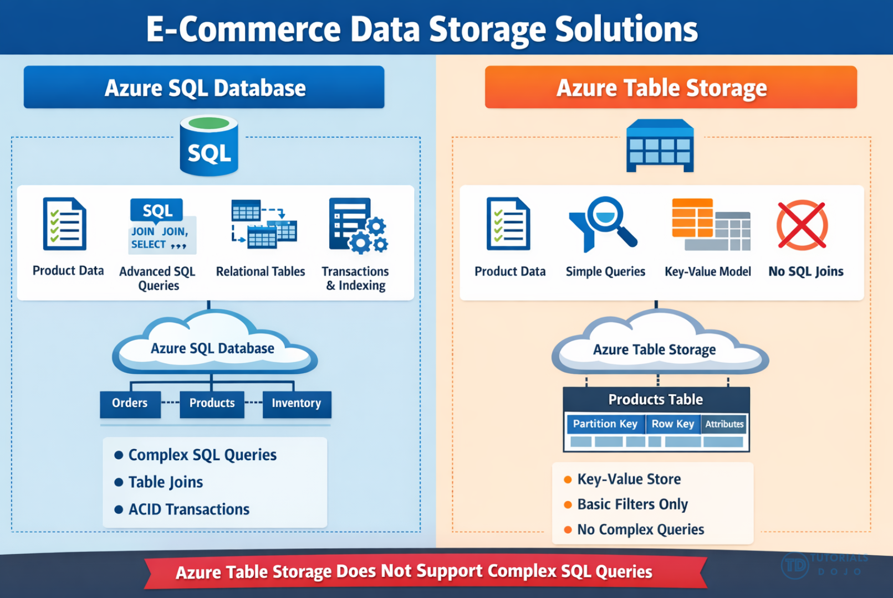

[Azure](https://github.com/magnum31415/wiki/blob/main/azure.md)
# Storage

# 📑 Índice

1. [Azure Managed Disks](#azure-managed-disks)
2. [Conceptos Generales](#conceptos)
3. [Tipo de Storage Account (SKU funcional)](#tipo-de-storage-account-sku-funcional)
4. [Tipos de datos en una Azure Storage Account](#tipos-de-datos-en-una-azure-storage-account)
5. [Redundancia en Azure Storage](#redundancia-en-azure-storage)
   - [Caída de región con GRS / RA-GRS](#si-la-región-principal-cae-en-lob-storage-con-grs-geo-redundant-storage)
6. [Access Tiers y Retención mínima](#retención-mínima-access-tiers)
7. [Network Security en Azure Storage](#-network-security-en-azure-storage)
   - [Public Endpoint + Firewall](#1️⃣-public-endpoint--firewall)
   - [Virtual Network Service Endpoints](#2️⃣-virtual-network-service-endpoints)
   - [Private Endpoint (Private Link)](#3️⃣-private-endpoint-private-link--importante)
   - [Trusted Microsoft Services](#4️⃣-trusted-microsoft-services)
8. [Comparativa Métodos de Seguridad de Red](#comparativa-rápida)
9. [Modelos de Control de Acceso](#concepto)
   - [Storage Account Access Key](#-storage-account-access-key)
   - [Shared Access Signature (SAS)](#-shared-access-signature-sas)
   - [Stored Access Policy](#-stored-access-policy)
   - [Resource Lock](#-readonly-resource-lock)

## Azure Managed Disks


| Tipo de disco    | Rendimiento             | Latencia          | IOPS máximos  | Throughput máx   | Escalabilidad dinámica                  | Uso típico                                              | Coste    |
| ---------------- | ----------------------- | ----------------- | ------------- | ---------------- | --------------------------------------- | ------------------------------------------------------- | -------- |
| **Ultra Disk**   | Muy alto (configurable) | Muy baja (sub-ms) | Hasta 160,000 | Hasta 4,000 MB/s | ✅ Sí (IOPS/MBps ajustables en caliente) | Bases de datos críticas (SQL, SAP HANA), OLTP intensivo | Muy alto |
| **Premium SSD**  | Alto                    | Baja              | Hasta ~20,000 | Hasta ~900 MB/s  | ❌ No (depende del tamaño del disco)     | Producción, apps empresariales, DB medias               | Alto     |
| **Standard SSD** | Medio                   | Media-baja        | Hasta ~6,000  | Hasta ~750 MB/s  | ❌ No                                    | Web servers, entornos prod ligeros                      | Medio    |
| **Standard HDD** | Bajo                    | Alta              | Hasta ~2,000  | Hasta ~500 MB/s  | ❌ No                                    | Backup, DEV/TEST, cargas no críticas                    | Bajo     |

---

## Conceptos

Hay tres conceptos distintos que se cruzan:

- 🔹 Storage Account
- 🔹 Access Tier (Hot/Cool/Cold/Archive)
- 🔹 Redundancia (LRS, ZRS, GRS, etc.)

---
## Tipo de Storage Account (SKU funcional)

Esto define qué tipo de almacenamiento puedes usar y con qué rendimiento.


| Tipo de cuenta                           | Para qué sirve               | Rendimiento | Soporta tiers Hot/Cool/Cold/Archive | Redundancia soportada |
|------------------------------------------|------------------------------|------------|-------------------------------------|-----------------------|
| **Standard – General Purpose v2 (GPv2)** | Blob, File, Queue, Table     | HDD        | ✅ Sí                                | LRS, ZRS, GRS, RA-GRS, GZRS, RA-GZRS |
| **Premium – Block Blobs**                | Blob de alto rendimiento     | SSD        | ❌ No (solo Hot implícito)           | LRS, ZRS |
| **Premium – File Shares**                | Azure Files alto rendimiento | SSD        | ❌ No                                | LRS, ZRS |
| **Premium – Page Blobs**                 | Discos de VM (VHD)           | SSD        | ❌ No                                | LRS |
| *(Legacy)* GPv1                          | Antiguo                      | HDD        | Limitado                             | LRS, GRS, RA-GRS |


- Standard (GPv2) → hasta 5 PiB (Pebibytes) por Storage Account


| Tipo de cuenta                           | Tipo de datos que soporta  | Blob Versioning | Soft Delete        | Snapshots                | Lifecycle Management                  | Object Replication | Casos de uso típicos                                      |
| ---------------------------------------- | -------------------------- | --------------- | ------------------ | ------------------------ | ------------------------------------- | ------------------ | --------------------------------------------------------- |
| **Standard – General Purpose v2 (GPv2)** | Blob, File, Queue, Table   | ✅ Sí (Blob)     | ✅ Sí (Blob & File) | ✅ Sí (Blob)              | ✅ Sí (Hot/Cool/Cold/Archive + Delete) | ✅ Sí (Block Blobs) | Workloads generales, backup, data lake, DR entre regiones |
| **Premium – Block Blobs**                | Blob (alto rendimiento)    | ✅ Sí            | ✅ Sí               | ✅ Sí                     | ❌ No (sin Archive/Cold)               | ✅ Sí (Block Blobs) | Streaming, media, ingestión masiva, alto throughput       |
| **Premium – File Shares**                | Azure Files (SMB/NFS)      | ❌ No            | ✅ Sí               | ❌ No (usa backup nativo) | ❌ No                                  | ❌ No               | File servers empresariales, lift-and-shift de shares      |
| **Premium – Page Blobs**                 | Page Blobs (VHD discos VM) | ❌ No            | ❌ No               | ❌ No                     | ❌ No                                  | ❌ No               | Discos de máquinas virtuales (IaaS)                       |
| **(Legacy) GPv1**                        | Blob, File, Queue, Table   | ❌ Limitado      | ❌ Limitado         | ✅ Básico                 | ❌ No                                  | ❌ No               | Entornos antiguos (no recomendado)                        |


| Necesidad                                   | Elección típica                 |
| ------------------------------------------- | ------------------------------- |
| Coste optimizado por temperatura            | GPv2                            |
| Rendimiento SSD extremo                     | Premium                         |
| Retención legal / protección contra borrado | Versioning + Soft Delete (GPv2) |
| Automatización de transición de datos       | Lifecycle (solo GPv2)           |

**📌 Importante:**

- Solo Standard GPv2 soporta Hot / Cool / Cold / Archive
- Las Premium son para rendimiento, no para optimización por acceso

---
## Tipos de datos en una Azure Storage Account

Una Storage Account puede contener:

````
Storage Account
│
├── Blob (objetos)
├── Table (NoSQL)
├── Queue (mensajes)
└── File (shares SMB/NFS)

````


| Tipo de dato                   | Servicio  | Para qué sirve                   | Modelo de datos                              | Caso típico                                    | ¿Soporta REST? | **Formato aceptado**                                                                               |
| ------------------------------ | --------- | -------------------------------- | -------------------------------------------- | ---------------------------------------------- | -------------- | -------------------------------------------------------------------------------------------------- |
| **Blob Storage**               | Blob      | Almacenamiento de objetos        | No estructurado (archivos/binarios)          | Imágenes, backups, data lake, logs, vídeos     | ✅ Sí           | **Cualquier formato**: `.xml`, `.json`, `.csv`, `.parquet`, `.pdf`, `.jpg`, `.zip`, binarios, etc. |
| **Table Storage**              | Table     | Base de datos NoSQL simple       | Key-Value estructurado (PartitionKey/RowKey) | Telemetría, IoT, metadatos, config distribuida | ✅ Sí           | Datos estructurados tipo **JSON (entidades)** vía API; no guarda archivos como `.xml` o `.pdf`     |
| **Queue Storage**              | Queue     | Mensajería asíncrona             | Mensajes simples (hasta 64 KB)               | Desacoplar aplicaciones, procesos background   | ✅ Sí           | Texto/Base64. Puede contener **JSON o XML como string**                                            |
| **File Storage (Azure Files)** | File      | Compartición de archivos SMB/NFS | Sistema de archivos jerárquico               | Reemplazo de file server on-prem               | ✅ Sí           | **Cualquier formato de archivo** (como un file server tradicional)                                 |
| **Disk Storage (Page Blob)**   | Page Blob | Discos para VMs                  | Bloques direccionables de 512 bytes          | Discos de máquinas virtuales (VHD)             | ✅ Sí           | Formato **VHD/VHDX** (almacenamiento de bloques, no archivos lógicos)                              |


**Cómo diferenciarlos rápido (modo examen)**

| Si lees…                               | Servicio correcto |
| -------------------------------------- | ----------------- |
| Archivos grandes / multimedia          | Blob              |
| Datos estructurados NoSQL simples      | Table             |
| Sistema de colas / procesamiento async | Queue             |
| File server compartido SMB             | Azure Files       |
| Disco de máquina virtual               | Page Blob         |


---



---

## Redundancia en Azure Storage

# 📊 Azure Storage – Modelos de Redundancia

| Redundancia | Nº réplicas | Reg Pri (tipo y nº copias) | Reg Sec (tipo y nº copias) | ¿Dónde se replica? | Protege contra | Acceso a región secundaria | Caso típico |
|-------------|------------|---------------------------|----------------------------|--------------------|----------------|----------------------------|-------------|
| **LRS** (Locally Redundant Storage) | 3 | 3 copias LRS (1 datacenter) | — | Mismo datacenter, misma región | Fallo de disco / rack local | ❌ No | Datos no críticos, entorno DEV |
| **ZRS** (Zone Redundant Storage) | 3 | 3 copias ZRS (3 zonas) | — | 3 Availability Zones dentro de la misma región | Caída de zona completa | ❌ No | Alta disponibilidad regional |
| **GRS** (Geo-Redundant Storage) | 6 | 3 copias LRS (1 DC) | 3 copias LRS (1 DC) | 3 en región primaria + 3 en región secundaria emparejada | Caída total de región | ❌ No (solo tras failover manual) | DR entre regiones |
| **RA-GRS** (Read-Access GRS) | 6 | 3 copias LRS (1 DC) | 3 copias LRS (1 DC) | Igual que GRS | Caída de región | ✅ Sí (read-only) | Apps que leen desde secundaria |
| **GZRS** (Geo-Zone Redundant Storage) | 6 | 3 copias ZRS (3 zonas) | 3 copias LRS (1 DC) | 3 zonas en primaria + 3 en región secundaria | Caída de zona + caída de región | ❌ No (solo tras failover) | Workloads críticos empresariales |
| **RA-GZRS** | 6 | 3 copias ZRS (3 zonas) | 3 copias LRS (1 DC) | Igual que GZRS | Caída zona + región | ✅ Sí (read-only) | Alta disponibilidad + lectura global |

---


# 🧠 Claves rápidas para memorizar

- **LRS** → 3 copias en un DC.
- **ZRS** → 3 copias en 3 zonas.
- **GRS** → LRS primaria + LRS secundaria.
- **RA-GRS** → Igual que GRS + lectura secundaria.
- **GZRS** → ZRS primaria + LRS secundaria.
- **RA-GZRS** → Igual que GZRS + lectura secundaria.

---

# 🎯 Regla mental AZ-305

Si el requisito menciona:

- “Protección frente a caída de zona” → ZRS o GZRS  
- “Protección frente a caída regional” → GRS o GZRS  
- “Necesito leer desde la región secundaria” → RA-*  
- “Máxima protección estándar” → RA-GZRS  

## Conversiones permitidas entre tipos de redundancia

**Regla general importante**

- ✅ Puedes aumentar nivel de resiliencia
- ⚠️ Algunas conversiones requieren que la región soporte ZRS/GZRS
- ❌ No puedes cambiar entre LRS y ZRS directamente (requiere recrear)
- ❌ No puedes convertir de GRS a ZRS directamente
- ❌ No puedes convertir de GZRS a ZRS

| Desde ↓     | Puede convertirse a →              |
| ----------- | ---------------------------------- |
| **LRS**     | GRS, RA-GRS, ZRS*, GZRS*, RA-GZRS* |
| **ZRS**     | GZRS, RA-GZRS                      |
| **GRS**     | RA-GRS, GZRS*, RA-GZRS*            |
| **RA-GRS**  | GRS, GZRS*, RA-GZRS*               |
| **GZRS**    | RA-GZRS                            |
| **RA-GZRS** | GZRS                               |


### Si la región principal cae en lob Storage con GRS (Geo-Redundant Storage)

**🔵 Si usas Blob Storage con GRS (Geo-Redundant Storage)**

- GRS:
  - Replica datos asincrónicamente a una región secundaria emparejada.
  - Pero ❗ No permite acceso a la región secundaria mientras la primaria esté activa.

**🚨 Si la región principal cae**

  - Con GRS normal:
    - 👉 No puedes acceder automáticamente a la copia secundaria.

  - Debes:

    - 1️⃣ Esperar a que Microsoft declare la región como no recuperable
    - 2️⃣ Solicitar o ejecutar un account failover
    - 3️⃣ El secundario se convierte en el nuevo primario

  - Después del failover:
    - El endpoint cambia internamente
    - Empiezas a operar desde la región secundaria

**⚠️ Es un proceso manual y definitivo (no reversible automáticamente).**

**🟢 Si usas RA-GRS (Read-Access GRS)**

 - Aquí cambia:
   - Puedes leer desde la región secundaria en cualquier momento
   - Pero solo lectura
   - Escrituras siguen yendo al primario
 - En caída regional:
   - Puedes acceder a datos en modo read-only
   - Luego ejecutar failover si es necesario

**Diferencia rápida**

| Tipo   | ¿Acceso secundario antes del failover? | ¿Failover automático? |
| ------ | -------------------------------------- | --------------------- |
| GRS    | ❌ No                                   | ❌ No (manual)         |
| RA-GRS | ✅ Solo lectura                         | ❌ No (manual)         |

- GRS → No puedes leer del secundario hasta hacer failover
- RA-GRS → Puedes leer inmediatamente (read-only)

**Cómo interpreta Microsoft “available”**
- En este tipo de preguntas:
  - **Available** = protegidos y recuperables
  - **Accessible / Read access required** = deben poder leerse inmediatamente

## Retención mínima Access tiers

| Tier    | Frecuencia   | Coste storage | Coste acceso | Latencia   | Retención mínima |
|---------|-------------|--------------|-------------|------------|------------------|
| Hot     | Alta        | Alto         | Bajo        | Inmediata  | 0 días           |
| Cool    | Media-baja  | Medio        | Medio       | Inmediata  | 30 días          |
| Cold    | Baja        | Bajo         | Alto        | Inmediata  | 90 días          |
| Archive | Muy baja    | Muy bajo     | Muy alto    | Horas      | 180 días         |

**Cambios entre tiers (muy preguntado)**

 ````
 ✔ Hot ↔ Cool ↔ Cold → inmediato
 ✔ Archive → Hot/Cool → rehydration (horas)
 ````

**política automática de ciclo de vida (Lifecycle Management) aplicada sobre blobs.**

````
Día 30   → Mover a Cool
Día 90   → Mover a Cold
Día 180  → Mover a Archive
Día 3650 → Delete
````

----
## 🔐 Network Security en Azure Storage

Cuando creas un Storage Account, por defecto:

- 👉 Tiene public endpoint
- 👉 Es accesible desde Internet (si tienes clave/SAS)

La seguridad de red consiste en controlar desde dónde puede conectarse alguien al storage.

### 1️⃣ Public Endpoint + Firewall

- 📌 ¿Qué es? El storage tiene una IP pública gestionada por Azure.

  Puedes activar el Storage Firewall y definir:
  - IPs públicas permitidas
  - VNets permitidas
  - Bloquear todo lo demás

- 📌 Cómo funciona
 El tráfico sigue siendo:  ``Cliente → Internet → Endpoint público Azure``

 Pero el firewall decide si lo deja pasar o no.

- ✅ Ventajas

  - Fácil de configurar
  - No requiere cambios DNS
  - Útil para permitir solo ciertas IPs corporativas

- ❌ Problema
  - Sigue siendo un endpoint público.
  - Aunque esté protegido, existe en Internet.

### 2️⃣ Virtual Network Service Endpoints

- 📌 ¿Qué es? Permite que una subnet acceda al storage usando su identidad de red privada, pero el endpoint sigue siendo público.
  El tráfico: ``VM en VNet → backbone Azure → Storage (public endpoint)``
  No sale a Internet, pero el endpoint sigue siendo público.


- 🔎 Clave técnica
  - Se habilita en la subnet
  - Se configura el firewall del storage para aceptar esa VNet

- ✅ Ventajas
  - Tráfico no pasa por Internet
  - Sencillo
  - Bueno para workloads internos

- ❌ Limitación
  - El storage sigue teniendo endpoint público activo
  - No cumple requisito de: “No debe ser accesible desde Internet”
 
### 3️⃣ Private Endpoint (Private Link) ✅ IMPORTANTE
- 📌 ¿Qué es? Crea una IP privada dentro de tu VNet para el storage.

  El storage deja de ser accesible públicamente si deshabilitas el public network access.

  El tráfico: ``VM → IP privada (10.x.x.x) → Storage``
  
  No hay endpoint público expuesto.

- 🔎 Qué ocurre técnicamente
  - Se crea un NIC en tu VNet
  - Se usa DNS privado (privatelink.blob.core.windows.net)
  - El tráfico es 100% privado

- ✅ Ventajas
  - Totalmente privado
  - Cumple Zero Trust
  - Requisito típico de compliance
 - Es lo más seguro

- 🎯 Pregunta clásica AZ-305
  - “El storage no debe ser accesible desde Internet”
  - Respuesta correcta:
    - 👉 Private Endpoint
    NO:
    - Service Endpoint
    - Firewall solo

### 4️⃣ Trusted Microsoft Services
- 📌 ¿Qué es? Permite que ciertos servicios Azure (Backup, Site Recovery, etc.) accedan aunque el firewall esté activo.
     Ejemplo: Azure Backup necesita acceder al storage


📊 Comparativa rápida

| Método            | Endpoint público existe | Tráfico pasa por Internet | Seguridad nivel |
| ----------------- | ----------------------- | ------------------------- | --------------- |
| Public + Firewall | ✅ Sí                    | Puede                     | Media           |
| Service Endpoint  | ✅ Sí                    | No                        | Media-Alta      |
| Private Endpoint  | ❌ No                    | No                        | Máxima          |

---
| Concepto             | Qué controla                  | Nivel           | Uso típico            |
| -------------------- | ----------------------------- | --------------- | --------------------- |
| Access Key           | Acceso total                  | Cuenta completa | Automatización legacy |
| SAS                  | Acceso temporal y granular    | Blob/Container  | Compartir acceso      |
| Stored Access Policy | Control centralizado de SAS   | Container       | Revocar SAS           |
| Resource Lock        | Protección contra cambios ARM | Recurso Azure   | Evitar borrados       |

## 🔐 Storage Account Access Key
- 📌 ¿Qué es?
  Es una clave maestra (shared key) que da acceso completo al Storage Account.
  Cada storage account tiene:
  - 2 claves (key1 y key2)
  - Acceso total al nivel de cuenta

- 🔎 Qué permite
  - Acceso a todos los servicios (Blob, File, Queue, Table)
  - Permite generar SAS
  - Permite acceso completo (según permisos usados)

- ⚠️ Riesgo
  - Si alguien obtiene la Access Key: 👉 Tiene acceso total al storage
  - No es granular.
  - No es recomendable para apps modernas.

- 🎯 Clave examen
  - Access Key = Master key del Storage Account.
  - Demasiado permisiva para entornos Zero Trust.

##  🔐  Shared Access Signature (SAS)
- 📌 ¿Qué es?
  Un token firmado que da acceso limitado y temporal a recursos del storage.
  Se puede limitar por:
  - Tiempo (start / expiry)
  - Permisos (read, write, delete)
  - IP
  - Protocolo (HTTPS only)
  - Recurso específico (blob, container, file)

- 📌 Tipos de SAS
  1. **User Delegation SAS** (recomendado)
    - Basado en Entra ID
    - Más seguro
  2. **Service SAS**
     - Basado en Access Key
     - A nivel blob/container
  3. **Account SAS**
    - A nivel cuenta completa

- 🎯 Clave examen

  - SAS = Acceso temporal y granular
  - Muy usado para compartir blobs sin dar claves maestras.

## 🔐  Stored Access Policy
- 📌 ¿Qué es?
  Una política almacenada en un container que define:
  - Permisos
  - Expiración

Y luego el SAS referencia esa política.

- 📌 ¿Para qué sirve?

Permite revocar múltiples SAS a la vez.

Ejemplo:

- 50 SAS creados usando la misma policy
- Cambias o eliminas la policy
- Todos los SAS quedan invalidados

- 🎯 Clave examen
  Stored Access Policy = Control centralizado de SAS
  Sin policy:
  - → No puedes revocar un SAS antes de su expiración

## 🔐 ReadOnly Resource Lock
- 📌 ¿Qué es?
  Un mecanismo de protección a nivel de Azure Resource Manager.
  Tipos:
   - CanNotDelete
   - ReadOnly
  ReadOnly:
   - Nadie puede modificar el recurso
   - Ni siquiera Owner
- 📌 Qué bloquea
 - Cambios de configuración
 - Eliminación
 - Actualizaciones

- ⚠️ Importante
  NO controla acceso a datos.
 Controla el recurso ARM.
 Ejemplo: No evita que alguien con clave lea blobs
 Solo evita cambiar configuración del storage account

 - 🎯 Clave examen
  Resource Lock = Protección administrativa
  No es un control de acceso a datos.


# 📂 ¿Qué es HNS (Hierarchical Namespace)?

## 🔎 Definición

**HNS (Hierarchical Namespace)** es una funcionalidad de **Azure Data Lake Storage Gen2** que permite organizar los datos en una estructura real de:

- Carpetas
- Subcarpetas
- Archivos

👉 Como un sistema de archivos tradicional (tipo NTFS o Linux).

---

# 🧠 ¿Qué cambia cuando activas HNS?

Sin HNS (Blob Storage normal):

- Las carpetas son solo “prefijos” en el nombre del blob
- No existen realmente
- Operaciones como renombrar carpeta son lentas (copiar + borrar)

Con HNS:

- Las carpetas existen como entidades reales
- Se soportan operaciones atómicas
- Mejor rendimiento en operaciones masivas

---

# 🎯 Capacidades clave que habilita HNS

## 1️⃣ Seguridad a nivel carpeta y archivo

Permite:

- ACLs estilo POSIX
- Permisos por usuario y grupo
- Control granular por directorio

Ejemplo:
- Usuario A puede leer `/data/finance`
- Usuario B solo `/data/hr`

👉 Esto no es posible con Blob tradicional.

---

## 2️⃣ Operaciones más rápidas

Con HNS:

- Rename directory → operación atómica
- Move directory → instantáneo
- Delete masivo → más eficiente

Sin HNS:
- Se debe copiar y borrar uno a uno

---

## 3️⃣ Integración con herramientas Big Data

HNS es necesario para:

- Azure Data Lake Gen2
- Apache Spark
- Databricks
- Hadoop-compatible workloads

---

# 📊 Comparación rápida

| Característica | Blob Storage normal | ADLS Gen2 (HNS activado) |
|---------------|--------------------|---------------------------|
| Carpetas reales | ❌ | ✅ |
| ACL por archivo | ❌ | ✅ |
| Rename rápido | ❌ | ✅ |
| Compatible Hadoop | ❌ | ✅ |
| Workloads Big Data | Limitado | Ideal |

---

# 🎯 Regla mental AZ-305

Si lees:

- “File and directory-level security”
- “ACL”
- “Faster rename operations”
- “Big Data / Data Lake”

👉 Piensa en **Storage Account con Hierarchical Namespace habilitado (ADLS Gen2)**

