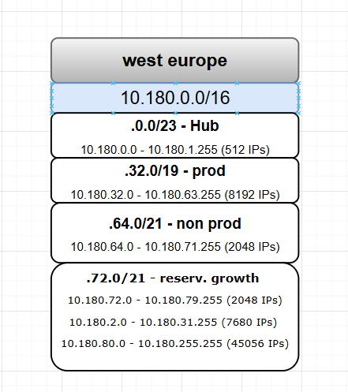

[Azure](https://github.com/magnum31415/wiki/blob/main/azure.md)

# Subnetting

- [Mini Clase Resumen - Subnetting (AZ-104)](#mini-clase-resumen---subnetting-az-104)
- [Cómo se obtiene /16 a partir de un bloque /14](#cómo-se-obtiene-16-a-partir-de-un-bloque-14)
- [Subnetting para crear Spokes en Azure Landing Zone](#subnetting-para-crear-spokes-en-azure-landing-zone)

  
# Mini Clase Resumen - Subnetting (AZ-104)

## Índice

- [Mini Clase Resumen - Subnetting (AZ-104)](#mini-clase-resumen---subnetting-az-104)
- [Qué es subnetting](#qué-es-subnetting)
- [IPv4 tiene 32 bits](#ipv4-tiene-32-bits)
- [Qué significa el /24, /25, etc](#qué-significa-el-24-25-etc)
- [Fórmulas importantes](#fórmulas-importantes)
- [Cómo calcular una subnet](#cómo-calcular-una-subnet)
- [Ejemplo completo /24](#ejemplo-completo-24)
- [Ejemplo completo /25](#ejemplo-completo-25)
- [Cómo saber el tamaño del bloque](#cómo-saber-el-tamaño-del-bloque)
- [Tabla rápida CIDR](#tabla-rápida-cidr)
- [Truco rápido examen](#truco-rápido-examen)
- [Trampas típicas](#trampas-típicas)
- [Reglas rápidas AZ-104](#reglas-rápidas-az-104)

---

# Netmask vs Network (Subnetting AZ-104)

## Qué es una Network

La: **Network** identifica **la red/subred** a la que pertenece una IP.


## Ejemplo

**192.168.1.0/24**

Aquí:

| Parte | Valor |
|---|---|
| Network | 192.168.1.0 |
| CIDR | /24 |

**CIDR Classless Inter-Domain Routing** : Es la forma moderna de definir:

- redes
- subredes
- tamaño de una red IP


Qué significa: Todos los dispositivos dentro de: **192.168.1.x** pertenecen a la misma red.

---

# Qué es una Netmask

La: **Netmask** (o subnet mask) define: **qué parte de la IP es network y qué parte es host**


## Ejemplo

| CIDR | Netmask |
|---|---|
| /24 | 255.255.255.0 |
| /25 | 255.255.255.128 |
| /16 | 255.255.0.0 |


# Relación entre ambas

La: **Netmask** sirve para calcular: **la Network**

## Ejemplo completo

IP: **192.168.1.34**
Netmask **255.255.255.0**
Resultado Network **192.168.1.0/24**

### Concepto visual

```text
IP Address
    ↓
Netmask
    ↓
Determina
    ↓
Network
```

---

## Diferencia importante

| Concepto | Función |
|---|---|
| Network | Identifica la subred |
| Netmask | Define tamaño de la subred |

## Analogía sencilla

| Concepto | Analogía |
|---|---|
| Network | Barrio |
| Netmask | Límites del barrio |


# Ejemplo AZ-104 típico

| Elemento | Valor |
|---|---|
| IP | 10.1.5.25 |
| Netmask | 255.255.0.0 |
| Network | 10.1.0.0/16 |

# Importante examen

La misma IP puede pertenecer a redes distintas dependiendo de la netmask.

## Ejemplo

### Caso 1

| IP | Netmask | Network |
|---|---|---|
| 10.1.5.25 | /16 | 10.1.0.0 |

### Caso 2

| IP | Netmask | Network |
|---|---|---|
| 10.1.5.25 | /24 | 10.1.5.0 |


## Regla rápida AZ-104

```text
The subnet mask defines the network boundary.
```

```text
The network address identifies the subnet.
```

## Frases clave examen

```text
- Netmask determines which bits belong to the network.
- The network address identifies the subnet itself.
```


# Qué es subnetting

Subnetting significa:

```text
dividir una red IP en subredes más pequeñas
```

---

# IPv4 tiene 32 bits

Una IP IPv4 tiene: **32** bits.

---

## Ejemplo

```text
192.168.1.0/24
```

---

# Qué significa el /24, /25, etc

| CIDR | Significado |
|---|---|
| /24 | 24 bits network |
| /25 | 25 bits network |
| /26 | 26 bits network |

---

## Fórmula

| Concepto | Fórmula |
|---|---|
| Host bits | 32 - CIDR |

---


# Cómo calcular una subnet

## Paso 1

Identificar CIDR.

Ejemplo:

```text
/25
```

## Paso 2

Calcular host bits:

```text
Host bits = 32 - CIDR
```

Ejemplo:

```text
32 - 25 = 7
```

## Paso 3

Calcular IPs totales:

```text
IPs totales = 2^(host bits)
```

Ejemplo:

```text
2^7 = 128
```

## Paso 4

Calcular hosts utilizables:

```text
Hosts utilizables = 2^(host bits) - 2
```

Ejemplo:

```text
128 - 2 = 126
```

# Ejemplo completo /24

```text
192.168.1.0/24
```

## Host bits

```text
Host bits = 32 - 24
```

Resultado:

```text
8 host bits
```

## Total IPs

```text
2^8 = 256
```

## Hosts utilizables

```text
256 - 2 = 254
```

---

---

## Resultado

| Tipo | Dirección |
|---|---|
| Network | 192.168.1.0 |
| Primera usable | 192.168.1.1 |
| Última usable | 192.168.1.254 |
| Broadcast | 192.168.1.255 |

---

# Ejemplo completo /25

```text
172.16.10.0/25
```

---

## Host bits

:contentReference[oaicite:9]{index=9}

---

## Total IPs

:contentReference[oaicite:10]{index=10}

---

## Hosts utilizables

:contentReference[oaicite:11]{index=11}

---

## Resultado

| Tipo | Dirección |
|---|---|
| Network | 172.16.10.0 |
| Primera usable | 172.16.10.1 |
| Última usable | 172.16.10.126 |
| Broadcast | 172.16.10.127 |

---

# Cómo saber el tamaño del bloque

El tamaño bloque es:

```text
256 - máscara octeto
```

---

## Ejemplo /26

Máscara:

```text
255.255.255.192
```

↓

:contentReference[oaicite:12]{index=12}

---

## Subnets

```text
0
64
128
192
```

---

# Tabla rápida CIDR

| CIDR | Máscara | Total IPs | Hosts útiles |
|---|---|---|---|
| /24 | 255.255.255.0 | 256 | 254 |
| /25 | 255.255.255.128 | 128 | 126 |
| /26 | 255.255.255.192 | 64 | 62 |
| /27 | 255.255.255.224 | 32 | 30 |
| /28 | 255.255.255.240 | 16 | 14 |

---

# Truco rápido examen

| CIDR | Hosts útiles aproximados |
|---|---|
| /24 | 254 |
| /25 | 126 |
| /26 | 62 |
| /27 | 30 |
| /28 | 14 |

---

# Trampas típicas

## Trampa 1

Olvidar contar:

```text
el 0
```

---

## Trampa 2

Confundir:

```text
IPs totales
```

con:

```text
hosts utilizables
```

---

## Trampa 3

Olvidar:

| Dirección | Reservada |
|---|---|
| Primera | Network |
| Última | Broadcast |

---

# Reglas rápidas AZ-104

```text
Total IPs = 2^(host bits)
```

```text
Usable hosts = 2^(host bits) - 2
```

```text
Host bits = 32 - CIDR
```

```text
The first IP is the network address.
```

```text
The last IP is the broadcast address.
```
---

# Cómo se obtiene /16 a partir de un bloque /14

## Índice

- [Cómo se obtiene /16 a partir de un bloque /14](#cómo-se-obtiene-16-a-partir-de-un-bloque-14)
- [Qué significa un /14](#qué-significa-un-14)
- [Máscara de un /14](#máscara-de-un-14)
- [Cuántas redes /16 caben dentro de un /14](#cuántas-redes-16-caben-dentro-de-un-14)
- [Cálculo matemático](#cálculo-matemático)
- [Ejemplo con 10.180.0.0/14](#ejemplo-con-101800014)
- [Por qué aparecen 10.180, 10.181, 10.182 y 10.183](#por-qué-aparecen-10180-10181-10182-y-10183)
- [Segundo bloque /14](#segundo-bloque-14)
- [Tabla completa](#tabla-completa)
- [Concepto importante examen](#concepto-importante-examen)
- [Truco rápido subnetting](#truco-rápido-subnetting)

---

# Qué significa un /14

Un:

```text
/14
```

significa:

- 14 bits network
- 18 bits host

---

## Máscara

| CIDR | Máscara |
|---|---|
| /14 | 255.252.0.0 |

---

# Máscara de un /14

```text
11111111.11111100.00000000.00000000
```

↓

```text
255.252.0.0
```

---

# Cuántas redes /16 caben dentro de un /14

Cada:

```text
/16
```

usa:

- 16 bits network

Entonces:

```text
16 - 14 = 2 bits
```

↓

tenemos:

:contentReference[oaicite:0]{index=0}

subredes posibles.

---

# Cálculo matemático

## Bloque original

```text
10.180.0.0/14
```

---

## El /14 cubre

Desde:

```text
10.180.0.0
```

hasta:

```text
10.183.255.255
```

---

## Porque el salto es 4

Máscara:

```text
255.252.0.0
```

↓

```text
256 - 252 = 4
```

---

## Entonces los bloques /14 avanzan así

| Bloque /14 |
|---|
| 10.180.0.0/14 |
| 10.184.0.0/14 |
| 10.188.0.0/14 |

---

# Ejemplo con 10.180.0.0/14

Dentro del:

```text
10.180.0.0/14
```

caben 4 redes /16:

| Subred /16 |
|---|
| 10.180.0.0/16 |
| 10.181.0.0/16 |
| 10.182.0.0/16 |
| 10.183.0.0/16 |

---

# Por qué aparecen 10.180, 10.181, 10.182 y 10.183

Porque el /14 agrupa:

```text
4 valores completos del segundo octeto
```

---

## Visualmente

```text
10.180.x.x
10.181.x.x
10.182.x.x
10.183.x.x
```

↓

todo eso pertenece al mismo:

```text
10.180.0.0/14
```

---

# Segundo bloque /14

```text
10.184.0.0/14
```

---

## Contiene

| Subred /16 |
|---|
| 10.184.0.0/16 |
| 10.185.0.0/16 |
| 10.186.0.0/16 |
| 10.187.0.0/16 |

---

# Tabla completa

| Bloque /14 | Redes /16 contenidas |
|---|---|
| 10.180.0.0/14 | 10.180, 10.181, 10.182, 10.183 |
| 10.184.0.0/14 | 10.184, 10.185, 10.186, 10.187 |

---

# Concepto importante examen

| CIDR | Cantidad subredes posibles |
|---|---|
| /14 → /16 | 4 |
| /14 → /18 | 16 |
| /16 → /24 | 256 |

---

# Truco rápido subnetting

## Fórmula

```text
2^(nuevoCIDR - CIDRoriginal)
```

---

## En este caso

:contentReference[oaicite:1]{index=1}

---

# Resumen visual

```text
10.180.0.0/14
│
├── 10.180.0.0/16
├── 10.181.0.0/16
├── 10.182.0.0/16
└── 10.183.0.0/16
```

---

# Regla rápida examen

```text
A /14 network contains four /16 subnets.
```

```text
The subnet increment is calculated from the subnet mask.
```

---


# Subnetting para crear Spokes en Azure Landing Zone

## Índice

- [Subnetting para crear Spokes en Azure Landing Zone](#subnetting-para-crear-spokes-en-azure-landing-zone)
- [Qué estás viendo en el diagrama](#qué-estás-viendo-en-el-diagrama)
- [Bloque principal](#bloque-principal)
- [Por qué se divide en subredes grandes](#por-qué-se-divide-en-subredes-grandes)
- [Concepto importante Azure Landing Zone](#concepto-importante-azure-landing-zone)
- [Explicación de cada subnet](#explicación-de-cada-subnet)
- [Qué significa /23, /19, /21](#qué-significa-23-19-21)
- [Cómo calcular cada bloque](#cómo-calcular-cada-bloque)
- [Por qué los bloques avanzan así](#por-qué-los-bloques-avanzan-así)
- [Qué son los Spokes](#qué-son-los-spokes)
- [Cómo usar la reserva growth](#cómo-usar-la-reserva-growth)
- [Cómo crear nuevos spokes](#cómo-crear-nuevos-spokes)
- [Ejemplo real futuro](#ejemplo-real-futuro)
- [Buenas prácticas Azure](#buenas-prácticas-azure)
- [Trampas típicas AZ-104](#trampas-típicas-az-104)
- [Tabla resumen](#tabla-resumen)

---


# Qué estás viendo en el diagrama

Tienes un bloque regional:

```text
10.180.0.0/16
```

reservado para:

```text
West Europe
```

---

# Bloque principal

## Qué significa /16

```text
10.180.0.0/16
```

contiene:

```text
2^16 = 65536
```

IPs totales.

---

## Rango completo

```text
10.180.0.0 → 10.180.255.255
```

---

# Por qué se divide en subredes grandes

En una Landing Zone normalmente separas:

| Área | Uso |
|---|---|
| Hub | Networking central |
| Prod | Aplicaciones producción |
| NonProd | Dev/Test |
| Reserved Growth | Futuro |

---

# Concepto importante Azure Landing Zone

Microsoft recomienda:

```text
reservar espacio IP para crecimiento futuro
```

porque:

❌ cambiar VNets luego es difícil  
❌ overlapping IPs rompe peering/VPN  

---

# Explicación de cada subnet

| Bloque | Uso |
|---|---|
| 10.180.0.0/23 | Hub |
| 10.180.32.0/19 | Producción |
| 10.180.64.0/21 | NonProd |
| 10.180.72.0/21 | Reserva |
| Resto | Growth futuro |

---


# Qué significa /16, /17, /18... /30

| CIDR | Host bits | Total IPs | Hosts utilizables |
|---|---|---|---|
| /16 | 16 | 65,536 | 65,534 |
| /17 | 15 | 32,768 | 32,766 |
| /18 | 14 | 16,384 | 16,382 |
| /19 | 13 | 8,192 | 8,190 |
| /20 | 12 | 4,096 | 4,094 |
| /21 | 11 | 2,048 | 2,046 |
| /22 | 10 | 1,024 | 1,022 |
| /23 | 9 | 512 | 510 |
| /24 | 8 | 256 | 254 |
| /25 | 7 | 128 | 126 |
| /26 | 6 | 64 | 62 |
| /27 | 5 | 32 | 30 |
| /28 | 4 | 16 | 14 |
| /29 | 3 | 8 | 6 |
| /30 | 2 | 4 | 2 |

---

## Fórmulas importantes

### Host bits

```text
32 - CIDR
```
---

# Cómo calcular cada bloque

## Hub

- **Hub:** ``10.180.0.0/23``
- **Host bits:** ``32 - 23 = 9``
- **Total IPs:** ``2^9 = 512``

## Producción

- **Producción:** ``10.180.32.0/19``
- **Host bits:** ``32 - 19 = 13``
- **Total IPs:** ``2^13 = 8192``
  
## NonProd

- **NonProd:** ``10.180.64.0/21``
- **Host bits:** ``32 - 21 = 11``
- **Total IPs:** ``2^11 = 2048``

---

# Por qué los bloques avanzan así

## /23

Máscara:

```text
255.255.254.0
```

↓

salto:

```text
256 - 254 = 2
```

---

## /19

Máscara:

```text
255.255.224.0
```

↓

salto:

```text
256 - 224 = 32
```

↓

por eso empieza en:

```text
10.180.32.0
```

---

## /21

Máscara:

```text
255.255.248.0
```

↓

salto:

```text
256 - 248 = 8
```

↓

por eso:

```text
64
72
80
88
...
```

---

# Qué son los Spokes

Los:

```text
Spokes
```

son VNets de aplicaciones.

---

## Arquitectura típica

```text
Hub VNet
    ↓
Firewall / Shared Services
    ↓
Spoke VNets
```

---

# Cómo usar la reserva growth

Tu diseño deja espacio libre para:

- nuevas regiones
- nuevas apps
- nuevos spokes
- adquisiciones
- entornos nuevos

---

# Cómo crear nuevos spokes

Por ejemplo:

| Spoke | CIDR |
|---|---|
| App1 | 10.180.80.0/24 |
| App2 | 10.180.81.0/24 |
| SAP | 10.180.82.0/23 |

---

# Ejemplo real futuro

```text
10.180.80.0/21
```

puede subdividirse en:

| Subred | Tamaño |
|---|---|
| /24 | 256 IPs |
| /25 | 128 IPs |
| /26 | 64 IPs |

---

# Buenas prácticas Azure

| Buen patrón | Motivo |
|---|---|
| Reservar espacio libre | Crecimiento |
| Separar Prod/NonProd | Seguridad |
| Hub separado | Networking central |
| CIDRs grandes inicialmente | Flexibilidad |

---

# Trampas típicas AZ-104

## Trampa 1

Pensar que:

```text
una VNet = una app
```

❌ No siempre.

---

## Trampa 2

No reservar espacio futuro.

↓

problemas peering/VPN.

---

## Trampa 3

Crear bloques demasiado pequeños.

↓

sin crecimiento.

---

# Tabla resumen

| Bloque | Uso | Tamaño |
|---|---|---|
| /23 | Hub | 512 IPs |
| /19 | Producción | 8192 IPs |
| /21 | NonProd | 2048 IPs |
| /21 | Reserva | 2048 IPs |

---

# Regla rápida Azure Networking

```text
Design IP addressing for future growth.
```

```text
Avoid overlapping address spaces.
```

```text
Hub-and-Spoke architectures require careful subnet planning.
```
