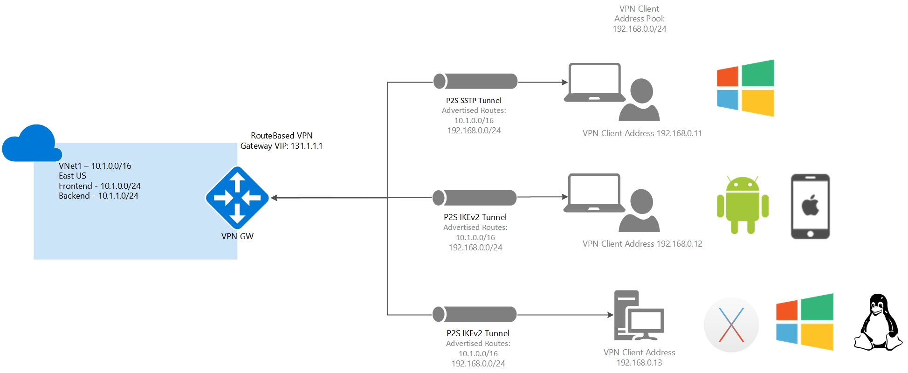

[Azure](https://github.com/magnum31415/wiki/blob/main/azure.md)

Point-to-Site (P2S) VPN connection

# 🔐 Conectividad en Azure – Comportamiento de Rutas (AZ-104)

| Tipo conexión | Aprende rutas dinámicamente | Usa BGP | Requiere descargar configuración cliente | Escenario típico | Punto crítico de examen |
|--------------|----------------------------|---------|-------------------------------------------|------------------|--------------------------|
| **Site-to-Site (S2S)** | ✅ Sí | ✅ Sí (si está habilitado) | ❌ No | Conectar red on-premises completa con Azure | Si hay BGP, las rutas se intercambian automáticamente |
| **VNet Peering** | ✅ Sí | ❌ No (usa sistema interno Azure) | ❌ No | Conectar dos VNets dentro de Azure | No usa gateway por defecto, es backbone privado de Azure |
| **Point-to-Site (P2S)** | ❌ No automáticamente | ⚠️ Opcional (según configuración) | ✅ Sí | Conectar equipos individuales (teletrabajo) | Si cambia la topología → hay que regenerar el cliente VPN |

---

## 🧠 Explicación ampliada

### 🔹 Site-to-Site (S2S)
- Conecta redes completas.
- Puede usar **BGP** para intercambio automático de rutas.
- Ideal para empresas con infraestructura híbrida.
- Si cambia la topología y usas BGP, las rutas se actualizan solas.

---

### 🔹 VNet Peering
- Conecta VNets en la red backbone privada de Azure.
- No necesita gateway si es peering directo.
- Las rutas se actualizan automáticamente.
- Baja latencia y alto rendimiento.

---

### 🔹 Point-to-Site (P2S)
- Conexión iniciada desde un cliente individual.
- Usa un paquete de configuración descargado.
- Si se crea un nuevo peering o cambia el rango IP:
  - ❗ Hay que descargar e instalar nuevamente el cliente VPN.
- Muy preguntado en escenarios donde "solo un usuario no puede conectar".

---

# 🎯 Resumen mental rápido para el examen

- **S2S = Red completa + BGP + rutas dinámicas**
- **Peering = Interno Azure + automático**
- **P2S = Cliente manual + requiere actualización si cambia topología**

Si la pregunta menciona:
> “El usuario individual no puede acceder tras crear peering”

👉 Piensa en **reinstalar configuración P2S**.

# 1️⃣ ¿Por qué crear un VNet Peering cambia la topología?

## 📌 Qué es la topología de red

La topología es:

- Cómo están conectadas las redes entre sí
- Qué rutas existen
- Qué prefijos IP son alcanzables
- Qué gateways intervienen

Es, básicamente, el “mapa” de conectividad.

---

## 📌 Situación inicial

Antes del peering:

- TD1 (P2S) → TDVnet1
- On-prem → TDVnet1 (S2S)

TDVnet2 no estaba conectado a TDVnet1.

Por tanto, el cliente P2S descargó una configuración que solo conocía:
- Los prefijos de TDVnet1

---

## 📌 Qué cambia al crear VNet Peering

Cuando haces peering entre:

TDVnet1 ↔ TDVnet2

Ahora:

- TDVnet1 puede llegar a TDVnet2
- TDVnet2 puede llegar a TDVnet1

Eso significa que:

🔄 Se añaden nuevos prefijos de red accesibles.

Ejemplo:
- TDVnet1 → 10.1.0.0/16
- TDVnet2 → 10.2.0.0/16

Antes el cliente solo conocía 10.1.0.0/16  
Ahora debería conocer también 10.2.0.0/16

Pero el cliente P2S no aprende eso automáticamente.

Por eso se dice que:
👉 Cambia la topología  
👉 Cambian las rutas disponibles  
👉 Hay que regenerar el cliente VPN

---

# 2️⃣ ¿Qué es “Enable transit gateway”?

## 📌 Concepto

“Enable gateway transit” es una opción dentro del VNet Peering.

Permite que:

Una VNet use el VPN Gateway de otra VNet peered.

---

## 📌 Para qué sirve

Imagina:

- TDVnet1 tiene VPN Gateway
- TDVnet2 no tiene gateway

Si habilitas:

- En TDVnet1 → **Allow gateway transit**
- En TDVnet2 → **Use remote gateway**

Entonces:

TDVnet2 puede usar el gateway de TDVnet1 para:
- Conectar con on-prem
- Conectar con otra VNet vía gateway

Sin tener su propio gateway.

---

## 📌 Cuándo es necesario

Es necesario cuando:

- Solo una VNet tiene VPN Gateway
- Quieres que otras VNets usen ese mismo gateway
- Diseñas arquitectura tipo Hub-Spoke

---

## 📌 Por qué no era la respuesta correcta en la pregunta

En el escenario:

- TDVnet2 ya podía conectarse a on-prem

Eso significa que:
👉 Gateway transit ya estaba configurado correctamente.

El problema no era el gateway.

Era que el cliente P2S no conocía la nueva topología.

---

# 🎯 Resumen para examen AZ-104

## Si la pregunta habla de:

- Nuevo VNet peering
- Cliente P2S que no puede acceder
- Todo lo demás funciona

👉 La causa es cambio de topología  
👉 La solución es regenerar cliente VPN

## Si la pregunta habla de:

- Varias VNets
- Solo una tiene gateway
- Las otras necesitan salir a on-prem

👉 Piensa en Enable Gateway Transit
