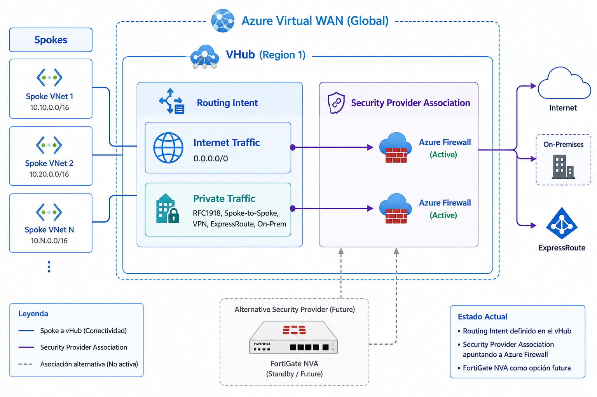
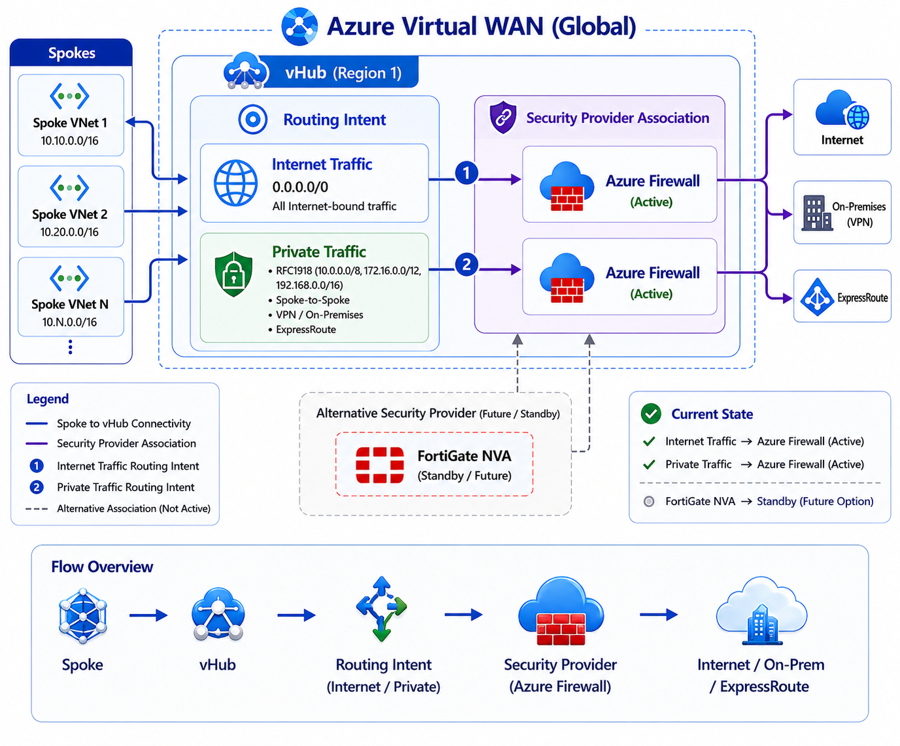
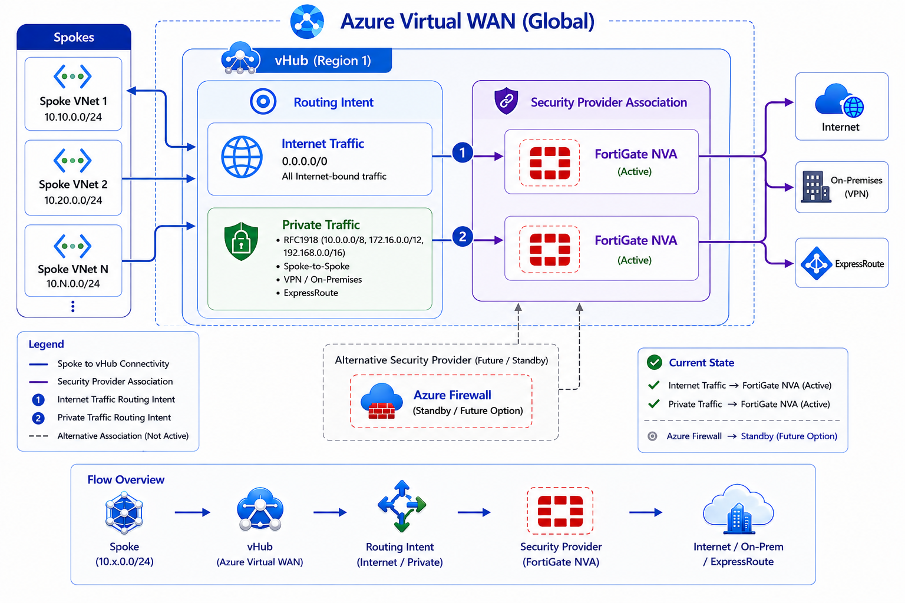

[Azure](https://github.com/magnum31415/wiki/blob/main/azure.md)

# vWAN

**Azure Virtual WAN** is a Microsoft-managed global networking service that centrally connects and secures:
- branch offices
- VPNs
- ExpressRoute circuits
- virtual networks
- and remote users through regional virtual hubs.

````mermaid
flowchart TB

%% =========================
%% Styles
%% =========================
classDef wan fill:#dbeafe,stroke:#2563eb,stroke-width:2,color:#111
classDef region fill:#fde68a,stroke:#d97706,stroke-width:2,color:#111
classDef hub fill:#bfdbfe,stroke:#1d4ed8,stroke-width:2,color:#111
classDef spoke fill:#dcfce7,stroke:#16a34a,stroke-width:2,color:#111

%% =========================
%% Azure Virtual WAN
%% =========================
vWAN["Azure Virtual WAN<br/>(Global Networking Layer)"]:::wan

%% =========================
%% Regions
%% =========================
Region1["Germany West Central<br/>Region"]:::region
Region2["Sweden Central<br/>Region"]:::region

%% =========================
%% vHubs
%% =========================
Hub1["vHub<br/>Germany West Central"]:::hub
Hub2["vHub<br/>Sweden Central"]:::hub

%% =========================
%% Spokes Germany
%% =========================
SpokeA["Spoke A<br/>Prod"]:::spoke
SpokeB["Spoke B<br/>NonProd"]:::spoke
SpokeC["Spoke C<br/>Shared Services"]:::spoke

%% =========================
%% Spokes Sweden
%% =========================
SpokeX["Spoke X<br/>Prod DR"]:::spoke
SpokeY["Spoke Y<br/>Prod AI Workloads"]:::spoke
SpokeZ["Spoke Z<br/>Non Prod"]:::spoke

%% =========================
%% Connections
%% =========================
vWAN --> Region1
vWAN --> Region2

Region1 --> Hub1
Region2 --> Hub2

Hub1 --> SpokeA
Hub1 --> SpokeB
Hub1 --> SpokeC

Hub2 --> SpokeX
Hub2 --> SpokeY
Hub2 --> SpokeZ
````

## vWAN Hub in one region

**Azure Virtual WAN Hub** is a regional Microsoft-managed networking hub inside Azure Virtual WAN that provides
- centralized routing
- connectivity
- security services between VNets
- VPNs
- ExpressRoute
- and firewalls.


````
                   Azure Virtual WAN
                    West Europe vHub
                    10.180.0.0/23

        ┌─────────────────────────────────────┐
        │          Virtual WAN Hub            │
        │          10.180.0.0/23              │
        │             (512 IPs)               │
        │                                     │
        │  - VPN Gateway                      │
        │  - ExpressRoute Gateway             │
        │  - Azure Firewall today             │
        │  - FortiGate NVA in the future      │
        │  - vHub route tables                │
        │  - Routing Intent / Policies        │
        └─────────────────────────────────────┘
              ▲             ▲             ▲
              │             │             │
        VPN Sites     ExpressRoute      Spokes
        On-prem        Circuits       VNet Connections
````

**Azure Virtual WAN Hub Design – West Europe**
````
10.180.0.0/23 – West Europe vHub
Range: 10.180.0.0 – 10.180.1.255
Total Capacity: 512 IPs

Purpose:
- Azure Virtual WAN Hub managed address space
- vHub Router
- vHub Route Tables
- Routing Intent
- VPN Gateway
- ExpressRoute Gateway
- Azure Firewall in secured vHub
- Future FortiGate NVA integration
- Spoke VNet connections
- Branch / Site-to-Site VPN connections
- ExpressRoute connectivity
````


| Resource                             |      Approximate Limit |
| ------------------------------------ | ---------------------: |
| VNet connections per vHub            |                    500 |
| Connected VNets (spokes) recommended |                   ~500 |
| Branch connections (VPN sites)       | Depends on gateway SKU |
| ExpressRoute circuits                |               Multiple |
| Route tables per vHub                |               Multiple |
| Routes learned/propagated            |              Thousands |


**Microsoft states that a minimum /22 is required to allow Azure Firewall to scale to maximum throughput.**

Importante: Azure reserva 5 IPs por subnet, así que una /26 tiene 64 IPs totales, pero 59 utilizables.


## Architectural Point

- In Azure Virtual WAN: ``Spokes do NOT point directly to the firewall.``
- Instead: ``Spokes point to the vHub.``

And the vHub uses:

- Route Tables
- Routing Intent
- Security Provider associations

to decide how traffic flows.




### Route Tables vs Routing Intent  
| Concept           | Route Tables                    | Routing Intent                                                      |
| ------------------- | ------------------------------- | ------------------------------------------------------------------- |
| Conceptual Definition | You explicitly define where traffic should be routed    | You define the traffic policy/intention               |
| Purpose             | Define where traffic is routed  | Define which traffic must pass through a firewall/security provider |
| Type                | Routing configuration           | Security/routing policy abstraction                                 |
| Level               | Low-level routing               | High-level centralized policy                                       |
| Configuration style | Manual                          | Automated / Intent-based                                            |
| Typical use         | Route traffic to a next hop     | Force Internet/Private traffic inspection                           |
| Works with          | Routes and next hops            | Security Providers (Azure Firewall, FortiGate, etc.)                |
| Scope               | Individual routes               | Traffic categories                                                  |
| Example             | `0.0.0.0/0 → Azure Firewall IP` | `Internet Traffic → Azure Firewall`                                 |
| Complexity          | More operational work           | Simpler centralized management                                      |
| Best fit            | Custom routing scenarios        | Enterprise vWAN security architectures                              |
| How it works                       | Manual routing configuration                            | Automated policy-based routing                        |
| Example Definition                 | “Send this network to this next hop”                    | “All Internet traffic must pass through the firewall” |
| Example                            | `10.50.0.0/16 → VPN Gateway`<br/>`0.0.0.0/0 → Firewall` | `Internet Traffic → Azure Firewall`                   |
| Management Style                   | Manual                                                  | Centralized and automated                             |
| Operational Complexity             | Higher                                                  | Lower                                                 |
| Typical Usage                      | Custom routing scenarios                                | Enterprise security enforcement in vWAN               |
| Azure automatically creates routes | No                                                      | Yes                                                   |


### Routing Intent types

| Routing Intent Type | Description                                       | Typical Example                                                                 |
| ------------------- | ------------------------------------------------- | ------------------------------------------------------------------------------- |
| Internet Traffic    | Controls all Internet-bound traffic (`0.0.0.0/0`) | Force all outbound Internet traffic through Azure Firewall or FortiGate         |
| Private Traffic     | Controls internal/private traffic                 | Force Spoke-to-Spoke, VPN, ExpressRoute, and On-Prem traffic through a firewall |

Routing Intent mainly works with two traffic categories.

#### 1. Internet Traffic

This means: ``0.0.0.0/0``

All Internet-bound traffic.

Example:
````
Internet Traffic
   ↓
Azure Firewall
````

This forces all outbound Internet traffic from spokes through the firewall.

#### 2. Private Traffic

This includes:
- RFC1918 traffic
- Spoke-to-Spoke
- On-Prem
- VPN
- ExpressRoute

Example:
````
Private Traffic
   ↓
FortiGate NVA
````

This forces internal/private traffic through the security provider.

**What Problem Does Routing Intent Solve?**

Without Routing Intent, you would need:

Hundreds or thousands of UDRs distributed across:
  - spokes
  - subnets
  - environments

That becomes difficult to maintain.


### Security Provider 
A Security Provider in Azure Virtual WAN is:

````
The firewall or security appliance
responsible for inspecting and filtering traffic.
````
Azure Virtual WAN itself does NOT inspect traffic.
It delegates that function to a Security Provider.

**Examples of Security Providers**

| Security Provider | Type                      |
| ----------------- | ------------------------- |
| Azure Firewall    | Microsoft native firewall |
| FortiGate NVA     | Fortinet firewall         |
| Palo Alto NVA     | Palo Alto firewall        |
| CheckPoint NVA    | CheckPoint firewall       |


### Security Provider Association
Azure Virtual WAN itself does NOT inspect traffic. It needs an external security engine.

That firewall/NVA becomes the:

````
Security Provider
````
and the link between the vHub and the firewall is the:


````
Security Provider Association
````

A Security Provider Association is the relationship between: 

````
Azure Virtual WAN Hub
        ↓
Security Provider (Firewall/NVA)
````

It tells the vHub:

````
"This is the firewall/security engine
that must inspect traffic."
````

**Example**
````
vHub
   ↓
Security Provider Association
   ↓
FortiGate NVA
````
Meaning:
````
The vHub will send traffic to FortiGate
according to the Routing Intent policies.
````


### Simplified Traffic Flow

````
Spoke
   ↓
vHub Route Table
   ↓
Routing Intent
   ↓
Security Provider
   ↓
Firewall
   ↓
Internet / OnPrem / Other Spokes
````


## Routing Intent vs Manual UDRs

| Feature              | Routing Intent                                                                   | Manual UDRs                                                      |
| -------------------- | -------------------------------------------------------------------------------- | ---------------------------------------------------------------- |
| Definition           | Centralized vWAN policy that forces traffic through a firewall/security provider | Manual route configuration defining where traffic should be sent |
| Scope                | Azure Virtual WAN Hub                                                            | Individual subnet                                                |
| Management           | Centralized                                                                      | Distributed                                                      |
| Scalability          | High                                                                             | Medium / Low                                                     |
| Maintenance          | Simple                                                                           | Complex at scale                                                 |
| Firewall abstraction | Yes                                                                              | No                                                               |
| Best for             | Enterprise Landing Zones                                                         | Small/custom environments                                        |
| Dynamic routing      | Native integration                                                               | Manual updates required                                          |
| Future FW migration  | Easy                                                                             | Operationally complex                                            |


**Examples**
| Scenario                      | Routing Intent                      | Manual User Defined Route "UDR"                  |
| ----------------------------- | ----------------------------------- | ---------------------------- |
| Internet traffic inspection   | `Internet Traffic → Azure Firewall` | `0.0.0.0/0 → Firewall IP`    |
| Future migration to FortiGate | Change Security Provider in vHub    | Modify UDRs in all spokes    |
| Spoke-to-Spoke inspection     | `Private Traffic → FortiGate`       | Custom routes per subnet     |
| VPN/OnPrem inspection         | Centralized through vHub            | Manual routing rules         |
| 200 spokes                    | Managed centrally                   | Hundreds of UDR associations |


**Routing Intent**
````
Spokes
   ↓
vWAN Hub
   ↓
Routing Intent
   ↓
Security Provider
   ↓
Firewall
````

**Manual UDRs**
````
Spoke Subnet
   ↓
UDR
0.0.0.0/0 → Firewall IP
   ↓
Firewall
````

Routing Intent is a feature in Azure Virtual WAN that allows you to define:

``"What type of traffic must always pass through a security device"``

without manually configuring hundreds of routes or UDRs.

It is basically a centralized traffic steering policy inside the vHub.


### Conceptually

Without Routing Intent:

````
Spokes
   ↓
Manual UDRs
   ↓
Firewall
````

With Routing Intent:

````
Spokes
   ↓
vHub
   ↓
Routing Intent
   ↓
Firewall / NVA
````

The spokes do not know which firewall is being used.

The vHub decides where traffic should go.

Main Purpose

Routing Intent is used to force traffic through:

- Azure Firewall
- FortiGate NVA
- Palo Alto
- CheckPoint
- Other supported Security Providers
- Main Traffic Types

Routing Intent centralizes everything inside the vHub.


## Future migration to another Security Provider

**How the Firewall Migration Works in Azure Virtual WAN**

You configure the vHub through:

- Routing Intent
- Route Tables
- Security Provider Association


#### Today:

``Spokes → vWAN Hub → Routing Intent -> Security Provider -> Azure Firewall``




#### Future:

``Spokes → vWAN Hub → Routing Intent -> Security Provider -> FortiGate NVA``



---

# Arquitectura ALZ típica
````
Application Team
   ↓
Can deploy only:
- Application Gateway WAF_v2
- WAF enabled
- Standard Public IP
- DDoS IP Protection enabled
````

## Lo más maduro

NO dejar que configuren esto manualmente.

Sino: ``Approved Terraform Module``
que ya:

- crea WAF_v2
- activa WAF
- Prevention mode
- OWASP policy
- diagnostics
- DDoS IP Protection
- tags
- naming

## Qué significa realmente

Que vosotros creáis: ``módulos Terraform corporativos reutilizables``

ya validados por:

- seguridad
- networking
- governance
- cloud team.

##Estructura típica
````
terraform-modules/
│
├── secure-app-gateway/
├── secure-public-ip/
├── secure-vnet/
├── firewall-rules/
└── spoke-networking/
````


### El app team NO hace esto

``resource "azurerm_application_gateway" ...`` directamente.

En cambio usa: `` module "secure_ingress"``. Ese módulo lo crea GroupIT Cloud

````hcl
module "api_ingress" {
  source = "git::https://dev.azure.com/company/alz-modules//secure-app-gateway"

  app_name = "api-prod"
  region   = "westeurope"
}
````

y dentro:

- crea App Gateway WAF_v2
- habilita WAF
- configura OWASP
- crea Public IP Standard
- habilita DDoS IP Protection
- activa diagnostics
- aplica tags/naming
- configura backend seguro.

### Entonces el modelo ALZ maduro es

**Policies**
- Impiden: patrones inseguros.

**Approved Modules**
- Facilitan: patrones seguros.

# Arquitectura típica ALZ

